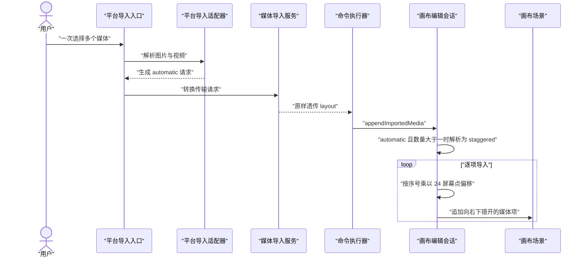
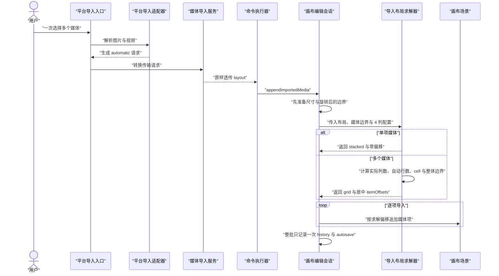

# 批量媒体网格导入分阶段修改计划

## 已确认范围
- `CanvasImportLayout.staggered` 正名为 `diagonal`，继续保留当前约 24 屏幕点向右下错开的效果。
- 普通导入请求仍使用 `.automatic`；单项解析为 `.stacked`，两个及以上媒体解析为 `.grid`。
- 网格固定 4 列，行数按 `ceil(itemCount / 4)` 自动增长；图片、视频及混合媒体统一参与网格。
- 按导入顺序从左到右、从上到下填充；最后一行不足 4 项时左对齐。少于 4 项时只使用实际列数，并让该行整体居中。
- 网格整体中心对齐现有 `CanvasImportPlacement`；文件选择、相册、粘贴、分享扩展仍以相机中心为锚点。本次不扩展拖放落点语义，也不新增布局切换 UI。
- 图片/视频保持现有尺寸归一化、宽高比、crop、rotation、zIndex、history、autosave 与持久化格式。

## 修改前后的数据结构对比

### 修改前
当前请求把“自动策略”“堆叠”“对角错位”“网格”混在同一个枚举中；对角模式命名为 `staggered`，网格配置已支持列数和间距，但 session 仅返回单个 cell size，未表达完整网格边界和居中偏移。

```swift
// MyCanvas_Ver_0/Canvas/Import/CanvasImportTypes.swift
enum CanvasImportLayout: Equatable {
    case automatic
    case stacked
    case staggered(stepInWorld: CGPoint)
    case grid(
        columns: Int,
        horizontalSpacing: CGFloat,
        verticalSpacing: CGFloat
    )
}

struct CanvasImportGridConfiguration: Equatable {
    let columns: Int
    let horizontalSpacing: CGFloat
    let verticalSpacing: CGFloat
}
```

当前几何计算散落在 [`CanvasEditorSession.swift`](MyCanvas_Ver_0/Canvas/Editing/CanvasEditorSession.swift)：`resolvedImportLayout` 只接收数量，`gridCellSize` 只求最大宽高，`importOffset` 以第一格中心为 `(0, 0)`。

### 修改后
保留请求层枚举，但把产品语义正名；增加普通批量导入的单一代码配置，以及不进入文档存储的瞬态求解结果。

```swift
// MyCanvas_Ver_0/Canvas/Import/CanvasImportTypes.swift
enum CanvasImportLayout: Equatable {
    case automatic
    case stacked
    case diagonal(stepInWorld: CGPoint)
    case grid(
        columns: Int,
        horizontalSpacing: CGFloat,
        verticalSpacing: CGFloat
    )
}

struct CanvasBatchImportLayoutConfiguration: Equatable {
    static let current = CanvasBatchImportLayoutConfiguration(
        grid: CanvasImportGridConfiguration(
            columns: 4,
            horizontalSpacing: 24,
            verticalSpacing: 24
        )
    )

    let grid: CanvasImportGridConfiguration
}
```

```swift
// MyCanvas_Ver_0/Canvas/Import/CanvasImportLayoutSolver.swift
struct CanvasResolvedImportLayout: Equatable {
    let effectiveLayout: CanvasImportLayout
    let itemOffsets: [CGPoint]
    let contentSize: CGSize
}

struct CanvasImportLayoutSolver {
    func resolve(
        requestedLayout: CanvasImportLayout,
        itemBoundingSizes: [CGSize],
        automaticConfiguration: CanvasBatchImportLayoutConfiguration,
        defaultDiagonalStepInWorld: CGPoint
    ) -> CanvasResolvedImportLayout
}
```

`CanvasResolvedImportLayout` 只服务当前导入事务，不写入 `BoardDocument`、history snapshot 或 autosave payload，因此不需要存储迁移。

## 关键业务时序对比

### 修改前：批量自动导入变成对角线



### 修改后：批量自动导入由纯 solver 生成居中网格



显式传入 `.diagonal(stepInWorld:)` 时，solver 继续执行现有 `index × step` 公式；该路径不再由 `.automatic` 默认触发，但作为独立模式保留。

## 阶段 1：冻结布局契约并正名枚举
- 修改 [`CanvasImportTypes.swift`](MyCanvas_Ver_0/Canvas/Import/CanvasImportTypes.swift)：将 `.staggered(stepInWorld:)` 重命名为 `.diagonal(stepInWorld:)`，保留关联值及 world-space 语义。
- 在同一领域文件增加 `CanvasBatchImportLayoutConfiguration.current`，普通批量导入固定为 4 列、横纵间距 24 world units；不复用 GIF 专用配置，避免普通导入与 GIF 选择器 UI 相互耦合。
- 更新 [`CanvasImportRequestModelTests.swift`](MyCanvas_Ver_0Tests/CanvasImportRequestModelTests.swift)，验证 grid 配置清洗、4 列默认值和 diagonal 枚举契约。
- 确认该枚举仅存在于瞬态请求链路，无 Codable/存储迁移；全仓替换现有 `.staggered` 分支，不保留同义 case。

## 阶段 2：抽取纯布局求解器
- 新增 [`CanvasImportLayoutSolver.swift`](MyCanvas_Ver_0/Canvas/Import/CanvasImportLayoutSolver.swift)，把 [`CanvasEditorSession.swift`](MyCanvas_Ver_0/Canvas/Editing/CanvasEditorSession.swift) 中的自动策略解析、cell 计算和 offset 计算移出副作用代码。
- `automatic` 规则固定为：空数组返回空结果，1 项为 stacked，2 项及以上媒体全部使用 `CanvasBatchImportLayoutConfiguration.current.grid`。
- `diagonal` 规则保持当前行为：第 `index` 项偏移为 `stepInWorld × index`；现有 `duplicateOffsetInWorld()` 继续提供 24 屏幕点换算后的默认步长，复制对象逻辑不改。
- `grid` 使用最大轴对齐展示边界作为统一 cell。普通 rotation 为 0 时与现状一致；存在 presentation rotation 时按旋转后的 bounding size 计算，避免旋转项互相覆盖。
- 网格公式：`usedColumns = min(configuredColumns, itemCount)`，`rows = ceil(itemCount / configuredColumns)`；由 cell 和 spacing 求完整 `contentSize`，第一格从整体左上角的 cell 中心开始，最终所有 offsets 围绕 `(0, 0)` 居中。
- 最后一行按列 0 开始填充，不单独二次居中，确保稳定的行列索引和导入顺序。

## 阶段 3：接回编辑会话并保持事务边界
- 调整 [`CanvasEditorSession.swift`](MyCanvas_Ver_0/Canvas/Editing/CanvasEditorSession.swift) 的 `appendImportedMedia`：先生成全部 `CanvasPreparedImportItem`，再把尺寸/旋转边界交给 solver，最后按一一对应的 offsets 创建 `CanvasImageItem`。
- 删除 session 内重复的 `resolvedImportLayout`、`gridCellSize`、`importOffset` 分支，避免新旧两套布局规则并存。
- `CanvasImportPlacement.cameraCenter/worldPoint` 统一表示“整组布局中心”；single/stacked 中仍等价于单项中心。
- 保持输入顺序、连续 zIndex、transient payload 注册、视频 poster/source、逐项 board expansion，以及整批一次 history/autosave 不变。
- 保持 [`CanvasMediaImportService.swift`](MyCanvas_Ver_0/Canvas/Import/CanvasMediaImportService.swift)、[`CanvasTransferCommandLowerer.swift`](MyCanvas_Ver_0/Canvas/Transfer/CanvasTransferCommandLowerer.swift) 和 [`CanvasCommandExecutor.swift`](MyCanvas_Ver_0/Canvas/Editing/CanvasCommandExecutor.swift) 的透传职责，不在平台入口复制数量判断。

## 阶段 4：兼容现有 GIF 帧显式网格
- 现有 [`CanvasGIFFrameImportBuilder.swift`](MyCanvas_Ver_0/Canvas/GIF/CanvasGIFFrameImportBuilder.swift) 已显式构造 `.grid`，但当前 `gridOrigin` 表示第一格中心；在统一“placement 为整组中心”后必须同步改为计算 `gridCenter`。
- `gridCenter` 根据选中帧数、列数、presentation size 和 spacing 求网格宽高，使首格仍从源 GIF 的 `worldBounds` 下方、既有 top/leading inset 后开始，避免 GIF 帧整体跳位。
- 保持 [`CanvasGIFFrameImportConfiguration.swift`](MyCanvas_Ver_0/Canvas/GIF/CanvasGIFFrameImportConfiguration.swift) 的 GIF 专用列数、选择器间距、board spacing 与 insets，不把它替换成普通批量导入配置。

## 阶段 5：补齐纯几何和 session 回归测试
- 新增 [`CanvasImportLayoutSolverTests.swift`](MyCanvas_Ver_0Tests/CanvasImportLayoutSolverTests.swift)：
  - automatic 的 0、1、2、4、5、8、9 项；断言 4 列、自动行数和中心不漂移。
  - 少于 4 项、刚好满行、最后一行不满、1 列及显式自定义列数。
  - 横图、竖图、方图、不同尺寸及旋转后的 cell 无重叠。
  - 显式 diagonal 的零、正、负 step，并验证位置与原 staggered 公式完全一致。
  - grid 所有 item offsets 数量与输入数量严格一致，空输入不产生无效坐标。
- 扩展 [`CanvasImportedMediaPlacementTests.swift`](MyCanvas_Ver_0Tests/CanvasImportedMediaPlacementTests.swift)：
  - `.automatic` 单项仍位于 placement；批量图片、批量视频、图片视频混合均落为 4 列网格。
  - `.cameraCenter` 和 `.worldPoint` 都以整组中心为锚点。
  - item 顺序、连续 zIndex、不同宽高比、board expansion 保持正确。
  - 一次 undo 移除整批、一次 redo 恢复整批，避免每个 cell 产生独立历史步骤。
- 更新 [`CanvasGIFFrameImportBuilderTests.swift`](MyCanvas_Ver_0Tests/CanvasGIFFrameImportBuilderTests.swift)：既断言 request 的新 grid center，也执行 request 到 session 的落板闭环，确认首格仍位于源 GIF 下方既有 inset 位置。

## 阶段 6：双端与扩展入口回归
- iOS：相册单图/多图、单视频/多视频、图片视频混合、GIF、拖放、粘贴。
- macOS：Open Panel 单项/多项、图片视频混合、Finder 拖放、粘贴。
- 分享扩展：[`ShareImportViewModel.swift`](Add%20To%20Canvas/ShareImportViewModel.swift) 显式 `.automatic`，确认多图自动获得 4 列网格且单图不变。
- 所有入口继续通过 adapter 和 import service 进入同一 automatic 规则；预计平台控制器无需业务修改，只做行为验证。
- 显式 GIF grid 和测试/程序化 diagonal 分别验证，确保两个非默认模式仍可独立使用。

## 阶段 7：构建、验收与清理
- 先运行布局模型、solver、session placement、GIF builder 的定向测试，再运行导入、history、board state 相关回归测试。
- 顺序执行 macOS 测试/build 与 iOS build，避免并行 DerivedData 锁冲突；同时构建分享扩展 target。
- 手动在不同 zoom 下导入 1、2、4、5、8、9 个媒体：网格允许随画布缩放，但不得重叠；显式 diagonal 仍保持当前约 24 屏幕点节奏。
- 检查保存、关闭、重开后媒体中心、尺寸、zIndex 与视频源不变；确认无文档 schema 变化、无额外 autosave、无新 UI、无拖放落点行为变更。
- 最终清理旧 `staggered` 命名和 session 内废弃辅助函数，确保全仓只保留 `automatic/stacked/diagonal/grid` 四种布局语义。