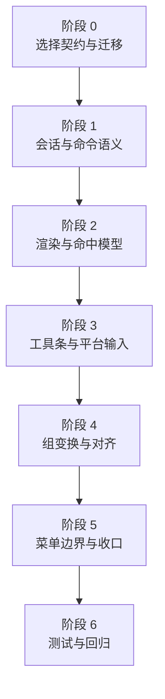

# 图板多选分阶段计划

## 范围与关键决策

- 目标能力：`macOS` 上 `Command + 左键` 始终执行多选切换；`iOS/macOS` 工具条新增多选模式开关；文本项和媒体项都纳入选择集；多于 1 个对象时显示组选框，并支持组平移、组缩放、组旋转。
- 选择模型不再以单个 `selectedItemID` 为核心，而是升级为“选择集 + 主选中项”。首批改造锚点在 [CanvasInteractionState.swift](/Users/shaun/Library/Mobile Documents/com~~apple~~CloudDocs/Develop/MyCanvas_Ver_0/MyCanvas_Ver_0/Canvas/Core/CanvasInteractionState.swift)、[CanvasEditorSession.swift](/Users/shaun/Library/Mobile Documents/com~~apple~~CloudDocs/Develop/MyCanvas_Ver_0/MyCanvas_Ver_0/Canvas/Editing/CanvasEditorSession.swift)、[BoardHistorySnapshot.swift](/Users/shaun/Library/Mobile Documents/com~~apple~~CloudDocs/Develop/MyCanvas_Ver_0/MyCanvas_Ver_0/Canvas/Editing/BoardHistorySnapshot.swift)、[BoardDocument.swift](/Users/shaun/Library/Mobile Documents/com~~apple~~CloudDocs/Develop/MyCanvas_Ver_0/MyCanvas_Ver_0/Canvas/Storage/BoardDocument.swift)。
- 多选模式开关属于临时交互模式，不进入文档存储，也不进入历史快照；但“当前选择集”延续现有单选行为，继续作为 view-state 参与存储与恢复。
- 组选框方案采用“保留单个 active edit overlay，但让它支持 group payload；另增加 selected-member passive highlights”。这样可以避免把现有 `crop` 流程整体推翻，同时给组命中和组手柄留出稳定契约。改造锚点在 [CanvasRenderSnapshot.swift](/Users/shaun/Library/Mobile Documents/com~~apple~~CloudDocs/Develop/MyCanvas_Ver_0/MyCanvas_Ver_0/Canvas/Core/CanvasRenderSnapshot.swift)、[CanvasRenderer.swift](/Users/shaun/Library/Mobile Documents/com~~apple~~CloudDocs/Develop/MyCanvas_Ver_0/MyCanvas_Ver_0/Canvas/Core/CanvasRenderer.swift)、[CanvasEditOverlayHitTester.swift](/Users/shaun/Library/Mobile Documents/com~~apple~~CloudDocs/Develop/MyCanvas_Ver_0/MyCanvas_Ver_0/Canvas/Core/CanvasEditOverlayHitTester.swift)。

## 阶段 0：选择契约与迁移

- 在 [CanvasInteractionState.swift](/Users/shaun/Library/Mobile Documents/com~~apple~~CloudDocs/Develop/MyCanvas_Ver_0/MyCanvas_Ver_0/Canvas/Core/CanvasInteractionState.swift) 中把 `selectedItemID` 升级为 `selectedItemIDs + primarySelectedItemID`，并建立不变式：`primarySelectedItemID` 必须为空或属于 `selectedItemIDs`。
- 在 [CanvasEditorSession.swift](/Users/shaun/Library/Mobile Documents/com~~apple~~CloudDocs/Develop/MyCanvas_Ver_0/MyCanvas_Ver_0/Canvas/Editing/CanvasEditorSession.swift) 中补齐派生只读接口：`singleSelectedItemID`、`selectedBoardItems`、`selectionCount`、`hasSelection`，供旧逻辑安全过渡。
- 在 [BoardDocument.swift](/Users/shaun/Library/Mobile Documents/com~~apple~~CloudDocs/Develop/MyCanvas_Ver_0/MyCanvas_Ver_0/Canvas/Storage/BoardDocument.swift)、[BoardDocumentMapper.swift](/Users/shaun/Library/Mobile Documents/com~~apple~~CloudDocs/Develop/MyCanvas_Ver_0/MyCanvas_Ver_0/Canvas/Storage/BoardDocumentMapper.swift) 中新增多选字段，并兼容解码旧文档里的 `selectedItemID`。文档格式版本需要从 [CanvasImageAssetContract.swift](/Users/shaun/Library/Mobile Documents/com~~apple~~CloudDocs/Develop/MyCanvas_Ver_0/MyCanvas_Ver_0/Canvas/Core/CanvasImageAssetContract.swift) 当前的 `4` 升级一版。
- 在 [BoardHistorySnapshot.swift](/Users/shaun/Library/Mobile Documents/com~~apple~~CloudDocs/Develop/MyCanvas_Ver_0/MyCanvas_Ver_0/Canvas/Editing/BoardHistorySnapshot.swift) 中把相等性从比较单个 `selectedItemID` 改为比较完整选择态，避免 undo/redo 丢失多选变化。
- 阶段完成标准：旧文档能正常恢复为单元素选择集；新运行时可以稳定维护选择集与主选中项；历史快照不再依赖单选字段。

## 阶段 1：会话与命令语义

- 在 [CanvasEditorSession.swift](/Users/shaun/Library/Mobile Documents/com~~apple~~CloudDocs/Develop/MyCanvas_Ver_0/MyCanvas_Ver_0/Canvas/Editing/CanvasEditorSession.swift) 中重写选择 API，至少覆盖：`replaceSelection`、`toggleSelectionMembership`、`addToSelection`、`removeFromSelection`、`clearSelection`、`normalizeSelectionAfterMutation`。
- 把 `syncInlineEditStateWithSelection()`、`canBeginCropMode`、`beginTextEdit`、`beginCropModeIfPossible` 全部收敛到“仅当 `selectionCount == 1` 时允许单对象编辑”的规则；多选时禁用文本内联编辑和裁剪。
- 在 [CanvasCommand.swift](/Users/shaun/Library/Mobile Documents/com~~apple~~CloudDocs/Develop/MyCanvas_Ver_0/MyCanvas_Ver_0/Canvas/Editing/CanvasCommand.swift)、[CanvasCommandCatalog.swift](/Users/shaun/Library/Mobile Documents/com~~apple~~CloudDocs/Develop/MyCanvas_Ver_0/MyCanvas_Ver_0/Canvas/Editing/CanvasCommandCatalog.swift)、[CanvasCommandExecutor.swift](/Users/shaun/Library/Mobile Documents/com~~apple~~CloudDocs/Develop/MyCanvas_Ver_0/MyCanvas_Ver_0/Canvas/Editing/CanvasCommandExecutor.swift) 中引入“选择感知”的命令语义。
- 这里建议保留 target-item 命令用于右键命中未选中对象，但新增 selection-based 批量命令用于当前选择，例如批量 duplicate/delete/bring forward/send backward/bring to front/send to back。这样右键目标和当前选择不会互相污染。
- 在 [CanvasScene.swift](/Users/shaun/Library/Mobile Documents/com~~apple~~CloudDocs/Develop/MyCanvas_Ver_0/MyCanvas_Ver_0/Canvas/Core/CanvasScene.swift) 中补齐批量层级和批量删除/复制辅助 API，避免 controller 对场景做循环散写。
- 阶段完成标准：选择集在会话层是唯一真相；批量删除、批量复制、批量图层调整都能通过 command lane 正常进历史。

## 阶段 2：渲染与命中模型

- 在 [CanvasRenderSnapshot.swift](/Users/shaun/Library/Mobile Documents/com~~apple~~CloudDocs/Develop/MyCanvas_Ver_0/MyCanvas_Ver_0/Canvas/Core/CanvasRenderSnapshot.swift) 中扩展渲染契约：保留 `editOverlay` 作为唯一 active overlay，但让其可表示 `single-selection` 或 `group-selection`；新增 passive `selectionHighlights`，为每个已选对象绘制轻量高亮。
- 在 [CanvasRenderer.swift](/Users/shaun/Library/Mobile Documents/com~~apple~~CloudDocs/Develop/MyCanvas_Ver_0/MyCanvas_Ver_0/Canvas/Core/CanvasRenderer.swift) 中增加 group bounds 计算逻辑，按选择集中所有 item 的 world geometry 生成组包围框、组手柄和组旋转 affordance；单选时维持当前 overlay 语义不变。
- 在 [CanvasEditOverlayHitTester.swift](/Users/shaun/Library/Mobile Documents/com~~apple~~CloudDocs/Develop/MyCanvas_Ver_0/MyCanvas_Ver_0/Canvas/Core/CanvasEditOverlayHitTester.swift) 和 [CanvasContextResolver.swift](/Users/shaun/Library/Mobile Documents/com~~apple~~CloudDocs/Develop/MyCanvas_Ver_0/MyCanvas_Ver_0/Canvas/Core/CanvasContextResolver.swift) 中增加 group handle / group rotate 命中分支，并让“selected body / unselected body”判断从单值切换为集合 membership。
- 在 [iOSCanvasViewportView.swift](/Users/shaun/Library/Mobile Documents/com~~apple~~CloudDocs/Develop/MyCanvas_Ver_0/MyCanvas_Ver_0/Platform/iOS/Canvas/iOSCanvasViewportView.swift) 和 [macOSCanvasViewportView.swift](/Users/shaun/Library/Mobile Documents/com~~apple~~CloudDocs/Develop/MyCanvas_Ver_0/MyCanvas_Ver_0/Platform/macOS/Canvas/macOSCanvasViewportView.swift) 中把现有单选 outline/handle 绘制升级为“成员高亮 + 组选框 + 组手柄”。
- 阶段完成标准：多选后所有成员可见被选中状态，且只出现一套组选框和组手柄；单选裁剪与单选旋转的现有视觉不回归。

## 阶段 3：工具条与平台输入

- 在 [CanvasToolbarState.swift](/Users/shaun/Library/Mobile Documents/com~~apple~~CloudDocs/Develop/MyCanvas_Ver_0/MyCanvas_Ver_0/Platform/Shared/Toolbar/CanvasToolbarState.swift)、[CanvasToolbarStateBuilder.swift](/Users/shaun/Library/Mobile Documents/com~~apple~~CloudDocs/Develop/MyCanvas_Ver_0/MyCanvas_Ver_0/Platform/Shared/Toolbar/CanvasToolbarStateBuilder.swift) 中新增 `multiSelect` 工具条项，图标使用 `checklist`，通过 `isActive` 表示当前模式。
- 在 [iOSViewController.swift](/Users/shaun/Library/Mobile Documents/com~~apple~~CloudDocs/Develop/MyCanvas_Ver_0/MyCanvas_Ver_0/Platform/iOS/iOSViewController.swift)、[macOSViewController.swift](/Users/shaun/Library/Mobile Documents/com~~apple~~CloudDocs/Develop/MyCanvas_Ver_0/MyCanvas_Ver_0/Platform/macOS/macOSViewController.swift)、[iOSCanvasToolbarHostView.swift](/Users/shaun/Library/Mobile Documents/com~~apple~~CloudDocs/Develop/MyCanvas_Ver_0/MyCanvas_Ver_0/Platform/iOS/Canvas/iOSCanvasToolbarHostView.swift)、[macOSCanvasToolbarHostView.swift](/Users/shaun/Library/Mobile Documents/com~~apple~~CloudDocs/Develop/MyCanvas_Ver_0/MyCanvas_Ver_0/Platform/macOS/Canvas/macOSCanvasToolbarHostView.swift) 中接入按钮、样式、点击回调与可用态刷新。
- 在 [macOSCanvasViewportView.swift](/Users/shaun/Library/Mobile Documents/com~~apple~~CloudDocs/Develop/MyCanvas_Ver_0/MyCanvas_Ver_0/Platform/macOS/Canvas/macOSCanvasViewportView.swift) 中把 `mouseDown / mouseUp` 的 `modifierFlags` 透传到 controller；最好抽一个共享的 pointer modifier 表达，避免 controller 直接依赖平台枚举。
- 在 [iOSViewController.swift](/Users/shaun/Library/Mobile Documents/com~~apple~~CloudDocs/Develop/MyCanvas_Ver_0/MyCanvas_Ver_0/Platform/iOS/iOSViewController.swift) 和 [macOSViewController.swift](/Users/shaun/Library/Mobile Documents/com~~apple~~CloudDocs/Develop/MyCanvas_Ver_0/MyCanvas_Ver_0/Platform/macOS/macOSViewController.swift) 里提炼共享的点击选择决策器，统一处理四种情况：普通单选、工具条多选模式、`macOS` 的 `Command+Click`、点击空白清空。
- 明确交互规则：`Command+Click` 始终 toggle membership；工具条多选开启后普通点击也 toggle membership；多选条件下点击已选中的文本不再自动进入文字编辑。
- 阶段完成标准：两端点击选择语义一致；`macOS` 关闭工具条多选时 `Command+Click` 依旧生效；工具条状态刷新和选择行为同步。

## 阶段 4：组变换与对齐

- 现有 [CanvasSelectedItemDragState.swift](/Users/shaun/Library/Mobile Documents/com~~apple~~CloudDocs/Develop/MyCanvas_Ver_0/MyCanvas_Ver_0/Canvas/Editing/CanvasSelectedItemDragState.swift)、`PointerResizeState`、`PointerRotateState` 都是单对象状态，需要新增共享的 group transform 状态和几何快照。建议新增一层共享 helper，负责保存每个成员的初始 `center/size/rotation` 与 group bounds。
- 在 [CanvasScene.swift](/Users/shaun/Library/Mobile Documents/com~~apple~~CloudDocs/Develop/MyCanvas_Ver_0/MyCanvas_Ver_0/Canvas/Core/CanvasScene.swift) 中增加批量几何写入 API，确保一次手势更新内所有成员按同一变换规则落盘，而不是 controller 自己逐项散写。
- 在 [CanvasAlignmentGuideSolver.swift](/Users/shaun/Library/Mobile Documents/com~~apple~~CloudDocs/Develop/MyCanvas_Ver_0/MyCanvas_Ver_0/Canvas/Core/CanvasAlignmentGuideSolver.swift) 中把 `movingItemID` 扩为“moving selection / excluded IDs / moving bounds”语义，让组平移时按组选框做吸附，而不是只拿一个 item 做参考。
- 组变换建议拆成三个子阶段连续落地：先做 group move，再做 group resize，最后做 group rotate。每个子阶段都复用同一组 geometry snapshot，避免三套算法各自维护不同初始态。
- `CanvasRotationPreviewState`、`CanvasRotationInteractionState`、`CanvasAlignmentInteractionState` 也要从单个 `itemID` 升级为可承载 group transform 的上下文，否则 renderer 仍会把 rotation/alignment HUD 绑死到单对象。
- 阶段完成标准：多选后可统一拖动、统一缩放、统一旋转，并且一次手势只形成一条历史事务；对齐线以组选框为参考，不出现成员各自吸附打架。

## 阶段 5：菜单边界与收口

- 在 [CanvasContextMenuContext.swift](/Users/shaun/Library/Mobile Documents/com~~apple~~CloudDocs/Develop/MyCanvas_Ver_0/MyCanvas_Ver_0/Canvas/Core/CanvasContextMenuContext.swift) 和 [CanvasContextMenuActionResolver.swift](/Users/shaun/Library/Mobile Documents/com~~apple~~CloudDocs/Develop/MyCanvas_Ver_0/MyCanvas_Ver_0/Platform/Shared/ContextMenu/CanvasContextMenuActionResolver.swift) 中重新定义“目标对象”和“当前选择集”的关系。
- 右键点击未选中对象时，菜单仍可针对目标对象；右键点击已选中对象或组选框时，批量命令默认作用于整个选择集。
- 单对象专属能力，如 `Crop`、`Edit Text`、`Set Display Frame`、`Import GIF Frames`，只在 `selectionCount == 1` 且目标类型匹配时显示或启用。
- 对阅读模式、内联编辑、裁剪模式做收口：这些模式下多选命中与工具条启用态必须被明确限制，避免出现“裁剪中还能加选”的冲突路径。
- 阶段完成标准：菜单与工具条的启用逻辑统一，不会出现 UI 显示可用但执行器拒绝，或目标对象与当前选择集不一致的问题。

## 阶段 6：测试与回归

- 为 [BoardDocument.swift](/Users/shaun/Library/Mobile Documents/com~~apple~~CloudDocs/Develop/MyCanvas_Ver_0/MyCanvas_Ver_0/Canvas/Storage/BoardDocument.swift) / [BoardDocumentMapper.swift](/Users/shaun/Library/Mobile Documents/com~~apple~~CloudDocs/Develop/MyCanvas_Ver_0/MyCanvas_Ver_0/Canvas/Storage/BoardDocumentMapper.swift) 增加旧文档兼容测试，覆盖“旧 `selectedItemID` -> 新选择集”的解码路径。
- 为 [BoardHistorySnapshot.swift](/Users/shaun/Library/Mobile Documents/com~~apple~~CloudDocs/Develop/MyCanvas_Ver_0/MyCanvas_Ver_0/Canvas/Editing/BoardHistorySnapshot.swift)、[CanvasEditorSession.swift](/Users/shaun/Library/Mobile Documents/com~~apple~~CloudDocs/Develop/MyCanvas_Ver_0/MyCanvas_Ver_0/Canvas/Editing/CanvasEditorSession.swift) 增加选择状态与 history 事务测试。
- 为 [CanvasRenderer.swift](/Users/shaun/Library/Mobile Documents/com~~apple~~CloudDocs/Develop/MyCanvas_Ver_0/MyCanvas_Ver_0/Canvas/Core/CanvasRenderer.swift)、[CanvasAlignmentGuideSolver.swift](/Users/shaun/Library/Mobile Documents/com~~apple~~CloudDocs/Develop/MyCanvas_Ver_0/MyCanvas_Ver_0/Canvas/Core/CanvasAlignmentGuideSolver.swift) 和 group transform helper 增加组 bounds、组缩放、组旋转、组对齐测试。
- 为 [CanvasToolbarStateBuilder.swift](/Users/shaun/Library/Mobile Documents/com~~apple~~CloudDocs/Develop/MyCanvas_Ver_0/MyCanvas_Ver_0/Platform/Shared/Toolbar/CanvasToolbarStateBuilder.swift) 和两端 controller 的选择决策路径增加工具条/输入行为测试，至少覆盖：普通单选、多选模式点击、`macOS Command+Click`、空白清选、单选文本编辑禁用规则。
- 手工回归清单要覆盖：旧图板恢复、新图板保存/重开、多选删除/复制/图层、组移动/缩放/旋转、单选裁剪、单选文本编辑、右键菜单、阅读模式。

## 实施顺序建议

- 先完成阶段 0 和阶段 1，再开始阶段 2；否则渲染和输入层会在“单值/集合”两套语义之间反复返工。
- 阶段 3 必须建立在阶段 2 的组选框契约稳定之后；否则 `Command+Click` 和多选模式虽然能改选择集，但看不到可靠的视觉反馈。
- 阶段 4 建议严格按 `group move -> group resize -> group rotate` 递进；这是本方案里风险最高的一段，不要一次性把三种变换并发上车。
- 阶段 5 和阶段 6 作为收口，不建议提前；否则菜单规则和测试用例会因为底层契约尚未稳定而频繁推翻。

