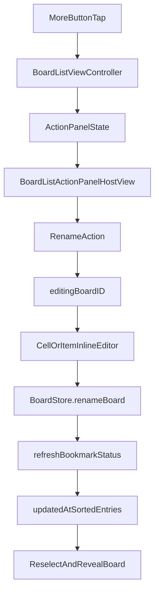

# BoardList Rename Rollout

实现目标：在 `BoardList` 的 `Grid/List` 两种展示里，为真实 board 增加三点“更多操作”按钮；点击后弹出自定义操作面板；点击“重命名”后收起面板并进入标题内联编辑；提交后只更新 `board.json` 的 `title` 和 `updatedAt`，然后刷新列表并让该 board 跳到最前、保持选中和可见。

## Flow




## Phase 1: 轻量 rename 持久化

- 在 [BoardStore](MyCanvas_Ver_0/Canvas/Storage/BoardStore.swift) 新增 `renameBoard(id:title:userDefaults:)`，只读写目标 board 的 `board.json`，不要走整板 `saveBoard()`。
- 复用同文件里现有的 `readBoardDocument(at:)` 和 `makeDocumentData(for:)`，只更新 `document.title` 与 `document.updatedAt = Date()`。
- 对输入标题做统一归一化：`trim` 首尾空白；若结果为空则回退到 `BoardDocument.defaultTitle`。
- 不改 loader / sort 逻辑，因为当前 catalog 已经按 `updatedAt` 倒序，rename 后天然会把 board 提到最前。

```208:214:MyCanvas_Ver_0/Canvas/Storage/BoardStore.swift
return entries.sorted { lhs, rhs in
    if lhs.document.updatedAt == rhs.document.updatedAt {
        return lhs.document.boardID.uuidString < rhs.document.boardID.uuidString
    }

    return lhs.document.updatedAt > rhs.document.updatedAt
}
```

## Phase 2: BoardList 专用 action panel 基础设施

- 新增 [BoardListActionPanelState](MyCanvas_Ver_0/Platform/Shared/BoardList/BoardListActionPanelState.swift)，定义最小 action 模型：`BoardListActionID.rename`、目标 `boardID`、锚点位置、展示项描述。
- 新增 [BoardListActionPanelHostView](MyCanvas_Ver_0/Platform/Shared/BoardList/BoardListActionPanelHostView.swift)，按 `CanvasContextMenuHostView` 的模式实现一层全屏 host：
  - iOS/macOS 都提供 `onDismissRequested` 和 `onActionSelected`
  - 面板是竖向按钮栈
  - 点击空白处收起
  - 根据锚点和安全区域做 clamp
- 参考 [CanvasContextMenuHostView](MyCanvas_Ver_0/Platform/Shared/ContextMenu/CanvasContextMenuHostView.swift) 的“控制器持有 host + state + 回调”接法，但不要复用 `CanvasCommandID` 或 canvas context menu state，避免把 BoardList 行为耦合进 canvas 命令体系。
- 默认先做 BoardList 专用 host view；本次实现不同时抽象 canvas menu 为通用泛型组件，避免把一次功能开发升级成跨模块重构。

## Phase 3: 在 iOS/macOS BoardList 控制器里接入 panel 生命周期

- 修改 [iOSBoardListViewController](MyCanvas_Ver_0/Platform/iOS/BoardList/iOSBoardListViewController.swift) 和 [macOSBoardListViewController](MyCanvas_Ver_0/Platform/macOS/BoardList/macOSBoardListViewController.swift)：
  - 新增 `actionPanelHostView`
  - 新增 `actionPanelState`
  - 新增 `editingBoardID`
  - 新增 `pendingRevealBoardID`
- 像 canvas controller 挂 `contextMenuHostView` 一样，把 panel host 挂到控制器根视图四边，而不是放进 cell/item 内部，避免被 `collectionView` 裁剪。
- 从 cell/item 的更多按钮回调拿到按钮 anchor rect，控制器负责把 rect 转成 host 坐标，并生成 `actionPanelState`。
- 新增统一的 `presentActionPanel(...)` / `dismissActionPanel()` / `performBoardAction(...)` 路径；`rename` 动作执行时顺序固定为：`dismissActionPanel()` -> 设置 `editingBoardID` -> reload -> 聚焦输入框。
- 下列事件统一收起 panel：点击空白、列表滚动、切换 Grid/List、刷新 bookmark 状态、开始打开 board、开始创建 board。

```36:42:MyCanvas_Ver_0/Platform/iOS/BoardList/iOSBoardListViewController.swift
private var entries: [BoardListEntry] {
    guard hasSelectedFolder, storageErrorMessage == nil else {
        return []
    }

    return [.newBoardPlaceholder] + availableBoards.map { .board($0) }
}
```

## Phase 4: 在 Grid/List cell/item 中加入三点按钮和内联编辑控件

- 修改 [iOSBoardCollectionViewCell](MyCanvas_Ver_0/Platform/iOS/BoardList/iOSBoardCollectionViewCell.swift)：
  - 新增 `moreButton`，图标使用 `ellipsis`
  - 新增 `titleTextField`
  - `configure(...)` 扩展为可接收 `isEditingTitle`、更多按钮回调、rename 提交/取消回调
  - Grid 模式把按钮放右上角；List 模式放右侧居中；placeholder 模式隐藏按钮
- 修改 [macOSBoardCollectionItem](MyCanvas_Ver_0/Platform/macOS/BoardList/macOSBoardCollectionItem.swift)：
  - 新增 `moreButton` 和可编辑标题输入控件
  - 用和 iOS 对等的配置参数与回调
  - 保持 placeholder 不出现更多按钮
- 标题进入编辑态时，隐藏原 `titleLabel`，显示输入控件；退出编辑态时反向切换。
- 内联编辑优先覆盖“标题区域”本身，不改 preview 区域和 card 尺寸，降低布局回归风险。

## Phase 5: rename 提交、排序回顶、选中与可见性恢复

- 在两端 controller 中新增 `commitRename(boardID:title:)`：
  - 调 `BoardStore.renameBoard(...)`
  - 成功后清空 `editingBoardID`
  - 设置 `selectedEntryID = .board(boardID)`
  - 设置 `pendingRevealBoardID = boardID`
  - 调用现有 `refreshBookmarkStatus()` 重新加载 entries
- 扩展 `reloadBoardList()` / `syncCollectionSelection()` 之后的流程：如果存在 `pendingRevealBoardID`，在新 indexPath 上执行显式滚动，让改名后的 board 即使因为 `updatedAt` 更新而跳到顶部，用户仍能立刻看到它。
- 编辑态期间要抑制误触打开：
  - iOS 的 `didSelectItemAt` 在 `editingBoardID != nil` 时不执行 `performPrimaryAction(for:)`
  - macOS 的双击打开同样要加 guard
- rename 失败时复用各平台现有 alert 路径反馈错误，不新增第二套错误 UI。

```404:414:MyCanvas_Ver_0/Platform/iOS/BoardList/iOSBoardListViewController.swift
private func performPrimaryAction(for entry: BoardListEntry) {
    guard hasSelectedFolder, storageErrorMessage == nil else {
        return
    }

    switch entry {
    case .newBoardPlaceholder:
        onCreateBoard?()
    case let .board(item):
        onOpenBoard?(item.boardID)
    }
}
```

## Phase 6: 平台交互细节与回归验证

- iOS 验证点：
  - Grid/List 中三点按钮命中区域稳定，不触发 cell 打开
  - 点击空白关闭 panel
  - 点“重命名”后键盘弹出，Return/结束编辑能提交
- macOS 验证点：
  - Grid/List 中三点按钮不干扰单击选中、双击打开
  - 点“重命名”后焦点进入文本框，Return 提交，Esc 取消
- 共通验证点：
  - placeholder `New Board` 不显示更多按钮
  - rename 后标题立即更新
  - `updatedAt` 更新导致 board 跳到列表顶部
  - 该 board 仍保持选中并滚动到可见区域
  - panel 在切换 display mode / refresh / 打开其他 board 时不会残留
- 完成代码后，对改动文件跑 `ReadLints`，并做至少一次 macOS typecheck / iOS 编译验证，重点关注新增输入框和 overlay host 的约束与事件传递。

## 实施顺序建议

- 先完成 Phase 1，再做 Phase 2 和 Phase 3 的骨架接线。
- 接着落地 Phase 4 的 iOS/macOS cell/item 改造。
- 最后补 Phase 5 的回顶与焦点恢复，再集中做 Phase 6 验证。
- 这样可以保证每一步都有可单独验证的增量：先数据正确，再浮层正确，再编辑正确，最后排序/滚动正确。

