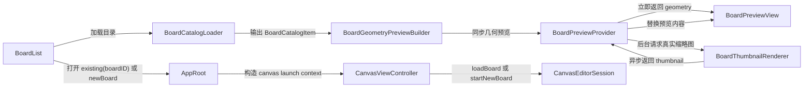

# BoardList 分阶段实现计划

## 目标

在不推翻现有架构的前提下，为 BoardList 增加：

- 列表与网格两种展示模式
- 基于 `boardID` 的显式打开链路
- 首屏同步几何预览
- 后台异步真实缩略图替换
- 为后续持久化 `thumbnail.png` 预留平滑升级点

## 当前关键约束

- [MyCanvas_Ver_0/Platform/macOS/BoardList/macOSBoardListViewController.swift](MyCanvas_Ver_0/Platform/macOS/BoardList/macOSBoardListViewController.swift) 和 [MyCanvas_Ver_0/Platform/iOS/BoardList/iOSBoardListViewController.swift](MyCanvas_Ver_0/Platform/iOS/BoardList/iOSBoardListViewController.swift) 目前只是占位页，只统计数量并跳转到 Canvas。
- [MyCanvas_Ver_0/App/AppLaunchDestination.swift](MyCanvas_Ver_0/App/AppLaunchDestination.swift) 当前 `canvas` 路由不携带 `boardID`，BoardList 不能显式打开某个画板。
- [MyCanvas_Ver_0/Canvas/Editing/CanvasEditorSession.swift](MyCanvas_Ver_0/Canvas/Editing/CanvasEditorSession.swift) 当前恢复逻辑依赖 `loadOrCreateInitialBoard()`，会自动取第一个画板或创建空白板，不适合作为 BoardList 入口。
- [MyCanvas_Ver_0/Canvas/Storage/BoardStore.swift](MyCanvas_Ver_0/Canvas/Storage/BoardStore.swift) 当前 `loadBoard(id:)` 会解码整板图片资产，不能直接用作 BoardList 首屏批量预览。
- [MyCanvas_Ver_0/Canvas/Core/CanvasMiniMapSnapshot.swift](MyCanvas_Ver_0/Canvas/Core/CanvasMiniMapSnapshot.swift) 和 [MyCanvas_Ver_0/Canvas/Core/CanvasMiniMapNodeProvider.swift](MyCanvas_Ver_0/Canvas/Core/CanvasMiniMapNodeProvider.swift) 已经体现出 geometry-first 方向，适合首屏几何预览复用其语义。

## 分阶段任务

### 阶段 1：补齐路由与 Canvas 启动上下文

目标：先解决 BoardList 选中哪个 board 却无法打开的根因。

- 改造 [MyCanvas_Ver_0/App/AppLaunchDestination.swift](MyCanvas_Ver_0/App/AppLaunchDestination.swift)
  - 增加 `CanvasLaunchContext`
  - 建议形态：`existing(boardID: UUID)` 和 `newBoard`
- 改造 [MyCanvas_Ver_0/Platform/macOS/AppRoot/macOSAppRootViewController.swift](MyCanvas_Ver_0/Platform/macOS/AppRoot/macOSAppRootViewController.swift) 与 [MyCanvas_Ver_0/Platform/iOS/AppRoot/iOSAppRootViewController.swift](MyCanvas_Ver_0/Platform/iOS/AppRoot/iOSAppRootViewController.swift)
  - 让 BoardList 可以回调“打开已有板”和“新建板”
  - AppRoot 负责把回调转成 `.canvas(...)`
- 改造 [MyCanvas_Ver_0/Canvas/Editing/CanvasEditorSession.swift](MyCanvas_Ver_0/Canvas/Editing/CanvasEditorSession.swift)
  - 新增 `loadBoard(id:)`
  - 新增 `startNewBoard()`
  - 保留 `restorePersistedBoardIfPossible()` 作为没有显式上下文时的兜底
- 改造 [MyCanvas_Ver_0/Platform/macOS/macOSViewController.swift](MyCanvas_Ver_0/Platform/macOS/macOSViewController.swift) 与 [MyCanvas_Ver_0/Platform/iOS/iOSViewController.swift](MyCanvas_Ver_0/Platform/iOS/iOSViewController.swift)
  - 增加 `launchContext`
  - 根据上下文决定 `loadBoard(id:)` / `startNewBoard()` / `restorePersistedBoardIfPossible()`

交付标准：BoardList 可以明确打开指定 `boardID`，空目录也可以走新建板路径。

### 阶段 2：抽目录读取层与几何预览种子

目标：把 BoardList 数据链路从 `BoardStore.loadBoard(id:)` 解耦出来。

- 新增 shared 目录模型
  - 建议新增 [MyCanvas_Ver_0/BoardList/Shared/BoardCatalogItem.swift](MyCanvas_Ver_0/BoardList/Shared/BoardCatalogItem.swift)
  - 包含：`boardID`、`title`、`createdAt`、`updatedAt`、`previewSeed`、`revisionToken`
- 新增目录加载器
  - 建议新增 [MyCanvas_Ver_0/BoardList/Shared/BoardCatalogLoader.swift](MyCanvas_Ver_0/BoardList/Shared/BoardCatalogLoader.swift)
  - 只读目录和 `board.json`，不读 `assets`
  - 可复用 [MyCanvas_Ver_0/Canvas/Storage/BoardStore.swift](MyCanvas_Ver_0/Canvas/Storage/BoardStore.swift) 里“遍历 board 目录 + 读 document”的逻辑，但要抽到共享 helper，避免重复实现
- 新增预览种子
  - 建议新增 [MyCanvas_Ver_0/BoardList/Shared/BoardPreviewSeed.swift](MyCanvas_Ver_0/BoardList/Shared/BoardPreviewSeed.swift)
  - 只保留几何数据，如 `boardWorldRect` 和节点列表
- 新增几何预览构建器
  - 建议新增 [MyCanvas_Ver_0/BoardList/Shared/BoardGeometryPreviewBuilder.swift](MyCanvas_Ver_0/BoardList/Shared/BoardGeometryPreviewBuilder.swift)
  - 从 `BoardDocument.items` 直接构造 geometry preview，不经过 `CGImage`
  - 复用 [MyCanvas_Ver_0/Canvas/Core/CanvasGeometry.swift](MyCanvas_Ver_0/Canvas/Core/CanvasGeometry.swift) 与 [MyCanvas_Ver_0/Canvas/Core/CanvasMiniMapViewGeometry.swift](MyCanvas_Ver_0/Canvas/Core/CanvasMiniMapViewGeometry.swift) 的几何能力

交付标准：BoardList 可以拿到完整目录项，并能同步生成“文档几何预览”。

### 阶段 3：统一 collection 容器，落地列表/网格模式

目标：先让 BoardList 成为真正可用的浏览器，再接入混合预览。

- 改造 [MyCanvas_Ver_0/Platform/macOS/BoardList/macOSBoardListViewController.swift](MyCanvas_Ver_0/Platform/macOS/BoardList/macOSBoardListViewController.swift)
  - 从占位页改为 `NSCollectionView`
  - 支持 list/grid 两种 layout
  - 增加 toolbar / segmented control 切换展示模式
- 改造 [MyCanvas_Ver_0/Platform/iOS/BoardList/iOSBoardListViewController.swift](MyCanvas_Ver_0/Platform/iOS/BoardList/iOSBoardListViewController.swift)
  - 从占位页改为 `UICollectionView`
  - 与 macOS 保持同一 display mode 语义
- 新增 shared 展示模式
  - 建议新增 [MyCanvas_Ver_0/BoardList/Shared/BoardListDisplayMode.swift](MyCanvas_Ver_0/BoardList/Shared/BoardListDisplayMode.swift)
- 新增平台 cell
  - 建议新增 [MyCanvas_Ver_0/Platform/macOS/BoardList/macOSBoardCollectionItem.swift](MyCanvas_Ver_0/Platform/macOS/BoardList/macOSBoardCollectionItem.swift)
  - 建议新增 [MyCanvas_Ver_0/Platform/iOS/BoardList/iOSBoardCollectionViewCell.swift](MyCanvas_Ver_0/Platform/iOS/BoardList/iOSBoardCollectionViewCell.swift)
- 空状态策略
  - 无 bookmark：继续显示文件夹选择入口
  - 有 bookmark 但无 board：显示空状态 + 新建板按钮
  - 有 board：显示 collection + 打开入口

交付标准：双端 BoardList 共享同一交互模型，只是平台控件不同；list/grid 切换不需要两套 controller。

### 阶段 4：接入混合预览的同步链

目标：保证 BoardList 首屏秒开，不空白，不阻塞。

- 新增 shared 预览内容抽象
  - 建议新增 [MyCanvas_Ver_0/BoardList/Shared/BoardPreviewContent.swift](MyCanvas_Ver_0/BoardList/Shared/BoardPreviewContent.swift)
  - 统一表达 `.geometry` 和 `.thumbnail`
- 新增 shared preview provider 接口
  - 建议新增 [MyCanvas_Ver_0/BoardList/Shared/BoardPreviewProvider.swift](MyCanvas_Ver_0/BoardList/Shared/BoardPreviewProvider.swift)
  - `immediatePreview(for:)` 永远同步返回几何预览
- 新增 preview view
  - 建议新增 [MyCanvas_Ver_0/Platform/Shared/BoardList/BoardPreviewView.swift](MyCanvas_Ver_0/Platform/Shared/BoardList/BoardPreviewView.swift)
  - 不直接复用现有 minimap view 的交互行为
  - 但内部复用 minimap 的绘制语义和 geometry fit 逻辑
- 更新平台 cell
  - `configure(with:)` 时先绑定标题
  - 再立即显示 `.geometry`

交付标准：BoardList 首屏不依赖真实图片解码，预览能稳定秒出。

### 阶段 5：接入后台真实缩略图替换

目标：在不牺牲首屏速度的情况下，提高预览质量。

- 新增真实缩略图渲染器
  - 建议新增 [MyCanvas_Ver_0/BoardList/Shared/BoardThumbnailRenderer.swift](MyCanvas_Ver_0/BoardList/Shared/BoardThumbnailRenderer.swift)
  - 负责读取文档和必要的图片资产，离屏生成真实缩略图
  - 不直接复用 platform controller / `CanvasEditorSession`
- 新增缓存层
  - 建议新增 [MyCanvas_Ver_0/BoardList/Shared/BoardThumbnailCache.swift](MyCanvas_Ver_0/BoardList/Shared/BoardThumbnailCache.swift)
  - key 建议包含：`boardID + revisionToken + pixelSize`
- 扩展 preview provider
  - `requestThumbnail(for:targetPixelSize:completion:)` 异步返回真实缩略图
  - 内部做限流、缓存命中、回调派发
- 更新平台 cell
  - `prepareForReuse()` 取消旧任务
  - 回调时校验 `boardID + revisionToken`
  - 只替换预览区域，不重绑布局与标题

交付标准：BoardList 首屏先显示几何预览，后台完成真实图后无缝替换，不发生串图。

### 阶段 6：二期升级为持久化 `thumbnail.png`

目标：把真实缩略图从“临时后台渲染”升级为“可复用的持久化产物”。

- 扩展 [MyCanvas_Ver_0/Canvas/Storage/BoardStore.swift](MyCanvas_Ver_0/Canvas/Storage/BoardStore.swift)
  - 在保存流程里为当前 board 生成或刷新 `thumbnail.png`
- 调整 `BoardPreviewProvider`
  - 优先读取持久化缩略图
  - 缺失或过期时才回退到即时渲染
- 复用阶段 5 的 cache key / version 语义
  - `updatedAt` 继续作为 revision 基础

交付标准：BoardList 大目录下的真实缩略图加载成本进一步降低，后台渲染只作为兜底。

## 数据流

## 验收顺序

- 阶段 1 完成后先验证：能否从 BoardList 打开指定 board 与新建 board。
- 阶段 3 完成后验证：双端 list/grid 切换、空状态、目录切换。
- 阶段 4 完成后验证：BoardList 首屏是否无明显阻塞。
- 阶段 5 完成后验证：滚动复用下是否串图、缩略图替换是否抖动。
- 阶段 6 完成后验证：保存后缩略图是否及时刷新，重新进入列表是否优先命中持久化产物。

## 风险控制

- 不让 BoardList 直接依赖 [MyCanvas_Ver_0/Canvas/Storage/BoardStore.swift](MyCanvas_Ver_0/Canvas/Storage/BoardStore.swift) 的重型 `loadBoard(id:)` 预览路径。
- 不把预览逻辑塞进平台 controller，统一通过 shared loader / provider / renderer 管理。
- `BoardList` 相关新增类型集中放在 `BoardList/Shared` 和 `Platform/*/BoardList`，避免污染现有 Canvas 编辑主链。
- 真实缩略图必须有取消、缓存、revision 校验三件套，否则 collection 复用下容易串图。

