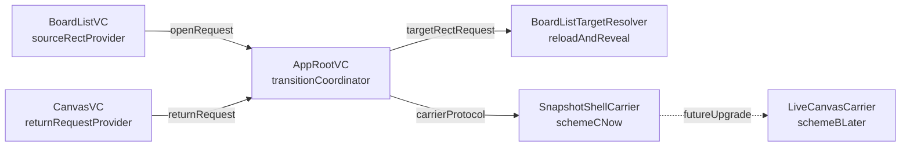

# BoardList 缩放转场计划

## 目标

- 先按 `方案 C` 实现 `BoardList -> Canvas -> BoardList` 的放大/缩小转场，满足已有板卡片、新建占位、新建后返回到真实新卡片这三类场景。
- 从第一天就把转场基础设施设计成“可替换 carrier”的结构，后续升级到 `方案 B` 时，不重做 `BoardList` 几何采集、`AppRoot` 状态机、返回目标解析和新建板持久化链。
- 本轮不直接实现 `方案 B`，只预留升级边界。

## 关键现状

- 当前页面切换集中在 [iOSAppRootViewController.swift](MyCanvas_Ver_0/Platform/iOS/AppRoot/iOSAppRootViewController.swift) 和 [macOSAppRootViewController.swift](MyCanvas_Ver_0/Platform/macOS/AppRoot/macOSAppRootViewController.swift) 的 `display(_:) -> setCurrentViewController(_:)`，属于“直接换 child VC”，还没有转场状态机。
- 当前列表打开链集中在 [iOSBoardListViewController.swift](MyCanvas_Ver_0/Platform/iOS/BoardList/iOSBoardListViewController.swift) / [macOSBoardListViewController.swift](MyCanvas_Ver_0/Platform/macOS/BoardList/macOSBoardListViewController.swift) 的 `performPrimaryAction(for:)`，只往上抛 `boardID` 或“新建”意图，没有抛 `entryID`、`sourceRect`、snapshot 描述。
- 当前画板返回链集中在 [iOSViewController.swift](MyCanvas_Ver_0/Platform/iOS/iOSViewController.swift) / [macOSViewController.swift](MyCanvas_Ver_0/Platform/macOS/macOSViewController.swift) 的 `handleBackButtonTap()` / `handleBackButtonClick()`，只回调 `onBackToBoardList`，没有回传 `boardID`，也没有保证新建板先落盘。
- 当前列表已有一条可复用的目标准备链：`pendingRevealBoardID -> reloadBoardList() -> revealPendingBoardIfNeeded()`，在 [iOSBoardListViewController.swift](MyCanvas_Ver_0/Platform/iOS/BoardList/iOSBoardListViewController.swift) 与 [macOSBoardListViewController.swift](MyCanvas_Ver_0/Platform/macOS/BoardList/macOSBoardListViewController.swift) 都已存在。
- 当前共享层已有 transition 命名模式可复用： [CanvasToolbarTransitionState.swift](MyCanvas_Ver_0/Platform/Shared/Toolbar/CanvasToolbarTransitionState.swift) 与 [CanvasToolbarTransitionGeometry.swift](MyCanvas_Ver_0/Platform/Shared/Toolbar/CanvasToolbarTransitionGeometry.swift)。

## 架构方向

## Phase 1：抽取共享转场域模型与请求契约

- 新增一组共享转场模型，建议放在新的共享目录中，命名沿用现有 transition 风格，例如：
  - `MyCanvas_Ver_0/Platform/Shared/Transition/BoardListCanvasTransitionState.swift`
  - `MyCanvas_Ver_0/Platform/Shared/Transition/BoardListCanvasTransitionGeometry.swift`
- 域模型只承载“从哪来、到哪去、当前方向、目标 board 身份、source/target 几何、carrier 类型”，不掺平台视图类型，避免把 `UIView` / `NSView` 直接带进共享层。
- 将现有 [AppLaunchDestination.swift](MyCanvas_Ver_0/App/AppLaunchDestination.swift) 维持为业务路由真源；新增独立的 open/close transition request，而不是把 snapshot 或 rect 塞进 `CanvasLaunchContext`。
- 将 `BoardList` 向 `AppRoot` 的回调，从“只传 `boardID` / 无参新建”升级为“传业务语义 + 转场来源信息”；将 `Canvas` 返回回调，从无参 `onBackToBoardList` 升级为“带 `boardID` / sourceKind / 是否需要确保持久化”的返回请求。
- 阶段验收：不产生视觉变化，但 `AppRoot` 已能完整拿到一次 open request 和一次 return request 的结构化上下文。

## Phase 2：补齐 BoardList 的 source rect 与 target reveal 提供能力

- 在 [iOSBoardListViewController.swift](MyCanvas_Ver_0/Platform/iOS/BoardList/iOSBoardListViewController.swift) / [macOSBoardListViewController.swift](MyCanvas_Ver_0/Platform/macOS/BoardList/macOSBoardListViewController.swift) 中，把“点击入口”和“几何解析能力”分开：
  - 打开时根据 `BoardListEntryID` 提供 source card rect。
  - 返回时根据 `boardID` 驱动 `pendingRevealBoardID`，并在 reveal 后提供 target rect。
- 在 [iOSBoardCollectionViewCell.swift](MyCanvas_Ver_0/Platform/iOS/BoardList/iOSBoardCollectionViewCell.swift) / [macOSBoardCollectionItem.swift](MyCanvas_Ver_0/Platform/macOS/BoardList/macOSBoardCollectionItem.swift) 中补齐“用于转场的可导出视图区域”，至少能稳定拿到卡片整体 rect；如果后续需要更像系统放大观感，再额外暴露 preview 子区域 rect。
- 统一封装 iOS 单击打开、macOS 双击打开 / 占位单击新建的差异，让上层只消费统一的 transition source。
- 保持 `pendingRevealBoardID -> revealPendingBoardIfNeeded()` 为返回目标准备链的唯一入口，不新增第二套“查找 target 卡片”的隐藏路径。
- 阶段验收：`AppRoot` 可以不关心 collection view 实现细节，只通过 `BoardList` 提供者拿到 source rect 和 reveal 后的 target rect。

## Phase 3：在 AppRoot 建立可替换 carrier 的转场协调器

- 在 [iOSAppRootViewController.swift](MyCanvas_Ver_0/Platform/iOS/AppRoot/iOSAppRootViewController.swift) / [macOSAppRootViewController.swift](MyCanvas_Ver_0/Platform/macOS/AppRoot/macOSAppRootViewController.swift) 中，把当前“直接删旧 VC、加新 VC”的 `setCurrentViewController(_:)` 改造成显式转场状态机：`idle -> opening -> steadyCanvas -> closing -> steadyBoardList`。
- 新增 `TransitionCarrier` 抽象，当前只落地 `SnapshotShellCarrier`；`LiveCanvasCarrier` 只保留接口和上下文要求，不在本阶段实现。
- `AppRoot` 统一负责：挂载/隐藏真实 canvas、持有 overlay host、等待列表 target ready、清理转场中间态；`BoardList` 和 `Canvas` 不直接互相调动画。
- 为后续升级到 `方案 B` 预留两个明确边界：
  - `AppRoot` 不依赖 snapshot 独有细节来推进状态机。
  - carrier 的输入是统一 transition context，而不是某个 snapshot view 的私有参数。
- 阶段验收：容器已经具备“保留旧页一小段时间、挂新页但暂不接管展示、等待目标 ready 再完成切换”的能力，即使动画先用占位实现也可以。

## Phase 4：实现方案 C 的打开放大动画

- 打开已有板时：从 source card rect 生成 snapshot shell，执行 `sourceRect -> fullscreenRect` 放大；真实 `CanvasVC` 在后台完成 `restoreInitialBoardState()`、`setupCanvasViewport()` 和首帧 refresh，待稳定后淡入接管。
- 打开新建占位时：同样从 placeholder card rect 起步，视觉上保持和已有板一致，只是业务路由是 `.newBoard`。
- 为了减少和真实 viewport 链冲突，首版不要让真实 `CanvasVC.view` 在动画前半段承担几何变化；保持它仍按全屏页面初始化，这样不会去碰 [iOSViewController.swift](MyCanvas_Ver_0/Platform/iOS/iOSViewController.swift) / [macOSViewController.swift](MyCanvas_Ver_0/Platform/macOS/macOSViewController.swift) 的 `viewDidLayoutSubviews` / `viewDidLayout`、`syncCameraViewportSizeIfNeeded(...)`、`requestCanvasRefresh(...)` 核心链。
- 将 snapshot shell 的圆角、背景、阴影、preview 比例与 [iOSBoardCollectionViewCell.swift](MyCanvas_Ver_0/Platform/iOS/BoardList/iOSBoardCollectionViewCell.swift) / [macOSBoardCollectionItem.swift](MyCanvas_Ver_0/Platform/macOS/BoardList/macOSBoardCollectionItem.swift) 当前卡片外观对齐，避免“开场瞬间换皮”。
- 阶段验收：iOS / macOS 都能从已有板卡片和新建占位平滑放大进入全屏画板，并且真实 canvas 接管时没有明显跳帧或布局突变。

## Phase 5：实现方案 C 的返回缩小动画

- 将 [iOSViewController.swift](MyCanvas_Ver_0/Platform/iOS/iOSViewController.swift) / [macOSViewController.swift](MyCanvas_Ver_0/Platform/macOS/macOSViewController.swift) 的返回按钮，从“直接 `onBackToBoardList?()`”升级为“返回请求 + 当前 `boardID` + 必要时先保存”。
- 新建板返回时，先调用 [CanvasEditorSession.swift](MyCanvas_Ver_0/Canvas/Editing/CanvasEditorSession.swift) 的 `saveBoardNow(reason:createBoardIfNeeded:completion:)`，确保列表 reload 后存在真实新卡片；不要依赖 autosave 的 0.35 秒延迟。
- `AppRoot` 收到返回请求后，先让 `BoardList.prepareForDisplay()` 触发 `refreshBookmarkStatus()` / `reloadBoardList()`，并通过 `pendingRevealBoardID` 保证目标卡片滚到可见区域；等 target rect ready 后，再驱动 snapshot shell 从全屏缩回目标卡片。
- 若目标卡片无法解析：
  - 已有板丢失时降级为居中缩放淡出。
  - 新建板保存失败时保留在 canvas 或给出明确失败反馈，不做“缩回空目标”的假动画。
- 阶段验收：已有板能缩回同一张卡片；新建板能缩回新生成的真实板卡片，而不是缩回占位卡片。

## Phase 6：补齐输入冻结、视觉一致性与方案 B 升级缝隙验证

- 转场期间统一冻结列表和画板输入，避免点击、滚动、双击、context menu、text overlay 在动画半途抢状态。
- 将时长、曲线、最小缩放比例、圆角插值等收口为共享 transition configuration，避免 iOS/macOS 各自写死。
- 处理 preview 与真实 board 内容不一致的视觉策略：
  - 打开时允许前半段看到卡片 preview，后半段由真实 canvas 接管。
  - 返回时优先用实时 capture 的 fullscreen shell，而不是复用旧列表 preview。
- 明确记录“升级到 B 时只需要替换的模块”:
  - `SnapshotShellCarrier` -> `LiveCanvasCarrier`
  - `Canvas` 侧新增过渡 phase 与输入保护
  - 容器关闭时延迟移除真实 `CanvasVC`
- 阶段验收：当前 `C` 已完整可用，同时能够证明未来切到 `B` 时，不需要重做 `BoardList` source/target 解析、`AppRoot` 状态机、返回持久化链和 reveal 链。

## 方案 B 升级边界

- 本轮 `C` 完成后，后续升级到 `B` 的新增工作应只集中在三处：
  - 真实 `CanvasVC.view` 或其外层 wrapper 作为 live carrier。
  - `Canvas` 过渡 phase：转场期输入冻结、layout/refresh 保护。
  - 返回时“真实 canvas 保留到 target ready 再缩回”的容器时序。
- 如果本轮实施中发现必须改动 `BoardList` source/target 提供协议、`AppRoot` 状态机或返回持久化链，说明设计仍然没有把 `C` 做成可升级到 `B` 的结构，应在 Phase 3 前回头收口。

## 建议的核心文件范围

- 现有文件：
  - [AppLaunchDestination.swift](MyCanvas_Ver_0/App/AppLaunchDestination.swift)
  - [iOSAppRootViewController.swift](MyCanvas_Ver_0/Platform/iOS/AppRoot/iOSAppRootViewController.swift)
  - [macOSAppRootViewController.swift](MyCanvas_Ver_0/Platform/macOS/AppRoot/macOSAppRootViewController.swift)
  - [iOSBoardListViewController.swift](MyCanvas_Ver_0/Platform/iOS/BoardList/iOSBoardListViewController.swift)
  - [macOSBoardListViewController.swift](MyCanvas_Ver_0/Platform/macOS/BoardList/macOSBoardListViewController.swift)
  - [iOSBoardCollectionViewCell.swift](MyCanvas_Ver_0/Platform/iOS/BoardList/iOSBoardCollectionViewCell.swift)
  - [macOSBoardCollectionItem.swift](MyCanvas_Ver_0/Platform/macOS/BoardList/macOSBoardCollectionItem.swift)
  - [iOSViewController.swift](MyCanvas_Ver_0/Platform/iOS/iOSViewController.swift)
  - [macOSViewController.swift](MyCanvas_Ver_0/Platform/macOS/macOSViewController.swift)
  - [CanvasEditorSession.swift](MyCanvas_Ver_0/Canvas/Editing/CanvasEditorSession.swift)
- 计划新增文件：
  - `MyCanvas_Ver_0/Platform/Shared/Transition/BoardListCanvasTransitionState.swift`
  - `MyCanvas_Ver_0/Platform/Shared/Transition/BoardListCanvasTransitionGeometry.swift`
  - 平台侧 carrier / coordinator 文件各一组，分别挂在 `Platform/iOS/AppRoot/` 与 `Platform/macOS/AppRoot/` 下。

## 总体验收

- 打开已有板：从对应卡片放大到全屏，真实 canvas 平滑接管。
- 打开新建占位：从占位卡片放大到全屏。
- 返回已有板：从全屏缩回同一张卡片。
- 返回新建板：若保存成功，缩回真实新板卡片；若保存失败，明确降级，不做错误缩回。
- iOS 与 macOS 的差异只保留在输入触发和平台 carrier 细节，不扩散到共享转场域模型与容器状态机。

