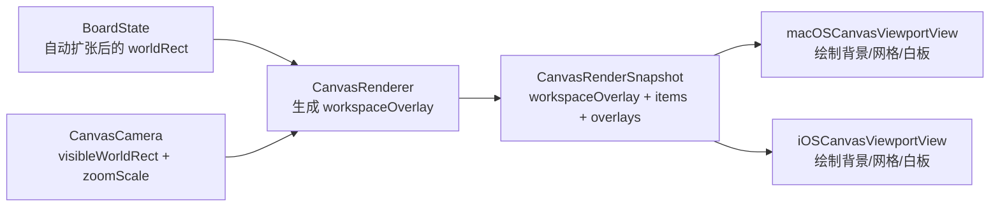

# 画布工作区方案三分阶段计划

## 目标

- 保留 `board` 自动扩张逻辑，只改渲染语义，不改文档事实。
- 采用方案三：由 shared 层统一产出 `workspace/grid/board surface` 几何，`macOS`/`iOS` viewport 只负责消费和绘制。
- 最终视觉目标是“黑灰工作区 + world 锁定网格 + 白色画布 + 无橙色虚线 board 边框”。

## 当前约束

- 现有快照只有 `boardOverlay`，还没有 `workspace/grid` 语义：[MyCanvas_Ver_0/Canvas/Core/CanvasRenderSnapshot.swift](MyCanvas_Ver_0/Canvas/Core/CanvasRenderSnapshot.swift)
- 现有 renderer 只把 `boardState.worldRect` 投影成 `screenRect`：[MyCanvas_Ver_0/Canvas/Core/CanvasRenderer.swift](MyCanvas_Ver_0/Canvas/Core/CanvasRenderer.swift)
- 现有 viewport 层级里 `boardHighlightLayer` 在 `overlayLayer` 内，天然适合描边，不适合承载白色 board surface：[MyCanvas_Ver_0/Platform/macOS/Canvas/macOSCanvasViewportView.swift](MyCanvas_Ver_0/Platform/macOS/Canvas/macOSCanvasViewportView.swift)、[MyCanvas_Ver_0/Platform/iOS/Canvas/iOSCanvasViewportView.swift](MyCanvas_Ver_0/Platform/iOS/Canvas/iOSCanvasViewportView.swift)
- 持久化目前只保存 `boardState` 几何，不应把工作区外观写入文档：[MyCanvas_Ver_0/Canvas/Storage/BoardDocumentMapper.swift](MyCanvas_Ver_0/Canvas/Storage/BoardDocumentMapper.swift)
- 撤销边界已经包含 `boardState`，本次不应扩大撤销语义：[MyCanvas_Ver_0/Canvas/Editing/BoardHistorySnapshot.swift](MyCanvas_Ver_0/Canvas/Editing/BoardHistorySnapshot.swift)
- 仓库里未发现独立测试 target，本次需要把验证计划写成 shared 几何校验 + 双端手动回归。

```219:225:MyCanvas_Ver_0/Canvas/Core/CanvasRenderSnapshot.swift
struct CanvasRenderSnapshot {
    let viewportBounds: CGRect
    let visibleWorldRect: CGRect
    let boardOverlay: CanvasBoardRenderOverlay?
    let items: [CanvasRenderItem]
    let editOverlay: CanvasEditRenderOverlay?
    let interactionOverlay: CanvasInteractionRenderOverlay?
}
```

```140:145:MyCanvas_Ver_0/Platform/macOS/Canvas/macOSCanvasViewportView.swift
layer?.addSublayer(backgroundLayer)
layer?.addSublayer(itemsLayer)
layer?.addSublayer(overlayLayer)
overlayLayer.addSublayer(boardHighlightLayer)
```




## 阶段 1：冻结 shared 渲染契约

- 目标：先把“board highlight”语义升级为“workspace + board surface + grid”语义，但保持编译安全，避免一上来同时重写双端 viewport。
- 变更文件： [MyCanvas_Ver_0/Canvas/Core/CanvasRenderSnapshot.swift](MyCanvas_Ver_0/Canvas/Core/CanvasRenderSnapshot.swift)、[MyCanvas_Ver_0/Canvas/Core/CanvasRenderer.swift](MyCanvas_Ver_0/Canvas/Core/CanvasRenderer.swift)
- 任务：新增 `CanvasWorkspaceRenderOverlay`，至少包含 `boardSurfaceScreenRect`、`boardSurfaceWorldRect`、`minorGridSegments`、`majorGridSegments`、`viewportBounds`。
- 任务：第一阶段采用“加法改造”，先保留现有 `boardOverlay` 字段，避免 shared 改动与双端视图改动强耦合。
- 任务：明确 shared 只输出几何和层级语义，不输出 `UIColor` / `NSColor` / `CGColor` 等平台对象。
- 任务：明确网格为 `world` 锁定，不绑定 `board` 扩张步长，不进入持久化；第一版用 shared 常量定义 `minorStepWorld` 与 `majorEvery`。
- 验收：`CanvasEditorSession.makeCanvasSnapshot()` 的调用链不变；`BoardDocument`、`BoardDocumentMapper`、`BoardHistorySnapshot` 无格式升级和外观字段。

## 阶段 2：把网格几何下沉到 shared renderer

- 目标：让 `CanvasRenderer` 真正承担方案三中的几何计算职责，平台层不再重复算网格。
- 变更文件： [MyCanvas_Ver_0/Canvas/Core/CanvasRenderer.swift](MyCanvas_Ver_0/Canvas/Core/CanvasRenderer.swift)，必要时新增一个 shared helper，建议落在 [MyCanvas_Ver_0/Canvas/Core/](MyCanvas_Ver_0/Canvas/Core/)
- 任务：根据 `camera.visibleWorldRect`、`camera.zoomScale`、`boardState.worldRect` 生成当前可见区域内的网格线段，并在 shared 层完成 `world -> screen` 投影。
- 任务：网格输出使用 screen-space line segments，平台层只负责把 segments 拼成 path 并设置线宽/颜色。
- 任务：board surface 继续完全基于自动扩张后的 `boardState.worldRect`，不改 `CanvasBoardState.expandIfNeeded()` 算法。
- 任务：shared 层统一处理可见区域裁剪，避免 iOS/macOS 各自做一套“只渲染可见网格线”的性能优化。
- 验收：平移和缩放过程中，网格与世界坐标稳定对齐；board 扩张后，新扩出的区域能立即形成新的白色 board surface 边界。

## 阶段 3：迁移 macOS viewport

- 目标：先在 `macOS` 端吃掉新的 shared contract，验证层级与交互不回退。
- 变更文件： [MyCanvas_Ver_0/Platform/macOS/Canvas/macOSCanvasViewportView.swift](MyCanvas_Ver_0/Platform/macOS/Canvas/macOSCanvasViewportView.swift)
- 任务：新增 `workspaceGridLayer` 和 `boardSurfaceLayer`。
- 任务：重排层级为 `backgroundLayer -> workspaceGridLayer -> boardSurfaceLayer -> itemsLayer -> overlayLayer`。
- 任务：新增 `refreshWorkspaceChrome()` 或等价方法，专门消费 `snapshot.workspaceOverlay`，不要继续复用 `refreshBoardHighlight()` 的“描边高亮”命名和职责。
- 任务：把 `backgroundLayer` 改成黑灰工作区底色；把 `boardSurfaceLayer` 改成白色填充且无描边。
- 任务：停用或删除 `boardHighlightLayer` 的橙色虚线逻辑，保证 board 不再以 overlay 边框的方式出现。
- 验收：图片内容仍然位于白色 board 上方；`selection/crop/rotation` 叠加层级不变；缩放和平移时网格不抖动、不漂移。

## 阶段 4：迁移 iOS viewport

- 目标：让 `iOS` 与 `macOS` 消费同一套 shared 几何，保持行为一致。
- 变更文件： [MyCanvas_Ver_0/Platform/iOS/Canvas/iOSCanvasViewportView.swift](MyCanvas_Ver_0/Platform/iOS/Canvas/iOSCanvasViewportView.swift)
- 任务：对齐 `macOS` 的 layer 拆分和刷新方法，避免两端再次分叉成不同的背景/网格实现。
- 任务：确保 pinch zoom、拖拽、长按菜单等交互只影响 `camera` 和 overlay，不影响 grid/board 的层级职责。
- 任务：保留现有 `selection/crop/rotation` 交互层结构，不把任何编辑 chrome 塞回 `boardSurfaceLayer`。
- 验收：`iOS` 上的 pan/zoom/long press 行为与改造前一致；网格随缩放和平移正确更新；board 自动扩张后视觉边界同步刷新。

## 阶段 5：收口旧 contract 与技术债

- 目标：在双端都迁移完成后，清理遗留的“board highlight”旧语义，避免 shared contract 长期双轨运行。
- 变更文件： [MyCanvas_Ver_0/Canvas/Core/CanvasRenderSnapshot.swift](MyCanvas_Ver_0/Canvas/Core/CanvasRenderSnapshot.swift)、[MyCanvas_Ver_0/Canvas/Core/CanvasRenderer.swift](MyCanvas_Ver_0/Canvas/Core/CanvasRenderer.swift)、双端 `*CanvasViewportView`
- 任务：确认 `boardOverlay` 已无调用方后，再删除或重命名旧字段，统一只保留 `workspaceOverlay` 语义。
- 任务：统一方法和类型命名，避免代码里继续出现 `Highlight`、`boardStrokeColor` 这类已经失效的旧命名。
- 任务：补一轮性能与渲染检查，重点关注大视口、高缩放、快速拖动画布时的 path 重建成本。
- 验收：shared snapshot 只表达当前真实视觉语义；主画布代码中不再存在“橙色虚线 board 高亮”的遗留路径。

## 阶段 6：小地图与列表预览的视觉对齐

- 目标：主画布稳定后，再决定是否统一 `MiniMap` 和 `BoardPreview` 的视觉语言，避免主画布已是白板 + 深色工作区，而缩略视图仍保留旧橙色 board。
- 变更文件： [MyCanvas_Ver_0/Platform/macOS/Canvas/macOSCanvasMiniMapView.swift](MyCanvas_Ver_0/Platform/macOS/Canvas/macOSCanvasMiniMapView.swift)、[MyCanvas_Ver_0/Platform/iOS/Canvas/iOSCanvasMiniMapView.swift](MyCanvas_Ver_0/Platform/iOS/Canvas/iOSCanvasMiniMapView.swift)、[MyCanvas_Ver_0/Platform/macOS/BoardList/macOSBoardPreviewView.swift](MyCanvas_Ver_0/Platform/macOS/BoardList/macOSBoardPreviewView.swift)、[MyCanvas_Ver_0/Platform/iOS/BoardList/iOSBoardPreviewView.swift](MyCanvas_Ver_0/Platform/iOS/BoardList/iOSBoardPreviewView.swift)、[MyCanvas_Ver_0/Platform/Shared/BoardList/BoardPreviewRenderer.swift](MyCanvas_Ver_0/Platform/Shared/BoardList/BoardPreviewRenderer.swift)
- 任务：小地图优先统一 board surface 色和边框语义；网格可先不完全复刻主画布，只保持“白板 + 中性背景”一致。
- 任务：列表缩略图优先去掉旧橙色 board 语言，避免列表入口与主画布视觉认知冲突。
- 验收：用户从 board list、mini map 进入主画布时，不会看到互相矛盾的 board 表达。

## 验证清单

- `board` 自动扩张前后，白色 board surface 都准确包住内容，且没有橙色虚线残留。
- 平移、缩放、连续拖动画布时，网格始终锁定世界坐标，而不是贴在屏幕上漂移。
- `selection`、`crop`、`rotation`、context menu、mini map 导航不出现层级回退。
- `BoardDocument` 格式、历史记录、运行时恢复逻辑不发生兼容性变化。
- 如果阶段 6 暂不做，要明确接受“主画布先变，新旧缩略视图暂时不一致”的过渡状态。

