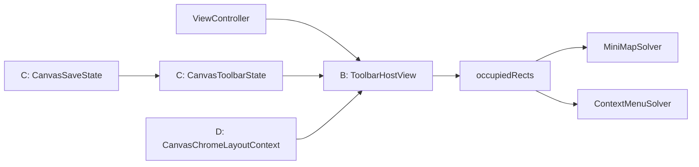

# Canvas 工具栏 B/C/D 分阶段计划

## 前提与边界

- 作用范围只包含 `Crop`、`Save`、`+` 三个入口。
- 停靠边界是 Canvas 可视区，即 `chromeOverlayView` 对应的安全区域，而不是物理显示器边界。
- 第一轮只支持代码枚举的 `top / bottom / leading / trailing` 停靠，不做用户拖拽与持久化。
- 默认不把 `iOS` 现有的 `undo/redo` 并入这组三按钮工具栏；它们先保持独立，避免把“主工具栏”和“历史工具”两类职责混成一个容器。

## 当前架构判断

- `iOS` 与 `macOS` 都把浮层 chrome 统一挂在 [MyCanvas_Ver_0/Platform/iOS/iOSViewController.swift](MyCanvas_Ver_0/Platform/iOS/iOSViewController.swift) / [MyCanvas_Ver_0/Platform/macOS/macOSViewController.swift](MyCanvas_Ver_0/Platform/macOS/macOSViewController.swift) 里的 `chromeOverlayView` 上。
- 现在的三按钮不是“工具栏”，而是控制器内联的 `controlsStackView + buttons`，并且它的 frame 已经被拿去做 `chromeOccupiedRects()`，这说明现有系统天然更适合“一个独立容器视图”，而不是继续让 3 个按钮散落在控制器里。
- 已有的共享能力主要分成两块：
  - 命令状态与执行： [MyCanvas_Ver_0/Canvas/Editing/CanvasCommandCatalog.swift](MyCanvas_Ver_0/Canvas/Editing/CanvasCommandCatalog.swift)、[MyCanvas_Ver_0/Canvas/Editing/CanvasCommandExecutor.swift](MyCanvas_Ver_0/Canvas/Editing/CanvasCommandExecutor.swift)、[MyCanvas_Ver_0/Canvas/Editing/CanvasEditorSession.swift](MyCanvas_Ver_0/Canvas/Editing/CanvasEditorSession.swift)
  - overlay 布局求解： [MyCanvas_Ver_0/Canvas/Core/CanvasMiniMapLayout.swift](MyCanvas_Ver_0/Canvas/Core/CanvasMiniMapLayout.swift)、[MyCanvas_Ver_0/Platform/Shared/ContextMenu/CanvasContextMenuState.swift](MyCanvas_Ver_0/Platform/Shared/ContextMenu/CanvasContextMenuState.swift)、[MyCanvas_Ver_0/Platform/Shared/ContextMenu/CanvasContextMenuHostView.swift](MyCanvas_Ver_0/Platform/Shared/ContextMenu/CanvasContextMenuHostView.swift)

## 演进关系

## 阶段 B：抽离独立工具栏容器

### 目标

- 先把 `Crop/Save/+` 从控制器内联按钮栈抽成真正的工具栏 surface。
- 保持现有业务行为不变，只改“承载方式”和“停靠方式”。
- 第一阶段就让按钮变成纯图标、正方形、统一尺寸，并支持四边停靠枚举。

### 阶段1：明确宿主职责与拆分边界

1. 明确 B 阶段只处理 `Crop/Save/+` 主工具栏，不把 `iOS` 的 `undo/redo` 一起并入。
2. 明确工具栏宿主只负责布局、外观和点击出口，不负责保存、导入、裁剪的业务实现。
3. 明确 B 阶段的停靠输入先用代码枚举，建议先在控制器层保留一个最小枚举：
  - `top`
  - `bottom`
  - `leading`
  - `trailing`
4. 确认新工具栏仍作为 `chromeOverlayView` 的直接子视图挂载，避免破坏现有坐标换算与 occupied rect 契约。
5. 相关文件：
  - [MyCanvas_Ver_0/Platform/iOS/iOSViewController.swift](MyCanvas_Ver_0/Platform/iOS/iOSViewController.swift)
  - [MyCanvas_Ver_0/Platform/macOS/macOSViewController.swift](MyCanvas_Ver_0/Platform/macOS/macOSViewController.swift)

### 阶段2：搭建 iOS/macOS 工具栏外壳

1. 在平台层各自新增工具栏宿主视图，建议放在：
  - [MyCanvas_Ver_0/Platform/iOS/Canvas](MyCanvas_Ver_0/Platform/iOS/Canvas)
  - [MyCanvas_Ver_0/Platform/macOS/Canvas](MyCanvas_Ver_0/Platform/macOS/Canvas)
2. 宿主视图结构采用“外层容器 + 内层 stack”两层模式：
  - 外层负责背景、圆角、阴影、padding、停靠约束和命中边界
  - 内层负责按钮横排/竖排切换和等宽等高布局
3. 外层容器延续当前 `CanvasChromeOverlayView` / `CanvasChromeStackView` 的命中透传思路，避免空白区域截断 Canvas 手势：
  - [MyCanvas_Ver_0/Platform/iOS/Canvas/iOSCanvasChromeOverlayView.swift](MyCanvas_Ver_0/Platform/iOS/Canvas/iOSCanvasChromeOverlayView.swift)
  - [MyCanvas_Ver_0/Platform/macOS/Canvas/macOSCanvasChromeOverlayView.swift](MyCanvas_Ver_0/Platform/macOS/Canvas/macOSCanvasChromeOverlayView.swift)
4. 内层 stack 以停靠边驱动方向：
  - `top / bottom` 使用横向排列
  - `leading / trailing` 使用纵向排列

### 阶段3：迁移三按钮与按钮样式统一

1. `macOS` 直接把当前 `controlsStackView` 中的 `crop/save/import` 迁到新工具栏 host。
2. `iOS` 把 `Crop/Save/+` 从现有五按钮组拆出来，`undo/redo` 保留在独立 history 组。
3. 三按钮统一改为纯图标、无文字、等宽等高正方形按钮。
4. 按钮业务动作继续由控制器提供回调，不在 B 阶段把导入、保存、裁剪逻辑内聚到 host。
5. 控制器里原先的样式函数先保留，但调用目标改成新 host 内部按钮，避免一次性重写过大。

### 阶段4：接入四边停靠与 overlay 占位链路

1. 把当前写死右下角的约束改成“按停靠位切换的一组约束”。
2. `chromeOccupiedRects()` 从上报 `controlsStackView.frame` 改为上报新工具栏 host 的 frame。
3. 保持新 host 仍为 `chromeOverlayView` 的直接子视图，使 minimap 避让逻辑可以无缝复用。
4. 对 `iOS` 和 `macOS` 分别验证：
  - 四边停靠都能工作
  - `minimap` 继续避让工具栏
  - Canvas 空白区域手势不被工具栏吞掉
  - `iOS` 的 `undo/redo` 不回归

### 本阶段验收点

- `iOS` / `macOS` 都能通过代码切换四边停靠。
- `Crop/Save/+` 变为纯图标、等宽等高的正方形按钮。
- `minimap` 继续避让工具栏。
- Canvas 空白区域手势不被工具栏容器吞掉。
- `iOS` 的 `undo/redo` 行为不回归。

## 阶段 C：收口跨平台共享状态模型

### 目标

- 不再让 `iOS` / `macOS` 各自拼装按钮标题、图标、启用态和激活态。
- 让工具栏 host 只负责“渲染 state”，不负责推导业务状态。

### 阶段1：定义共享工具栏状态类型

1. 新增共享状态类型，建议最小集合包括：
  - `CanvasToolbarDockEdge`
  - `CanvasToolbarPlacement`
  - `CanvasToolbarItemID`
  - `CanvasToolbarItemState`
  - `CanvasToolbarState`
2. 这些类型放在共享层，避免再次把状态判断散回平台控制器：
  - [MyCanvas_Ver_0/Platform/Shared](MyCanvas_Ver_0/Platform/Shared)
  - 或更靠近编辑共享层的目录
3. 先把 state 设计成“只描述当前应渲染什么”，不承载平台控件实例或平台颜色对象。

### 阶段2：把 `Crop` 接入共享命令状态

1. 复用 [MyCanvas_Ver_0/Canvas/Editing/CanvasCommandCatalog.swift](MyCanvas_Ver_0/Canvas/Editing/CanvasCommandCatalog.swift) 已有的 `Crop` 共享描述。
2. 把 `title / systemImageName / isEnabled / isActive` 映射成工具栏 item state。
3. 保持 `CanvasCommandExecutor` 与 `CanvasEditorSession` 作为行为和真状态来源，不在 host 内重复判断裁剪模式。
4. 把控制器里原先 `updateCropButtonAppearance()` 的职责降为“从共享 state 刷新 UI”，而不是直接拼装按钮样式。

### 阶段3：为 `Save` 建立独立共享状态

1. 新增轻量 `CanvasSaveState`，建议先覆盖：
  - `idle`
  - `saving`
  - `success`
  - `missingFolder`
  - `failure`
2. 将当前控制器私有的 `Saving / Saved / Failed / No Folder` 视觉反馈收口到这个共享状态，而不是继续直接写按钮文案和颜色。
3. 工具栏只消费 `CanvasSaveState` 去决定图标、颜色、禁用态和辅助文本；控制器继续负责触发保存、接收结果和弹窗。
4. 相关文件：
  - [MyCanvas_Ver_0/Platform/iOS/iOSViewController.swift](MyCanvas_Ver_0/Platform/iOS/iOSViewController.swift)
  - [MyCanvas_Ver_0/Platform/macOS/macOSViewController.swift](MyCanvas_Ver_0/Platform/macOS/macOSViewController.swift)

### 阶段4：统一由共享 state 驱动 host

1. 让 `iOS` / `macOS` 的工具栏 host 都只接收一份共享 `CanvasToolbarState`。
2. `Import` 继续走平台特有流程：`PHPickerViewController` / `NSOpenPanel`，但其图标、启用态、可访问性文本改由共享 state 描述。
3. 控制器逐步移除三按钮样式拼装代码，只保留：
  - action 回调
  - 平台弹窗
  - 平台导入流程
4. 验证两端渲染结果语义一致，仅保留原生控件层差异。

### 本阶段验收点

- `iOS` / `macOS` 的 `Crop`、`Save`、`+` 语义一致，渲染差异只保留在原生控件层。
- 控制器不再直接维护三按钮的大部分样式拼装代码。
- 新工具栏 host 可以通过一份共享 state 刷新 UI。

## 阶段 D：统一 overlay chrome 布局上下文与求解

### 目标

- 不再让工具栏停靠位置完全依赖控制器里的手写约束分支。
- 为后续“用户拖拽停靠、吸附、记忆位置、与其他 chrome 协同避让”建立统一输入模型。

### 阶段1：抽象共享布局上下文

1. 在共享层新增 `CanvasChromeLayoutContext`，集中表达：
  - `safeBounds`
  - `occupiedRects`
  - `toolbarPreferredPlacement`
  - `toolbarMeasuredSize`
  - 其他 chrome blocker rect
2. 统一的重点是布局输入和几何清洗工具，而不是做一个“万能 solver”同时统治 minimap、context menu、toolbar。
3. 复用现有布局代码的边界：
  - [MyCanvas_Ver_0/Canvas/Core/CanvasMiniMapLayout.swift](MyCanvas_Ver_0/Canvas/Core/CanvasMiniMapLayout.swift)
  - [MyCanvas_Ver_0/Platform/Shared/ContextMenu/CanvasContextMenuState.swift](MyCanvas_Ver_0/Platform/Shared/ContextMenu/CanvasContextMenuState.swift)

### 阶段2：为工具栏建立独立 placement policy

1. 为工具栏建立单独的布局策略，语义是“边缘停靠 + 可选沿边偏移”。
2. 该策略复用共享的 `safeBounds / occupiedRects` 与几何处理，但不强行与 minimap/menu 共用一套 placement 算法。
3. placement 输入建议从这几个字段开始：
  - `preferredEdge`
  - `offsetAlongEdge`
  - `measuredSize`
4. placement 输出保持简单明确，优先直接落到一个 resolved frame。

### 阶段3：把工具栏纳入 overlay 布局链

1. 调整 overlay 布局顺序，建议固定为：
  1. 返回按钮与固定 chrome
  2. 工具栏
  3. minimap
  4. context menu
2. 控制器从“布局实现者”降级为“坐标桥接者”，只负责：
  - 收集 `safeBounds`
  - 收集现有 chrome rect
  - 把 solver 输出应用到 host view
3. 让 minimap 与 context menu 都能把工具栏 frame 当成 blocker rect，避免后续出现循环避让或自避让。

### 阶段4：为拖拽与遮挡策略预留扩展点

1. D 阶段先不实现拖拽，但 placement model 预留未来输入：
  - `preferredEdge`
  - `offsetAlongEdge`
  - `isUserPinned`
2. 这样后续只需在平台层增加手势桥接，把拖拽结果写回 placement 输入，不必重写 host 或 solver 边界。
3. 同步确认 context menu 的遮挡策略：
  - 如果希望 menu 避开工具栏，需要调整 [MyCanvas_Ver_0/Platform/Shared/ContextMenu/CanvasContextMenuHostView.swift](MyCanvas_Ver_0/Platform/Shared/ContextMenu/CanvasContextMenuHostView.swift)
  - 并同步检查 [MyCanvas_Ver_0/Platform/Shared/ContextMenu/CanvasContextMenuState.swift](MyCanvas_Ver_0/Platform/Shared/ContextMenu/CanvasContextMenuState.swift) 的 occlusion policy
4. 在 D 阶段末明确“是否将停靠偏好持久化到 board 级别”这一架构决策，但不在本轮实现。

### 本阶段验收点

- 工具栏位置不再是控制器里写死的一组边缘约束。
- minimap / context menu 能把工具栏视为统一 blocker。
- 后续接入拖拽停靠时，只需要增加 placement 输入与手势桥接，不需要再次拆分视图层。

## 建议执行顺序

1. 先完成 `B1 -> B4`，先把“工具栏是什么、挂在哪、怎么停靠”从控制器里抽出来。
2. 再完成 `C1 -> C4`，把“工具栏应该显示什么状态”统一为共享输入。
3. 最后完成 `D1 -> D4`，把“工具栏应该摆在哪、如何和其他 chrome 协同”收口到共享布局上下文。
4. 拖拽停靠、位置持久化放在 `D4` 之后，作为 placement 输入扩展，而不是单独再造一套布局逻辑。

## 主要风险与对策

- 风险：`iOS` 当前把 `undo/redo` 混在 `controlsStackView` 里，若 B 阶段一起改会扩大回归面。
- 对策：B 阶段只抽 `Crop/Save/+`，`undo/redo` 维持独立。
- 风险：`Save` 当前依赖平台按钮文案反馈，直接改成纯图标后信息密度下降。
- 对策：C 阶段引入 `CanvasSaveState`，以图标、颜色、禁用态、辅助文本承载反馈，不再依赖按钮文字。
- 风险：D 阶段若试图做“一个 solver 统治所有 chrome”，会把 minimap/menu/toolbar 三种不同布局语义硬绑在一起。
- 对策：统一 layout context，不统一 placement 算法；每类 surface 仍保留自己的 placement policy。

