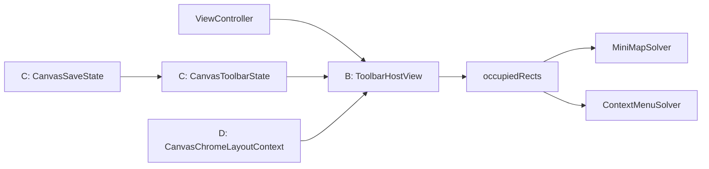

# Canvas 工具栏 B/C/D 分阶段计划

## 前提与边界

- 作用范围只包含 `Crop`、`Save`、`+` 三个入口。
- 停靠边界是 Canvas 可视区，即 `chromeOverlayView` 对应的安全区域，而不是物理显示器边界。
- 第一轮只支持代码枚举的 `top / bottom / leading / trailing` 停靠，不做用户拖拽与持久化。
- 默认不把 `iOS` 现有的 `undo/redo` 并入这组三按钮工具栏；它们先保持独立，避免把“主工具栏”和“历史工具”两类职责混成一个容器。

## 当前架构判断

- `iOS` 与 `macOS` 都把浮层 chrome 统一挂在 [MyCanvas_Ver_0/Platform/iOS/iOSViewController.swift](MyCanvas_Ver_0/Platform/iOS/iOSViewController.swift) / [MyCanvas_Ver_0/Platform/macOS/macOSViewController.swift](MyCanvas_Ver_0/Platform/macOS/macOSViewController.swift) 里的 `chromeOverlayView` 上。
- 现在的三按钮不是“工具栏”，而是控制器内联的 `controlsStackView + buttons`，并且它的 frame 已经被拿去做 `chromeOccupiedRects()`，这说明现有系统天然更适合“一个独立容器视图”，而不是继续让 3 个按钮散落在控制器里。
- 已有的共享能力主要分成两块：
  - 命令状态与执行： [MyCanvas_Ver_0/Canvas/Editing/CanvasCommandCatalog.swift](MyCanvas_Ver_0/Canvas/Editing/CanvasCommandCatalog.swift)、[MyCanvas_Ver_0/Canvas/Editing/CanvasCommandExecutor.swift](MyCanvas_Ver_0/Canvas/Editing/CanvasCommandExecutor.swift)、[MyCanvas_Ver_0/Canvas/Editing/CanvasEditorSession.swift](MyCanvas_Ver_0/Canvas/Editing/CanvasEditorSession.swift)
  - overlay 布局求解： [MyCanvas_Ver_0/Canvas/Core/CanvasMiniMapLayout.swift](MyCanvas_Ver_0/Canvas/Core/CanvasMiniMapLayout.swift)、[MyCanvas_Ver_0/Platform/Shared/ContextMenu/CanvasContextMenuState.swift](MyCanvas_Ver_0/Platform/Shared/ContextMenu/CanvasContextMenuState.swift)、[MyCanvas_Ver_0/Platform/Shared/ContextMenu/CanvasContextMenuHostView.swift](MyCanvas_Ver_0/Platform/Shared/ContextMenu/CanvasContextMenuHostView.swift)

## 演进关系

## 阶段 B：抽离独立工具栏容器

### 目标

- 先把 `Crop/Save/+` 从控制器内联按钮栈抽成真正的工具栏 surface。
- 保持现有业务行为不变，只改“承载方式”和“停靠方式”。
- 第一阶段就让按钮变成纯图标、正方形、统一尺寸，并支持四边停靠枚举。

### 计划

1. 新增平台工具栏 host view

- 在 `iOS` / `macOS` 各自新增一个工具栏宿主视图，建议放在：
  - [MyCanvas_Ver_0/Platform/iOS/Canvas](MyCanvas_Ver_0/Platform/iOS/Canvas)
  - [MyCanvas_Ver_0/Platform/macOS/Canvas](MyCanvas_Ver_0/Platform/macOS/Canvas)
- 宿主视图结构采用“外层容器 + 内层 stack”的两层模式：
  - 外层负责背景、圆角、阴影、padding、停靠约束和命中透传边界
  - 内层负责按钮横排/竖排切换和等宽等高布局
- 外层尽量复用当前 `CanvasChromeOverlayView` 的命中透传思路，避免空白区域截断 Canvas 手势：
  - [MyCanvas_Ver_0/Platform/iOS/Canvas/iOSCanvasChromeOverlayView.swift](MyCanvas_Ver_0/Platform/iOS/Canvas/iOSCanvasChromeOverlayView.swift)
  - [MyCanvas_Ver_0/Platform/macOS/Canvas/macOSCanvasChromeOverlayView.swift](MyCanvas_Ver_0/Platform/macOS/Canvas/macOSCanvasChromeOverlayView.swift)

1. 把控制器里的三按钮迁入工具栏 host

- `macOS`：直接把当前三按钮从 `controlsStackView` 迁到新 host。
- `iOS`：把 `Crop/Save/+` 从现有五按钮 `controlsStackView` 中拆出来，`undo/redo` 暂时保留在独立 history 组，避免本阶段过度耦合。
- 按钮行为继续由控制器提供回调，不在 B 阶段把导入/保存逻辑塞入 host 内部。

1. 把停靠位从“写死右下角”改成“枚举驱动”

- 在 B 阶段先引入一个最小可用的停靠枚举输入，支持 `top / bottom / leading / trailing`。
- 工具栏横竖方向由停靠边自动决定：
  - `top / bottom` 使用横向排列
  - `leading / trailing` 使用纵向排列
- 约束仍然可以由平台控制器管理，但要改成“按停靠位切换的一组约束”，而不是写死右下角。

1. 保持 overlay 占位契约稳定

- `chromeOccupiedRects()` 从当前上报 `controlsStackView.frame`，改为上报新工具栏 host 的 frame。
- 只要新 host 仍是 `chromeOverlayView` 的直接子视图，现有 minimap 避让链路就能继续工作，无需在 B 阶段重写 solver。

### 本阶段验收点

- `iOS` / `macOS` 都能通过代码切换四边停靠。
- `Crop/Save/+` 变为纯图标、等宽等高的正方形按钮。
- `minimap` 继续避让工具栏。
- Canvas 空白区域手势不被工具栏容器吞掉。
- `iOS` 的 `undo/redo` 行为不回归。

## 阶段 C：收口跨平台共享状态模型

### 目标

- 不再让 `iOS` / `macOS` 各自拼装按钮标题、图标、启用态和激活态。
- 让工具栏 host 只负责“渲染 state”，不负责推导业务状态。

### 计划

1. 新增共享 `CanvasToolbarState`

- 建议新增共享状态类型，例如：
  - `CanvasToolbarDockEdge`
  - `CanvasToolbarPlacement`
  - `CanvasToolbarItemID`
  - `CanvasToolbarItemState`
  - `CanvasToolbarState`
- 放置位置建议优先考虑共享层，避免再次把状态逻辑散回平台控制器：
  - [MyCanvas_Ver_0/Platform/Shared](MyCanvas_Ver_0/Platform/Shared)
  - 或与编辑命令更近的共享目录

1. 复用现有命令目录，统一 `Crop` 的状态来源

- `Crop` 的标题/图标/启用态/激活态已经共享化，来自：
  - [MyCanvas_Ver_0/Canvas/Editing/CanvasCommandCatalog.swift](MyCanvas_Ver_0/Canvas/Editing/CanvasCommandCatalog.swift)
- C 阶段要把这套结果转换成工具栏 item state，而不是由 `iOS/macOS ViewController` 分别调用 `updateCropButtonAppearance()` 去拼 UI。

1. 为 `Save` 补一个独立共享状态，而不是沿用控制器文案

- 当前 `Save` 反馈是控制器私有 UI 状态，`Saving/Saved/Failed/No Folder` 不是共享真相。
- C 阶段建议新增一个轻量 `CanvasSaveState`，明确区分：
  - `idle`
  - `saving`
  - `success`
  - `missingFolder`
  - `failure`
- 工具栏只消费这个状态，决定图标、颜色、是否允许点击；控制器只负责触发保存和投递结果。
- 这一步能避免后面继续把 `Save` 逻辑绑死在平台按钮样式函数里：
  - [MyCanvas_Ver_0/Platform/iOS/iOSViewController.swift](MyCanvas_Ver_0/Platform/iOS/iOSViewController.swift)
  - [MyCanvas_Ver_0/Platform/macOS/macOSViewController.swift](MyCanvas_Ver_0/Platform/macOS/macOSViewController.swift)

1. 明确哪些动作继续留在控制器层

- `Import` 继续走平台特有流程：`PHPickerViewController` / `NSOpenPanel`。
- 因此工具栏 state 负责描述“图标、启用态、可访问性文本”，动作执行仍由控制器回调承接。
- 不建议在 C 阶段强行把 `Import` 塞进现有 command abstraction；这样会把平台 UI 流程和编辑命令错误地绑在一起。

### 本阶段验收点

- `iOS` / `macOS` 的 `Crop`、`Save`、`+` 语义一致，渲染差异只保留在原生控件层。
- 控制器不再直接维护三按钮的大部分样式拼装代码。
- 新工具栏 host 可以通过一份共享 state 刷新 UI。

## 阶段 D：统一 overlay chrome 布局上下文与求解

### 目标

- 不再让工具栏停靠位置完全依赖控制器里的手写约束分支。
- 为后续“用户拖拽停靠、吸附、记忆位置、与其他 chrome 协同避让”建立统一输入模型。

### 计划

1. 引入共享 `CanvasChromeLayoutContext`

- 在共享层新增一个统一布局上下文，集中表达：
  - `safeBounds`
  - `occupiedRects`
  - `toolbarPreferredPlacement`
  - `toolbarMeasuredSize`
  - 其他 chrome 的 blocker rect
- 不要把 minimap、context menu、toolbar 强行塞进一个“万能 solver”；应该统一的是输入上下文和几何工具，而不是三个 surface 共用一套放置算法。

1. 为工具栏新增独立 placement policy

- `toolbar` 的布局语义与 minimap / context menu 不同：它是“边缘停靠 + 可选沿边偏移”，不是“角落候选”也不是“锚点弹出菜单”。
- 因此 D 阶段应为 toolbar 建立独立 placement policy，但复用共享的 `safeBounds/occupiedRects` 计算和几何清洗工具。
- 放置顺序建议固定为：
  1. 返回按钮 / 固定 chrome
  2. 工具栏
  3. minimap
  4. context menu
- 这样 minimap 和 menu 都能把 toolbar 当成 blocker rect 处理，避免后续形成循环依赖。

1. 把控制器从“布局实现者”降级为“坐标桥接者”

- 控制器只负责：
  - 收集 `safeBounds`
  - 收集现有 chrome rect
  - 把 solver 输出应用到 host view
- 不再直接承担工具栏的布局策略判断。

1. 为后续拖拽停靠预留输入位

- D 阶段先不实现拖拽，但要把 placement model 设计成未来可接入：
  - `preferredEdge`
  - `offsetAlongEdge`
  - `isUserPinned`
- 这样将来只需要在平台层加手势桥接，把拖拽结果写入 placement 输入即可，不用再重做工具栏和 solver 的边界。

1. 明确 context menu 的遮挡策略

- 当前 context menu 虽然接收了 `occupiedRects`，但策略仍允许覆盖 chrome。
- D 阶段需要明确：如果希望 menu 避开工具栏，就要同步调整 [MyCanvas_Ver_0/Platform/Shared/ContextMenu/CanvasContextMenuHostView.swift](MyCanvas_Ver_0/Platform/Shared/ContextMenu/CanvasContextMenuHostView.swift) / [MyCanvas_Ver_0/Platform/Shared/ContextMenu/CanvasContextMenuState.swift](MyCanvas_Ver_0/Platform/Shared/ContextMenu/CanvasContextMenuState.swift) 的遮挡策略；否则工具栏进入统一布局链后，menu 视觉上仍可能压到它上面。

### 本阶段验收点

- 工具栏位置不再是控制器里写死的一组边缘约束。
- minimap / context menu 能把工具栏视为统一 blocker。
- 后续接入拖拽停靠时，只需要增加 placement 输入与手势桥接，不需要再次拆分视图层。

## 建议执行顺序

1. 先做 B，先把“工具栏是什么”从控制器里抽出来。
2. 再做 C，把“工具栏该长什么样、是否可点、是否高亮”统一成共享状态。
3. 最后做 D，把“工具栏应该摆在哪、如何和其他 chrome 协同”从控制器约束迁到共享布局上下文。
4. 拖拽停靠、位置持久化放在 D 之后，作为 D 的输入扩展，而不是单独再造一套布局逻辑。

## 主要风险与对策

- 风险：`iOS` 当前把 `undo/redo` 混在 `controlsStackView` 里，若 B 阶段一起改会扩大回归面。
- 对策：B 阶段只抽 `Crop/Save/+`，`undo/redo` 维持独立。
- 风险：`Save` 当前依赖平台按钮文案反馈，直接改成纯图标后信息密度下降。
- 对策：C 阶段引入 `CanvasSaveState`，以图标、颜色、禁用态、辅助文本承载反馈，不再依赖按钮文字。
- 风险：D 阶段若试图做“一个 solver 统治所有 chrome”，会把 minimap/menu/toolbar 三种不同布局语义硬绑在一起。
- 对策：统一 layout context，不统一 placement 算法；每类 surface 仍保留自己的 placement policy。

