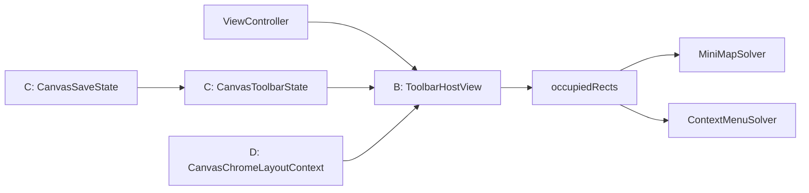

# Canvas 工具栏 B/C/D 分阶段计划

## 前提与边界

- 作用范围只包含 `Crop`、`Save`、`+` 三个入口。
- 停靠边界是 Canvas 可视区，即 `chromeOverlayView` 对应的安全区域，而不是物理显示器边界。
- 第一轮只支持代码枚举的 `top / bottom / leading / trailing` 停靠，不做用户拖拽与持久化。
- 默认不把 `iOS` 现有的 `undo/redo` 并入这组三按钮工具栏；它们先保持独立，避免把“主工具栏”和“历史工具”两类职责混成一个容器。

## 当前架构判断

- `iOS` 与 `macOS` 都把浮层 chrome 统一挂在 [MyCanvas_Ver_0/Platform/iOS/iOSViewController.swift](MyCanvas_Ver_0/Platform/iOS/iOSViewController.swift) / [MyCanvas_Ver_0/Platform/macOS/macOSViewController.swift](MyCanvas_Ver_0/Platform/macOS/macOSViewController.swift) 里的 `chromeOverlayView` 上。
- 现在的三按钮不是“工具栏”，而是控制器内联的 `controlsStackView + buttons`，并且它的 frame 已经被拿去做 `chromeOccupiedRects()`，这说明现有系统天然更适合“一个独立容器视图”，而不是继续让 3 个按钮散落在控制器里。
- 已有的共享能力主要分成两块：
  - 命令状态与执行： [MyCanvas_Ver_0/Canvas/Editing/CanvasCommandCatalog.swift](MyCanvas_Ver_0/Canvas/Editing/CanvasCommandCatalog.swift)、[MyCanvas_Ver_0/Canvas/Editing/CanvasCommandExecutor.swift](MyCanvas_Ver_0/Canvas/Editing/CanvasCommandExecutor.swift)、[MyCanvas_Ver_0/Canvas/Editing/CanvasEditorSession.swift](MyCanvas_Ver_0/Canvas/Editing/CanvasEditorSession.swift)
  - overlay 布局求解： [MyCanvas_Ver_0/Canvas/Core/CanvasMiniMapLayout.swift](MyCanvas_Ver_0/Canvas/Core/CanvasMiniMapLayout.swift)、[MyCanvas_Ver_0/Platform/Shared/ContextMenu/CanvasContextMenuState.swift](MyCanvas_Ver_0/Platform/Shared/ContextMenu/CanvasContextMenuState.swift)、[MyCanvas_Ver_0/Platform/Shared/ContextMenu/CanvasContextMenuHostView.swift](MyCanvas_Ver_0/Platform/Shared/ContextMenu/CanvasContextMenuHostView.swift)

## 演进关系

## 阶段 B：抽离独立工具栏容器

### 目标

- 先把 `Crop/Save/+` 从控制器内联按钮栈抽成真正的工具栏 surface。
- 保持现有业务行为不变，只改“承载方式”和“停靠方式”。
- 第一阶段就让按钮变成纯图标、正方形、统一尺寸，并支持四边停靠枚举。

### 阶段1：明确宿主职责与拆分边界

1. 明确 B 阶段只处理 `Crop/Save/+` 主工具栏，不把 `iOS` 的 `undo/redo` 一起并入。
2. 明确工具栏宿主只负责布局、外观和点击出口，不负责保存、导入、裁剪的业务实现。
3. 明确 B 阶段的停靠输入先用代码枚举，建议先在控制器层保留一个最小枚举：
  - `top`
  - `bottom`
  - `leading`
  - `trailing`
4. 确认新工具栏仍作为 `chromeOverlayView` 的直接子视图挂载，避免破坏现有坐标换算与 occupied rect 契约。
5. 相关文件：
  - [MyCanvas_Ver_0/Platform/iOS/iOSViewController.swift](MyCanvas_Ver_0/Platform/iOS/iOSViewController.swift)
  - [MyCanvas_Ver_0/Platform/macOS/macOSViewController.swift](MyCanvas_Ver_0/Platform/macOS/macOSViewController.swift)

#### 执行顺序

1. 先梳理 `iOS` 当前 `controlsStackView` 内 `crop -> undo -> redo -> save -> import` 的顺序，明确后续会拆成“主工具栏”和“history 组”两块。
2. 再梳理 `macOS` 当前三按钮与 `controlsStackView` 的绑定点，确认后续可以整体迁移而不改变业务入口。
3. 在 B 阶段先约定默认停靠行为为“边中停靠”：
  - `top / bottom` 水平居中
  - `leading / trailing` 垂直居中
4. 首版 host API 只保留最小集合：`onCrop`、`onSave`、`onImport`、`setDockEdge(...)`。
5. 明确 B 阶段不处理 `Save` 共享真状态、拖拽停靠、位置持久化，避免 B1 期间把 C/D 的职责提前混入。

#### 完成标志

- `iOS` 的主工具栏与 history 组边界已经固定。
- `macOS` 的迁移路径已经确定为“现有三按钮整体平移”。
- B 阶段的默认停靠规则与 host API 已经足够支撑后续编码。

### 阶段2：搭建 iOS/macOS 工具栏外壳

1. 在平台层各自新增工具栏宿主视图，建议放在：
  - [MyCanvas_Ver_0/Platform/iOS/Canvas](MyCanvas_Ver_0/Platform/iOS/Canvas)
  - [MyCanvas_Ver_0/Platform/macOS/Canvas](MyCanvas_Ver_0/Platform/macOS/Canvas)
2. 宿主视图结构采用“外层容器 + 内层 stack”两层模式：
  - 外层负责背景、圆角、阴影、padding、停靠约束和命中边界
  - 内层负责按钮横排/竖排切换和等宽等高布局
3. 外层容器延续当前 `CanvasChromeOverlayView` / `CanvasChromeStackView` 的命中透传思路，避免空白区域截断 Canvas 手势：
  - [MyCanvas_Ver_0/Platform/iOS/Canvas/iOSCanvasChromeOverlayView.swift](MyCanvas_Ver_0/Platform/iOS/Canvas/iOSCanvasChromeOverlayView.swift)
  - [MyCanvas_Ver_0/Platform/macOS/Canvas/macOSCanvasChromeOverlayView.swift](MyCanvas_Ver_0/Platform/macOS/Canvas/macOSCanvasChromeOverlayView.swift)
4. 内层 stack 以停靠边驱动方向：
  - `top / bottom` 使用横向排列
  - `leading / trailing` 使用纵向排列

#### 涉及文件

- [MyCanvas_Ver_0/Platform/iOS/Canvas](MyCanvas_Ver_0/Platform/iOS/Canvas)
- [MyCanvas_Ver_0/Platform/macOS/Canvas](MyCanvas_Ver_0/Platform/macOS/Canvas)
- [MyCanvas_Ver_0/Platform/iOS/Canvas/iOSCanvasChromeOverlayView.swift](MyCanvas_Ver_0/Platform/iOS/Canvas/iOSCanvasChromeOverlayView.swift)
- [MyCanvas_Ver_0/Platform/macOS/Canvas/macOSCanvasChromeOverlayView.swift](MyCanvas_Ver_0/Platform/macOS/Canvas/macOSCanvasChromeOverlayView.swift)

#### 执行顺序

1. 推荐新增两个宿主文件：
  - [MyCanvas_Ver_0/Platform/iOS/Canvas/iOSCanvasToolbarHostView.swift](MyCanvas_Ver_0/Platform/iOS/Canvas/iOSCanvasToolbarHostView.swift)
  - [MyCanvas_Ver_0/Platform/macOS/Canvas/macOSCanvasToolbarHostView.swift](MyCanvas_Ver_0/Platform/macOS/Canvas/macOSCanvasToolbarHostView.swift)
2. 由于现有 `iOSCanvasChromeOverlayView` / `macOSCanvasChromeOverlayView` 都是 `final`，B2 采用组合复用命中透传契约，而不是继承它们。
3. 宿主内部先固定三类布局常量：`toolbarButtonEdge`、`toolbarSpacing`、`toolbarContentInsets`，首版建议优先贴近现有 chrome 的 `44` 尺寸系。
4. 外层 host 只承担背景和布局，内层 stack 只承担 arranged subviews 的横纵排布，不在 B2 引入任何业务状态判断。
5. `iOS` 与 `macOS` 两端都先把 host 挂到 `chromeOverlayView`，但暂时不迁移旧按钮，确保 B2 能独立验证容器命中和内边距行为。

#### 完成标志

- 两端都有独立的 toolbar host 外壳。
- host 已经具备横向/纵向切换能力。
- host 空白区域的 hit test 规则不会吞掉 Canvas 手势。

### 阶段3：迁移三按钮与按钮样式统一

1. `macOS` 直接把当前 `controlsStackView` 中的 `crop/save/import` 迁到新工具栏 host。
2. `iOS` 把 `Crop/Save/+` 从现有五按钮组拆出来，`undo/redo` 保留在独立 history 组。
3. 三按钮统一改为纯图标、无文字、等宽等高正方形按钮。
4. 按钮业务动作继续由控制器提供回调，不在 B 阶段把导入、保存、裁剪逻辑内聚到 host。
5. 控制器里原先的样式函数先保留，但调用目标改成新 host 内部按钮，避免一次性重写过大。

#### 涉及文件

- [MyCanvas_Ver_0/Platform/iOS/iOSViewController.swift](MyCanvas_Ver_0/Platform/iOS/iOSViewController.swift)
- [MyCanvas_Ver_0/Platform/macOS/macOSViewController.swift](MyCanvas_Ver_0/Platform/macOS/macOSViewController.swift)
- [MyCanvas_Ver_0/Platform/iOS/Canvas](MyCanvas_Ver_0/Platform/iOS/Canvas)
- [MyCanvas_Ver_0/Platform/macOS/Canvas](MyCanvas_Ver_0/Platform/macOS/Canvas)

#### 执行顺序

1. 首先迁移“现有按钮实例”而不是重建按钮，尽量复用已经存在的 `target/action`、`UIButton.Configuration`、`NSButton` 配置与回调入口。
2. `macOS` 直接把 `cropButton`、`saveButton`、`importButton` 从旧 `controlsStackView` 挪进新 host。
3. `iOS` 先把 `cropButton`、`saveButton`、`importButton` 从五按钮组拆出，再把 `undo/redo` 留给独立 history 组，避免一个 host 承担两类职责。
4. 样式统一策略以“不显示可见文字”为准，但要保留语义信息：
  - `macOS` 通过 `toolTip` / `accessibilityLabel`
  - `iOS` 通过 `accessibilityLabel` / `accessibilityHint`
5. `Save` 在 B3 仍保留原有反馈语义，但表现形式改为“图标 + 颜色 + 辅助文本”，不再依赖按钮可见标题。

#### 完成标志

- 两端三按钮都已经迁入新 host。
- 三按钮在两端都变为纯图标正方形按钮。
- 现有 `handleCrop`、`handleSave`、`handleImport` 业务入口不变。

### 阶段4：接入四边停靠与 overlay 占位链路

1. 把当前写死右下角的约束改成“按停靠位切换的一组约束”。
2. `chromeOccupiedRects()` 从上报 `controlsStackView.frame` 改为上报新工具栏 host 的 frame。
3. 保持新 host 仍为 `chromeOverlayView` 的直接子视图，使 minimap 避让逻辑可以无缝复用。
4. 对 `iOS` 和 `macOS` 分别验证：
  - 四边停靠都能工作
  - `minimap` 继续避让工具栏
  - Canvas 空白区域手势不被工具栏吞掉
  - `iOS` 的 `undo/redo` 不回归

#### 涉及文件

- [MyCanvas_Ver_0/Platform/iOS/iOSViewController.swift](MyCanvas_Ver_0/Platform/iOS/iOSViewController.swift)
- [MyCanvas_Ver_0/Platform/macOS/macOSViewController.swift](MyCanvas_Ver_0/Platform/macOS/macOSViewController.swift)

#### 执行顺序

1. 在控制器里把“右下角固定约束”改成可切换的约束组，避免一开始就引入 D 阶段的 frame solver。
2. B4 默认仍采用边中停靠：
  - `top / bottom` 绑定边缘并居中 `X`
  - `leading / trailing` 绑定边缘并居中 `Y`
3. `iOS` 侧除了工具栏 host，还要把 history 组也纳入 `chromeOccupiedRects()`，否则 minimap 可能压到 `undo/redo`。
4. 维持 `chromeOverlayView -> toolbarHost` 的直接子视图关系，确保不需要新增额外坐标转换。
5. 回归验证以视觉与交互双维度为主，重点看四边切换、miniMap 避让、context menu 锚点和空白点击透传。

#### 完成标志

- 代码枚举切换四边停靠后，工具栏都能稳定贴边。
- `chromeOccupiedRects()` 已经上报正确的新 blocker rect。
- B 阶段结束后，布局问题局限在工具栏自身，不会破坏既有 overlay 链路。

### 本阶段验收点

- `iOS` / `macOS` 都能通过代码切换四边停靠。
- `Crop/Save/+` 变为纯图标、等宽等高的正方形按钮。
- `minimap` 继续避让工具栏。
- Canvas 空白区域手势不被工具栏容器吞掉。
- `iOS` 的 `undo/redo` 行为不回归。

## 阶段 C：收口跨平台共享状态模型

### 目标

- 不再让 `iOS` / `macOS` 各自拼装按钮标题、图标、启用态和激活态。
- 让工具栏 host 只负责“渲染 state”，不负责推导业务状态。

### 阶段1：定义共享工具栏状态类型

1. 新增共享状态类型，建议最小集合包括：
  - `CanvasToolbarDockEdge`
  - `CanvasToolbarPlacement`
  - `CanvasToolbarItemID`
  - `CanvasToolbarItemState`
  - `CanvasToolbarState`
2. 这些类型放在共享层，避免再次把状态判断散回平台控制器：
  - [MyCanvas_Ver_0/Platform/Shared](MyCanvas_Ver_0/Platform/Shared)
  - 或更靠近编辑共享层的目录
3. 先把 state 设计成“只描述当前应渲染什么”，不承载平台控件实例或平台颜色对象。

#### 涉及文件

- [MyCanvas_Ver_0/Platform/Shared](MyCanvas_Ver_0/Platform/Shared)
- [MyCanvas_Ver_0/Canvas/Editing/CanvasEditorSession.swift](MyCanvas_Ver_0/Canvas/Editing/CanvasEditorSession.swift)
- [MyCanvas_Ver_0/Canvas/Editing/CanvasCommandCatalog.swift](MyCanvas_Ver_0/Canvas/Editing/CanvasCommandCatalog.swift)

#### 执行顺序

1. 推荐先建立共享目录与状态文件，例如：
  - [MyCanvas_Ver_0/Platform/Shared/Toolbar/CanvasToolbarState.swift](MyCanvas_Ver_0/Platform/Shared/Toolbar/CanvasToolbarState.swift)
2. `CanvasToolbarItemState` 首版至少覆盖这些字段：`id`、`systemImageName`、`isEnabled`、`isActive`、`accessibilityLabel`、`visualRole`。
3. `CanvasToolbarState` 首版至少覆盖这些字段：`placement`、`items`、`showsBackground`、`preferredAxis`。
4. `visualRole` 使用平台无关枚举表达，例如普通态、强调态、成功态、警告态、失败态，而不是直接塞 `UIColor/NSColor`。
5. C1 只做类型与 contract，不接 UI，不接 controller，不引入状态拼装逻辑。

#### 完成标志

- 跨平台工具栏 state 类型已经稳定。
- 这些类型不依赖 UIKit/AppKit。
- 后续 C2/C3 可以直接往这个 contract 上挂接数据来源。

### 阶段2：把 `Crop` 接入共享命令状态

1. 复用 [MyCanvas_Ver_0/Canvas/Editing/CanvasCommandCatalog.swift](MyCanvas_Ver_0/Canvas/Editing/CanvasCommandCatalog.swift) 已有的 `Crop` 共享描述。
2. 把 `title / systemImageName / isEnabled / isActive` 映射成工具栏 item state。
3. 保持 `CanvasCommandExecutor` 与 `CanvasEditorSession` 作为行为和真状态来源，不在 host 内重复判断裁剪模式。
4. 把控制器里原先 `updateCropButtonAppearance()` 的职责降为“从共享 state 刷新 UI”，而不是直接拼装按钮样式。

#### 涉及文件

- [MyCanvas_Ver_0/Canvas/Editing/CanvasCommandCatalog.swift](MyCanvas_Ver_0/Canvas/Editing/CanvasCommandCatalog.swift)
- [MyCanvas_Ver_0/Canvas/Editing/CanvasCommandExecutor.swift](MyCanvas_Ver_0/Canvas/Editing/CanvasCommandExecutor.swift)
- [MyCanvas_Ver_0/Canvas/Editing/CanvasEditorSession.swift](MyCanvas_Ver_0/Canvas/Editing/CanvasEditorSession.swift)
- [MyCanvas_Ver_0/Platform/iOS/iOSViewController.swift](MyCanvas_Ver_0/Platform/iOS/iOSViewController.swift)
- [MyCanvas_Ver_0/Platform/macOS/macOSViewController.swift](MyCanvas_Ver_0/Platform/macOS/macOSViewController.swift)

#### 执行顺序

1. 先新增一个共享映射入口，建议命名为 `CanvasToolbarStateBuilder` 或等价 builder，专门把共享真状态转换成 toolbar state。
2. builder 读取 `CanvasCommandCatalog.descriptor(for: .crop, ...)`，把 `title` 与 `systemImageName` 转成 icon-only 按钮语义。
3. 当 `Crop` 进入 `Done` 语义时，不再依赖可见文字，而是通过 `accessibilityLabel` 与激活态颜色保留语义。
4. `updateCropButtonAppearance()` 在这一阶段先退化为调用 builder + render，而不是彻底删除。
5. 保持 `performCommand(.crop)` 和 inline crop mode 流转完全不变，C2 只改状态来源，不改行为。

#### 完成标志

- `Crop` 的启用态、激活态、图标切换都来自共享 builder。
- 两端不再分别推导 `Crop` 的业务状态。
- `Crop` 从 controller 内联样式逻辑中脱离出来。

### 阶段3：为 `Save` 建立独立共享状态

1. 新增轻量 `CanvasSaveState`，建议先覆盖：
  - `idle`
  - `saving`
  - `success`
  - `missingFolder`
  - `failure`
2. 将当前控制器私有的 `Saving / Saved / Failed / No Folder` 视觉反馈收口到这个共享状态，而不是继续直接写按钮文案和颜色。
3. 工具栏只消费 `CanvasSaveState` 去决定图标、颜色、禁用态和辅助文本；控制器继续负责触发保存、接收结果和弹窗。
4. 相关文件：
  - [MyCanvas_Ver_0/Platform/iOS/iOSViewController.swift](MyCanvas_Ver_0/Platform/iOS/iOSViewController.swift)
  - [MyCanvas_Ver_0/Platform/macOS/macOSViewController.swift](MyCanvas_Ver_0/Platform/macOS/macOSViewController.swift)

#### 涉及文件

- [MyCanvas_Ver_0/Platform/iOS/iOSViewController.swift](MyCanvas_Ver_0/Platform/iOS/iOSViewController.swift)
- [MyCanvas_Ver_0/Platform/macOS/macOSViewController.swift](MyCanvas_Ver_0/Platform/macOS/macOSViewController.swift)
- [MyCanvas_Ver_0/Canvas/Storage/BoardSaveCoordinator.swift](MyCanvas_Ver_0/Canvas/Storage/BoardSaveCoordinator.swift)
- [MyCanvas_Ver_0/App/FolderBookmarkStore.swift](MyCanvas_Ver_0/App/FolderBookmarkStore.swift)

#### 执行顺序

1. 先新增共享 `CanvasSaveState`，但第一轮只复刻当前“手动保存反馈”的语义，不扩展成全局 dirty/persisted 真相。
2. 现有 `beginSaveButtonSaveState()` 和 `showSaveButtonFeedback(...)` 保留时序，但把结果改为更新 `CanvasSaveState`。
3. 当前的 `Saved / No Folder / Failed` 文案转为 icon-only 语义时，优先使用图标、色彩和辅助文本，不再恢复可见标题。
4. 先保留现有 `1.2s` 自动回落时序，避免在 C3 期间顺手重构 `BoardSaveCoordinator`。
5. 明确 C3 的非目标：不解决 autosave 与 manual save 的真状态统一问题，不新增“当前是否完全落盘”的全局可信标记。

#### 完成标志

- `Save` 不再由两端按钮私有文案驱动。
- 两端都通过共享 `CanvasSaveState` 表达保存反馈。
- C3 不会扩大到保存系统底层重构。

### 阶段4：统一由共享 state 驱动 host

1. 让 `iOS` / `macOS` 的工具栏 host 都只接收一份共享 `CanvasToolbarState`。
2. `Import` 继续走平台特有流程：`PHPickerViewController` / `NSOpenPanel`，但其图标、启用态、可访问性文本改由共享 state 描述。
3. 控制器逐步移除三按钮样式拼装代码，只保留：
  - action 回调
  - 平台弹窗
  - 平台导入流程
4. 验证两端渲染结果语义一致，仅保留原生控件层差异。

#### 涉及文件

- [MyCanvas_Ver_0/Platform/iOS/iOSViewController.swift](MyCanvas_Ver_0/Platform/iOS/iOSViewController.swift)
- [MyCanvas_Ver_0/Platform/macOS/macOSViewController.swift](MyCanvas_Ver_0/Platform/macOS/macOSViewController.swift)
- [MyCanvas_Ver_0/Platform/Shared](MyCanvas_Ver_0/Platform/Shared)
- [MyCanvas_Ver_0/Platform/iOS/Canvas](MyCanvas_Ver_0/Platform/iOS/Canvas)
- [MyCanvas_Ver_0/Platform/macOS/Canvas](MyCanvas_Ver_0/Platform/macOS/Canvas)

#### 执行顺序

1. 为工具栏 host 提供统一渲染入口，例如 `render(_ state: CanvasToolbarState)`。
2. `iOS` 和 `macOS` host 只做同一份 state 到各自控件的映射，颜色转换与平台控件细节留在 host 内部。
3. 控制器只保留三类职责：生成 state、分发 action、处理平台特有副作用。
4. `Import` 在 C4 仍然是平台流程，但外观语义已经并入共享 state，避免 host 再对导入按钮做特殊分支。
5. `undo/redo` history 组暂时不并入 `CanvasToolbarState`，避免 C4 扩成整套顶层 chrome 状态治理。

#### 完成标志

- 两端 host 都以共享 state 为唯一渲染输入。
- 控制器中的 `applyCropButtonAppearance` / `applySaveButtonAppearance` 类逻辑已经明显收缩。
- 平台差异只剩控件渲染层和平台副作用层。

### 本阶段验收点

- `iOS` / `macOS` 的 `Crop`、`Save`、`+` 语义一致，渲染差异只保留在原生控件层。
- 控制器不再直接维护三按钮的大部分样式拼装代码。
- 新工具栏 host 可以通过一份共享 state 刷新 UI。

## 阶段 D：统一 overlay chrome 布局上下文与求解

### 目标

- 不再让工具栏停靠位置完全依赖控制器里的手写约束分支。
- 为后续“用户拖拽停靠、吸附、记忆位置、与其他 chrome 协同避让”建立统一输入模型。

### 阶段1：抽象共享布局上下文

1. 在共享层新增 `CanvasChromeLayoutContext`，集中表达：
  - `safeBounds`
  - `occupiedRects`
  - `toolbarPreferredPlacement`
  - `toolbarMeasuredSize`
  - 其他 chrome blocker rect
2. 统一的重点是布局输入和几何清洗工具，而不是做一个“万能 solver”同时统治 minimap、context menu、toolbar。
3. 复用现有布局代码的边界：
  - [MyCanvas_Ver_0/Canvas/Core/CanvasMiniMapLayout.swift](MyCanvas_Ver_0/Canvas/Core/CanvasMiniMapLayout.swift)
  - [MyCanvas_Ver_0/Platform/Shared/ContextMenu/CanvasContextMenuState.swift](MyCanvas_Ver_0/Platform/Shared/ContextMenu/CanvasContextMenuState.swift)

#### 涉及文件

- [MyCanvas_Ver_0/Canvas/Core/CanvasMiniMapLayout.swift](MyCanvas_Ver_0/Canvas/Core/CanvasMiniMapLayout.swift)
- [MyCanvas_Ver_0/Platform/Shared/ContextMenu/CanvasContextMenuState.swift](MyCanvas_Ver_0/Platform/Shared/ContextMenu/CanvasContextMenuState.swift)
- [MyCanvas_Ver_0/Platform/iOS/iOSViewController.swift](MyCanvas_Ver_0/Platform/iOS/iOSViewController.swift)
- [MyCanvas_Ver_0/Platform/macOS/macOSViewController.swift](MyCanvas_Ver_0/Platform/macOS/macOSViewController.swift)

#### 执行顺序

1. 先抽出新的共享几何上下文文件，例如 `CanvasChromeLayoutContext.swift`，专门承载 chrome 布局输入。
2. D1 只统一输入 contract 与几何清洗工具，不强行把 minimap solver 和 context menu solver 合并成一个算法。
3. `CanvasChromeLayoutContext` 首版至少包含 `safeBounds`、`toolbarPlacement`、`toolbarMeasuredSize`、`chromeBlockers`。
4. 如果发现现有 rect sanitize / inset / clamp 逻辑重复，再在 D1 顺手抽出共享几何 helper；如果重复度不够，就暂时保留在各 solver 内。
5. D1 完成后，controller 应该已经能通过一个统一 context 准备工具栏布局输入。

#### 完成标志

- 已经存在独立的共享 chrome layout context。
- toolbar 的布局输入不再散落在 controller 局部变量里。
- minimap 与 context menu 仍保持各自 solver，不被错误合并。

### 阶段2：为工具栏建立独立 placement policy

1. 为工具栏建立单独的布局策略，语义是“边缘停靠 + 可选沿边偏移”。
2. 该策略复用共享的 `safeBounds / occupiedRects` 与几何处理，但不强行与 minimap/menu 共用一套 placement 算法。
3. placement 输入建议从这几个字段开始：
  - `preferredEdge`
  - `offsetAlongEdge`
  - `measuredSize`
4. placement 输出保持简单明确，优先直接落到一个 resolved frame。

#### 涉及文件

- [MyCanvas_Ver_0/Canvas/Core/CanvasMiniMapLayout.swift](MyCanvas_Ver_0/Canvas/Core/CanvasMiniMapLayout.swift)
- [MyCanvas_Ver_0/Platform/iOS/iOSViewController.swift](MyCanvas_Ver_0/Platform/iOS/iOSViewController.swift)
- [MyCanvas_Ver_0/Platform/macOS/macOSViewController.swift](MyCanvas_Ver_0/Platform/macOS/macOSViewController.swift)

#### 执行顺序

1. 为工具栏新增独立 solver 或 placement 函数，建议单独成文件，而不是把逻辑硬塞进 minimap solver。
2. 第一版策略坚持“以当前边为主”，先在首选边上做 offset clamp 和沿边滑动，不自动切换到别的边，避免 solver 过度智能化。
3. 当首选边存在 blocker 时，先尝试沿同一条边滑开；只有明确设计需要时，才在后续版本考虑跨边回退。
4. 输出以 `resolvedFrame` 为主，避免在 D2 重新引入 B4 的约束分支模式。
5. D2 末尾应明确工具栏外层 host 将转向“solver 出 frame，host 内部仍用 Auto Layout”的混合模型。

#### 完成标志

- 工具栏拥有独立 placement policy。
- 该 policy 不依赖 controller 手写四边约束分支。
- placement 行为已经可解释、可预测，并且不会无故自动换边。

### 阶段3：把工具栏纳入 overlay 布局链

1. 调整 overlay 布局顺序，建议固定为：
  1. 返回按钮与固定 chrome
  2. 工具栏
  3. minimap
  4. context menu
2. 控制器从“布局实现者”降级为“坐标桥接者”，只负责：
  - 收集 `safeBounds`
  - 收集现有 chrome rect
  - 把 solver 输出应用到 host view
3. 让 minimap 与 context menu 都能把工具栏 frame 当成 blocker rect，避免后续出现循环避让或自避让。

#### 涉及文件

- [MyCanvas_Ver_0/Platform/iOS/iOSViewController.swift](MyCanvas_Ver_0/Platform/iOS/iOSViewController.swift)
- [MyCanvas_Ver_0/Platform/macOS/macOSViewController.swift](MyCanvas_Ver_0/Platform/macOS/macOSViewController.swift)
- [MyCanvas_Ver_0/Platform/Shared/ContextMenu/CanvasContextMenuHostView.swift](MyCanvas_Ver_0/Platform/Shared/ContextMenu/CanvasContextMenuHostView.swift)
- [MyCanvas_Ver_0/Platform/Shared/ContextMenu/CanvasContextMenuState.swift](MyCanvas_Ver_0/Platform/Shared/ContextMenu/CanvasContextMenuState.swift)

#### 执行顺序

1. 重构控制器中的 `updateChromeOverlayLayout()` 流程，先解出 toolbar frame，再解 minimap，再解 context menu。
2. `chromeOccupiedRects()` 统一以“已落位的真实 frame”上报 blocker，而不是继续依赖早期静态约束假设。
3. `iOS` 端同时把 history 组 frame 纳入 blocker 集合，避免 D3 后 minimap/context menu 只识别主工具栏。
4. context menu 相关的 `occupiedRects` 坐标转换保持现有 contract，不改变 host 坐标系桥接方式。
5. D3 完成后，toolbar 已经正式进入 overlay 布局链，而不是独立飘在链路之外。

#### 完成标志

- `updateChromeOverlayLayout()` 的顺序已经稳定包含 toolbar。
- minimap 与 context menu 都能把 toolbar 当 blocker。
- controller 只剩布局输入收集与 frame 应用职责。

### 阶段4：为拖拽与遮挡策略预留扩展点

1. D 阶段先不实现拖拽，但 placement model 预留未来输入：
  - `preferredEdge`
  - `offsetAlongEdge`
  - `isUserPinned`
2. 这样后续只需在平台层增加手势桥接，把拖拽结果写回 placement 输入，不必重写 host 或 solver 边界。
3. 同步确认 context menu 的遮挡策略：
  - 如果希望 menu 避开工具栏，需要调整 [MyCanvas_Ver_0/Platform/Shared/ContextMenu/CanvasContextMenuHostView.swift](MyCanvas_Ver_0/Platform/Shared/ContextMenu/CanvasContextMenuHostView.swift)
  - 并同步检查 [MyCanvas_Ver_0/Platform/Shared/ContextMenu/CanvasContextMenuState.swift](MyCanvas_Ver_0/Platform/Shared/ContextMenu/CanvasContextMenuState.swift) 的 occlusion policy
4. 在 D 阶段末明确“是否将停靠偏好持久化到 board 级别”这一架构决策，但不在本轮实现。

#### 涉及文件

- [MyCanvas_Ver_0/Platform/iOS/iOSViewController.swift](MyCanvas_Ver_0/Platform/iOS/iOSViewController.swift)
- [MyCanvas_Ver_0/Platform/macOS/macOSViewController.swift](MyCanvas_Ver_0/Platform/macOS/macOSViewController.swift)
- [MyCanvas_Ver_0/Platform/Shared/ContextMenu/CanvasContextMenuHostView.swift](MyCanvas_Ver_0/Platform/Shared/ContextMenu/CanvasContextMenuHostView.swift)
- [MyCanvas_Ver_0/Platform/Shared/ContextMenu/CanvasContextMenuState.swift](MyCanvas_Ver_0/Platform/Shared/ContextMenu/CanvasContextMenuState.swift)

#### 执行顺序

1. 先为 placement 输入补全扩展字段，例如 `isUserPinned`、`preferredEdge`、`offsetAlongEdge`，但不绑定真实手势实现。
2. 明确未来拖拽桥接点：
  - `iOS` 侧优先考虑 `UIPanGestureRecognizer`
  - `macOS` 侧优先考虑 `NSPanGestureRecognizer` 或等价 pointer drag 入口
3. 先把停靠偏好保留为 controller 或 app 级瞬时状态，不直接写入 board 文档，避免在 D4 顺手打开持久化设计面。
4. 单独做一次 context menu 遮挡策略决策，明确它是允许覆盖 toolbar，还是要在进入 D 链路后改成避让 toolbar。
5. D4 输出的重点是“可扩展输入位与架构决策”，不是手势功能本身。

#### 完成标志

- placement model 已经能承接未来拖拽输入。
- context menu 与 toolbar 的遮挡关系已有明确策略。
- 是否持久化停靠偏好已形成独立架构结论，不与本轮实现绑定。

### 本阶段验收点

- 工具栏位置不再是控制器里写死的一组边缘约束。
- minimap / context menu 能把工具栏视为统一 blocker。
- 后续接入拖拽停靠时，只需要增加 placement 输入与手势桥接，不需要再次拆分视图层。

## 建议执行顺序

1. 先完成 `B1 -> B4`，先把“工具栏是什么、挂在哪、怎么停靠”从控制器里抽出来。
2. 再完成 `C1 -> C4`，把“工具栏应该显示什么状态”统一为共享输入。
3. 最后完成 `D1 -> D4`，把“工具栏应该摆在哪、如何和其他 chrome 协同”收口到共享布局上下文。
4. 拖拽停靠、位置持久化放在 `D4` 之后，作为 placement 输入扩展，而不是单独再造一套布局逻辑。

## 主要风险与对策

- 风险：`iOS` 当前把 `undo/redo` 混在 `controlsStackView` 里，若 B 阶段一起改会扩大回归面。
- 对策：B 阶段只抽 `Crop/Save/+`，`undo/redo` 维持独立。
- 风险：`Save` 当前依赖平台按钮文案反馈，直接改成纯图标后信息密度下降。
- 对策：C 阶段引入 `CanvasSaveState`，以图标、颜色、禁用态、辅助文本承载反馈，不再依赖按钮文字。
- 风险：D 阶段若试图做“一个 solver 统治所有 chrome”，会把 minimap/menu/toolbar 三种不同布局语义硬绑在一起。
- 对策：统一 layout context，不统一 placement 算法；每类 surface 仍保留自己的 placement policy。

