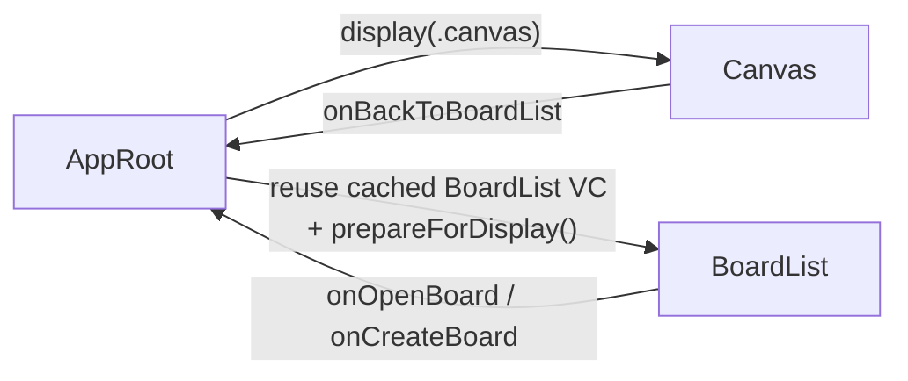

# Canvas返回与列表缓存计划

## 目标

- 在 `Canvas` 页面左上角增加悬浮圆形返回按钮，点击后返回 `BoardList`。
- 返回时复用同一个 `BoardListViewController` 实例，而不是每次重新 `new`。
- 优先保住已有页面状态：`displayMode`、`selectedEntryID`、滚动位置、缩略图热缓存。

## 现状锚点

当前根因不在 `BoardList` 视图本身，而在 `AppRoot` 每次进入 `.boardList` 时都会新建 controller；同时 `BoardList` 的数据刷新只在首次 `viewDidLoad()` 里触发一次。

```swift
// MyCanvas_Ver_0/Platform/macOS/AppRoot/macOSAppRootViewController.swift
case .boardList:
    let viewController = macOSBoardListViewController()
    viewController.onOpenBoard = { [weak self] boardID in
        self?.display(.canvas(.existing(boardID: boardID)))
    }
    viewController.onCreateBoard = { [weak self] in
        self?.display(.canvas(.newBoard))
    }
    return viewController
```

```swift
// MyCanvas_Ver_0/Platform/macOS/BoardList/macOSBoardListViewController.swift
override func viewDidLoad() {
    super.viewDidLoad()
    setupViewHierarchy()
    setupConstraints()
    setupActions()
    refreshBookmarkStatus()
}
```

## 核心方案

- 缓存对象放在 `AppRoot`，而不是缓存裸 `BoardListView`。
- `Canvas` 只暴露一个 `onBackToBoardList` 回调，不直接知道 `AppRoot`。
- `BoardList` 增加可重入的 `prepareForDisplay()`，每次重新显示前显式刷新 catalog / bookmark / header / selection。
- 返回按钮挂在 `chromeOverlayView`，不塞进右下角 `controlsStackView`。




## 阶段1：AppRoot持有BoardList缓存

- 修改 [MyCanvas_Ver_0/Platform/macOS/AppRoot/macOSAppRootViewController.swift](MyCanvas_Ver_0/Platform/macOS/AppRoot/macOSAppRootViewController.swift) 与 [MyCanvas_Ver_0/Platform/iOS/AppRoot/iOSAppRootViewController.swift](MyCanvas_Ver_0/Platform/iOS/AppRoot/iOSAppRootViewController.swift)。
- 新增缓存属性，例如 `cachedBoardListViewController`。
- 把 `.boardList` 分支的创建逻辑提成 `getOrCreateBoardListViewController()`，确保 `onOpenBoard` / `onCreateBoard` 只绑定一次。
- 保持 [MyCanvas_Ver_0/App/AppLaunchDestination.swift](MyCanvas_Ver_0/App/AppLaunchDestination.swift) 不变，因为当前路由枚举已经足够表达 `boardList <-> canvas`。
- 阶段完成标志：再次 `display(.boardList)` 时返回同一个 controller 实例。

## 阶段2：BoardList增加显示前刷新入口

- 修改 [MyCanvas_Ver_0/Platform/macOS/BoardList/macOSBoardListViewController.swift](MyCanvas_Ver_0/Platform/macOS/BoardList/macOSBoardListViewController.swift) 与 [MyCanvas_Ver_0/Platform/iOS/BoardList/iOSBoardListViewController.swift](MyCanvas_Ver_0/Platform/iOS/BoardList/iOSBoardListViewController.swift)。
- 新增 `prepareForDisplay()`，内部复用现有 `refreshBookmarkStatus()` 链路。
- 刷新时继续沿用现有方法：`refreshBookmarkStatus()`、`ensureValidSelection()`、`reloadBoardList()`，只更新数据快照与 header / empty / error UI。
- 明确保留实例态，不在这里重置 `displayMode`、`selectedEntryID`。
- 验证 `BoardPreviewProvider` 的实例级缓存会随 controller 复用而保留，但 refresh 后要能拿到新的 `BoardCatalogItem.revisionToken`。
- 阶段完成标志：返回列表时能看到最新 board 数据，同时原有模式和选中态不被清空。

## 阶段3：Canvas暴露返回出口并接回AppRoot

- 修改 [MyCanvas_Ver_0/Platform/macOS/macOSViewController.swift](MyCanvas_Ver_0/Platform/macOS/macOSViewController.swift) 与 [MyCanvas_Ver_0/Platform/iOS/iOSViewController.swift](MyCanvas_Ver_0/Platform/iOS/iOSViewController.swift)。
- 新增 `onBackToBoardList: (() -> Void)?`。
- 由 `AppRoot` 在创建 `Canvas` controller 时注入回调，点击返回后统一走 `display(.boardList)`。
- 不让 `Canvas` 直接持有 `AppRoot` 或自己决定路由，保持容器职责单一。
- 阶段完成标志：Canvas 已有一个明确的“返回列表”出口，但 UI 按钮还未接入。

## 阶段4：Canvas左上角悬浮圆形返回按钮

- 修改 [MyCanvas_Ver_0/Platform/macOS/macOSViewController.swift](MyCanvas_Ver_0/Platform/macOS/macOSViewController.swift) 与 [MyCanvas_Ver_0/Platform/iOS/iOSViewController.swift](MyCanvas_Ver_0/Platform/iOS/iOSViewController.swift)。
- 在现有 `chromeOverlayView` 上增加 `backButton`，不要挂到 `canvasHostView`，也不要塞进 `controlsStackView`。
- 约束到 `safeAreaLayoutGuide` 的 top-leading，尺寸固定，宽高相等，形成圆形按钮。
- 保持双端原生风格：iOS 用 `UIButton.Configuration`，macOS 用 `NSButton` + SF Symbol。
- 按钮事件只做一件事：调用 `onBackToBoardList?()`。
- 阶段完成标志：Canvas 左上角出现独立浮层返回按钮，视觉与右下角工具区解耦。

## 阶段5：浮层避让、命中层级与回显稳定性

- 重点检查 [MyCanvas_Ver_0/Platform/macOS/macOSViewController.swift](MyCanvas_Ver_0/Platform/macOS/macOSViewController.swift) 与 [MyCanvas_Ver_0/Platform/iOS/iOSViewController.swift](MyCanvas_Ver_0/Platform/iOS/iOSViewController.swift) 中的 `chromeOccupiedRects()`、`contextMenuOccupiedRects()`。
- 把左上角 `backButton` 的 frame 纳入 occupied rect 计算，让 minimap / context menu 避开它。
- 检查 [MyCanvas_Ver_0/Platform/Shared/ContextMenu/CanvasContextMenuHostView.swift](MyCanvas_Ver_0/Platform/Shared/ContextMenu/CanvasContextMenuHostView.swift) 的整层 hit-test 行为，确保返回按钮层级不会被菜单 host 吞掉。
- 如有需要，把 `backButton` 放到 `contextMenuHostView` 之上，或在返回动作前先 dismiss 当前 context menu。
- 这一阶段同时验证：refresh 后若 `reloadData()` 导致滚动位置跳动，再补显式 offset capture / restore。
- 阶段完成标志：返回按钮不与 minimap、context menu、画布手势产生冲突。

## 阶段6：回归验证与验收清单

- `BoardList -> existing board -> Canvas -> 返回`：确认不重新 new 列表 controller。
- `BoardList placeholder -> new board -> Canvas -> 返回`：确认列表页仍保留之前的 display mode 与可见位置。
- `Grid/List` 切换后进入 Canvas 再返回：确认模式不丢失。
- 进入 Canvas 前选中了某个真实 board，返回后 board 仍能维持有效选中；如果 board 已删除，要由 `ensureValidSelection()` 自动修正。
- 选中文件夹变化、bookmark 丢失、storage error：确认 `prepareForDisplay()` 能刷新 header 与 empty/error 状态。
- 缩略图验证：返回后优先复用 `BoardPreviewProvider` 内存缓存，新的 `revisionToken` 变化仍然生效。

## 实施顺序建议

1. 先做阶段1和阶段2，把“缓存 + 显示前刷新”打通。
2. 再做阶段3和阶段4，把返回路径和按钮接上。
3. 最后做阶段5和阶段6，专门收口浮层冲突、滚动稳定性和双端回归。

## 主要改动文件

- [MyCanvas_Ver_0/Platform/macOS/AppRoot/macOSAppRootViewController.swift](MyCanvas_Ver_0/Platform/macOS/AppRoot/macOSAppRootViewController.swift)
- [MyCanvas_Ver_0/Platform/iOS/AppRoot/iOSAppRootViewController.swift](MyCanvas_Ver_0/Platform/iOS/AppRoot/iOSAppRootViewController.swift)
- [MyCanvas_Ver_0/Platform/macOS/BoardList/macOSBoardListViewController.swift](MyCanvas_Ver_0/Platform/macOS/BoardList/macOSBoardListViewController.swift)
- [MyCanvas_Ver_0/Platform/iOS/BoardList/iOSBoardListViewController.swift](MyCanvas_Ver_0/Platform/iOS/BoardList/iOSBoardListViewController.swift)
- [MyCanvas_Ver_0/Platform/macOS/macOSViewController.swift](MyCanvas_Ver_0/Platform/macOS/macOSViewController.swift)
- [MyCanvas_Ver_0/Platform/iOS/iOSViewController.swift](MyCanvas_Ver_0/Platform/iOS/iOSViewController.swift)
- [MyCanvas_Ver_0/Platform/Shared/ContextMenu/CanvasContextMenuHostView.swift](MyCanvas_Ver_0/Platform/Shared/ContextMenu/CanvasContextMenuHostView.swift)

