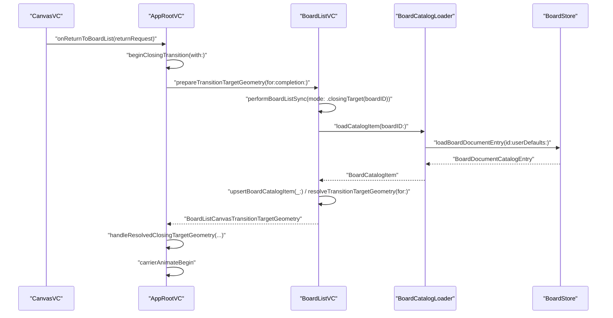

# Closing Delay Root Fix

## 目标

- 把 iOS 返回缩小动画开始前的主线程阻塞，从“全量刷新 BoardList”改成“只为目标板准备 target rect”。
- 从根因上消灭三类前置成本：
  - closing 链中的重复 `refreshBookmarkStatus()`
  - 为返回目标板拿 `cardRect` 而触发的全量 `loadCatalog()` / `reloadData()`
  - 无关卡片在 `cellForItemAt()` 中同步 `immediatePreview(...)` 和诊断副作用
- 保持现有转场视觉和业务语义不变：
  - 仍然缩回真实目标卡片
  - 仍然支持 returning board 在 BoardList 中被 reveal 到可见位置
  - 不把问题转嫁成“动画先播，列表晚点再同步”的假修复

## 范围

- 本计划以 iOS closing 链为主，因为当前实测日志和瓶颈都出自 iOS。
- 共享层和存储层的改造会尽量做成通用能力，但本轮不强行要求 macOS 同步落地。
- 本轮不改转场 carrier 方案，不切到 `方案 B`；只修复 `方案 C` 返回前置卡顿的根因。

## 关键现状

- closing 入口在 [iOSAppRootViewController.swift](MyCanvas_Ver_0/Platform/iOS/AppRoot/iOSAppRootViewController.swift) 的 `beginClosingTransition(with:)`。当前顺序是：
  - `mountViewController(boardList, hidden: true)`
  - `prepareForDisplay()`
  - `carrier.prepareTransition(...)`
  - `prepareTransitionTargetGeometry(...)`
- `prepareForDisplay()` 和 `prepareTransitionTargetGeometry(...)` 都会落到 [iOSBoardListViewController.swift](MyCanvas_Ver_0/Platform/iOS/BoardList/iOSBoardListViewController.swift) 的 `refreshBookmarkStatus()`，导致一次 return 内出现两轮 `loadCatalog()`。
- `refreshBookmarkStatus()` 调用 [BoardCatalogLoader.swift](MyCanvas_Ver_0/Platform/Shared/BoardList/BoardCatalogLoader.swift) 的 `loadCatalog()`；后者依赖 [BoardStore.swift](MyCanvas_Ver_0/Canvas/Storage/BoardStore.swift) 的 `listBoardDocumentEntries()` 做全量目录扫描、逐板 `board.json` 读取和解码。
- `reloadBoardList()` 会触发 `collectionView.reloadData()`；在 `cellForItemAt()` 中，[iOSBoardListViewController.swift](MyCanvas_Ver_0/Platform/iOS/BoardList/iOSBoardListViewController.swift) 会同步调用 [BoardPreviewProvider.swift](MyCanvas_Ver_0/Platform/Shared/BoardList/BoardPreviewProvider.swift) 的 `immediatePreview(...)`。
- `immediatePreview(...)` 虽然不一定 fresh render，但它依然会做缓存命中判断、persisted thumbnail 读取，并在 cache-hit 路径里进入 `logBoardPreviewProviderCacheHit()` / `logBoardPreviewProviderSourceImagesIfNeeded()`。
- 当前 trace 已证明：
  - 动画本身约 `0.498s`，基本正常
  - `requestTargetGeometry -> targetGeometryResolved` 约 `0.506s`
  - `revealPendingBoardEnqueued -> revealBoardBegin` 约 `0.461s`
  - 这说明真正的问题是 target-ready 期间主线程被全量列表工作占满，而不是 shrink 动画慢

## 架构方向

- 让 `boardListViewController` 从“每次 closing 前临时准备的 destination 页面”转成“常驻的 BoardList 缓存容器”。
- 把 BoardList 的数据同步拆成两条语义明确的路径：
  - `display sync`：用于真正显示 BoardList 页面时的全量一致性刷新
  - `closing target sync`：用于 closing 期间的目标板就绪，只更新 returning board 所需数据
- 让 target-ready 只依赖三件事：
  - 目标板条目在 `availableBoards` 中存在
  - 排序位置正确
  - 对应 index path 的布局和 `cardRect` 可解析
- preview 和 trace 只服务“视觉内容”，不再阻塞“几何就绪”

## 核心时序逻辑

### 当前时序问题

- 现在的 closing 实际时序是：
  1. `CanvasVC.handleBackButtonTap()` 发出 `BoardListCanvasReturnRequest`
  2. `AppRoot.beginClosingTransition(with:)` 挂载 `boardListViewController`
  3. `BoardList.prepareForDisplay()` 触发第一轮 `refreshBookmarkStatus() -> loadCatalog() -> reloadBoardList()`
  4. `carrier.prepareTransition(...)` 期间，BoardList mount 后的布局与 cell 配置继续消耗主线程
  5. `BoardList.prepareTransitionTargetGeometry(...)` 又触发第二轮 `refreshBookmarkStatus() -> loadCatalog() -> reloadBoardList()`
  6. `revealPendingBoardIfNeeded() -> DispatchQueue.main.async -> revealBoard(...)`
  7. `finishPendingTransitionTargetResolution(...)`
  8. `AppRoot.handleResolvedClosingTargetGeometry(...) -> carrier.animateTransition(...)`
- 真正的问题发生在步骤 `3` 到 `7` 之间：动画开始前，target-ready 被全量 catalog、全量 reload 和同步 preview 塞满了。

### 目标时序

### 目标时序的硬约束

- `beginClosingTransition(with:)` 进入 closing 后，到 `carrierAnimateBegin` 之前，只允许出现一次 target-ready 数据同步。
- `prepareForDisplay()` 不再参与 closing target-ready；closing 前置只允许走 `prepareTransitionTargetGeometry(for:completion:)`。
- `performBoardListSync(mode: .closingTarget(boardID))` 只能做单板读取、单板 upsert、局部布局和目标 reveal，不能调用全量 `reloadBoardList()`。
- `finishPendingTransitionTargetResolution(...)` 的 completion 只依赖目标板数据、排序和 `cardRect`，不依赖 preview 是否完成。
- `carrierAnimateBegin` 一旦拿到 geometry，就立即开始；closing 链里不再夹杂第二轮 `loadCatalog()` 或无关卡片的 preview 工作。

## 核心数据结构与函数约定

### 统一数据结构

| 层级        | 名称                                        | 关键内容                                                                            | 首次落地阶段  |
| --------- | ----------------------------------------- | ------------------------------------------------------------------------------- | ------- |
| BoardList | `BoardListPreparationMode`                | `.fullDisplay`、`.closingTarget(boardID: UUID)`，区分全量显示同步和 closing target-only 同步 | Phase 1 |
| BoardList | `BoardListCatalogMutationChangeKind`      | `.inserted`、`.updated`、`.moved`、`.unchanged`                                    | Phase 3 |
| BoardList | `BoardListCatalogMutationResult`          | `resolvedIndexPath`、`previousIndexPath`、`changeKind`                            | Phase 3 |
| BoardList | `BoardListPreviewWorkPolicy`              | `.normal`、`.geometryOnly`，控制 target-ready 期间的 preview 策略                        | Phase 4 |
| BoardList | `BoardListClosingTargetPreparationResult` | `boardID`、`resolvedIndexPath`、`geometry`、`usedFallbackGeometry`                 | Phase 4 |
| Preview   | `BoardPreviewTracePolicy`                 | `.disabled`、`.metadataOnly`、`.verbose`，控制 trace 是否允许读取源图                        | Phase 5 |

### 统一函数约定

| 文件                                                                                                         | 函数                                                 | 角色                                                                |
| ---------------------------------------------------------------------------------------------------------- | -------------------------------------------------- | ----------------------------------------------------------------- |
| [iOSAppRootViewController.swift](MyCanvas_Ver_0/Platform/iOS/AppRoot/iOSAppRootViewController.swift)       | `beginClosingTransition(with:)`                    | closing 容器入口；Phase 1 后不再显式调用 `prepareForDisplay()`                |
| [iOSBoardListViewController.swift](MyCanvas_Ver_0/Platform/iOS/BoardList/iOSBoardListViewController.swift) | `prepareForDisplay()`                              | 保留为“页面显示准备”入口，不承担 closing target-ready                            |
| [iOSBoardListViewController.swift](MyCanvas_Ver_0/Platform/iOS/BoardList/iOSBoardListViewController.swift) | `prepareTransitionTargetGeometry(for:completion:)` | 保留为对外 contract；内部转调 closing target-only 准备链                       |
| [iOSBoardListViewController.swift](MyCanvas_Ver_0/Platform/iOS/BoardList/iOSBoardListViewController.swift) | `performBoardListSync(mode:)`                      | 统一收口 BoardList 的同步入口，内部按 `BoardListPreparationMode` 分流            |
| [BoardStore.swift](MyCanvas_Ver_0/Canvas/Storage/BoardStore.swift)                                         | `loadBoardDocumentEntry(id:userDefaults:)`         | 只读单个 `BoardDocumentCatalogEntry`，不做全量目录扫描                         |
| [BoardCatalogLoader.swift](MyCanvas_Ver_0/Platform/Shared/BoardList/BoardCatalogLoader.swift)              | `loadCatalogItem(boardID:)`                        | 把单板 entry 映射为 `BoardCatalogItem`                                  |
| [iOSBoardListViewController.swift](MyCanvas_Ver_0/Platform/iOS/BoardList/iOSBoardListViewController.swift) | `upsertBoardCatalogItem(_:)`                       | returning board 的单条 mutation，返回 `BoardListCatalogMutationResult`  |
| [iOSBoardListViewController.swift](MyCanvas_Ver_0/Platform/iOS/BoardList/iOSBoardListViewController.swift) | `resolveTransitionTargetGeometry(for:)`            | 根据目标 index path / cell / layoutAttributes 解析最终 `geometry`         |
| [iOSBoardListViewController.swift](MyCanvas_Ver_0/Platform/iOS/BoardList/iOSBoardListViewController.swift) | `currentPreviewWorkPolicy()`                       | 根据当前是否处于 closing target-resolution，决定 `.normal` 或 `.geometryOnly` |
| [BoardPreviewProvider.swift](MyCanvas_Ver_0/Platform/Shared/BoardList/BoardPreviewProvider.swift)          | `currentTracePolicy()` 或等价 helper                  | 控制 trace 是否允许进入源图读取与重日志路径                                         |

### 对外 contract 保持稳定

- `BoardListCanvasReturnRequest`
- `BoardListCanvasTransitionTargetGeometry`
- `iOSAppRootViewController.beginClosingTransition(with:)`
- `iOSBoardListViewController.prepareTransitionTargetGeometry(for:completion:)`

以上对外 contract 本轮尽量不改；真正新增的逻辑优先收敛在 BoardList 内部 helper 和存储 / loader 层扩展函数里。

## Phase 1：收口 closing 前置入口，消除双 refresh

- 修改点：
  - 在 [iOSAppRootViewController.swift](MyCanvas_Ver_0/Platform/iOS/AppRoot/iOSAppRootViewController.swift) 的 `beginClosingTransition(with:)` 中，移除 closing 期间对 `destinationViewController.prepareForDisplay()` 的同步前置调用。
  - 保留 `prepareTransitionTargetGeometry(...)` 作为 closing 阶段唯一的前置数据同步入口。
  - 明确 `prepareForDisplay()` 只负责“页面显示准备”，不再承担“closing target-ready”职责。
  - 在 [iOSBoardListViewController.swift](MyCanvas_Ver_0/Platform/iOS/BoardList/iOSBoardListViewController.swift) 中引入 `BoardListPreparationMode` 与 `performBoardListSync(mode:)` 的壳，让后续 Phase 2-4 的时序都挂在同一个入口上，而不是继续散落在 `refreshBookmarkStatus()` 和 `prepareTransitionTargetGeometry(...)` 中。
- 关键文件：
  - [iOSAppRootViewController.swift](MyCanvas_Ver_0/Platform/iOS/AppRoot/iOSAppRootViewController.swift)
  - [iOSBoardListViewController.swift](MyCanvas_Ver_0/Platform/iOS/BoardList/iOSBoardListViewController.swift)
- 验收：
  - 一次 existing-board return 的 trace 中，只出现一次 `refreshBookmarkStatusBegin/End`
  - `boardListPrepareForDisplayFinished` 不再是 closing 前置关键耗时
- 这一阶段为什么先做：
  - 它是最直接、风险最低的根因去重
  - 不先消掉双 refresh，后面的 targeted update 会被重复入口重新打回全量路径

## Phase 2：建立单板 catalog 读取能力

- 修改点：
  - 在 [BoardStore.swift](MyCanvas_Ver_0/Canvas/Storage/BoardStore.swift) 中新增单板 catalog 级读取能力，例如 `loadBoardDocumentEntry(id:)`，复用现有 `boardDirectoryURL(...)` 和 `readBoardDocument(at:)`，避免 `contentsOfDirectory(...)` 和全量遍历。
  - 在 [BoardCatalogLoader.swift](MyCanvas_Ver_0/Platform/Shared/BoardList/BoardCatalogLoader.swift) 中新增 `loadCatalogItem(boardID:)`，把单条 `BoardDocumentCatalogEntry` 映射为 `BoardCatalogItem`。
  - 保持现有 `loadCatalog()` 原样存在，用于真正的全量场景。
- 关键文件：
  - [BoardStore.swift](MyCanvas_Ver_0/Canvas/Storage/BoardStore.swift)
  - [BoardCatalogLoader.swift](MyCanvas_Ver_0/Platform/Shared/BoardList/BoardCatalogLoader.swift)
  - [BoardCatalogItem.swift](MyCanvas_Ver_0/Platform/Shared/BoardList/BoardCatalogItem.swift)
- 验收：
  - BoardList 能在不调用 `listBoardDocumentEntries()` 的情况下，只读取 returning board 的 `BoardCatalogItem`
  - 单板读取路径不触发全量目录扫描
- 这一阶段为什么排第二：
  - closing target-ready 要想从根上摆脱全量 IO，必须先有存储层和 loader 层的单板能力

## Phase 3：把 BoardList 改成常驻缓存模型，并支持 targeted upsert

- 修改点：
  - 在 [iOSBoardListViewController.swift](MyCanvas_Ver_0/Platform/iOS/BoardList/iOSBoardListViewController.swift) 中，把 `availableBoards` 视为长生命周期缓存，不再把每次 return 都当成“重建整个列表”。
  - 新增针对 `BoardCatalogItem` 的本地 mutation 能力：
    - `upsertBoardCatalogItem(_:)`
    - `BoardListCatalogMutationResult`
    - `BoardListCatalogMutationChangeKind`
    - 根据 `boardID` 快速定位 index
  - returning board 回来时，只更新这一条数据，并维持与现有 `updatedAt` 排序逻辑一致。
  - 保持 `pendingRevealBoardID -> revealPendingBoardIfNeeded()` 仍然是唯一的 target reveal 入口。
- 关键文件：
  - [iOSBoardListViewController.swift](MyCanvas_Ver_0/Platform/iOS/BoardList/iOSBoardListViewController.swift)
  - [BoardCatalogLoader.swift](MyCanvas_Ver_0/Platform/Shared/BoardList/BoardCatalogLoader.swift)
- 验收：
  - returning board 的 title / updatedAt / previewSeed 能在不重建整个 `availableBoards` 的前提下更新
  - 目标板排序正确，`indexPath(for:)` 仍然稳定
- 这一阶段为什么排第三：
  - 有了 Phase 2 的单板读取，BoardList 才能真正从“全量覆盖”转成“按板更新”

## Phase 4：建立 target-ready 快路径，不为拿 rect 触发全量 reload

- 修改点：
  - 在 [iOSBoardListViewController.swift](MyCanvas_Ver_0/Platform/iOS/BoardList/iOSBoardListViewController.swift) 中，把 `prepareTransitionTargetGeometry(...)` 拆成明确的 closing target-resolution 流程。
  - 该流程只做：
    - 加载 returning board 的单条 `BoardCatalogItem`
    - `availableBoards` 中的 targeted upsert / 排序
    - 目标 item 的插入、移动或局部刷新
    - `layoutIfNeeded()` 后通过 `resolveTransitionTargetGeometry(for:)` 解析 `transitionCardRect(at:)`
  - 避免在 target-ready 路径中调用 `reloadBoardList()` 和 `collectionView.reloadData()`。
  - 对 geometry 解析优先使用 `layoutAttributesForItem(at:)` 和目标 cell 的 `transitionGeometry(in:)`，不依赖 preview 是否已经到位。
  - 引入 `BoardListClosingTargetPreparationResult` 和 `BoardListPreviewWorkPolicy`，让 closing 期间的“目标几何准备”和“预览策略”都变成显式状态，而不是隐含在 `pendingRevealBoardID` 附近。
- 关键文件：
  - [iOSBoardListViewController.swift](MyCanvas_Ver_0/Platform/iOS/BoardList/iOSBoardListViewController.swift)
  - [iOSBoardCollectionViewCell.swift](MyCanvas_Ver_0/Platform/iOS/BoardList/iOSBoardCollectionViewCell.swift)
- 验收：
  - `requestTargetGeometry -> targetGeometryResolved` 不再触发整页 `reloadData()`
  - trace 中 `revealBoardBegin local` 接近 0，说明 `DispatchQueue.main.async` 不再被前面的全量主线程工作堵住
  - `hasCardRect=true` 的成功率不下降
- 这一阶段为什么是核心阶段：
  - 真正决定“动画何时能开始”的不是 preview，而是 target geometry
  - 只有把 target-ready 改成局部路径，前面的 0.461s queueing 才会真正消失

## Phase 5：把 preview 和 trace 的副作用从主线程路径剥离

- 修改点：
  - 在 [BoardPreviewProvider.swift](MyCanvas_Ver_0/Platform/Shared/BoardList/BoardPreviewProvider.swift) 中，把 `logBoardPreviewProviderCacheHit()`、`logBoardPreviewProviderSourceImagesIfNeeded()` 改成 `BoardPreviewTracePolicy` 驱动，默认只允许 `.metadataOnly`，不再读取源图。
  - 在 closing target-resolution 模式下，根据 `BoardListPreviewWorkPolicy.geometryOnly`，对无关卡片直接使用 `.geometry(item.previewSeed)`，跳过 `immediatePreview(...)` 和 `requestThumbnail(...)`。
  - 让 preview 的补齐变成动画开始后或 closing 完成后的低优先级工作，而不是 target-ready 的前置依赖。
- 关键文件：
  - [BoardPreviewProvider.swift](MyCanvas_Ver_0/Platform/Shared/BoardList/BoardPreviewProvider.swift)
  - [iOSBoardListViewController.swift](MyCanvas_Ver_0/Platform/iOS/BoardList/iOSBoardListViewController.swift)
  - [iOSBoardCollectionViewCell.swift](MyCanvas_Ver_0/Platform/iOS/BoardList/iOSBoardCollectionViewCell.swift)
- 验收：
  - 开启 trace 时，不再因为日志本身触发额外图片读取与解码
  - target-ready 期间，无关卡片不再进入同步 preview 计算
- 这一阶段为什么单列：
  - 当前日志已经表明 profiling 本身放大了路径成本
  - 如果不把诊断副作用拆掉，后续 trace 很难真实反映架构修复收益

## Phase 6：用 closing trace 做回归验证，并补性能护栏

- 修改点：
  - 复用现有 `BoardListCanvasTransitionDebugTrace`，重新测量 `backButtonTap -> carrierAnimateBegin`、`requestTargetGeometry -> targetGeometryResolved`、`revealPendingBoardEnqueued -> revealBoardBegin`。
  - 为关键路径增加面向调试的护栏日志，确保以后不会无意中重新引入：
    - closing 内双 refresh
    - target-ready 内全量 `reloadData()`
    - trace 日志触发源图读取
  - 若 closing 完成后仍需要一次全量一致性刷新，把它放到 `completeClosingTransition()` 之后异步执行，并与 target-ready trace 分离。
- 关键文件：
  - [iOSAppRootViewController.swift](MyCanvas_Ver_0/Platform/iOS/AppRoot/iOSAppRootViewController.swift)
  - [iOSBoardListViewController.swift](MyCanvas_Ver_0/Platform/iOS/BoardList/iOSBoardListViewController.swift)
  - [BoardPreviewProvider.swift](MyCanvas_Ver_0/Platform/Shared/BoardList/BoardPreviewProvider.swift)
- 验收：
  - warm existing-board return 中，`carrierAnimateBegin` 明显前移
  - `requestTargetGeometry -> targetGeometryResolved` 从当前约 `0.506s` 降到“单板读取 + reveal”级别
  - `revealPendingBoardEnqueued -> revealBoardBegin` 不再出现数百毫秒排队
  - `completeClosingTransition local` 仍接近当前动画时长，说明改动没有破坏动画本身

## 推荐实施顺序

- 必须先做 Phase 1，再做 Phase 2 和 Phase 3。
- Phase 4 是真正消灭主卡顿的关键阶段。
- Phase 5 建议在 Phase 4 之后立刻做，否则 trace 会持续被诊断副作用污染。
- Phase 6 不只是验收，也用于判断是否还需要继续向“Board mutation sink”方向演进。

## 总体验收

- 一次 existing-board return 中，不再出现双 `refreshBookmarkStatus()`
- closing 前置不再依赖全量 `loadCatalog()` / `reloadBoardList()`
- target-ready 只为目标板做必要同步，不被无关卡片 preview 阻塞
- trace 开启时只增加观测，不再改变主线程成本模型
- 用户体感上，“点返回后停一下再缩小”的停顿明显消失，只剩正常的缩小动画时长

