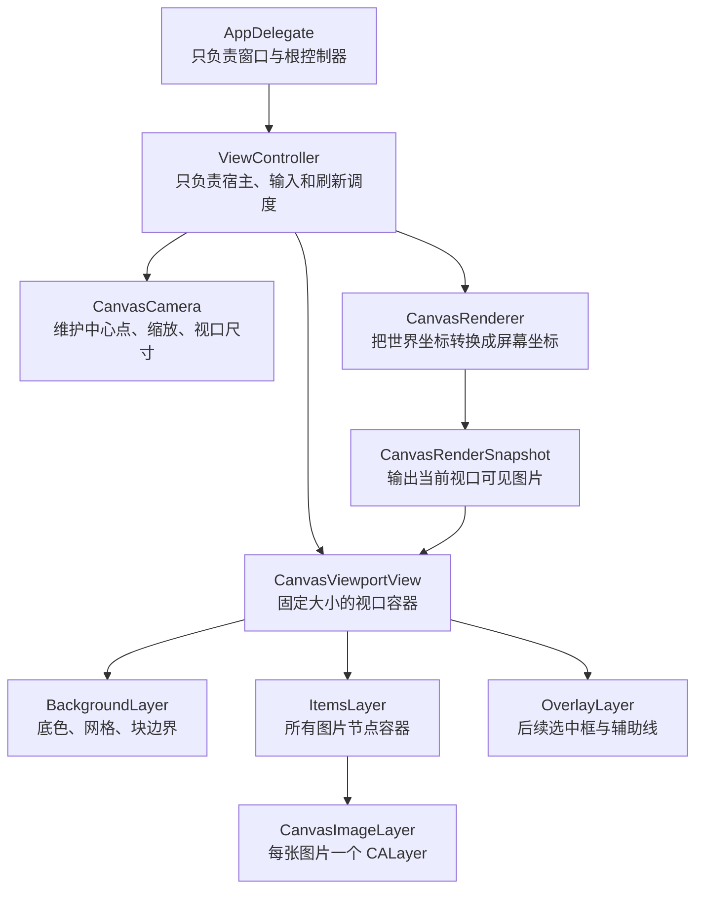

# 图片显示执行计划

## 目标

- 在不改变现有 `AppDelegate` 启动职责的前提下，把当前 `Hello world` 占位主页面替换为真正的图板主页面。
- 放弃系统 `UIScrollView` / `NSScrollView` 容器方案，改为固定视口 + 自定义相机模型（`CanvasCamera`）实现平移与缩放。
- 图片显示统一采用 `CALayer`，由平台视口视图管理 layer 树，不使用 `UIImageView` / `NSImageView` 作为图片节点容器。
- 本轮只实现“图片显示 + 基础平移/缩放 + 双平台渲染链路”，暂不处理存储、持久化、导入流程、撤销重做、无边界扩张策略落地。

## 当前基础

- 启动入口已经稳定：`[MyCanvas_Ver_0/Platform/iOS/iOSAppDelegate.swift](MyCanvas_Ver_0/Platform/iOS/iOSAppDelegate.swift)` 负责创建 `UIWindow` 并挂载 `iOSViewController`；`[MyCanvas_Ver_0/Platform/macOS/macOSAppDelegate.swift](MyCanvas_Ver_0/Platform/macOS/macOSAppDelegate.swift)` 负责创建 `NSWindow` 并挂载 `macOSViewController`。
- 当前页面仍是占位：`[MyCanvas_Ver_0/Platform/iOS/iOSViewController.swift](MyCanvas_Ver_0/Platform/iOS/iOSViewController.swift)` 和 `[MyCanvas_Ver_0/Platform/macOS/macOSViewController.swift](MyCanvas_Ver_0/Platform/macOS/macOSViewController.swift)` 现在只是居中显示 `Hello world`。
- 工程仍然很小，当前适合直接在 `[MyCanvas_Ver_0](MyCanvas_Ver_0)` 目录下新增共享 Canvas 文件与平台专属视口文件，不需要先做模块拆分。

## 方案总览

## 设计调整要点

### 旧方案中不再保留的部分

- 不再把 `iOSViewController` / `macOSViewController` 改造成 `ScrollView` 宿主控制器。
- 不再依赖 `contentSize`、`contentOffset`、`documentView`、系统 magnification 之类滚动容器概念。
- 不再以“超大内容视图 + 系统滚动窗口”作为无限图板基础。

### 新方案的核心思想

- 主页面始终是一个固定大小的“观察窗口”，窗口大小等于当前屏幕或窗口内容区大小。
- 用户看到世界坐标中的哪一部分，由 `CanvasCamera` 决定，而不是由一个超大内容视图的位置决定。
- 图片节点始终存储在世界坐标系中；渲染阶段根据 `CanvasCamera` 把图片转换到当前屏幕坐标。
- 主页面平移、缩放都由自定义输入和相机公式完成，不依赖系统滚动容器。

## 主页面结构

### 页面形态

- `iOS`：几乎整个页面都是图板视口，不额外引入系统导航层作为第一版主布局核心。
- `macOS`：保留系统窗口标题栏，标题栏下方整个内容区域就是图板视口。
- 第一版界面保持克制，只保留底色、轻量背景层、测试图片显示；不加侧边栏、属性面板、资源列表。

### 视图与 layer 层级

- `iOSViewController` / `macOSViewController`
- `iOSCanvasViewportView` / `macOSCanvasViewportView`
- `backgroundLayer`
- `itemsLayer`
- `overlayLayer`
- `CanvasImageLayer x N`

职责划分：

- `ViewController`：宿主层，负责输入、相机更新、触发渲染。
- `CanvasViewportView`：固定大小视口，负责维护 layer 树。
- `CanvasImageLayer`：单张图片节点显示。
- `CanvasRenderer`：把世界坐标中的图片转换成当前视口屏幕坐标。

## 文件落点

### 保持职责不变的现有文件

- `[MyCanvas_Ver_0/Platform/iOS/iOSAppDelegate.swift](MyCanvas_Ver_0/Platform/iOS/iOSAppDelegate.swift)`：继续只负责 iOS 窗口创建与根控制器挂载。
- `[MyCanvas_Ver_0/Platform/macOS/macOSAppDelegate.swift](MyCanvas_Ver_0/Platform/macOS/macOSAppDelegate.swift)`：继续只负责 macOS 窗口创建与根控制器挂载。

### 需要改造的现有文件

- `[MyCanvas_Ver_0/Platform/iOS/iOSViewController.swift](MyCanvas_Ver_0/Platform/iOS/iOSViewController.swift)`
  - 从占位 `UILabel` 页面改成固定视口宿主控制器。
  - 持有 `iOSCanvasViewportView`、`CanvasCamera`、共享场景/渲染器。
  - 通过 `UIPanGestureRecognizer`、`UIPinchGestureRecognizer` 等输入更新相机并触发重绘。
- `[MyCanvas_Ver_0/Platform/macOS/macOSViewController.swift](MyCanvas_Ver_0/Platform/macOS/macOSViewController.swift)`
  - 从占位 `NSTextField` 页面改成固定视口宿主控制器。
  - 持有 `macOSCanvasViewportView`、`CanvasCamera`、共享场景/渲染器。
  - 通过鼠标拖动、触控板缩放、滚轮事件等输入更新相机并触发重绘。

### 建议新增的共享文件

- `[MyCanvas_Ver_0/Canvas/Core/CanvasImageItem.swift](MyCanvas_Ver_0/Canvas/Core/CanvasImageItem.swift)`
  - 定义图片节点模型：`id`、`cgImage` 或图片引用、`center`、`size`、`zIndex`。
  - 提供 `worldFrame` 等几何属性。
- `[MyCanvas_Ver_0/Canvas/Core/CanvasScene.swift](MyCanvas_Ver_0/Canvas/Core/CanvasScene.swift)`
  - 管理当前画布中的图片节点集合。
  - 第一版只关注显示，不关心持久化和文档恢复。
- `[MyCanvas_Ver_0/Canvas/Core/CanvasCamera.swift](MyCanvas_Ver_0/Canvas/Core/CanvasCamera.swift)`
  - 保存 `center`、`zoomScale`、`viewportSize`。
  - 提供 `worldToViewport`、`viewportToWorld`、`pan(by:)`、`zoom(to:around:)` 等核心换算方法。
- `[MyCanvas_Ver_0/Canvas/Core/CanvasRenderer.swift](MyCanvas_Ver_0/Canvas/Core/CanvasRenderer.swift)`
  - 纯渲染层，把 `CanvasScene + CanvasCamera` 转成 `CanvasRenderSnapshot`。
  - 负责可见性筛选和世界坐标到屏幕坐标转换。
- `[MyCanvas_Ver_0/Canvas/Core/CanvasRenderSnapshot.swift](MyCanvas_Ver_0/Canvas/Core/CanvasRenderSnapshot.swift)`
  - 定义平台无关的渲染输出：`viewportBounds`、`visibleWorldRect`、`items`。
  - 其中每个渲染 item 输出 `screenFrame`，而不是旧方案里的 `localFrame`。

### 建议新增的平台渲染文件

- `[MyCanvas_Ver_0/Platform/Shared/Rendering/CanvasImageLayer.swift](MyCanvas_Ver_0/Platform/Shared/Rendering/CanvasImageLayer.swift)`
  - `CALayer` 子类。
  - 负责单张图片显示、内容缩放模式、边框或选中态占位、层级顺序。
  - 尽量只依赖 `QuartzCore` / `CoreGraphics`，减少平台分叉。
- `[MyCanvas_Ver_0/Platform/iOS/Canvas/iOSCanvasViewportView.swift](MyCanvas_Ver_0/Platform/iOS/Canvas/iOSCanvasViewportView.swift)`
  - `UIView` 子类。
  - 负责固定视口容器、背景层、图片层、覆盖层，以及把 `CanvasRenderSnapshot` 应用到 layer 树。
- `[MyCanvas_Ver_0/Platform/macOS/Canvas/macOSCanvasViewportView.swift](MyCanvas_Ver_0/Platform/macOS/Canvas/macOSCanvasViewportView.swift)`
  - `NSView` 子类。
  - 与 iOS 版本保持同构职责。
  - 建议 `isFlipped = true`，统一左上角为原点的屏幕坐标逻辑。

## 分阶段实施

### 第一阶段：替换宿主结构，去掉 ScrollView 思路

- 把两个 `ViewController` 从“中心文本页”改成“固定视口宿主控制器”。
- 页面中只挂一个全屏 `CanvasViewportView`，不再挂系统滚动容器。
- 清理旧计划中所有依赖 `ScrollView` / `documentView` / `contentOffset` 的实现入口。
- 第一阶段只完成主页面骨架和视口容器，不要求图片已经能完整交互。

### 第二阶段：建立共享场景与相机模型

- 增加 `CanvasScene`，作为当前页面中图片节点的最小运行时容器。
- 增加 `CanvasCamera`，明确这套模型是“固定视口 + 世界坐标 + 相机变换”，而不是“大画布 + 偏移量”。
- 在这一阶段，把旧计划中的 `CanvasViewportState` 替换为 `CanvasCamera`，避免后续继续沿用滚动容器思维。
- 明确图片节点坐标存储规则：所有节点持有世界坐标，不能存成依赖当前窗口左上角的本地坐标。

### 第三阶段：实现渲染器与快照输出

- 新增 `CanvasRenderer`，负责把 `CanvasScene + CanvasCamera` 转成 `CanvasRenderSnapshot`。
- `CanvasRenderSnapshot.items` 输出 `screenFrame`、`cgImage`、`zIndex`，供平台视口视图直接消费。
- 在这一阶段加入 `visibleWorldRect` 计算，让后续做无边界图板、背景网格、可见性裁剪时有统一入口。
- 第一版即使只显示少量图片，也要把坐标转换职责收口到 `CanvasRenderer`，不要让平台控制器自己算 frame。

### 第四阶段：实现平台视口视图与 layer 树管理

- `iOSCanvasViewportView` / `macOSCanvasViewportView` 统一维护三层 layer：`backgroundLayer`、`itemsLayer`、`overlayLayer`。
- 根据 `CanvasRenderSnapshot.items` 维护 `[CanvasItemID: CanvasImageLayer]` 映射，做到按节点增删改，不整页重建。
- 背景层第一版至少提供底色，网格可以先做极简版本，但 API 要为后续块边界绘制留口。
- `CanvasImageLayer` 负责 `contents`、`frame`、`contentsGravity`、`zPosition`、后续选中态占位。

### 第五阶段：实现自定义平移与缩放输入

- `iOS` 侧：使用 `UIPanGestureRecognizer` 实现平移；使用 `UIPinchGestureRecognizer` 实现缩放。
- `macOS` 侧：在视口或控制器层接 `mouseDragged`、`scrollWheel`、`magnify` 等输入。
- 缩放必须以手势锚点或鼠标焦点为中心，保证缩放前后该世界点在屏幕上的位置尽量稳定。
- 平移量必须按当前缩放比例换算到世界坐标，不能直接把屏幕像素当世界坐标使用。
- 完成这一阶段后，主页面应能在不借助系统滚动容器的前提下完成平移与缩放。

### 第六阶段：接入测试图片，跑通显示链路

- 暂不依赖存储系统，可以使用内存生成的测试 `CGImage`、临时测试资源，或本地占位图来验证渲染链路。
- 将 1 到 3 张测试图片放到不同世界坐标位置，验证：初始显示、缩放后位置稳定、平移后不漂移、层级顺序正确。
- 控制器只负责给场景喂测试图片并触发刷新，不在控制器内部直接创建图片控件。
- 这一阶段结束的标志是：`ViewController -> CanvasScene/CanvasCamera -> CanvasRenderer -> CanvasViewportView -> CanvasImageLayer` 这条链路在 iOS/macOS 两端都跑通。

### 第七阶段：为后续无边界图板预留接口

- 虽然本轮不实现存储和图板自动扩张，但要在 `CanvasRenderer` 与 `CanvasViewportView` 中保留 `visibleWorldRect`、背景绘制入口、世界坐标换算接口。
- 不把“当前画布大小”做成唯一真相，避免后续回退到“超大内容 view”模型。
- 背景层绘制优先基于当前 `CanvasCamera` 和视口尺寸，而不是依赖一个固定内容矩形。
- 这一步的目标是让后续扩张策略能自然接入，而不是再次推翻图片显示层。

## 本轮明确不做的内容

- 不做图片存储、持久化、文档结构设计。
- 不做图片导入流程、沙盒文件管理、资源去重。
- 不做撤销重做、框选、多选、拖拽编辑。
- 不做真正的 chunk 扩张策略和画布自动长大逻辑。
- 不做性能极限优化，如虚拟化分块、分辨率分级、磁盘缓存系统。

## 关键实现约束

- `AppDelegate` 不承载图板业务逻辑，启动层与图板层继续解耦。
- 主页面不得依赖 `UIScrollView` / `NSScrollView` 作为平移缩放基础容器。
- 图片节点统一使用 `CALayer`，不使用 `UIImageView` / `NSImageView` 作为长期方案。
- 平移和缩放必须通过 `CanvasCamera` 统一建模，不允许平台控制器各自维护一套零散偏移量逻辑。
- 共享层尽量只依赖 `Foundation`、`CoreGraphics`、`QuartzCore`，避免把 `UIKit` / `AppKit` 污染进核心模型。
- `macOS` 端要显式处理 `isFlipped` 与 `backingScaleFactor`，避免坐标反向和显示模糊。
- 第一版即使只有少量测试图片，也要遵守最终架构方向，不走“临时先堆几个 image view”的过渡写法。

## 验证方式

- iOS：启动后看到的是纯画布视口而不是文本占位页；两指缩放后，缩放中心附近的图片不会明显漂移；单指拖动可以平移世界内容。
- macOS：启动后窗口内容区是同构画布视口；鼠标/触控板输入可完成平移与缩放；窗口缩放后图片清晰度与位置保持正确。
- 共性验证：主页面中没有系统滚动容器；图片节点都是 `CALayer`；控制器只负责输入和刷新，不直接持有图片 view。
- 架构验证：渲染 frame 的计算收口在 `CanvasRenderer`，而不是分散在平台控制器和视图里。

## 风险与应对

- 风险：没有 `ScrollView` 后，平移/缩放公式一旦设计不稳，画面会出现漂移或抖动。
  - 应对：把所有坐标变换集中到 `CanvasCamera`，并尽早验证“以手势锚点缩放”的行为。
- 风险：iOS 与 macOS 输入模型不同，容易出现一端手感正常、另一端方向或缩放中心不一致。
  - 应对：两端输入都只转换成统一的 `pan` / `zoom` 相机命令，不在平台层重复发明一套渲染逻辑。
- 风险：如果平台视图直接自己算图片 frame，后续无边界扩张和可见性裁剪会非常难收口。
  - 应对：坚持由 `CanvasRenderer` 产出 `CanvasRenderSnapshot`，平台视图只消费结果。
- 风险：macOS 坐标系默认与 iOS 不同，若不统一，后续拖拽与命中测试会持续出问题。
  - 应对：macOS 视口视图尽早翻转坐标系，并在渲染阶段统一坐标约定。
- 风险：如果第一版为了快直接上 `UIImageView` / `NSImageView`，后续会和自定义相机模型冲突。
  - 应对：第一版就坚持 `CALayer` 节点方案，哪怕测试图片数量很少也不偏离方向。

