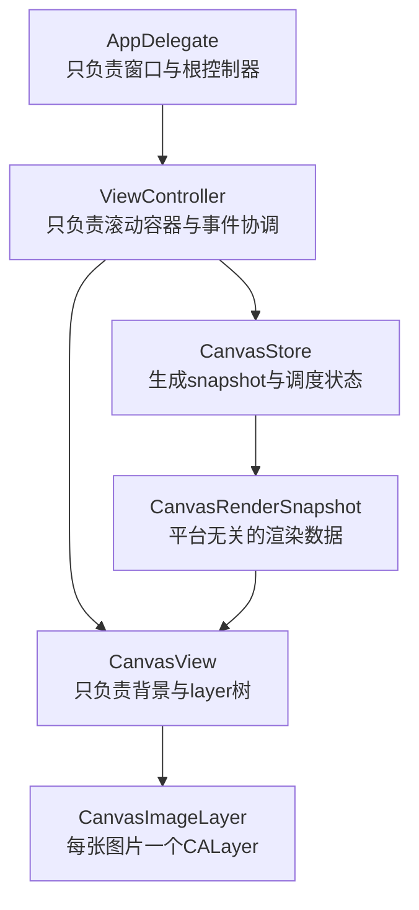

# 图片显示执行计划

## 目标

- 在不改变现有 `AppDelegate` 启动职责的前提下，把当前 `Hello world` 占位界面替换为可扩展的图板容器。
- 采用统一方案：`iOS` 用 `UIScrollView + UIView + CALayer`，`macOS` 用 `NSScrollView + NSView + CALayer`。
- 把“图片如何显示”和“图板如何扩张/滚动”解耦，避免后续把无边界逻辑散落到平台控制器里。

## 当前基础

- 入口层已经稳定：`[MyCanvas_Ver_0/Platform/iOS/iOSAppDelegate.swift](MyCanvas_Ver_0/Platform/iOS/iOSAppDelegate.swift)` 负责创建 `UIWindow` 并挂载 `iOSViewController`；`[MyCanvas_Ver_0/Platform/macOS/macOSAppDelegate.swift](MyCanvas_Ver_0/Platform/macOS/macOSAppDelegate.swift)` 负责创建 `NSWindow` 并挂载 `macOSViewController`。
- 当前 UI 层仍然是占位实现：`[MyCanvas_Ver_0/Platform/iOS/iOSViewController.swift](MyCanvas_Ver_0/Platform/iOS/iOSViewController.swift)` 和 `[MyCanvas_Ver_0/Platform/macOS/macOSViewController.swift](MyCanvas_Ver_0/Platform/macOS/macOSViewController.swift)` 只显示居中的 `Hello world`。
- Xcode 工程使用 filesystem-synchronized group，新增源码文件放在 `[MyCanvas_Ver_0](MyCanvas_Ver_0)` 目录树内即可，通常不需要手工维护 `project.pbxproj`。

## 方案概览

## 文件落点

### 保持职责不变的现有文件

- `[MyCanvas_Ver_0/Platform/iOS/iOSAppDelegate.swift](MyCanvas_Ver_0/Platform/iOS/iOSAppDelegate.swift)`：继续只负责 iOS 窗口启动，不承载图板逻辑。
- `[MyCanvas_Ver_0/Platform/macOS/macOSAppDelegate.swift](MyCanvas_Ver_0/Platform/macOS/macOSAppDelegate.swift)`：继续只负责 macOS 窗口启动，不承载图片显示逻辑。

### 需要改造的现有文件

- `[MyCanvas_Ver_0/Platform/iOS/iOSViewController.swift](MyCanvas_Ver_0/Platform/iOS/iOSViewController.swift)`
  - 从单个 `UILabel` 页面改成 `UIScrollView` 宿主控制器。
  - 持有 `iOSCanvasView` 与共享 `CanvasStore`。
  - 负责把用户交互转成世界坐标动作，并将 `snapshot` 应用到画布。
- `[MyCanvas_Ver_0/Platform/macOS/macOSViewController.swift](MyCanvas_Ver_0/Platform/macOS/macOSViewController.swift)`
  - 从单个 `NSTextField` 页面改成 `NSScrollView` 宿主控制器。
  - 持有 `macOSCanvasView` 与共享 `CanvasStore`。
  - 负责 macOS 事件与滚动/缩放接线。

### 建议新增的共享文件

- `[MyCanvas_Ver_0/Canvas/Core/CanvasImageItem.swift](MyCanvas_Ver_0/Canvas/Core/CanvasImageItem.swift)`
  - 定义图片节点模型：`id`、`assetID`、`center`、`size`、`zIndex`。
  - 提供 `worldFrame` 等几何属性。
- `[MyCanvas_Ver_0/Canvas/Core/CanvasRenderSnapshot.swift](MyCanvas_Ver_0/Canvas/Core/CanvasRenderSnapshot.swift)`
  - 定义平台无关的渲染快照：`boardBounds`、`activeChunks`、`items`。
  - 让平台 `CanvasView` 只消费结果，不感知业务状态细节。
- `[MyCanvas_Ver_0/Canvas/Core/CanvasStore.swift](MyCanvas_Ver_0/Canvas/Core/CanvasStore.swift)`
  - 负责保存画布状态、调度图片节点、生成 `snapshot`。
  - 第一阶段先只支撑图片显示与刷新；图板扩张逻辑后续继续接入。
- `[MyCanvas_Ver_0/Canvas/Core/CanvasViewportState.swift](MyCanvas_Ver_0/Canvas/Core/CanvasViewportState.swift)`
  - 定义视口偏移、缩放比例、可见世界区域。
  - 为后续“扩张后不跳屏”留接口。

### 建议新增的平台渲染文件

- `[MyCanvas_Ver_0/Platform/iOS/Canvas/iOSCanvasView.swift](MyCanvas_Ver_0/Platform/iOS/Canvas/iOSCanvasView.swift)`
  - `UIView` 子类。
  - 负责背景绘制、维护 `[CanvasItemID: CanvasImageLayer]` 映射、把 `snapshot` diff 到 layer 树上。
- `[MyCanvas_Ver_0/Platform/macOS/Canvas/macOSCanvasView.swift](MyCanvas_Ver_0/Platform/macOS/Canvas/macOSCanvasView.swift)`
  - `NSView` 子类。
  - 与 iOS 版本职责一致；建议 `isFlipped = true`，统一左上角坐标系。
- `[MyCanvas_Ver_0/Platform/Shared/Rendering/CanvasImageLayer.swift](MyCanvas_Ver_0/Platform/Shared/Rendering/CanvasImageLayer.swift)`
  - `CALayer` 子类。
  - 负责单张图片显示、尺寸更新、层级顺序、选中框占位能力。
  - 尽量只依赖 `QuartzCore` / `CoreGraphics`，减少平台分支。

## 分阶段实施

### 第一阶段：搭出显示骨架

- 把两个 `ViewController` 从“显示 Hello world”切到“显示滚动容器 + 画布容器”。
- 先不接真实导图/导入图片流程，直接用本地占位 `CGImage` 或测试资源验证渲染链路。
- 目标是先证明：`snapshot -> CanvasView -> CanvasImageLayer` 这条链路能在 iOS/macOS 两端同时成立。

### 第二阶段：接入图片节点渲染

- 在 `CanvasStore` 中维护图片节点列表，并生成 `CanvasRenderSnapshot`。
- `iOSCanvasView` / `macOSCanvasView` 根据 `snapshot.items` 增删改 `CanvasImageLayer`。
- 明确约束：图片节点不用 Auto Layout，不用 `UIImageView` / `NSImageView`，统一走绝对定位的 `CALayer.frame`。

### 第三阶段：补齐视口与缩放接口

- iOS 侧实现 `UIScrollView` 内容尺寸与缩放代理。
- macOS 侧实现 `NSScrollView` 的 `documentView`、滚动和 magnification 接线。
- 把视口状态从平台容器回写到 `CanvasViewportState`，为后续无边界扩张提供补偿基线。

### 第四阶段：预留后续无边界图板能力

- 在 `CanvasStore` 中预留 `boardBounds`、`activeChunks`、世界坐标到本地坐标映射。
- `CanvasView` 背景绘制改为基于 `boardBounds/activeChunks` 画块边界或网格，而不是只依赖当前窗口大小。
- 这一步不一定一次做完，但第一版的类型和 API 要提前为它留出位置，避免后续大改。

## 关键实现约束

- `AppDelegate` 不承载图板业务逻辑，避免启动层与画布层耦合。
- 交互事件放在 `UIView` / `NSView` 或 `ViewController`，不要放到 `CALayer`。
- 图片显示统一走 `CGImage -> CALayer.contents`，不要让 iOS 走 `UIImageView`、macOS 走 `NSImageView`，否则后续平台行为会越来越分叉。
- 共享层尽量只依赖 `Foundation`、`CoreGraphics`、`QuartzCore` 能兼容的公共能力，避免直接引用 `UIKit` / `AppKit`。
- macOS 画布视图要显式考虑 `isFlipped` 与 `backingScaleFactor`，否则坐标和清晰度会与 iOS 不一致。

## 验证方式

- iOS：启动后能看到空白画布容器，添加测试图片后能稳定显示，滚动/缩放不闪烁。
- macOS：启动后窗口内能看到同结构画布，测试图片显示正确，窗口缩放后 layer 位置不漂移。
- 两端共性：`ViewController` 里不再直接持有图片控件；画布图片节点数变化时，`CanvasView` 只更新对应 layer，不整页重建。

## 风险与应对

- 风险：共享层如果直接依赖 `UIKit` 或 `AppKit`，后续多平台编译会迅速变脆弱。
  - 应对：共享层只放状态、快照、几何与协议，平台差异留在 `CanvasView` 和控制器层。
- 风险：macOS 与 iOS 坐标系不同，后续一接拖拽就容易反向。
  - 应对：macOS 画布尽早切到翻转坐标系，并统一使用世界坐标/本地坐标转换。
- 风险：直接把图片都做成 `View`，第一版虽然快，但后续节点一多会拖慢图板。
  - 应对：第一版就把图片节点收口到 `CanvasImageLayer`，后续性能优化不需要推倒重来。

