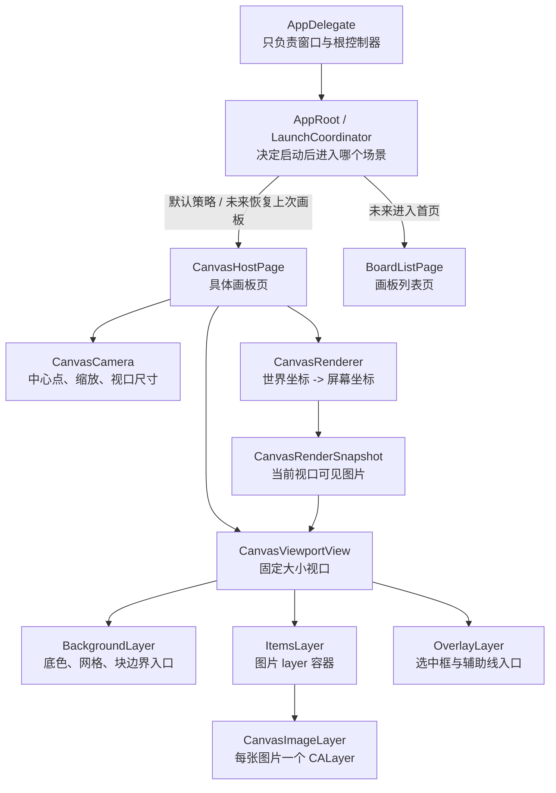

# 图片显示执行计划

## 目标

- 在不改变现有 `AppDelegate` 启动职责的前提下，引入 `AppRoot/LaunchCoordinator` 作为应用启动后的场景路由层。
- 将 `BoardListPage`（首页/画板列表）和 `CanvasHostPage`（具体画板页）设计为平行场景，而不是“必须先经过列表才能进入画板”的单一路径。
- 继续采用“固定视口 + `CanvasCamera` + 自定义平移/缩放 + `CALayer` 图片节点”的方案实现画板显示。
- 本轮只落地图板图片显示与基础交互链路，不实现存储、持久化、最近打开恢复、画板列表数据源；但要为这些能力预留明确入口。

## 当前基础

- 启动入口已经稳定：`[MyCanvas_Ver_0/Platform/iOS/iOSAppDelegate.swift](MyCanvas_Ver_0/Platform/iOS/iOSAppDelegate.swift)` 负责创建 `UIWindow` 并挂载根控制器；`[MyCanvas_Ver_0/Platform/macOS/macOSAppDelegate.swift](MyCanvas_Ver_0/Platform/macOS/macOSAppDelegate.swift)` 负责创建 `NSWindow` 并挂载根控制器。
- 当前页面仍是占位实现：`[MyCanvas_Ver_0/Platform/iOS/iOSViewController.swift](MyCanvas_Ver_0/Platform/iOS/iOSViewController.swift)` 和 `[MyCanvas_Ver_0/Platform/macOS/macOSViewController.swift](MyCanvas_Ver_0/Platform/macOS/macOSViewController.swift)` 目前只显示 `Hello world`。
- 现在还没有存储系统，也没有画板列表数据源，因此“启动后进入哪个场景”暂时只能由一个运行时策略或临时默认值决定。
- 工程体量很小，适合先在 `[MyCanvas_Ver_0](MyCanvas_Ver_0)` 目录树内增加 `AppRoot`、共享 Canvas 核心层和平台视口层，不必先拆 framework/module。

## 场景层级重构

### 核心确认

- `BoardListPage` 和 `CanvasHostPage` 是平行场景。
- 它们的共同上层应该是 `AppRoot/LaunchCoordinator`，而不是彼此互为上级。
- “从画板列表进入画板”只是未来可能的一条导航路径，不是画板页存在的前提条件。
- “如果上次退出时正处于打开画板状态，下次启动直接进入画板”也是应被支持的启动路径。
- 在当前没有存储功能的阶段，`BoardListPage` 可以只是空占位组件，而默认启动直接进入一个临时 `CanvasHostPage` 是合理的过渡策略。

## 总体结构

## 页面职责重新定义

### AppDelegate

- `[MyCanvas_Ver_0/Platform/iOS/iOSAppDelegate.swift](MyCanvas_Ver_0/Platform/iOS/iOSAppDelegate.swift)`
- `[MyCanvas_Ver_0/Platform/macOS/macOSAppDelegate.swift](MyCanvas_Ver_0/Platform/macOS/macOSAppDelegate.swift)`

职责保持不变：

- 只负责创建窗口、设置根控制器、让窗口可见。
- 不负责决定直接进画板还是进列表。
- 不负责图片显示、平移缩放、列表数据组织。

### AppRoot / LaunchCoordinator

这是本次新增的关键层，职责是：

- 在应用启动后决定当前应该进入哪个场景。
- 将“首页列表”和“画板详情页”从结构上解耦。
- 为未来“恢复上次打开的画板”预留统一入口。
- 在当前没有存储能力时，提供一个临时启动策略，例如默认进入 `CanvasHostPage`。

建议它承接的决策包括：

- 当前是否应该展示 `BoardListPage`。
- 当前是否应该展示 `CanvasHostPage`。
- 未来是否需要根据“上次退出状态”直接恢复到画板页。
- 当前阶段由于没有持久化，是否直接固定路由到一个临时画板会话。

### BoardListPage

- 这是未来的首页组件，但当前阶段可以是空占位。
- 不应阻塞 `CanvasHostPage` 的实现。
- 在没有画板存储能力时，它可以先是一个结构预留页，而不是本轮必须完整交付的功能页。
- 后续真正接入存储后，它负责展示已有画板、创建新画板、删除、进入具体画板等入口。

### CanvasHostPage

- 这是前面整套“固定视口 + `CanvasCamera` + `CanvasRenderer` + `CanvasViewportView` + `CanvasImageLayer`”方案真正落地的地方。
- 它不是首页，而是具体某个画板的运行时宿主页面。
- 它负责：
  - 持有 `CanvasScene`
  - 持有 `CanvasCamera`
  - 驱动 `CanvasRenderer`
  - 挂载 `CanvasViewportView`
  - 处理图片显示和平移/缩放输入
- 在当前阶段，即使没有真正 `boardID` 和存储系统，也可以承载一个临时内存态画板。

## 文件落点

### 保持职责不变的现有文件

- `[MyCanvas_Ver_0/Platform/iOS/iOSAppDelegate.swift](MyCanvas_Ver_0/Platform/iOS/iOSAppDelegate.swift)`：继续只负责 iOS 窗口创建与根控制器挂载。
- `[MyCanvas_Ver_0/Platform/macOS/macOSAppDelegate.swift](MyCanvas_Ver_0/Platform/macOS/macOSAppDelegate.swift)`：继续只负责 macOS 窗口创建与根控制器挂载。

### 建议新增的根路由文件

- `[MyCanvas_Ver_0/App/AppLaunchDestination.swift](MyCanvas_Ver_0/App/AppLaunchDestination.swift)`
  - 定义应用启动后的目标场景，例如 `.boardList`、`.canvas`。
  - 当前阶段可以先只有简单枚举，不绑定真实持久化状态。
- `[MyCanvas_Ver_0/App/AppLaunchCoordinator.swift](MyCanvas_Ver_0/App/AppLaunchCoordinator.swift)`
  - 封装“启动后进入哪个页面”的规则。
  - 当前阶段默认返回 `canvas`，但接口设计上要允许未来接入“恢复上次打开画板”的策略。
- `[MyCanvas_Ver_0/Platform/iOS/AppRoot/iOSAppRootViewController.swift](MyCanvas_Ver_0/Platform/iOS/AppRoot/iOSAppRootViewController.swift)`
  - iOS 根场景宿主，负责根据 `AppLaunchCoordinator` 的结果装配 `BoardListPage` 或 `CanvasHostPage`。
- `[MyCanvas_Ver_0/Platform/macOS/AppRoot/macOSAppRootViewController.swift](MyCanvas_Ver_0/Platform/macOS/AppRoot/macOSAppRootViewController.swift)`
  - macOS 根场景宿主，与 iOS 版本承担同构职责。

### 需要改造或重定位职责的现有文件

- `[MyCanvas_Ver_0/Platform/iOS/iOSViewController.swift](MyCanvas_Ver_0/Platform/iOS/iOSViewController.swift)`
  - 不再被当作“应用首页”理解，而是临时承接 `CanvasHostPage` 的角色，或在实施时进一步收口成画板宿主控制器。
  - 负责固定视口、输入、相机与渲染刷新。
- `[MyCanvas_Ver_0/Platform/macOS/macOSViewController.swift](MyCanvas_Ver_0/Platform/macOS/macOSViewController.swift)`
  - 同上，作为当前阶段的画板宿主控制器，而不是首页。
  - 负责 macOS 端平移缩放输入与视口刷新。

### 建议新增的共享 Canvas 文件

- `[MyCanvas_Ver_0/Canvas/Core/CanvasImageItem.swift](MyCanvas_Ver_0/Canvas/Core/CanvasImageItem.swift)`
  - 图片节点：`id`、图片引用、世界坐标中心点、尺寸、层级。
- `[MyCanvas_Ver_0/Canvas/Core/CanvasScene.swift](MyCanvas_Ver_0/Canvas/Core/CanvasScene.swift)`
  - 当前画板中的运行时图片集合。
  - 当前阶段只做内存态，不涉及落盘。
- `[MyCanvas_Ver_0/Canvas/Core/CanvasCamera.swift](MyCanvas_Ver_0/Canvas/Core/CanvasCamera.swift)`
  - 相机中心点、缩放比例、视口尺寸。
  - 提供世界坐标与屏幕坐标转换方法。
- `[MyCanvas_Ver_0/Canvas/Core/CanvasRenderer.swift](MyCanvas_Ver_0/Canvas/Core/CanvasRenderer.swift)`
  - 负责将 `CanvasScene + CanvasCamera` 转换为 `CanvasRenderSnapshot`。
- `[MyCanvas_Ver_0/Canvas/Core/CanvasRenderSnapshot.swift](MyCanvas_Ver_0/Canvas/Core/CanvasRenderSnapshot.swift)`
  - 平台无关渲染结果，包含 `viewportBounds`、`visibleWorldRect`、`items`。

### 建议新增的平台渲染文件

- `[MyCanvas_Ver_0/Platform/Shared/Rendering/CanvasImageLayer.swift](MyCanvas_Ver_0/Platform/Shared/Rendering/CanvasImageLayer.swift)`
  - 单张图片一个 `CALayer`。
  - 负责 `contents`、`frame`、`zPosition`、选中态占位。
- `[MyCanvas_Ver_0/Platform/iOS/Canvas/iOSCanvasViewportView.swift](MyCanvas_Ver_0/Platform/iOS/Canvas/iOSCanvasViewportView.swift)`
  - 固定大小的 iOS 画布视口容器。
  - 管理背景层、图片层、覆盖层和图片 layer diff。
- `[MyCanvas_Ver_0/Platform/macOS/Canvas/macOSCanvasViewportView.swift](MyCanvas_Ver_0/Platform/macOS/Canvas/macOSCanvasViewportView.swift)`
  - 固定大小的 macOS 画布视口容器。
  - 与 iOS 职责对齐，并统一坐标约定。

### 可选占位文件

- `[MyCanvas_Ver_0/Platform/iOS/BoardList/iOSBoardListViewController.swift](MyCanvas_Ver_0/Platform/iOS/BoardList/iOSBoardListViewController.swift)`
  - 当前阶段可只做空白占位或简单提示页。
  - 目的是让路由结构真实存在，而不是等功能实现时再大改根控制器关系。
- `[MyCanvas_Ver_0/Platform/macOS/BoardList/macOSBoardListViewController.swift](MyCanvas_Ver_0/Platform/macOS/BoardList/macOSBoardListViewController.swift)`
  - 当前阶段同样可以是极简占位。

## 分阶段实施

### 第一阶段：建立根路由层，明确场景平行关系

- 引入 `AppLaunchDestination` 和 `AppLaunchCoordinator`。
- 在 iOS/macOS 两端增加 `AppRoot` 宿主，把 `BoardListPage` 和 `CanvasHostPage` 变成真实存在的平行场景。
- 修改根控制器挂载路径：`AppDelegate -> AppRoot`，而不是 `AppDelegate -> 直接某个 ViewController`。
- 当前阶段因为没有存储和列表数据，`AppLaunchCoordinator` 可以默认直接选择 `CanvasHostPage`。
- 这一阶段的目的不是立刻做出列表功能，而是先把应用启动后的结构层级搭正，避免后面再拆根控制器。

### 第二阶段：把当前页面明确重定位为 CanvasHostPage

- 将现有 `[MyCanvas_Ver_0/Platform/iOS/iOSViewController.swift](MyCanvas_Ver_0/Platform/iOS/iOSViewController.swift)` 和 `[MyCanvas_Ver_0/Platform/macOS/macOSViewController.swift](MyCanvas_Ver_0/Platform/macOS/macOSViewController.swift)` 从“主页面/首页”语义中剥离出来，明确为画板宿主页。
- 如果当前阶段不新增专门命名的 `CanvasHostViewController`，也至少要在职责上将这两个控制器只用于画板场景。
- 清理原有 `Hello world` 占位布局，为固定视口结构让路。

### 第三阶段：建立共享 Canvas 核心模型

- 新增 `CanvasScene`、`CanvasImageItem`、`CanvasCamera`、`CanvasRenderer`、`CanvasRenderSnapshot`。
- 用这些共享类型收口“图片显示状态”和“坐标变换”，避免平台控制器各自维护散乱状态。
- 在这个阶段明确：
  - 图片节点坐标统一为世界坐标。
  - 缩放和平移统一通过 `CanvasCamera` 建模。
  - 渲染输出统一通过 `CanvasRenderSnapshot` 传递给平台视图。

### 第四阶段：实现固定视口和 layer 树

- 新增 `iOSCanvasViewportView`、`macOSCanvasViewportView`、`CanvasImageLayer`。
- 固定视口内部维护三层 layer：`backgroundLayer`、`itemsLayer`、`overlayLayer`。
- 由视口视图根据 `CanvasRenderSnapshot` 增删改图片 layer，不重建整页视图层次。
- 第一版背景至少提供底色，网格和块边界先留渲染入口即可。

### 第五阶段：接入自定义平移与缩放输入

- `iOS`：通过 `UIPanGestureRecognizer` 与 `UIPinchGestureRecognizer` 驱动 `CanvasCamera`。
- `macOS`：通过鼠标拖动、滚轮、触控板放大手势驱动 `CanvasCamera`。
- 缩放以手势锚点/鼠标焦点为中心，避免缩放过程内容跳动。
- 平移量按当前缩放比例转换到世界坐标，不直接使用屏幕像素作为世界位移。

### 第六阶段：接入测试图片，打通画板页显示链路

- `UI 入口`：在 `[MyCanvas_Ver_0/Platform/iOS/iOSViewController.swift](MyCanvas_Ver_0/Platform/iOS/iOSViewController.swift)` 和 `[MyCanvas_Ver_0/Platform/macOS/macOSViewController.swift](MyCanvas_Ver_0/Platform/macOS/macOSViewController.swift)` 中新增一个屏幕空间固定的悬浮 `+` 按钮，按钮挂在控制器视图层级中，而不是挂到 `CanvasViewportView` 的 layer 树里，确保它不会跟随画布平移或缩放。
- `iOS 选图`：iOS 侧通过 `PhotosUI` 的 `PHPickerViewController` 打开系统相册选择图片。第一版优先支持单张选择，避免在阶段六把多选、批量布局和权限管理一起引入。基于当前工程，优先选用 `PHPickerViewController` 而不是旧的 `UIImagePickerController`。
- `macOS 选图`：macOS 侧通过 `NSOpenPanel` 以 sheet 形式打开 Finder 选图，限制 `allowedContentTypes = [.image]`。当前 target 已开启 `ENABLE_USER_SELECTED_FILES = readonly`，这条路径与现有沙盒配置相匹配。
- `解码策略`：两端选择完成后，都在各自控制器中先把平台图片对象解码成 `CGImage`。iOS 侧从 `PHPickerResult` 异步加载 `UIImage` 再转 `CGImage`；macOS 侧从选中的文件 URL 解码 `NSImage` 或直接使用 `CGImageSource` 得到 `CGImage`。第一版可以先把这些解码 helper 放在各自控制器私有方法中，不急着抽独立文件。
- `数据注入`：解码成功后，在 `CanvasHostPage` 中构造 `CanvasImageItem` 并写入 `CanvasScene`。当前共享模型 `[MyCanvas_Ver_0/Canvas/Core/CanvasImageItem.swift](MyCanvas_Ver_0/Canvas/Core/CanvasImageItem.swift)` 和 `[MyCanvas_Ver_0/Canvas/Core/CanvasScene.swift](MyCanvas_Ver_0/Canvas/Core/CanvasScene.swift)` 已经支持 `CGImage + 世界坐标 + 尺寸 + 层级` 这一最小注入模型。
- `初始落点`：第一版把新导入图片默认放在 `camera.center`，保证用户选完图后能立即在当前视口中心看到它，而不是还要再去寻找图片。若同一轮导入多张图片，后续可在 `camera.center` 周围做轻微偏移，避免完全重叠；但第一版可以先只做单张导入。
- `显示尺寸归一化`：不要直接把原始像素尺寸当作世界坐标尺寸写进 `CanvasImageItem.size`。阶段六应增加一个初始显示尺寸策略，例如将图片最长边压到一个固定显示范围内并保持宽高比，避免超大图片第一次导入就占满整个画布。
- `刷新链路`：控制器在 `scene.append(item)` 或 `scene.upsert(item)` 后，立即调用现有的 `refreshCanvas()`，让链路保持为 `CanvasHostPage -> CanvasScene / CanvasCamera -> CanvasRenderer -> CanvasViewportView -> CanvasImageLayer`。不在 `CanvasViewportView` 里直接写导入逻辑，继续保持“平台选图在控制器、渲染在共享层和视口层”的边界。
- `阶段六的最小交付`：用户进入画板页后能看到悬浮 `+` 按钮；iOS 点击后能从相册选图，macOS 点击后能从 Finder 选图；选完后图片以正确比例出现在当前视口中心；此后仍可继续平移和缩放查看该图片。
- `阶段六仍不做的事`：不做存储和持久化、不做画板列表联动、不做图片资源去重、不做多选或批量导入布局优化；阶段六的目标只是把“平台选图 -> 共享场景 -> 渲染显示”这条最小闭环跑通。

### 第七阶段：为未来列表与恢复策略预留扩展点

- 虽然当前没有存储功能，但 `AppLaunchCoordinator` 的接口要允许未来接入“上次退出是否处于打开画板状态”的判断。
- `BoardListPage` 保持占位即可，但其存在意义是让未来“默认进列表”或“从列表进入具体画板”的路径可以无痛接入。
- 当前阶段不实现 `boardID` 持久化，但要让 `CanvasHostPage` 接受未来可以被注入启动上下文的结构位置。
- 这一步的目标是保证当前图片显示实现不会把未来场景路由结构锁死。

## 当前默认策略

在没有存储和恢复能力的阶段，推荐默认策略写入计划中：

- 启动后由 `AppLaunchCoordinator` 决定进入 `CanvasHostPage`。
- `BoardListPage` 先作为空待实现组件存在，但不阻塞图片显示功能开发。
- 等未来有存储能力后，再把“恢复上次打开画板”与“默认进列表”的真实规则接入 `AppLaunchCoordinator`。

## 本轮明确不做的内容

- 不做图片存储、持久化、最近打开状态恢复的真实逻辑。
- 不做真实的画板列表数据模型和列表展示。
- 不做导入流程、文件管理、资源去重。
- 不做撤销重做、框选、多选、拖拽编辑。
- 不做真正的无边界扩张策略落地。
- 不做性能极限优化，如虚拟化分块、分辨率分级、磁盘缓存系统。

## 关键实现约束

- `AppDelegate` 不能承担场景路由职责，路由决策收口到 `AppRoot/LaunchCoordinator`。
- `BoardListPage` 和 `CanvasHostPage` 必须被视为平行场景，而不是前后依赖场景。
- 当前没有存储时，允许默认直接进入画板页，但不能因此省掉根路由结构。
- 主页面中的图片显示仍然不能依赖 `UIScrollView` / `NSScrollView` 作为平移缩放基础。
- 图片节点统一使用 `CALayer`，不使用 `UIImageView` / `NSImageView` 作为长期架构。
- 平移和缩放统一通过 `CanvasCamera` 建模，不允许在各平台控制器里写各自一套偏移量算法。
- 共享层尽量只依赖 `Foundation`、`CoreGraphics`、`QuartzCore`。
- `macOS` 端显式处理坐标系翻转与像素缩放，保持与 iOS 行为一致。

## 验证方式

- 结构验证：根控制器链路变为 `AppDelegate -> AppRoot -> 某个目标场景`，而不再是直接挂具体画板页。
- 启动验证：在当前阶段，即使 `BoardListPage` 还未实现，应用也能通过 `AppLaunchCoordinator` 默认进入 `CanvasHostPage`。
- 页面验证：`CanvasHostPage` 能显示测试图片，并完成基础平移与缩放。
- 架构验证：画板显示逻辑不依赖列表组件存在；未来列表接入后也不需要重构画板内部渲染层。
- 平台验证：iOS/macOS 两端都遵守同样的场景层级和 Canvas 渲染结构。

## 风险与应对

- 风险：当前没有存储功能，`AppLaunchCoordinator` 看起来会像“多包一层”。
  - 应对：即便当前默认只返回 `canvas`，也应提前建立这层，因为它解决的是未来场景演进问题，而不是当前数据问题。
- 风险：如果仍把当前 `iOSViewController` / `macOSViewController` 当首页理解，后续接入列表会再次打碎控制器职责。
  - 应对：在计划和实施中明确它们当前承担的是 `CanvasHostPage` 角色。
- 风险：列表还未实现时，团队容易误以为路由结构可以省略。
  - 应对：把“列表是占位组件，但场景层级必须真实存在”写进实施阶段和验证标准。
- 风险：没有 `ScrollView` 后，平移/缩放公式若分散在多个层，容易产生漂移与手感不一致。
  - 应对：所有变换集中到 `CanvasCamera`，平台输入只转成统一的 `pan` / `zoom` 命令。
- 风险：如果平台视图直接自己计算 frame，未来接入恢复、扩张、可见性裁剪会越来越难维护。
  - 应对：坚持由 `CanvasRenderer` 输出统一 `CanvasRenderSnapshot`，平台视图只消费结果。

