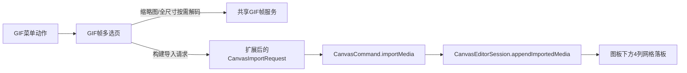

# GIF 多选帧导入分阶段计划

## 总体策略

- 保留 `CanvasCommand.importMedia(CanvasImportRequest)` 作为唯一的落板执行入口，避免再开一条 GIF 专用写入通道。
- 不把“画板内 GIF 派生静态图”塞进 `CanvasTransferRequest`；它仍只负责拖拽、剪贴板、系统相册这类外部输入。
- 方案 2 的核心不是“给 GIF 写特例”，而是把导入系统补齐两个缺口：
  - 支持网格布局，而不是只有 `stacked/staggered`
  - 支持导入时附带 `CanvasImageItem` 级别的几何模板，而不是一律走 `normalizedDisplaySize(for:)`
- GIF 导出的静态帧统一按以下规则落板：
  - `assetKind = .staticImage`
  - 继承源 GIF 的 `size`
  - 继承源 GIF 的 `cropRectNormalized`
  - `rotationRadians = 0`
  - 以源 GIF 的 `worldBounds` 下缘作为参考，在图板中按可配置列数做网格排布

## 架构走向

## 阶段 0：锁定通用约束与配置源

- 在共享层引入一个单一配置源，建议新建 `[MyCanvas_Ver_0/Canvas/GIF/CanvasGIFFrameImportConfiguration.swift](MyCanvas_Ver_0/Canvas/GIF/CanvasGIFFrameImportConfiguration.swift)`，集中定义：
  - 选择页列数默认值 `4`
  - 图板排布列数默认值 `4`
  - 缩略图最大像素尺寸
  - 网格横纵间距
  - 上下左右边距
- 第一版保持“选择页列数”和“图板排布列数”可共享同一个默认值，避免两个地方各自硬编码 `4`。
- 明确兼容策略：旧的外部导入、视频封面、普通图片导入逻辑不应改语义；新能力只通过新菜单入口触发。

## 阶段 1：抽出共享 GIF 帧能力，先解决根因上的重复逻辑

- 新增共享服务，建议放在 `[MyCanvas_Ver_0/Canvas/GIF/CanvasGIFFrameService.swift](MyCanvas_Ver_0/Canvas/GIF/CanvasGIFFrameService.swift)`，负责：
  - 从 GIF `Data` / `CGImageSource` 读取帧数与延时元数据
  - 按 `frameIndex` 解码缩略图
  - 按 `frameIndex` 解码全尺寸 `CGImage`
- 复用并对齐现有两处 `ImageIO` 逻辑，避免再复制一套 GIF 帧解析：
  - `[MyCanvas_Ver_0/Canvas/Import/CanvasImportTypes.swift](MyCanvas_Ver_0/Canvas/Import/CanvasImportTypes.swift)` 里的 GIF 元数据读取
  - `[MyCanvas_Ver_0/Platform/Shared/Rendering/CanvasAnimatedImagePlayback.swift](MyCanvas_Ver_0/Platform/Shared/Rendering/CanvasAnimatedImagePlayback.swift)` 里的逐帧解码
- 缩略图与全尺寸分层：
  - 选择页只允许按需解码缩略图，避免一次性拉满所有全尺寸帧
  - 点击“导入”后，只对选中帧解码全尺寸图
- 作为收尾清理，把播放侧的 GIF 元数据/帧解码尽量迁移到这个共享服务上，减少后续双份逻辑漂移。

## 阶段 2：扩展通用导入模型，而不是给 GIF 写临时特例

- 在 `[MyCanvas_Ver_0/Canvas/Import/CanvasImportTypes.swift](MyCanvas_Ver_0/Canvas/Import/CanvasImportTypes.swift)` 中扩展 `CanvasImportLayout`：
  - 保留现有 `automatic` / `stacked` / `staggered`
  - 新增通用网格布局，建议形态为 `grid(columns: Int, horizontalSpacing: CGFloat, verticalSpacing: CGFloat)`
- 同文件新增一个导入几何模板，建议命名为 `CanvasImportPresentationTemplate`，用于在导入时携带：
  - `size`
  - `cropRectNormalized`
  - `rotationPolicy` 或最终 `rotationRadians`
- 扩展 `CanvasImportRequest`：
  - 保留现有 `items / placement / layout / sourceDescription`
  - 增加可选的 `presentationTemplate`
- 这里建议不要把“源 item ID”塞进 request 做执行时查询，而是把 request 做成自包含：
  - 在构建 request 时，就把源 GIF 当前的 `worldBounds`、`size`、`cropRectNormalized` 折算成 placement 和 template
  - 这样 `CanvasCommand.importMedia` 仍然只消费请求本身，不依赖执行时再次查 scene
- `[MyCanvas_Ver_0/Canvas/Transfer/CanvasTransferTypes.swift](MyCanvas_Ver_0/Canvas/Transfer/CanvasTransferTypes.swift)` 与两端 import adapter 在这一阶段不扩语义，只保持兼容现有外部导入。

## 阶段 3：让 `appendImportedMedia` 真正支持“网格 + 继承几何模板”

- 在 `[MyCanvas_Ver_0/Canvas/Editing/CanvasEditorSession.swift](MyCanvas_Ver_0/Canvas/Editing/CanvasEditorSession.swift)` 中改造：
  - `resolvedImportLayout(...)`
  - `importOffset(...)`
  - `appendImportedMedia(...)`
- 具体落地规则：
  - `placement` 继续使用已有的 `.worldPoint(...)`，由 GIF 导入流程预先算出“源 GIF 下方网格起点”
  - `layout.grid(...)` 负责二维偏移，不再滥用 `staggered`
  - 对有 `presentationTemplate` 的请求：
    - 图片 item 的 `size` 直接用模板值，不再调用 `normalizedDisplaySize(for:)`
    - `cropRectNormalized` 直接继承模板值
    - `rotationRadians` 强制按模板规则写 `0`
  - 对没有模板的请求：完全保持今天的旧行为，避免影响普通导入
- 网格锚点必须基于源 GIF 的 `worldBounds`，不是 `worldFrame`，这样源 GIF 即使已旋转，下面的静态帧也不会视觉上贴错位置。
- `CanvasCommandExecutor` 和 `[MyCanvas_Ver_0/Canvas/Editing/CanvasCommand.swift](MyCanvas_Ver_0/Canvas/Editing/CanvasCommand.swift)` 预期只做很小改动，尽量保持 `importMedia` 命令不变。

## 阶段 4：增加 GIF 派生导入请求构建器

- 在共享层新增一条专门的“从已选 GIF 构造 `CanvasImportRequest`”能力，建议落在 `[MyCanvas_Ver_0/Canvas/Editing/CanvasEditorSession.swift](MyCanvas_Ver_0/Canvas/Editing/CanvasEditorSession.swift)` 或新的 `[MyCanvas_Ver_0/Canvas/GIF/CanvasGIFFrameImportBuilder.swift](MyCanvas_Ver_0/Canvas/GIF/CanvasGIFFrameImportBuilder.swift)`。
- 这条能力负责：
  - 读取源 GIF 数据（优先 transient payload，其次持久化 asset data）
  - 根据选中的 `frameIndex` 列表生成静态 `CanvasResolvedImportImage`
  - 计算导入起点：源 GIF 的 `worldBounds.maxY` 下方 + 配置间距
  - 构造 `CanvasImportRequest`：
    - `placement = .worldPoint(gridOrigin)`
    - `layout = .grid(columns: config.boardColumns, ...)`
    - `presentationTemplate.size = sourceItem.size`
    - `presentationTemplate.cropRectNormalized = sourceItem.cropRectNormalized`
    - `presentationTemplate.rotationRadians = 0`
- 这里要显式保证派生后的每一帧是静态图片，而不是 `animatedGIF`，否则会误入 GIF 播放链路。

## 阶段 5：共享菜单与平台入口接线

- 在 `[MyCanvas_Ver_0/Platform/Shared/ContextMenu/CanvasContextMenuState.swift](MyCanvas_Ver_0/Platform/Shared/ContextMenu/CanvasContextMenuState.swift)` 中新增 GIF 专用 `CanvasContextMenuUIActionID`。
- 在 `[MyCanvas_Ver_0/Platform/Shared/ContextMenu/CanvasContextMenuCommandResolver.swift](MyCanvas_Ver_0/Platform/Shared/ContextMenu/CanvasContextMenuCommandResolver.swift)` 中：
  - 增加 `targetGIFItemID(...)`
  - 仅当命中 item 为 `assetKind == .animatedGIF` 时显示该菜单项
  - 让该动作在 `selectedItemBody` / `unselectedItemBody` 路径都能出现，行为与视频封面入口保持一致
- 在 `[MyCanvas_Ver_0/Platform/iOS/iOSViewController.swift](MyCanvas_Ver_0/Platform/iOS/iOSViewController.swift)` 与 `[MyCanvas_Ver_0/Platform/macOS/macOSViewController.swift](MyCanvas_Ver_0/Platform/macOS/macOSViewController.swift)` 中新增：
  - `presentGIFFrameImportEditor(for:)`
  - `performContextMenuUIAction` 的 GIF 分支
  - 导入完成后执行 `.importMedia(request)`，复用现有 refresh / autosave 路径

## 阶段 6：iOS GIF 多选帧页面

- 新增 `[MyCanvas_Ver_0/Platform/iOS/iOSGIFFrameImportViewController.swift](MyCanvas_Ver_0/Platform/iOS/iOSGIFFrameImportViewController.swift)`，呈现方式与现有视频页一致，使用全屏底部上拉过渡。
- 页面结构：
  - 左上角“取消”
  - 右上角“导入”
  - 中间为 `UICollectionViewFlowLayout` 的固定列网格
- 参考 `[MyCanvas_Ver_0/Platform/iOS/BoardList/iOSBoardListViewController.swift](MyCanvas_Ver_0/Platform/iOS/BoardList/iOSBoardListViewController.swift)` 的 FlowLayout 宽度计算，但列数由配置固定为 4；参考 `[MyCanvas_Ver_0/Platform/iOS/BoardList/iOSBoardCollectionViewCell.swift](MyCanvas_Ver_0/Platform/iOS/BoardList/iOSBoardCollectionViewCell.swift)` 处理 cell 生命周期与取消异步任务。
- 页面内需要补的状态：
  - `selectedFrameIndices: Set<Int>`
  - 缩略图加载状态 / 失败状态
  - 导入中状态
- 行为要求：
  - 允许多选
  - 未选中时“导入”不可点击
  - 导入时禁用交互并展示进度态

## 阶段 7：macOS GIF 多选帧页面

- 新增 `[MyCanvas_Ver_0/Platform/macOS/macOSGIFFrameImportViewController.swift](MyCanvas_Ver_0/Platform/macOS/macOSGIFFrameImportViewController.swift)`，呈现方式与现有视频页一致，使用 sheet。
- 页面结构同 iOS，但用 `NSCollectionViewFlowLayout` + `NSCollectionView` 实现 4 列多选网格。
- 参考 `[MyCanvas_Ver_0/Platform/macOS/BoardList/macOSBoardListViewController.swift](MyCanvas_Ver_0/Platform/macOS/BoardList/macOSBoardListViewController.swift)` 与 `[MyCanvas_Ver_0/Platform/macOS/BoardList/macOSBoardCollectionItem.swift](MyCanvas_Ver_0/Platform/macOS/BoardList/macOSBoardCollectionItem.swift)` 的布局与 item 组织方式。
- 与 iOS 共享同一套 GIF 帧服务、同一套 request builder，平台层只负责 UI 与交互。

## 阶段 8：测试、回归与性能保护

- 在 `[MyCanvas_Ver_0Tests](MyCanvas_Ver_0Tests)` 增加以下测试组：
  - `CanvasGIFFrameServiceTests`：验证帧数、缩略图解码、全尺寸解码、异常数据处理
  - `CanvasImportLayoutGridTests`：验证 `grid(columns:...)` 的 offset 计算
  - `CanvasDerivedImportPresentationTests`：验证 `presentationTemplate` 会继承 `size` 与 `cropRectNormalized`，并把 `rotationRadians` 置 0
  - `CanvasGIFDerivedImportRequestTests`：验证从 GIF 派生的导入 request 最终产物是静态图片而非 `animatedGIF`
- 手动回归清单：
  - 普通图片导入尺寸行为不变
  - 视频“Set Display Frame”不受影响
  - 已旋转 GIF 的导出静态帧仍从可视下边缘开始排布
  - 已裁剪 GIF 的导出静态帧与原可视区域一致
  - 选帧很多时页面不因全尺寸预解码而卡顿或暴涨内存

## 分阶段交付建议

- 第 1 批：完成阶段 0-3，只把通用导入模型与 session 能力补齐，但先不开放 UI 入口
- 第 2 批：完成阶段 4-6，先落 iOS 端 GIF 多选导入
- 第 3 批：完成阶段 7，补齐 macOS
- 第 4 批：完成阶段 8，并做 GIF 解码逻辑收敛清理

