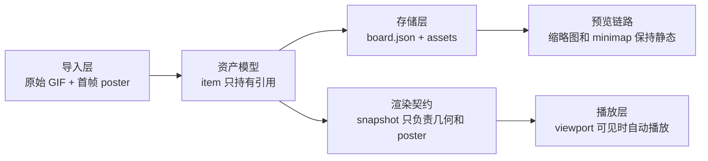

# GIF 方案 B 分阶段计划

## 目标

- 在不破坏现有画布交互的前提下，为 GIF 增加与静态图片一致的导入、移动、缩放、裁切、旋转、层级、复制、删除、保存、重开能力，并在主画布自动播放。
- 保持 `[CanvasRenderer.swift](/Users/shaun/Library/Mobile Documents/com~apple~CloudDocs/Develop/MyCanvas_Ver_0/MyCanvas_Ver_0/Canvas/Core/CanvasRenderer.swift)` 的几何职责稳定；GIF 播放不驱动整张画布重建 snapshot。
- `Board List`、持久化缩略图、minimap 第一阶段统一使用静态首帧，先保证正确性和成本可控。

## 关键设计约束

- `[CanvasImageItem.swift](/Users/shaun/Library/Mobile Documents/com~apple~CloudDocs/Develop/MyCanvas_Ver_0/MyCanvas_Ver_0/Canvas/Core/CanvasImageItem.swift)` 从“持有 `CGImage`”改为“持有图片资产引用 + poster 元数据”；像素数据与时间轴从 item 剥离。
- `undo/redo` 只记录文档状态，不记录 GIF 当前播放进度；仍通过资源引用变化来反映真正的内容变更。
- `[BoardDocument.swift](/Users/shaun/Library/Mobile Documents/com~apple~CloudDocs/Develop/MyCanvas_Ver_0/MyCanvas_Ver_0/Canvas/Storage/BoardDocument.swift)` 升级为 `formatVersion = 4`，新增 GIF 资产元数据并兼容旧版 `v2/v3` 静态图片文档。
- 主画布仅对可见 GIF 播放；离屏、被移除、切后台时暂停并释放解码压力。

## 架构草图

## 阶段 0 语义定稿与防返工约束

- 明确 GIF 第一阶段语义：主画布自动播放；`Board List`、持久化缩略图、minimap、占位预览全部显示首帧。
- 明确编辑语义：移动、缩放、裁切、旋转、层级、复制、删除都作用在几何层；裁切仍是非破坏式 normalized crop。
- 明确复制语义：复制后的多个 item 共享同一底层资产引用，不为每个副本重复写一份 GIF 文件。
- 明确历史语义：`[BoardHistorySnapshot.swift](/Users/shaun/Library/Mobile Documents/com~apple~CloudDocs/Develop/MyCanvas_Ver_0/MyCanvas_Ver_0/Canvas/Editing/BoardHistorySnapshot.swift)` 不记录播放进度，只记录资源引用、几何和选择状态。
- 重点文件：`[CanvasImageItem.swift](/Users/shaun/Library/Mobile Documents/com~apple~CloudDocs/Develop/MyCanvas_Ver_0/MyCanvas_Ver_0/Canvas/Core/CanvasImageItem.swift)`、`[BoardHistorySnapshot.swift](/Users/shaun/Library/Mobile Documents/com~apple~CloudDocs/Develop/MyCanvas_Ver_0/MyCanvas_Ver_0/Canvas/Editing/BoardHistorySnapshot.swift)`、`[CanvasEditorSession.swift](/Users/shaun/Library/Mobile Documents/com~apple~CloudDocs/Develop/MyCanvas_Ver_0/MyCanvas_Ver_0/Canvas/Editing/CanvasEditorSession.swift)`、`[BoardDocument.swift](/Users/shaun/Library/Mobile Documents/com~apple~CloudDocs/Develop/MyCanvas_Ver_0/MyCanvas_Ver_0/Canvas/Storage/BoardDocument.swift)`。

## 阶段 1 资产域模型拆分

- 新增共享资产抽象，例如 `CanvasImageAssetKind`、`CanvasImageAssetReference`、`CanvasImportedImageAsset`、`CanvasImagePoster`。
- 重构 `[CanvasImageItem.swift](/Users/shaun/Library/Mobile Documents/com~apple~CloudDocs/Develop/MyCanvas_Ver_0/MyCanvas_Ver_0/Canvas/Core/CanvasImageItem.swift)`：移除 `let cgImage: CGImage`，改为 `assetReference`、`posterFrame`、`logicalPixelSize` 或等价字段，保留 `center`、`size`、`cropRectNormalized`、`rotationRadians`。
- 更新 `[CanvasImagePresentation.swift](/Users/shaun/Library/Mobile Documents/com~apple~CloudDocs/Develop/MyCanvas_Ver_0/MyCanvas_Ver_0/Canvas/Core/CanvasImagePresentation.swift)` 与 `[CanvasImagePresentationResolver.swift](/Users/shaun/Library/Mobile Documents/com~apple~CloudDocs/Develop/MyCanvas_Ver_0/MyCanvas_Ver_0/Canvas/Core/CanvasImagePresentationResolver.swift)`：几何解析继续输出 visible/full-image quad，但像素来源改为 poster/asset 元数据，不再要求运行时 item 自带完整位图。
- 更新 `[CanvasBoardItem.swift](/Users/shaun/Library/Mobile Documents/com~apple~CloudDocs/Develop/MyCanvas_Ver_0/MyCanvas_Ver_0/Canvas/Core/CanvasBoardItem.swift)`、`[CanvasScene.swift](/Users/shaun/Library/Mobile Documents/com~apple~CloudDocs/Develop/MyCanvas_Ver_0/MyCanvas_Ver_0/Canvas/Core/CanvasScene.swift)` 中所有图片路径的类型引用，确保几何 API 不受 GIF 多帧影响。
- 完成标志：工程在“静态图不丢功能”的前提下，运行时模型已经不再依赖单个 `CGImage`。

## 阶段 2 导入链路升级

- 扩展 `[CanvasImportTypes.swift](/Users/shaun/Library/Mobile Documents/com~apple~CloudDocs/Develop/MyCanvas_Ver_0/MyCanvas_Ver_0/Canvas/Import/CanvasImportTypes.swift)`、`[CanvasTransferTypes.swift](/Users/shaun/Library/Mobile Documents/com~apple~CloudDocs/Develop/MyCanvas_Ver_0/MyCanvas_Ver_0/Canvas/Transfer/CanvasTransferTypes.swift)`、`[CanvasTransferCommandLowerer.swift](/Users/shaun/Library/Mobile Documents/com~apple~CloudDocs/Develop/MyCanvas_Ver_0/MyCanvas_Ver_0/Canvas/Transfer/CanvasTransferCommandLowerer.swift)`，让导入请求同时携带原始资源来源 `Data` 或 `URL`、类型信息 `UTType`、首帧 `CGImage`、逻辑像素尺寸与 GIF 帧延迟元数据入口。
- 改造 `[iOSCanvasImportAdapter.swift](/Users/shaun/Library/Mobile Documents/com~apple~CloudDocs/Develop/MyCanvas_Ver_0/MyCanvas_Ver_0/Platform/iOS/iOSCanvasImportAdapter.swift)` 与 `[macOSCanvasImportAdapter.swift](/Users/shaun/Library/Mobile Documents/com~apple~CloudDocs/Develop/MyCanvas_Ver_0/MyCanvas_Ver_0/Platform/macOS/macOSCanvasImportAdapter.swift)`：GIF 导入时保留原始资源，不再只解第 `0` 帧后丢失源文件；静态图仍走当前路径，但统一输出到新的资产导入结构。
- 更新 `[CanvasEditorSession.swift](/Users/shaun/Library/Mobile Documents/com~apple~CloudDocs/Develop/MyCanvas_Ver_0/MyCanvas_Ver_0/Canvas/Editing/CanvasEditorSession.swift)` 的 `appendImportedImages`，改为“创建图片 item + 注册待持久化资产”，而不是直接把 `cgImage` 塞进 item。
- 完成标志：从 open panel、photo picker、paste、drag/drop 进入的 GIF 都能在运行时保留原始资产。

## 阶段 3 文档格式与存储迁移

- 将 `[BoardDocument.swift](/Users/shaun/Library/Mobile Documents/com~apple~CloudDocs/Develop/MyCanvas_Ver_0/MyCanvas_Ver_0/Canvas/Storage/BoardDocument.swift)` 的 `formatVersion` 升为 `4`，为 `BoardImageItemRecord` 增加 `assetFilename`、`assetKind` 或等价媒体类型字段、可选 `posterFilename` 或 `posterFrameIndex`、必要时的 `pixelSize` 或 `durationMetadataVersion`。
- 重构 `[BoardDocumentMapper.swift](/Users/shaun/Library/Mobile Documents/com~apple~CloudDocs/Develop/MyCanvas_Ver_0/MyCanvas_Ver_0/Canvas/Storage/BoardDocumentMapper.swift)`：不再把图片资产名写死为 `"\(item.id).png"`，item 记录与“资产记录/资产引用”解耦。
- 重构 `[BoardStore.swift](/Users/shaun/Library/Mobile Documents/com~apple~CloudDocs/Develop/MyCanvas_Ver_0/MyCanvas_Ver_0/Canvas/Storage/BoardStore.swift)`：GIF 保存为原始 `.gif` 文件；静态图可继续存 `.png` 以降低变更面；加载时根据 `assetKind` 选择 GIF 或静态图解码策略；`removeOrphanedAssets` 以“被引用的唯一资产文件集合”为准，兼容多个 item 共享同一资源。
- 兼容策略：读取旧版 `v2/v3` 时继续支持现有 `.png` 资产；读取旧板子后，下一次保存再按 `v4` 写回。
- 完成标志：保存后重开，GIF 资产不被降格成 PNG，旧静态图文档仍可正常打开。

## 阶段 4 渲染契约收口

- 调整 `[CanvasRenderSnapshot.swift](/Users/shaun/Library/Mobile Documents/com~apple~CloudDocs/Develop/MyCanvas_Ver_0/MyCanvas_Ver_0/Canvas/Core/CanvasRenderSnapshot.swift)` 与 `[CanvasRenderer.swift](/Users/shaun/Library/Mobile Documents/com~apple~CloudDocs/Develop/MyCanvas_Ver_0/MyCanvas_Ver_0/Canvas/Core/CanvasRenderer.swift)`：`CanvasImageRenderPayload` 改为表达“展示契约”而不是“单帧像素”，例如 `assetReference + posterFrame + contentsRect`；明确 snapshot 只负责几何、裁切、旋转、zIndex 和静态 poster，不负责 GIF 时间推进。
- 调整 `[CanvasImageLayer.swift](/Users/shaun/Library/Mobile Documents/com~apple~CloudDocs/Develop/MyCanvas_Ver_0/MyCanvas_Ver_0/Platform/Shared/Rendering/CanvasImageLayer.swift)`：从“只能接收 `CGImage`”改成“既能显示 poster，也能被播放器接管帧更新”，同时保留现有 `contentsRect`、position、rotation、zPosition 更新逻辑。
- 调整 `[iOSCanvasViewportView.swift](/Users/shaun/Library/Mobile Documents/com~apple~CloudDocs/Develop/MyCanvas_Ver_0/MyCanvas_Ver_0/Platform/iOS/Canvas/iOSCanvasViewportView.swift)` 与 `[macOSCanvasViewportView.swift](/Users/shaun/Library/Mobile Documents/com~apple~CloudDocs/Develop/MyCanvas_Ver_0/MyCanvas_Ver_0/Platform/macOS/Canvas/macOSCanvasViewportView.swift)`：在 `refreshItemLayers()` 中为图片 layer 建立“静态显示”和“动画播放”两种路径，继续沿用当前 item diff 和 layer 复用逻辑，不让 GIF tick 触发整张 snapshot 重建。
- 完成标志：即使还没接播放器，静态 poster 路径已经能完整跑通新模型。

## 阶段 5 本地 GIF 播放子系统

- 新增共享播放抽象，例如 `CanvasGIFPlaybackRegistry`、`CanvasGIFPlaybackController`、`CanvasAnimationTicker`：以 `CanvasItemID` 或 `assetReference` 管理播放实例，用 `CGImageSource` 与帧延迟信息推进时间轴，平台侧各自提供 tick 实现，但共享时间推进、循环、暂停和恢复规则。
- 在 `[CanvasImageLayer.swift](/Users/shaun/Library/Mobile Documents/com~apple~CloudDocs/Develop/MyCanvas_Ver_0/MyCanvas_Ver_0/Platform/Shared/Rendering/CanvasImageLayer.swift)` 或其关联对象中实现首帧 poster 初始显示、播放器启动后只更新当前帧 `contents`、切后台或离屏或 layer 被移除时停止 tick 与解码。
- 在 `[iOSCanvasViewportView.swift](/Users/shaun/Library/Mobile Documents/com~apple~CloudDocs/Develop/MyCanvas_Ver_0/MyCanvas_Ver_0/Platform/iOS/Canvas/iOSCanvasViewportView.swift)` 与 `[macOSCanvasViewportView.swift](/Users/shaun/Library/Mobile Documents/com~apple~CloudDocs/Develop/MyCanvas_Ver_0/MyCanvas_Ver_0/Platform/macOS/Canvas/macOSCanvasViewportView.swift)` 按可见项驱动播放生命周期：`snapshot.items` 中可见的 GIF 才注册播放，被裁出视口或 item layer 被移除时暂停并释放。
- 完成标志：主画布 GIF 自动播放，平移、缩放、旋转、裁切过程中不依赖全量 snapshot 重刷，CPU 与内存可控。

## 阶段 6 预览链路与成本控制

- 保持 `[CanvasMiniMapRenderer.swift](/Users/shaun/Library/Mobile Documents/com~apple~CloudDocs/Develop/MyCanvas_Ver_0/MyCanvas_Ver_0/Canvas/Core/CanvasMiniMapRenderer.swift)`、`[CanvasMiniMapNodeProvider.swift](/Users/shaun/Library/Mobile Documents/com~apple~CloudDocs/Develop/MyCanvas_Ver_0/MyCanvas_Ver_0/Canvas/Core/CanvasMiniMapNodeProvider.swift)` 继续只走几何，不引入动画。
- 调整 `[BoardThumbnailRenderer.swift](/Users/shaun/Library/Mobile Documents/com~apple~CloudDocs/Develop/MyCanvas_Ver_0/MyCanvas_Ver_0/Platform/Shared/BoardList/BoardThumbnailRenderer.swift)`、`[BoardPreviewProvider.swift](/Users/shaun/Library/Mobile Documents/com~apple~CloudDocs/Develop/MyCanvas_Ver_0/MyCanvas_Ver_0/Platform/Shared/BoardList/BoardPreviewProvider.swift)`、`[BoardPreviewContent.swift](/Users/shaun/Library/Mobile Documents/com~apple~CloudDocs/Develop/MyCanvas_Ver_0/MyCanvas_Ver_0/Platform/Shared/BoardList/BoardPreviewContent.swift)`：GIF 缩略图统一取首帧，持久化缩略图仍输出静态 `thumbnail.png`，board list 不播放 GIF，避免列表滚动时大量解码。
- 若阶段 3 没有单独 poster 文件，这一阶段补齐“从 GIF 资产快速解首帧”的工具方法，避免每次全量扫描多帧。
- 完成标志：board list、持久化 thumbnail、minimap 行为稳定，GIF 只在主画布播放。

## 阶段 7 历史、回归与验收

- 校验 `[BoardHistorySnapshot.swift](/Users/shaun/Library/Mobile Documents/com~apple~CloudDocs/Develop/MyCanvas_Ver_0/MyCanvas_Ver_0/Canvas/Editing/BoardHistorySnapshot.swift)` 与 `[BoardHistoryController.swift](/Users/shaun/Library/Mobile Documents/com~apple~CloudDocs/Develop/MyCanvas_Ver_0/MyCanvas_Ver_0/Canvas/Editing/BoardHistoryController.swift)`：相等性比较纳入资源引用字段，但不纳入当前播放帧与播放进度。
- 校验 `[CanvasEditorSession.swift](/Users/shaun/Library/Mobile Documents/com~apple~CloudDocs/Develop/MyCanvas_Ver_0/MyCanvas_Ver_0/Canvas/Editing/CanvasEditorSession.swift)` 与 `[CanvasScene.swift](/Users/shaun/Library/Mobile Documents/com~apple~CloudDocs/Develop/MyCanvas_Ver_0/MyCanvas_Ver_0/Canvas/Core/CanvasScene.swift)`：复制、删除、撤销、重做、自动保存在共享资产引用下行为正确；重开 board 后选中、裁切、旋转状态与 GIF 资源一致。
- 回归用例至少覆盖：导入 GIF，保存，重开后继续自动播放；GIF 的移动、缩放、裁切、旋转、层级、复制、删除、撤销与重做；同一 GIF 复制多个实例后只保留一份资产文件；board list、minimap、persisted thumbnail 仅显示静态首帧；大 GIF、多 GIF、离屏 GIF 的性能与释放。
- 完成标志：方案 B 闭环完成，旧静态图片功能无回归。

## 实施顺序建议

- 先做阶段 0 到阶段 3，把“资源不再丢失 GIF 本体”打通。
- 再做阶段 4 到阶段 5，把主画布播放接到 layer 生命周期。
- 最后做阶段 6 到阶段 7，收预览与回归。
- 每一阶段结束都先验证静态图无回归，再进入 GIF 专项验证。

