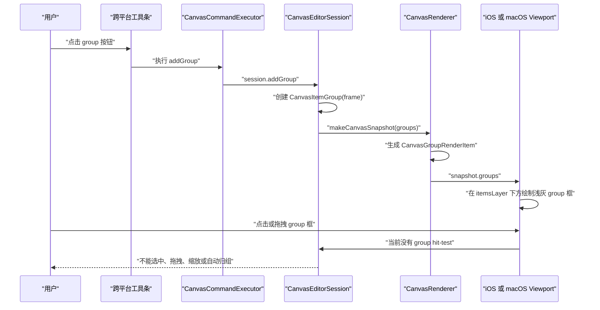
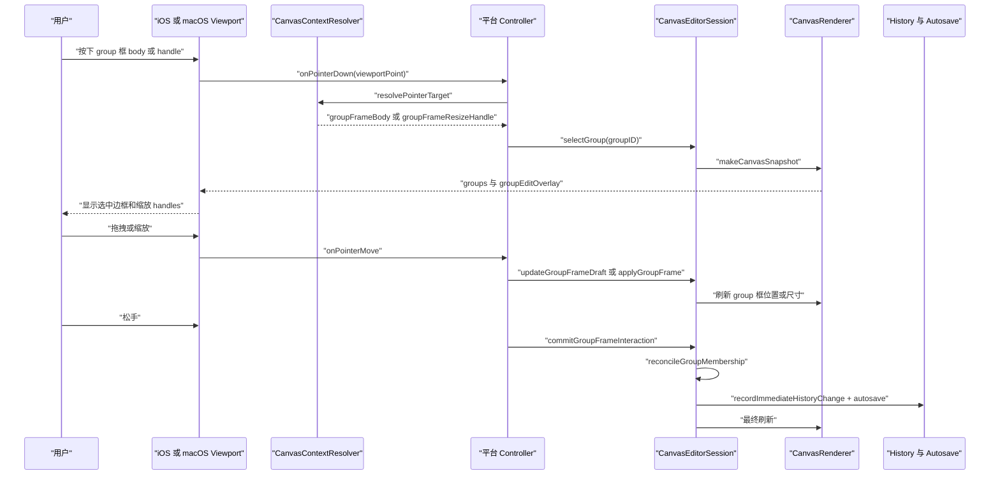

# 跨平台 Group 框交互计划

## 当前状态

当前代码已经具备 group 框的第一段能力：`CanvasItemGroup.frame` 可持久化，工具条可创建 group，`CanvasRenderer` 输出 `CanvasGroupRenderItem`，iOS/macOS viewport 在 `itemsLayer` 下方绘制浅灰半透明 group 框。

还缺少三类能力：

- group 框没有 hit-test，点击框体目前不会进入 group 交互。
- group 框没有 edit overlay，因此没有拖拽 body、缩放 handles。
- group 框移动/缩放后不会自动重算 `itemIDs`。

涉及核心文件：

- [MyCanvas_Ver_0/Canvas/Storage/BoardDocument.swift](MyCanvas_Ver_0/Canvas/Storage/BoardDocument.swift)
- [MyCanvas_Ver_0/Canvas/Core/CanvasRenderSnapshot.swift](MyCanvas_Ver_0/Canvas/Core/CanvasRenderSnapshot.swift)
- [MyCanvas_Ver_0/Canvas/Core/CanvasRenderer.swift](MyCanvas_Ver_0/Canvas/Core/CanvasRenderer.swift)
- [MyCanvas_Ver_0/Canvas/Core/CanvasContextResolver.swift](MyCanvas_Ver_0/Canvas/Core/CanvasContextResolver.swift)
- [MyCanvas_Ver_0/Canvas/Core/CanvasPointerPressContext.swift](MyCanvas_Ver_0/Canvas/Core/CanvasPointerPressContext.swift)
- [MyCanvas_Ver_0/Canvas/Editing/CanvasEditorSession.swift](MyCanvas_Ver_0/Canvas/Editing/CanvasEditorSession.swift)
- [MyCanvas_Ver_0/Platform/iOS/iOSViewController.swift](MyCanvas_Ver_0/Platform/iOS/iOSViewController.swift)
- [MyCanvas_Ver_0/Platform/macOS/macOSViewController.swift](MyCanvas_Ver_0/Platform/macOS/macOSViewController.swift)
- [MyCanvas_Ver_0/Platform/iOS/Canvas/iOSCanvasViewportView.swift](MyCanvas_Ver_0/Platform/iOS/Canvas/iOSCanvasViewportView.swift)
- [MyCanvas_Ver_0/Platform/macOS/Canvas/macOSCanvasViewportView.swift](MyCanvas_Ver_0/Platform/macOS/Canvas/macOSCanvasViewportView.swift)

## 数据结构

计划保留 `CanvasItemGroup.frame` 作为唯一持久化几何数据，不把 group 框改成普通 item，避免破坏 item z-order 和现有 item hit-test。

拟新增/扩展的交互数据如下：

```swift
// MyCanvas_Ver_0/Canvas/Core/CanvasPointerPressContext.swift
// group 框交互命中目标：body 用于拖拽，resizeHandle 用于缩放。
enum CanvasPointerTargetKind {
    case groupFrameBody
    case groupFrameResizeHandle(groupID: CanvasItemGroupID, role: CanvasSelectionHandleRole)
}
```

```swift
// MyCanvas_Ver_0/Canvas/Core/CanvasRenderSnapshot.swift
// group overlay 用于画选中边框和缩放 handles，不混入普通 item selection overlay。
struct CanvasGroupEditOverlay {
    let groupID: CanvasItemGroupID
    let screenFrame: CGRect
    let handles: [CanvasEditHandleGeometry]
}
```

```swift
// MyCanvas_Ver_0/Canvas/Editing/CanvasEditorSession.swift
// group selection 独立于 item selection；选中 group 时清空 item selection，避免两套 overlay 互相抢状态。
struct CanvasGroupInteractionState: Equatable {
    var selectedGroupID: CanvasItemGroupID?
}
```

```swift
// MyCanvas_Ver_0/Platform/iOS/iOSViewController.swift
// macOS 使用同构状态；字段名保持一致，方便同步实现。
private struct PointerGroupDragState {
    let groupID: CanvasItemGroupID
    let initialFrame: CGRect
    let dragStartWorldLocation: CGPoint
}

private struct PointerGroupResizeState {
    let groupID: CanvasItemGroupID
    let handleRole: CanvasSelectionHandleRole
    let initialFrame: CGRect
    let minimumSize: CGSize
}
```

自动归组策略：

- 默认使用 item 的 `worldBounds` 中心点是否落入 group frame 来判断“框内”。
- 忽略当前没有稳定 `worldBounds` 的非法 item。
- 忽略 group 自身，不引入 group 嵌套。
- 在 group 拖拽或缩放 commit 时重算 `itemIDs`，而不是每一帧写入 history。
- 删除 item 时继续复用现有 `removeDeletedItemIDsFromGroups` 清理成员。

## 修改前关键业务时序



## 修改后关键业务时序



## 分阶段计划

### 阶段 1：补 group 选择态与基础查询

在 `CanvasEditorSession` 中新增 group 选择态和基础 API：

- `selectedGroupID` 或 `CanvasGroupInteractionState`。
- `selectGroup(withID:recordHistory:)`。
- `clearGroupSelectionIfNeeded(recordHistory:)`。
- `group(withID:)`、`groupFrame(withID:)`。
- `updateGroupFrame(groupID:frame:recordHistory:)`。

约束：

- 选中 group 时清空 item selection。
- 选中 item 时清空 group selection。
- reading mode 下不允许 group editing。
- history snapshot 已包含 `groups`，无需新历史结构，但需要确保 selection clearing 不造成多余 autosave。

### 阶段 2：给 group 框加 hit-test

扩展 `CanvasContextResolver`：

- 在 item hit-test 之前检查 group edit overlay handles。
- 在普通 item hit-test 之后、blank pan 之前检查 group frame body。
- item 始终优先于 group body，保证层级语义为 item 在 group 上方。
- group body 命中返回 `CanvasPointerTargetKind.groupFrameBody`。
- group resize handles 命中返回 `CanvasPointerTargetKind.groupFrameResizeHandle`。

命中优先级：

1. 已选中的 item/group overlay handles。
2. 普通 item body。
3. group frame body。
4. blank canvas pan。

这样用户点击框内 item 时仍然选 item；点击 group 框空白区域时才选 group。

### 阶段 3：渲染 group edit overlay

扩展 `CanvasRenderSnapshot` 和 `CanvasRenderer`：

- 如果 `selectedGroupID` 有合法 frame，则生成 `CanvasGroupEditOverlay`。
- overlay 包含 group frame 的 screen rect、8 个缩放 handle。
- 不启用 rotate handle；本阶段只做拖拽和缩放。
- iOS/macOS viewport 复用现有 selection handle 绘制风格，或者抽出共享 `refreshGroupEditOverlay`，避免复制过多 selection 绘制逻辑。

视觉目标：

- group 框仍然是浅灰半透明背景。
- 选中后显示蓝色边框和 handles。
- handles 在 overlay layer 中，位于 item 之上，方便交互。

### 阶段 4：实现 group 拖拽

在 iOS/macOS controller 中增加 `PointerGroupDragState` 和 pointer flow：

- `pressed -> groupFrameBody` 后进入 `draggingGroupFrame`。
- move 时根据 `camera.viewportToWorld` 计算 delta。
- 更新 group frame，刷新 canvas。
- 不移动 group 内 item。用户要求的是 group 框拖拽，不是移动整组 item。
- commit 时记录一次 history/autosave。

提交时机：

- pointer move 只更新内存和画面。
- pointer up 调用 `commitPendingPointerHistoryTransaction` 或 session 专用 commit API。
- pointer cancel 回滚或取消 pending transaction，行为对齐 item drag。

### 阶段 5：实现 group 缩放

新增 `PointerGroupResizeState`：

- 保存 initial frame、handle role、minimum size。
- 使用 `CanvasSelectionHandleRole` 复用 8 个方向 handles。
- 按 handle 计算固定对角点和 dragged world corner。
- 生成标准化 frame，最小尺寸建议 `80 x 60`。
- move 期间刷新 group frame。
- pointer up 记录 history/autosave。

缩放不影响普通 item 的位置和尺寸，只改变 group frame。

### 阶段 6：自动归组 membership reconcile

在 `CanvasEditorSession` 中新增共享逻辑：

```swift
// MyCanvas_Ver_0/Canvas/Editing/CanvasEditorSession.swift
// group frame 改变后统一重算成员，默认以 item worldBounds 中心点是否在 frame 内判定。
func reconcileItemMembership(forGroupID groupID: CanvasItemGroupID) -> Bool {
    guard let groupIndex = groups.firstIndex(where: { $0.id == groupID }),
          let frame = groups[groupIndex].frame?.standardized
    else {
        return false
    }

    let memberIDs = scene.orderedBoardItems().compactMap { item -> CanvasItemID? in
        let bounds = item.worldBounds.standardized
        let center = CGPoint(x: bounds.midX, y: bounds.midY)
        return frame.contains(center) ? item.id : nil
    }

    guard groups[groupIndex].itemIDs != memberIDs else {
        return false
    }

    groups[groupIndex].itemIDs = memberIDs
    return true
}
```

调用点：

- group 创建后可立即 reconcile 一次。
- group 拖拽 commit 后 reconcile。
- group 缩放 commit 后 reconcile。
- item move / resize / rotate commit 后，刷新所有有 frame 的 group membership，避免 item 被移动进框内后 group 不更新。
- item delete 继续使用现有删除清理逻辑。

### 阶段 7：统一 history/autosave 事务

目标是避免拖拽每帧污染 undo stack：

- group drag/resize 开始时记录 before snapshot。
- move 期间只更新 frame 和 render。
- pointer up 时同时提交 frame 变化与 membership 变化。
- 如果 frame 和 membership 都没变，取消 transaction。
- autosave reason 区分：`move group frame`、`resize group frame`、`update group membership`。

需要确认 undo/redo 后：

- group frame 回滚。
- group itemIDs 回滚。
- group selection 若指向已不存在 group，要清空。

### 阶段 8：跨平台一致性与测试

测试重点：

- `BoardDocumentMapper` round-trip：frame 与 itemIDs 一起保存/恢复。
- `CanvasEditorSession`：group frame 移动后 membership 重算。
- `CanvasEditorSession`：item move 进入/离开 group 后 membership 重算。
- `CanvasContextResolver`：点击 item 优先 item，点击 group 空白区域命中 group，点击空白画布仍然 pan。
- iOS/macOS build。

验证命令建议：

```shell
# /Users/shaun/cloudDev/MyCanvas_Ver_0 验证 macOS build
xcodebuild -scheme MyCanvas_Ver_0 -destination 'platform=macOS' build
```

```shell
# /Users/shaun/cloudDev/MyCanvas_Ver_0 验证 iOS Simulator build
xcodebuild -scheme MyCanvas_Ver_0 -destination 'generic/platform=iOS Simulator' build
```

```shell
# /Users/shaun/cloudDev/MyCanvas_Ver_0 验证 group 相关单测
xcodebuild -scheme MyCanvas_Ver_0 -destination 'platform=macOS' test -only-testing:MyCanvas_Ver_0Tests/BoardVideoStorageTests/testBoardDocumentMapperRoundTripsCanvasItemGroups
```

## 风险与控制

- Hit-test 优先级风险：如果 group body 在 item 前命中，会挡住 item 操作。计划明确 item body 优先于 group body。
- History 污染风险：拖拽/缩放每帧记录会导致 undo 不可用。计划只在 pointer up commit。
- Membership 抖动风险：move 期间持续重算会造成列表闪动。计划只在 commit 时重算。
- 平台重复代码风险：iOS/macOS pointer state 目前已经重复，计划保持同构实现，优先不做大重构。
- 旧数据兼容风险：无 frame 的旧 group 不渲染、不参与 group frame hit-test，保持现有语义 group 行为。