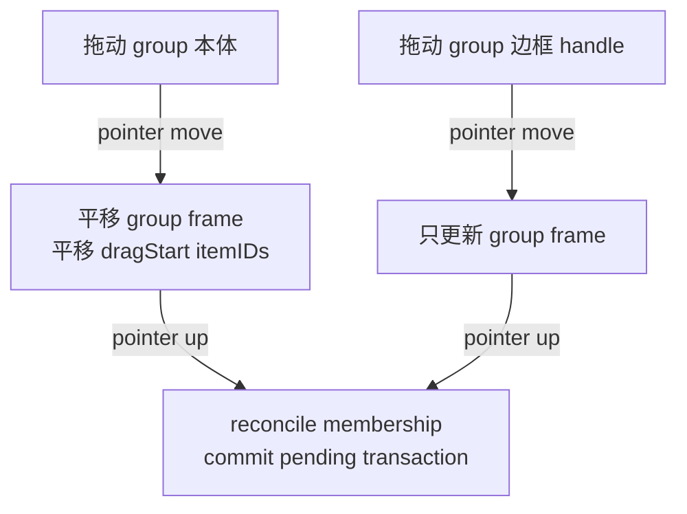

# Group Move Items Plan

## 目标语义

- **拖动 group 本体**：把 group 当作容器整体搬运。group frame 平移，drag 开始时属于该 group 的 item 也按同一个 world delta 平移，保持相对位置不变。
- **拖动 group 边框 handle**：只改变 group frame 的尺寸或边界，不移动、不缩放内部 item。pointer commit 前再按中心点规则 reconcile membership。
- **history/autosave**：沿用阶段 7 的 pending transaction，frame、item 位置和 membership 变化进入同一个 undo entry。

## 关键改动

- 在 [`/Users/shaun/cloudDev/MyCanvas_Ver_0/MyCanvas_Ver_0/Canvas/Editing/CanvasEditorSession.swift`](/Users/shaun/cloudDev/MyCanvas_Ver_0/MyCanvas_Ver_0/Canvas/Editing/CanvasEditorSession.swift) 增加 shared API，例如 `moveGroupFrameWithMembers(...)`：
  - 输入 `groupID`、目标 `frame`、drag 开始时的成员 item 几何快照、`reconcileMembership`。
  - 同时更新 group frame 和成员 item 的 `center`。
  - 使用 `CanvasBoardItemGeometry` + `scene.applyBoardItemGeometries(...)` 走现有共享几何写入路径，避免平台层直接改 scene。
  - 默认不在 pointer move 每帧 reconcile membership，继续把 membership 收敛到 commit 前。

- 在 [`/Users/shaun/cloudDev/MyCanvas_Ver_0/MyCanvas_Ver_0/Platform/iOS/iOSViewController.swift`](/Users/shaun/cloudDev/MyCanvas_Ver_0/MyCanvas_Ver_0/Platform/iOS/iOSViewController.swift) 和 [`/Users/shaun/cloudDev/MyCanvas_Ver_0/MyCanvas_Ver_0/Platform/macOS/macOSViewController.swift`](/Users/shaun/cloudDev/MyCanvas_Ver_0/MyCanvas_Ver_0/Platform/macOS/macOSViewController.swift) 扩展 `PointerGroupDragState`：
  - 保存 drag 开始时的 `memberGeometries`，来源为当前 `group.itemIDs` 对应的 existing board items。
  - `moveGroupFrame(...)` 计算 world translation 后，调用 shared API 同步平移 frame 和这些 item。
  - 不动态扩大本次 drag 的成员集合，避免 item 在拖动途中因进入 frame 而突然被带着走。

- 保持 `PointerGroupResizeState` 和 `resizeGroupFrame(...)` 的当前语义：
  - 继续调用 `updateGroupFrame(..., reconcileMembership: false)`。
  - 不移动 item、不缩放 item。
  - pointer commit 前由现有 `commitPendingHistoryTransaction(reconcilingFrameGroupMembershipsWithAutosaveReason:)` 统一 reconcile。

## 边界规则

- group drag 的成员集合以 **drag 开始时的 `group.itemIDs`** 为准；如果某个 item 已被删除或不存在，忽略。
- item 平移只改几何，不改 zIndex、rotation、size、content。
- group drag 后的 membership 仍在 commit 前按 frame 中心点规则重算，因此最终 `itemIDs` 会反映移动后的 frame 范围。
- 如果 frame 和 item 都没有实际变化，现有 history controller 仍不会产生 undo entry。

## 验证

- 用 build 验证跨平台编译：macOS 和 iOS Simulator。
- 手动验证两条路径：
  - 拖 group 本体：框和成员 item 一起移动，undo 后 frame 和 item 回到原位。
  - 拖 resize handle：只有框大小变化，item 不动，commit 后 membership 按新范围更新。