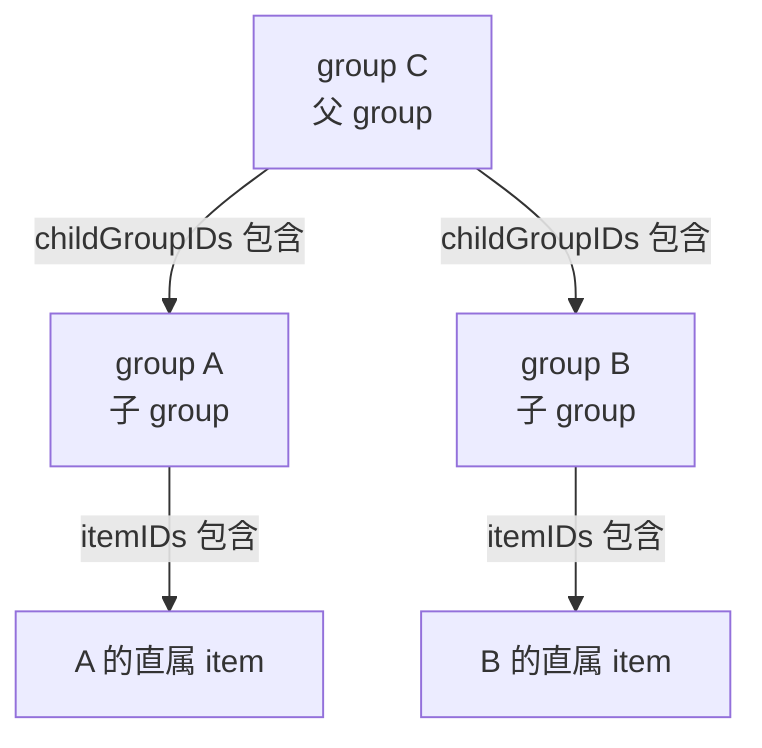
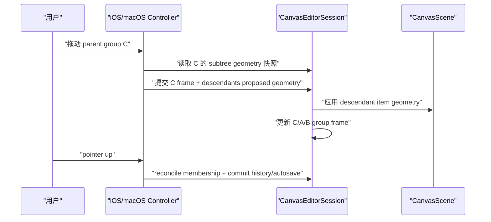

# Group Nesting 分阶段计划

## 设计约定

- 采用单父树结构：一个 group 最多只能有一个父 group，不支持同一个 group 同时属于多个父 group。
- `CanvasItemGroup.itemIDs` 表示直属 item；新增的 `childGroupIDs` 表示直属子 group。后代 item/group 通过树递归获得，不重复写入父级 `itemIDs`。
- 自动归属规则先沿用现有 item 逻辑风格：group frame 的中心点落在父 group frame 内，则可成为其 child；同时禁止 self、ancestor、descendant 形成环。
- group resize 只改变当前 group frame，不移动子 group 或 item；group body drag 移动当前 group frame、所有 descendant group frame、所有 descendant item。
- 历史/自动保存继续以一次用户手势为一个事务，避免拖动过程污染 undo stack。

## 阶段 1：数据模型与存储迁移

目标：让 group 数据能表达直属子 group，并保持旧文档兼容。

- 修改 [MyCanvas_Ver_0/Canvas/Storage/BoardDocument.swift](MyCanvas_Ver_0/Canvas/Storage/BoardDocument.swift)
  - `CanvasItemGroup` 新增 `childGroupIDs: [CanvasItemGroupID]`。
  - 初始化时归一化 child ids，去重并排除 self 的校验放在 session 层处理。
  - `displayTitle` 等现有行为不变。
- 修改 [MyCanvas_Ver_0/Canvas/Storage/BoardDocumentMapper.swift](MyCanvas_Ver_0/Canvas/Storage/BoardDocumentMapper.swift)
  - `BoardGroupRecord` 增加 `childGroupIDs`，旧文档 decode 缺省为空数组。
  - 升级 `BoardDocument.currentFormatVersion`。
- 修改 history snapshot 相关结构
  - 确认 `BoardHistorySnapshot` 包含 group 数组后自动覆盖新字段。
  - 添加/更新迁移测试，确保旧文档 group 没有 child 信息时仍能读取。

## 阶段 2：共享层级工具与不变量

目标：把 group tree 相关逻辑集中在 `CanvasEditorSession`，不要散落到 controller。

- 修改 [MyCanvas_Ver_0/Canvas/Editing/CanvasEditorSession.swift](MyCanvas_Ver_0/Canvas/Editing/CanvasEditorSession.swift)
  - 新增 parent map 派生能力：从 `groups.childGroupIDs` 计算 `parentGroupID(for:)`。
  - 新增 descendants 查询：`descendantGroupIDs(withID:)`、`descendantItemIDs(withID:)`。
  - 新增 direct membership 查询：`directItemIDs`、`directChildGroupIDs`。
  - 新增不变量校验：去重、存在性、单父、无环、无 self child。
  - 新增更新 API：`setChildGroups(forGroupID:to:)` 或内部 reconciliation 专用 API。
- 测试重点
  - 单父约束：child 从旧 parent 移到新 parent 时，旧 parent 自动移除。
  - 环检测：不能把 parent 加入 descendant。
  - 删除/缺失 group 后，parent child ids 被 normalize。

## 阶段 3：自动归属 reconciliation 升级

目标：把现有 `reconcileItemMembership(forGroupID:)` 升级为同时处理直属 item 和直属 child group。

- 修改 [MyCanvas_Ver_0/Canvas/Editing/CanvasEditorSession.swift](MyCanvas_Ver_0/Canvas/Editing/CanvasEditorSession.swift)
  - 将现有 item reconciliation 拆分为：
    - `reconcileDirectItemMembership(forGroupID:)`
    - `reconcileDirectChildGroupMembership(forGroupID:)`
    - `reconcileGroupMembership(forGroupID:)`
  - item 直属归属规则：item center 在 group frame 内，但如果 item 已经属于某个 child group 的后代，则不重复放入 parent 的 direct `itemIDs`。
  - child group 归属规则：候选 group frame center 在 parent frame 内，且候选不是 parent/self/ancestor，加入 `childGroupIDs`。
  - 单父处理：child 被新 parent 接收时，从旧 parent 的 `childGroupIDs` 中移除。
  - `reconcileFrameGroupMemberships()` 要按合理顺序处理：先 normalize group tree，再对所有 framed group reconciliation，最后再 normalize 一次。
- 历史/autosave
  - 复用当前 `commitPendingHistoryTransaction(reconcilingFrameGroupMembershipsWithAutosaveReason:...)` 思路，在手势结束前统一 reconciliation。
- 测试重点
  - C 框住 A/B 后，C.childGroupIDs 包含 A/B。
  - A/B 的 item 不重复出现在 C.itemIDs。
  - A 移出 C 后，C.childGroupIDs 移除 A。

## 阶段 4：拖拽/resize 语义升级

目标：parent group drag 带动整棵子树，resize 仍只改当前 frame。

- 修改 [MyCanvas_Ver_0/Canvas/Editing/CanvasEditorSession.swift](MyCanvas_Ver_0/Canvas/Editing/CanvasEditorSession.swift)
  - 新增 `groupSubtreeGeometries(withID:)`，返回 descendant group frame + descendant item geometry 快照。
  - 新增 `updateGroupFrameAndSubtreeGeometries(...)`，一次性更新：
    - 当前 group frame
    - descendant group frames
    - descendant item geometries
  - 保留现有 `updateGroupFrameAndMemberGeometries(...)` 或改为调用 subtree 版本，避免重复逻辑。
- 修改 [MyCanvas_Ver_0/Platform/iOS/iOSViewController.swift](MyCanvas_Ver_0/Platform/iOS/iOSViewController.swift) 和 [MyCanvas_Ver_0/Platform/macOS/macOSViewController.swift](MyCanvas_Ver_0/Platform/macOS/macOSViewController.swift)
  - `PointerGroupDragState` 从 `initialMemberGeometries` 扩展为 subtree snapshot。
  - `moveGroupFrame(...)` 使用 subtree snapshot 计算 proposed frames/geometries。
  - `resizeGroupFrame(...)` 保持只更新当前 frame，不移动 children。
- 测试重点
  - 拖动 C，A/B frame 和 A/B 内 item 都平移。
  - resize C，A/B frame 和 item 不动。
  - 拖动 A 时，只移动 A 子树，不移动 sibling B 或 parent C。

## 阶段 5：渲染、hit test 与层级显示

目标：让嵌套 group 在画布和 group list 中可理解、可选择、可导航。

- 修改 [MyCanvas_Ver_0/Canvas/Core/CanvasRenderer.swift](MyCanvas_Ver_0/Canvas/Core/CanvasRenderer.swift)
  - group frame render item 增加 depth 或渲染排序：parent 在下，child 在上，item 仍在 group frame 上方。
  - `CanvasGroupEditOverlay` 仍只展示当前 selected group 的 handles。
- 修改 [MyCanvas_Ver_0/Canvas/Core/CanvasContextResolver.swift](MyCanvas_Ver_0/Canvas/Core/CanvasContextResolver.swift)
  - 当多个 group frame 重叠时，hit test 应优先命中更深层 child group。
  - parent body 在 child frame 区域不抢 child hit target。
- 修改 iOS/macOS group list view
  - 将 `render(groups:)` 从扁平列表改为 tree rows。
  - child row 缩进显示。
  - edit button、row click navigate、inline title edit 都继续工作。
  - 可先不做 expand/collapse，默认全部展开；后续再设计折叠状态。

## 阶段 6：选择、命令与删除语义

目标：明确选中 parent/child group 时命令行为一致且可预期。

- 修改 [MyCanvas_Ver_0/Canvas/Editing/CanvasEditorSession.swift](MyCanvas_Ver_0/Canvas/Editing/CanvasEditorSession.swift)
  - `selectGroup` 保持只选当前 group，不隐式选中 children。
  - `clearSelection` 已支持 group selection，继续复用。
  - 如果后续支持 delete group，需要定义删除 parent 时是否删除子 group；本阶段建议先只处理选中/清选/拖拽，不扩展删除语义。
- 修改 [MyCanvas_Ver_0/Canvas/Input/CanvasClickSelectionResolver.swift](MyCanvas_Ver_0/Canvas/Input/CanvasClickSelectionResolver.swift)
  - 确保 blank click、group frame click 与嵌套 hit target 一致。
- 测试重点
  - 点击 child frame 选 child，不选 parent。
  - 点击 parent 空白 frame 区域选 parent。
  - 点击画布空白清除 selected group。

## 阶段 7：历史、autosave 与文档一致性回归

目标：所有嵌套关系变化、drag/resize、自动归属都能正确 undo/redo 和持久化。

- 覆盖场景
  - 新建 C 框住 A/B，commit 后 undo 应恢复无 parent/child 关系。
  - 拖动 C 后 undo，C/A/B frames 和 descendant items 均恢复。
  - resize C 后 undo，只恢复 C frame，A/B 不应该出现额外移动。
  - 保存/恢复 board 后，group tree 结构保持一致。
- 更新测试
  - `CanvasEditorSession` group membership tests。
  - `BoardDocumentMapper` migration/persistence tests。
  - iOS/macOS controller 层以 build 验证为主，复杂行为优先放 session 单测。

## 阶段 8：清理与性能保护

目标：避免 group 多、嵌套深时出现明显性能问题或状态漂移。

- 增加 tree normalization 的复杂度保护：避免每帧重复 O(n²) 递归。
- 对 reconciliation 使用 parent map / descendant cache，单次事务内复用。
- 清理临时 debug logs，保留必要的断言或测试。
- 更新 commit record，记录数据结构、迁移、不变量、拖拽/resize 行为变化。

## 实施顺序建议

1. 先做阶段 1-2，确保数据模型和不变量稳定。
2. 再做阶段 3，让自动 membership 能产生 parent/child 关系。
3. 再做阶段 4，解决最核心的交互语义：拖动 parent 带动子树。
4. 再做阶段 5-6，补 UI 层级展示、hit testing 和选择语义。
5. 最后做阶段 7-8，集中做历史、持久化、回归与性能清理。