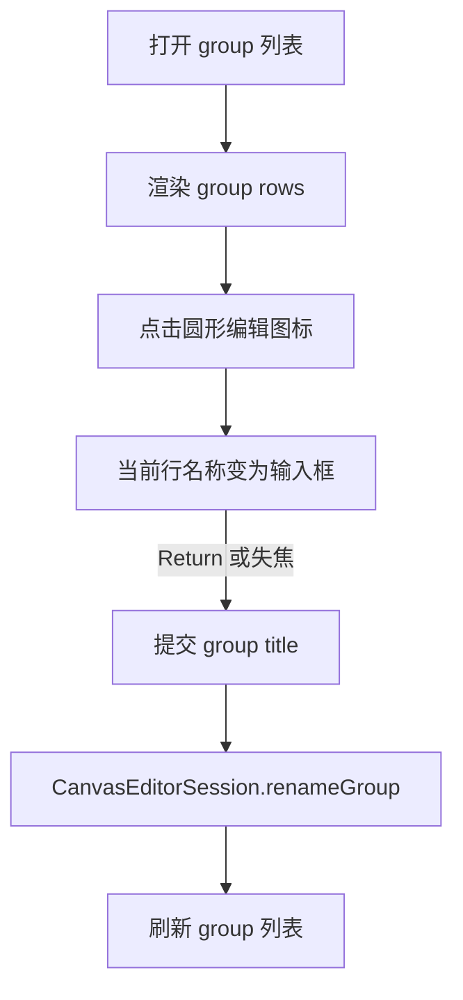

# Group Title Inline Edit Plan

## 目标行为

- 右上角 group 按钮展开后，每个 group 行右侧增加一个圆形图标按钮，使用系统图标，不显示“编辑”文字。
- 点击某行编辑按钮后，只让该行的 group 名称进入 inline edit 状态；metadata 和 description 仍保留显示。
- 提交方式沿用本地编辑习惯：Return/Done 提交，失焦提交；空字符串允许写入，展示时继续走 `displayTitle` 的 `Untitled Group` 兜底。
- iOS 和 macOS 行为保持一致。

## 阶段 1：补齐共享 rename API

修改 [`/Users/shaun/cloudDev/MyCanvas_Ver_0/MyCanvas_Ver_0/Canvas/Editing/CanvasEditorSession.swift`](/Users/shaun/cloudDev/MyCanvas_Ver_0/MyCanvas_Ver_0/Canvas/Editing/CanvasEditorSession.swift)：

- 新增 `renameGroup(withID:to:recordHistory:) -> Bool`。
- 按 `group.id` 找到目标 group，写入 `title`。
- 如果标题没变，返回 `false`，不产生 history/autosave。
- `recordHistory == true` 时记录 `rename group`，autosave reason 同样使用 `rename group`。

关键点：group title 是 document state 的一部分，所以 rename 必须走 `BoardHistorySnapshot.groups`，不能只改 UI。

## 阶段 2：iOS group list 增加编辑状态和 row UI

修改 [`/Users/shaun/cloudDev/MyCanvas_Ver_0/MyCanvas_Ver_0/Platform/iOS/iOSViewController.swift`](/Users/shaun/cloudDev/MyCanvas_Ver_0/MyCanvas_Ver_0/Platform/iOS/iOSViewController.swift)：

- 在 controller 增加 `editingGroupTitleID: CanvasItemGroupID?`。
- `updateGroupListPresentation()` 改为把 `editingGroupTitleID` 传给 `iOSCanvasGroupListView.render(...)`。
- `iOSCanvasGroupListView` 新增 callbacks：
  - `onEditGroupTitleRequested: (CanvasItemGroupID) -> Void`
  - `onGroupTitleSubmitted: (CanvasItemGroupID, String) -> Void`
- `makeGroupRow(for:)` 改为水平布局：左侧 title/metadata/description，右侧圆形 icon button。
- 编辑按钮使用系统 pencil 图标，例如 `pencil` 或 `square.and.pencil`，`accessibilityLabel = "Edit group name"`。
- 当 row 的 group id 等于 `editingGroupTitleID` 时，把 title label 替换为 `UITextField`，并在 render 后自动 focus/select。

## 阶段 3：iOS 提交与刷新

仍在 [`/Users/shaun/cloudDev/MyCanvas_Ver_0/MyCanvas_Ver_0/Platform/iOS/iOSViewController.swift`](/Users/shaun/cloudDev/MyCanvas_Ver_0/MyCanvas_Ver_0/Platform/iOS/iOSViewController.swift)：

- 点击编辑按钮：设置 `editingGroupTitleID = groupID`，刷新列表，focus 当前 text field。
- Return/Done 或失焦：调用 `editorSession.renameGroup(withID:to:recordHistory: true)`。
- 提交后清空 `editingGroupTitleID`，调用 `updateGroupListPresentation()`。
- 如果 rename 成功，触发 autosave；如果只是 no-op，也退出编辑态但不写 history。

## 阶段 4：macOS group list 对齐实现

修改 [`/Users/shaun/cloudDev/MyCanvas_Ver_0/MyCanvas_Ver_0/Platform/macOS/macOSViewController.swift`](/Users/shaun/cloudDev/MyCanvas_Ver_0/MyCanvas_Ver_0/Platform/macOS/macOSViewController.swift)：

- 增加 `editingGroupTitleID: CanvasItemGroupID?`。
- `macOSCanvasGroupListView.render(groups:)` 扩展为接收 editing id。
- 每个 group row 右侧添加圆形 `NSButton`，使用 `NSImage(systemSymbolName: "pencil", accessibilityDescription: "Edit group name")`。
- 编辑态 row 使用可编辑 `NSTextField` 替换 title label。
- 用 `NSTextFieldDelegate` 或 action 处理 Return/失焦提交。
- 提交后调用同一个 `editorSession.renameGroup(...)`，清空编辑态并刷新列表。

## 阶段 5：交互边界与一致性

- 如果正在编辑 A，再点击 B 的编辑按钮：先结束 A 的编辑并提交，再进入 B。
- group 列表隐藏或 board 切换时，清空 `editingGroupTitleID`，避免 stale group id。
- 如果目标 group 已不存在，提交时忽略并清空编辑态。
- 圆形按钮只放图标，不放文字；按钮仍提供 accessibility label。

## 阶段 6：验证

- `ReadLints` 检查修改文件。
- macOS build：`xcodebuild -project "MyCanvas_Ver_0.xcodeproj" -scheme "MyCanvas_Ver_0" -destination 'platform=macOS' build`。
- iOS Simulator build：`xcodebuild -project "MyCanvas_Ver_0.xcodeproj" -scheme "MyCanvas_Ver_0" -destination 'generic/platform=iOS Simulator' build`。
- 手动验收：
  - group list 每行右侧有圆形图标按钮。
  - 点击后仅当前行标题变成输入框。
  - Return/失焦能保存名称。
  - undo/redo 能回滚/恢复 group 名称。
  - resize/move group frame 行为不受影响。