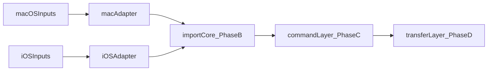

# B -> C -> D 分阶段计划

## 当前锚点

- 共享落板入口已经存在于 `[MyCanvas_Ver_0/Canvas/Editing/CanvasEditorSession.swift](MyCanvas_Ver_0/Canvas/Editing/CanvasEditorSession.swift)` 的 `appendImportedImage(_:)`：它负责 `camera.center` 落板、`normalizedDisplaySize(for:)`、历史记录和 autosave。
- `macOS` 入口当前集中在 `[MyCanvas_Ver_0/Platform/macOS/macOSViewController.swift](MyCanvas_Ver_0/Platform/macOS/macOSViewController.swift)` 的 `handleImportButtonClick()`，即 `NSOpenPanel -> CGImage -> editorSession.appendImportedImage(...)`。
- `iOS` 入口当前集中在 `[MyCanvas_Ver_0/Platform/iOS/iOSViewController.swift](MyCanvas_Ver_0/Platform/iOS/iOSViewController.swift)` 的 `handleImportButtonTap()` / `loadSelectedImage(from:)`，即 `PHPicker/NSItemProvider -> CGImage -> editorSession.appendImportedImage(...)`。
- 命令层 `[MyCanvas_Ver_0/Canvas/Editing/CanvasCommand.swift](MyCanvas_Ver_0/Canvas/Editing/CanvasCommand.swift)` 目前没有 import/paste case；存储层 `[MyCanvas_Ver_0/Canvas/Storage/BoardDocument.swift](MyCanvas_Ver_0/Canvas/Storage/BoardDocument.swift)` 和运行时模型 `[MyCanvas_Ver_0/Canvas/Core/CanvasImageItem.swift](MyCanvas_Ver_0/Canvas/Core/CanvasImageItem.swift)` 仍然是 image-specific。

```swift
// 当前共享插入缝合点（CanvasEditorSession.appendImportedImage）
let item = CanvasImageItem(cgImage: cgImage, center: camera.center, ...)
scene.append(item)
_ = recordImmediateHistoryChange(..., autosaveReason: "append image")
```

## 目标形态




## 阶段 B-1：共享批量导入核心

- 在共享层新增中性 import 类型，建议落在新目录 `[MyCanvas_Ver_0/Canvas/Import/](MyCanvas_Ver_0/Canvas/Import/)`；首批类型保持轻量：`CanvasResolvedImportImage`、`CanvasImportPlacement`、`CanvasImportLayout`，命名避免带 `paste` / `picker` / `drag`。
- 扩展 `[MyCanvas_Ver_0/Canvas/Editing/CanvasEditorSession.swift](MyCanvas_Ver_0/Canvas/Editing/CanvasEditorSession.swift)`：新增批量导入 API，输入为“已解析图片 + placement/layout”，内部统一完成多图插入、zIndex 递增、board 扩展、一次 history、一次 autosave。
- 优先复用已有 `beginHistoryTransaction` / `commitPendingHistoryTransaction` 或等价的 before/after snapshot 机制，避免多图导入出现 N 次 undo。
- 保持当前行为不变：默认仍然落在 `camera.center`、仍走 `normalizedDisplaySize(for:)`、仍然不自动选中新插入项。
- 保留 `appendImportedImage(_:)` 作为兼容包装，让现有 `macOS` / `iOS` 单图路径先无痛接入新核心。
- 仅当 session 代码明显简化时，才在 `[MyCanvas_Ver_0/Canvas/Core/CanvasScene.swift](MyCanvas_Ver_0/Canvas/Core/CanvasScene.swift)` 增加极小的批量 append helper；history/autosave 继续留在 session。
- 完成标志：单图导入行为零回归；多图导入可以一次撤销、一次 autosave、并按约定的默认排布落板。

## 阶段 B-2：macOS 接入共享 import core

- 新增 macOS 平台适配器，建议落在 `[MyCanvas_Ver_0/Platform/macOS/](MyCanvas_Ver_0/Platform/macOS/)`；职责是把 `NSOpenPanel` 结果、`NSPasteboard` 内容、拖拽项统一解析为 `[CanvasResolvedImportImage]`。
- 更新 `[MyCanvas_Ver_0/Platform/macOS/macOSViewController.swift](MyCanvas_Ver_0/Platform/macOS/macOSViewController.swift)`：
  - 让 `handleImportButtonClick()` 改走“平台适配器 -> 批量 import core”。
  - 在 controller 里保留导入成功后的 `refreshCanvas(...)` 与 UI 刷新职责。
  - 先把现有单选 open panel 改造成可切换的批量入口；等 B-1 稳定后再打开 `allowsMultipleSelection`。
- 更新 `[MyCanvas_Ver_0/Platform/macOS/Canvas/macOSCanvasViewportView.swift](MyCanvas_Ver_0/Platform/macOS/Canvas/macOSCanvasViewportView.swift)`：
  - 新增 responder hook，如 `paste(_:)`。
  - 让 viewport 成为 `NSDraggingDestination` 的承载点，因为它已经负责 `makeFirstResponder(self)` 与 pointer 回调，天然是 paste / drop 的焦点表面。
  - 继续沿用当前 closure 风格，把 paste/drop 请求转发给 controller，而不是把导入业务写进 view。
- 更新 `[MyCanvas_Ver_0/Platform/macOS/macOSAppDelegate.swift](MyCanvas_Ver_0/Platform/macOS/macOSAppDelegate.swift)`：
  - 在手写 Edit 菜单里补上标准 `Paste` 菜单项和 `⌘V`。
  - 这项建议走 responder chain，而不是继续走 `AppDelegate -> currentCanvasViewController` 的硬转发，这样未来文本输入不会被 canvas paste 抢走。
- B-2 的入口覆盖范围：toolbar import、系统图片剪贴板粘贴、Finder 文件粘贴、Finder 拖拽图片/文件到画板。
- 完成标志：macOS 所有导入入口都收敛到同一批量 import core，且默认仍然“粘贴/导入到画板中心”。

## 阶段 B-3：iOS 接入共享 import core

- 新增 iOS 平台适配器，建议落在 `[MyCanvas_Ver_0/Platform/iOS/](MyCanvas_Ver_0/Platform/iOS/)`；职责是把 `PHPickerResult` / `NSItemProvider`、`UIPasteboard`、`UIDropInteraction` items 统一解析为 `[CanvasResolvedImportImage]`。
- 更新 `[MyCanvas_Ver_0/Platform/iOS/iOSViewController.swift](MyCanvas_Ver_0/Platform/iOS/iOSViewController.swift)`：
  - 把现有 picker 路径改走“平台适配器 -> 批量 import core”。
  - 新增外接键盘 paste 入口，优先放在 controller responder 层，例如 `UIKeyCommand` 或标准 `paste(_:)`。
  - 给 canvas 表面加 `UIDropInteraction`，复用同一解析链路。
  - 保持导入成功后的 `requestCanvasRefresh(...)` 和 `updateHistoryButtonsAppearance()` 行为一致。
- 如无必要，不改 `[MyCanvas_Ver_0/Platform/iOS/Canvas/iOSCanvasViewportView.swift](MyCanvas_Ver_0/Platform/iOS/Canvas/iOSCanvasViewportView.swift)`；优先让 controller 挂载交互，保持现有触控/渲染视图简洁。
- 等 B-1 稳定后，再打开 picker 的多选能力，让 iOS 批量导入和批量粘贴天然复用同一核心。
- 完成标志：iOS picker、外接键盘粘贴、拖放导入全部走同一共享导入核心。

## 阶段 C-1：把“已解析图片导入”收口进命令执行层

- 扩展 `[MyCanvas_Ver_0/Canvas/Editing/CanvasCommand.swift](MyCanvas_Ver_0/Canvas/Editing/CanvasCommand.swift)`：新增 import command，但 payload 只允许是共享层的“已解析图片批次”，不要把 `NSPasteboard`、`PHPickerResult`、`NSDraggingInfo` 等平台对象带进 command。
- 扩展 `[MyCanvas_Ver_0/Canvas/Editing/CanvasCommandExecutor.swift](MyCanvas_Ver_0/Canvas/Editing/CanvasCommandExecutor.swift)`：新增 import 分支，执行时只调用 B-1 的批量 session API，并返回 refresh reason。
- 更新 `CanvasCommand` 的 `id` / `shouldCancelActiveRotation` 分支，让 import 和其他画板变更一样，自动走 rotation/interaction 清理路径。
- 这一阶段先不强制改 `[MyCanvas_Ver_0/Canvas/Editing/CanvasCommandCatalog.swift](MyCanvas_Ver_0/Canvas/Editing/CanvasCommandCatalog.swift)`，除非 import 需要立即参与 descriptor-driven UI 状态。
- 完成标志：控制器已经可以在“平台解析完成”之后，把导入当成一个标准 `CanvasCommand` 交给 executor。

## 阶段 C-2：控制器全面迁移到 command dispatch

- 更新 `[MyCanvas_Ver_0/Platform/macOS/macOSViewController.swift](MyCanvas_Ver_0/Platform/macOS/macOSViewController.swift)` 和 `[MyCanvas_Ver_0/Platform/iOS/iOSViewController.swift](MyCanvas_Ver_0/Platform/iOS/iOSViewController.swift)`：导入成功后不再直接触碰 `editorSession.appendImportedImage(...)`，而是统一改成 `performCommand(.import...)`。
- 把“导入后的 refresh reason、rotation cancel、selection consistency”统一交给 command path；controller 保留平台获取输入、错误提示、sheet/picker/drag session 生命周期管理。
- 重新评估 `[MyCanvas_Ver_0/Canvas/Editing/CanvasCommandCatalog.swift](MyCanvas_Ver_0/Canvas/Editing/CanvasCommandCatalog.swift)`、`[MyCanvas_Ver_0/Platform/Shared/Toolbar/CanvasToolbarStateBuilder.swift](MyCanvas_Ver_0/Platform/Shared/Toolbar/CanvasToolbarStateBuilder.swift)` 以及菜单 wiring：
  - 如果 import 需要像 undo/crop 那样进入 descriptor-driven enablement，再纳入 catalog。
  - 如果 import 仍然只是“平台入口 + 命令执行”，则保留 toolbar item 与 command item 分层。
- 完成标志：所有成功导入路径都在 controller 末端汇合到 `performCommand(...)`，而不是直接操作 session。

## 阶段 D-1：引入 transfer domain，但不改存储/运行时模型

- 在共享层新增 transfer 领域，建议目录为 `[MyCanvas_Ver_0/Canvas/Transfer/](MyCanvas_Ver_0/Canvas/Transfer/)`；首批类型建议是 `CanvasTransferItem`、`CanvasTransferRequest`，并只实现 `.image(...)` 这一种 item。
- 让平台适配器先从“输出 resolved import images”升级为“输出 transfer request”，再由 transfer layer 把 image item lower 到 B/C 已经稳定的导入命令链路。
- 这一阶段不要动 `[MyCanvas_Ver_0/Canvas/Core/CanvasImageItem.swift](MyCanvas_Ver_0/Canvas/Core/CanvasImageItem.swift)`、`[MyCanvas_Ver_0/Canvas/Storage/BoardDocument.swift](MyCanvas_Ver_0/Canvas/Storage/BoardDocument.swift)`、`[MyCanvas_Ver_0/Canvas/Storage/BoardDocumentMapper.swift](MyCanvas_Ver_0/Canvas/Storage/BoardDocumentMapper.swift)`、`[MyCanvas_Ver_0/Canvas/Storage/BoardStore.swift](MyCanvas_Ver_0/Canvas/Storage/BoardStore.swift)`。
- 目标是先把 API 边界从“image import”升级成“transfer request”，而不是提前把整套画板 runtime 泛化。
- 完成标志：paste / drop / import 在架构语义上都变成 transfer pipeline，但当前 runtime 和文档格式保持不变。

## 阶段 D-2：在出现第二种内容类型后，再泛化 runtime 与持久化

- 只有当第二种非图片 transfer item 明确落地后，才启动 D-2；这一步是领域升级，不应在图片导入阶段提前做。
- 重点重审以下文件的 image-only 假设：
  - `[MyCanvas_Ver_0/Canvas/Core/CanvasImageItem.swift](MyCanvas_Ver_0/Canvas/Core/CanvasImageItem.swift)`
  - `[MyCanvas_Ver_0/Canvas/Core/CanvasScene.swift](MyCanvas_Ver_0/Canvas/Core/CanvasScene.swift)`
  - `[MyCanvas_Ver_0/Canvas/Storage/BoardDocument.swift](MyCanvas_Ver_0/Canvas/Storage/BoardDocument.swift)`
  - `[MyCanvas_Ver_0/Canvas/Storage/BoardDocumentMapper.swift](MyCanvas_Ver_0/Canvas/Storage/BoardDocumentMapper.swift)`
  - 渲染、命中测试、context menu、history snapshot 等目前默认 item == image 的路径
- 在 D-2 里再决定是否引入通用 board item enum/protocol，或为 image/text/sticker 等建立并行 item family；这一步要先选定至少一种真实的第二内容类型，再设计 persistence 形态。
- 完成标志：transfer domain 不只是输入层泛化，文档、运行时、渲染和编辑系统也都能承载多内容类型。

## 约束与验收守则

- B 和 C 全程保持“默认插入到画板中心”“默认不自动选中新导入项”，避免同时引入交互语义变化。
- 在 D-2 之前，不扩大文档格式和存储结构；先把输入入口和导入调度收口。
- 共享层禁止直接依赖 `NSPasteboard`、`NSDraggingInfo`、`UIPasteboard`、`NSItemProvider`、`PHPickerResult` 等平台类型。
- 每个阶段结束都至少验证：单图导入、批量导入、一次 undo、一次 autosave、现有 crop/undo/redo 行为无回归。

