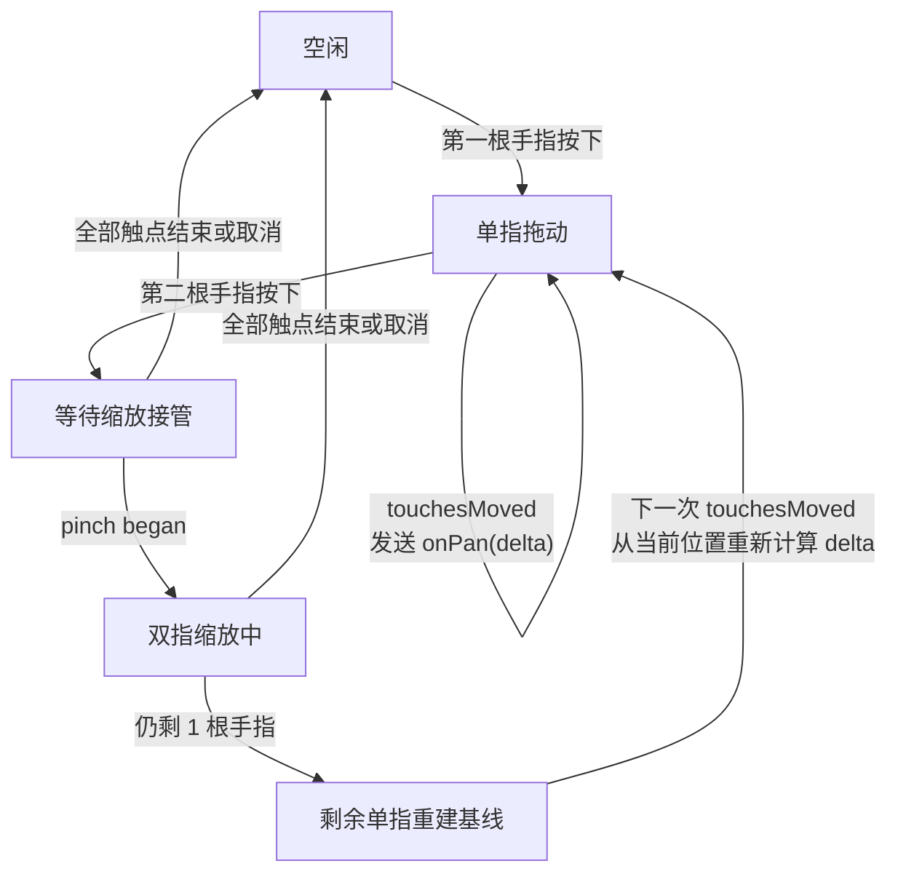

# iOS Raw Touch 平移改造

## 目标

去掉 `UIPanGestureRecognizer` 的起手阈值，让单指拖动画布在第一帧 `touchesMoved` 就开始响应，同时保留现有双指缩放能力。

当前最适合承接这次改造的边界已经很清晰：

- [iOSCanvasViewportView.swift](/Users/shaun/Library/Mobile Documents/com~~apple~~CloudDocs/Develop/MyCanvas_Ver_0/MyCanvas_Ver_0/Platform/iOS/Canvas/iOSCanvasViewportView.swift) 负责把 UIKit 输入翻译成 `onPan(CGPoint)` / `onZoom(CGFloat, CGPoint)`。
- [iOSViewController.swift](/Users/shaun/Library/Mobile Documents/com~~apple~~CloudDocs/Develop/MyCanvas_Ver_0/MyCanvas_Ver_0/Platform/iOS/iOSViewController.swift) 只消费这两个增量命令并更新 `CanvasCamera`。
- [CanvasCamera.swift](/Users/shaun/Library/Mobile Documents/com~~apple~~CloudDocs/Develop/MyCanvas_Ver_0/MyCanvas_Ver_0/Canvas/Core/CanvasCamera.swift) 的几何语义不需要改。

## 输入状态机

## 改动方案

### 1. 在 viewport 内彻底移除 pan recognizer，改为 raw touch 单指平移

修改 [iOSCanvasViewportView.swift](/Users/shaun/Library/Mobile Documents/com~~apple~~CloudDocs/Develop/MyCanvas_Ver_0/MyCanvas_Ver_0/Platform/iOS/Canvas/iOSCanvasViewportView.swift)：

- 删除 `panGestureRecognizer`、`handlePan(_:)` 以及只服务于 pan recognizer 的日志逻辑。
- 保留 `UIPinchGestureRecognizer`，继续通过 `onZoom` 输出缩放比例和 anchor。
- 显式开启 `isMultipleTouchEnabled`，确保 raw touch 能可靠收到第二根手指。
- 把现有 `touchesBegan / touchesMoved / touchesEnded / touchesCancelled` 从“只打日志”升级为真正的平移输入源。

### 2. 在 viewport 内建立显式触点状态机

仍修改 [iOSCanvasViewportView.swift](/Users/shaun/Library/Mobile Documents/com~~apple~~CloudDocs/Develop/MyCanvas_Ver_0/MyCanvas_Ver_0/Platform/iOS/Canvas/iOSCanvasViewportView.swift)：

- 跟踪一根明确的 `UITouch` 身份和它的最近位置，避免使用 `touches.first` 这种无序集合语义做业务逻辑。
- 当总触点数为 1 且当前不在 pinch 相关状态时，`touchesMoved` 直接计算 `delta = current - previous` 并调用 `onPan(delta)`。
- 第二根手指出现时，立即停止单指平移并切到等待缩放接管的状态，避免在 pinch 真正开始前多打一段平移。
- `touchesCancelled` 做硬重置，清空 tracked touch 和中间状态，不发送额外补偿位移。

### 3. 处理“缩放结束后剩余一根手指无缝续拖”的边界

仍修改 [iOSCanvasViewportView.swift](/Users/shaun/Library/Mobile Documents/com~~apple~~CloudDocs/Develop/MyCanvas_Ver_0/MyCanvas_Ver_0/Platform/iOS/Canvas/iOSCanvasViewportView.swift)：

- 当 `UIPinchGestureRecognizer` 结束后，如果还有一根手指留在屏幕上，不立即沿用旧的单指基线。
- 先用剩余手指的当前位置重新 seed baseline，再从下一次 `touchesMoved` 开始恢复 `onPan(delta)`，避免出现跳变或补偿性大位移。
- pinch `.began/.changed` 期间禁止发送任何单指 `onPan`，保证平移和缩放两条语义不会混发。

### 4. 保持控制器和相机层接口不变

以“不扩大爆炸半径”为原则：

- [iOSViewController.swift](/Users/shaun/Library/Mobile Documents/com~~apple~~CloudDocs/Develop/MyCanvas_Ver_0/MyCanvas_Ver_0/Platform/iOS/iOSViewController.swift) 继续按现有方式消费 `onPan` / `onZoom`，不改 `camera.pan(by:)` / `camera.zoom(by:around:)` 的调用链。
- [CanvasCamera.swift](/Users/shaun/Library/Mobile Documents/com~~apple~~CloudDocs/Develop/MyCanvas_Ver_0/MyCanvas_Ver_0/Canvas/Core/CanvasCamera.swift) 不做数学层修改。
- 如果需要保留少量定位日志，只保留 raw touch 状态转换和 `ControllerPan` 的关键点，去掉当前过于密集的 pan recognizer 热路径日志。

## 验证重点

- 单指拖动画布时，第一帧 `touchesMoved` 就开始平移，不再有 dead zone。
- 第二根手指按下后，单指平移立即停住，pinch 开始前不会额外滑动一段。
- 双指缩放期间只发生缩放，不混入单指平移。
- 缩放结束后若仍剩一根手指，下一次移动能无缝继续拖动，且不会瞬移。
- `touchesCancelled`、来电/系统中断、三指及以上输入后，状态能正确回到可继续交互的状态。

