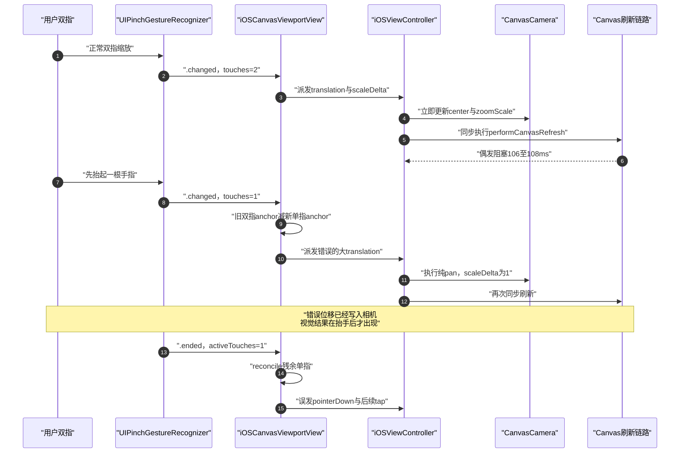
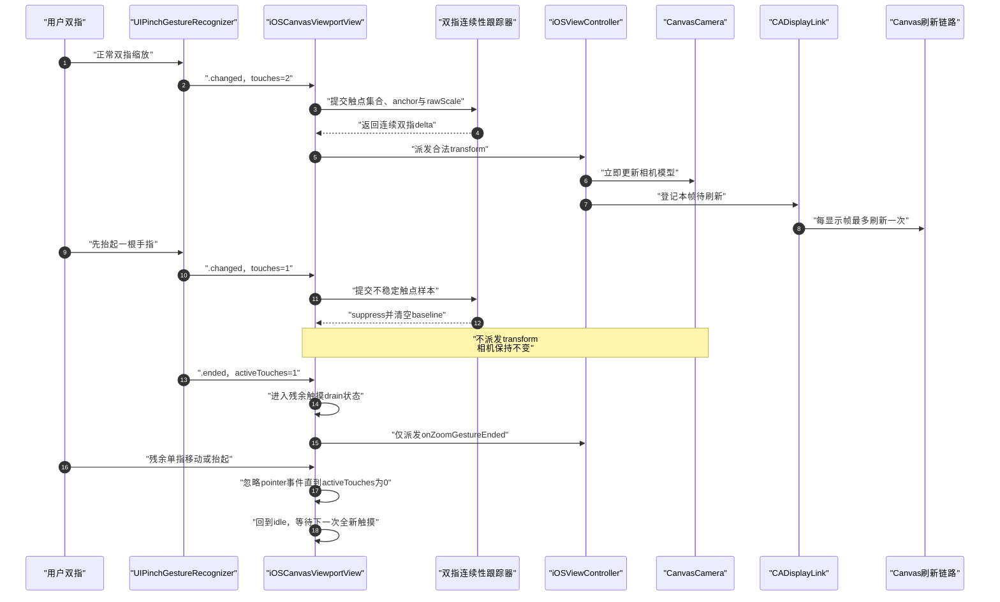

# iOS 双指缩放收尾跳移修复计划

## 已确认根因与修改边界
- 真机日志已证明：`UIPinchGestureRecognizer` 会在一指先抬时先发送 `.changed`，此时 `numberOfTouches=1`；现有代码仍用上一帧双指中心和当前单指位置计算 translation，实际出现过 `{79,19}`、`{93,25}` 的错误纯平移。
- 同一错误帧中 `scaleDelta=1`，因此错误来自输入连续性判断，不来自 [CanvasCamera.swift](/Users/shaun/cloudDev/MyCanvas_Ver_0/MyCanvas_Ver_0/Canvas/Core/CanvasCamera.swift) 的缩放数学；相机层保持不变。
- 多元素场景会把同步刷新放大到 `106–108ms`，导致错误位移直到抬手后才显示。修改范围包括输入正确性、残余触摸隔离、pinch 刷新合帧、分阶段性能观测，以及由观测结果驱动的热点优化。
- 不采用“大位移阈值”“结束后回滚 camera”或 debounce 猜测值；这些方案会误伤合法双指平移，也无法保证触点集合连续性。

## 业务流修改前



## 业务流修改后



## 1. 提取可测试的双指连续性跟踪器
在 [Canvas/Input](/Users/shaun/cloudDev/MyCanvas_Ver_0/MyCanvas_Ver_0/Canvas/Input) 新增 `CanvasDirectPinchContinuityTracker.swift`。它只接受平台无关的触点样本，保证 delta 必须来自“前后两帧完全相同的两根触点”；UIKit 层只负责把 `UITouch` 映射为 `ObjectIdentifier`。

关键数据结构与决策合同：

```swift
// 文件路径: MyCanvas_Ver_0/Canvas/Input/CanvasDirectPinchContinuityTracker.swift
import CoreGraphics
import Foundation

enum CanvasDirectPinchSuppressionReason: Equatable {
    case invalidScale
    case unstableTouchCount
}

struct CanvasDirectPinchSample<TouchID: Hashable> {
    let recognizerTouchCount: Int       // UIPinchGestureRecognizer 当前认可的触点数
    let activeTouchIDs: Set<TouchID>    // UIView 当前仍存活的触点身份
    let rawScale: CGFloat
    let timestamp: TimeInterval
    let anchorInViewport: CGPoint
}

struct CanvasDirectPinchContinuousDelta: Equatable {
    let translationInViewport: CGPoint
    let rawScaleDelta: CGFloat
    let sampleInterval: TimeInterval
    let anchorInViewport: CGPoint
}

enum CanvasDirectPinchDecision: Equatable {
    case rebaselined                    // 首帧或触点集合替换，只建基线，不输出
    case suppressed(CanvasDirectPinchSuppressionReason)
    case transform(CanvasDirectPinchContinuousDelta)
}

struct CanvasDirectPinchContinuityTracker<TouchID: Hashable> {
    private struct Baseline {
        let touchIDs: Set<TouchID>
        let rawScale: CGFloat
        let timestamp: TimeInterval
        let anchor: CGPoint
    }

    private var baseline: Baseline?

    mutating func consume(
        _ sample: CanvasDirectPinchSample<TouchID>
    ) -> CanvasDirectPinchDecision {
        guard sample.rawScale.isFinite, sample.rawScale > 0 else {
            baseline = nil
            return .suppressed(.invalidScale)
        }

        // recognizer 与 UIView 两侧都必须确认恰好是两根手指。
        guard sample.recognizerTouchCount == 2,
              sample.activeTouchIDs.count == 2 else {
            baseline = nil
            return .suppressed(.unstableTouchCount)
        }

        let next = Baseline(
            touchIDs: sample.activeTouchIDs,
            rawScale: sample.rawScale,
            timestamp: sample.timestamp,
            anchor: sample.anchorInViewport
        )

        guard let previous = baseline,
              previous.touchIDs == sample.activeTouchIDs else {
            baseline = next
            return .rebaselined
        }

        baseline = next
        return .transform(
            CanvasDirectPinchContinuousDelta(
                translationInViewport: CGPoint(
                    x: sample.anchorInViewport.x - previous.anchor.x,
                    y: sample.anchorInViewport.y - previous.anchor.y
                ),
                rawScaleDelta: sample.rawScale / max(previous.rawScale, 0.0001),
                sampleInterval: max(sample.timestamp - previous.timestamp, 0),
                anchorInViewport: sample.anchorInViewport
            )
        )
    }

    mutating func reset() {
        baseline = nil
    }
}
```

实现约束：
- `2 -> 1`、`2 -> 3`、触点身份替换、非法 scale 都先清空 baseline，且绝不输出 transform。
- 触点恢复为两根后第一帧只 rebaseline，下一帧才能输出，杜绝跨触点集合跳变。
- 不在 tracker 内应用缩放 deadzone；tracker 保证几何连续性，现有 source-specific normalization 继续负责噪声过滤。

## 2. 重构 iOS pinch session，并接入连续性决策
修改 [iOSCanvasViewportView.swift](/Users/shaun/cloudDev/MyCanvas_Ver_0/MyCanvas_Ver_0/Platform/iOS/Canvas/iOSCanvasViewportView.swift) 的 `PinchGestureSession`、`.began/.changed/.ended` 分支和日志。

将 session 改为带稳定 ID、事件序号和 source-specific 状态的结构，避免 direct touch 与 Mirroring 共用一组含义不同的字段：

```swift
// 文件路径: MyCanvas_Ver_0/Platform/iOS/Canvas/iOSCanvasViewportView.swift
private struct IndirectPinchBaseline {
    var lastRawScale: CGFloat
    var lastTimestamp: TimeInterval
    var lastAnchor: CGPoint
}

private enum PinchSessionInputState {
    case directTouch(
        CanvasDirectPinchContinuityTracker<ObjectIdentifier>
    )
    case indirectMirroringLike(IndirectPinchBaseline)
}

private struct PinchGestureSession {
    let id: UInt64                     // 关联 PinchInput 与 Controller 日志
    var eventSequence: UInt64          // 明确事件先后顺序
    var inputState: PinchSessionInputState
}
```

`handlePinch(.changed)` 的 direct touch 分支改为消费 tracker 决策；只有 `.transform` 才能进入 controller：

```swift
// 文件路径: MyCanvas_Ver_0/Platform/iOS/Canvas/iOSCanvasViewportView.swift
private func consumeDirectTouchPinchChanged(
    gestureRecognizer: UIPinchGestureRecognizer,
    session: inout PinchGestureSession,
    tracker: inout CanvasDirectPinchContinuityTracker<ObjectIdentifier>,
    timestamp: TimeInterval
) {
    let decision = tracker.consume(
        CanvasDirectPinchSample(
            recognizerTouchCount: gestureRecognizer.numberOfTouches,
            activeTouchIDs: Set(activeTouchesByID.keys),
            rawScale: gestureRecognizer.scale,
            timestamp: timestamp,
            anchorInViewport: gestureRecognizer.location(in: self)
        )
    )

    session.inputState = .directTouch(tracker)
    logDirectPinchDecision(session: session, decision: decision)

    guard case let .transform(delta) = decision else {
        return
    }

    let scaleDelta = normalizedDirectTouchPinchScaleDelta(
        delta.rawScaleDelta
    ) ?? 1
    guard delta.translationInViewport != .zero || scaleDelta != 1 else {
        return
    }

    onDirectTouchTransform?(
        CanvasDirectTouchTransformDelta(
            translationInViewport: delta.translationInViewport,
            scaleDelta: scaleDelta,
            anchorInViewport: delta.anchorInViewport
        )
    )
}
```

同时扩展现有 `[Canvas iOS][PinchInput]` 日志：记录 `sessionID`、`seq`、`decision`、`recognizerTouches`、`activeTouches` 和 baseline 是否重建。验收时可以直接断言 `touches != 2` 的事件后不存在 `ControllerPinchTransform`。

## 3. 增加 pinch 残余触摸 drain 状态
继续修改 [iOSCanvasViewportView.swift](/Users/shaun/cloudDev/MyCanvas_Ver_0/MyCanvas_Ver_0/Platform/iOS/Canvas/iOSCanvasViewportView.swift)，禁止 pinch 结束时把剩余单指重新解释为一次全新的 pointer。

```swift
// 文件路径: MyCanvas_Ver_0/Platform/iOS/Canvas/iOSCanvasViewportView.swift
private enum TouchInteractionState {
    case idle
    case trackingPrimaryPointer(
        trackedTouch: UITouch,
        pressedLocation: CGPoint,
        lastLocation: CGPoint
    )
    case awaitingPinch
    case pinching
    case drainingPinchResidualTouches   // pinch 结束后，等待所有旧触点离开
    case presentingContextMenu(trackedTouch: UITouch)
}

private func finishPinchGestureSession() {
    let hadActiveSession = pinchGestureSession != nil
    pinchGestureSession = nil

    // 不能调用普通 reconcile；否则 activeTouchCount == 1 会触发 pointerDown。
    interactionState = activeTouchCount == 0
        ? .idle
        : .drainingPinchResidualTouches

    if hadActiveSession {
        onZoomGestureEnded?()
    }
}

private func reconcileTouchInteractionState() {
    if case .drainingPinchResidualTouches = interactionState {
        if activeTouchCount == 0 {
            interactionState = .idle
        }
        return                          // drain 期间禁止 pointerDown/move/up
    }

    // 其余现有 context menu、pinch、primary pointer 分支保持原合同。
    // ...existing branches...
}
```

补充规则：
- drain 期间 `touchesMoved` 直接忽略；`touchesEnded/touchesCancelled` 只维护 active touch 集合。
- drain 期间若又落下一根新手指，也一并等待到 active touch 全部归零；安全优先于把新旧手势错误拼接。
- `.ended/.cancelled/.failed` 均走同一 finish helper，`onZoomGestureEnded` 每个 session 最多一次。
- 修复后不应再出现 pinch `.ended` 紧跟 `RawInputRoute tap` 的幽灵点击日志。

## 4. 将 pinch camera 刷新合并到显示帧
在 [Canvas/Core](/Users/shaun/cloudDev/MyCanvas_Ver_0/MyCanvas_Ver_0/Canvas/Core) 新增 `CanvasRefreshFrameCoalescer.swift`，只保存最新 pinch refresh 请求；调度本身由 iOS controller 的 `CADisplayLink` 完成。普通编辑、文本、导入、viewport resize 等刷新仍保持同步。

```swift
// 文件路径: MyCanvas_Ver_0/Canvas/Core/CanvasRefreshFrameCoalescer.swift
struct CanvasRefreshFrameCoalescer {
    struct Pending: Equatable {
        let reason: String
        let generation: UInt64
    }

    private(set) var pending: Pending?

    // 返回 true 表示调用方需要新建一次 CADisplayLink。
    mutating func request(reason: String, generation: UInt64) -> Bool {
        let needsSchedule = pending == nil
        pending = Pending(reason: reason, generation: generation)
        return needsSchedule
    }

    mutating func takePending(currentGeneration: UInt64) -> Pending? {
        defer { pending = nil }
        guard pending?.generation == currentGeneration else {
            return nil                 // board/runtime 已替换，丢弃旧请求
        }
        return pending
    }

    mutating func cancel() {
        pending = nil
    }
}
```

修改 [iOSViewController.swift](/Users/shaun/cloudDev/MyCanvas_Ver_0/MyCanvas_Ver_0/Platform/iOS/iOSViewController.swift)：

```swift
// 文件路径: MyCanvas_Ver_0/Platform/iOS/iOSViewController.swift
private enum CanvasRefreshDelivery {
    case synchronous
    case coalescedPinchCameraFrame
}

private var pinchRefreshCoalescer = CanvasRefreshFrameCoalescer()
private var pinchRefreshDisplayLink: CADisplayLink?
private var canvasPresentationGeneration: UInt64 = 0

private func requestCanvasRefresh(
    reason: String,
    delivery: CanvasRefreshDelivery = .synchronous
) {
    syncCameraViewportSizeFromCurrentBoundsIfPossible()

    guard hasRenderableViewportSize else {
        cancelPendingPinchRefresh()
        pendingRefreshReason = reason
        return
    }

    switch delivery {
    case .synchronous:
        // 当前 snapshot 使用最新 camera，因此同步刷新可直接取代待处理 pinch 帧。
        cancelPendingPinchRefresh()
        performCanvasRefresh(reason: reason)

    case .coalescedPinchCameraFrame:
        let needsSchedule = pinchRefreshCoalescer.request(
            reason: reason,
            generation: canvasPresentationGeneration
        )
        if needsSchedule {
            schedulePinchRefreshDisplayLink()
        }
    }
}

@objc
private func handlePinchRefreshDisplayLink(_ displayLink: CADisplayLink) {
    displayLink.invalidate()
    pinchRefreshDisplayLink = nil

    guard let pending = pinchRefreshCoalescer.takePending(
        currentGeneration: canvasPresentationGeneration
    ) else {
        return
    }
    performCanvasRefresh(reason: pending.reason)
}
```

接入与生命周期规则：
- `handleZoom`、`handleDirectTouchTransform` 更新 camera 后改走 `.coalescedPinchCameraFrame`。
- `handleZoomGestureEnded` 不做同步重渲染；若已有 pending display link，让它在下一显示帧消费最新 camera，避免把百毫秒重活重新塞回抬手事件。
- 任意同步 refresh 会取消 pending pinch refresh，并以当前 camera 生成最新 snapshot，不会丢最后一帧。
- `deinit`、board/runtime 替换、transition freeze 前取消或按边界需要同步消费 pending；替换 runtime 时递增 `canvasPresentationGeneration`，防止旧 display link 覆盖新 board。
- display link 使用 `.common` run-loop mode，并沿用现有 group navigation display link 的 invalidate 风格。

## 5. 补齐 refresh 分阶段观测，再修真正热点
当前 direct touch 只记录总 `refreshMs`，无法证明 106–108ms 位于 snapshot、viewport apply、minimap 还是 accessory。先修改 [iOSViewController.swift](/Users/shaun/cloudDev/MyCanvas_Ver_0/MyCanvas_Ver_0/Platform/iOS/iOSViewController.swift) 的 `performCanvasRefresh` 和日志，并让 [iOSCanvasViewportView.swift](/Users/shaun/cloudDev/MyCanvas_Ver_0/MyCanvas_Ver_0/Platform/iOS/Canvas/iOSCanvasViewportView.swift) 返回 apply 统计。

```swift
// 文件路径: MyCanvas_Ver_0/Platform/iOS/iOSViewController.swift
private struct CanvasRefreshMetrics {
    let refreshID: UInt64
    let reason: String
    let sceneItemCount: Int
    let visibleItemCount: Int
    let snapshotMs: TimeInterval
    let viewportApplyMs: TimeInterval
    let miniMapMs: TimeInterval
    let selectionAccessoryMs: TimeInterval
    let totalMs: TimeInterval
}

private func performCanvasRefresh(reason: String) {
    let start = ProcessInfo.processInfo.systemUptime
    let snapshot = editorSession.makeCanvasSnapshot()
    let afterSnapshot = ProcessInfo.processInfo.systemUptime

    let applyMetrics = canvasViewportView.apply(snapshot)
    let afterApply = ProcessInfo.processInfo.systemUptime

    refreshMiniMap()
    let afterMiniMap = ProcessInfo.processInfo.systemUptime

    syncSelectionAccessoryPresentation()
    let afterAccessory = ProcessInfo.processInfo.systemUptime

    logCameraGestureRefresh(
        reason: reason,
        snapshot: snapshot,
        applyMetrics: applyMetrics,
        timestamps: (start, afterSnapshot, afterApply, afterMiniMap, afterAccessory)
    )
}
```

日志覆盖 `