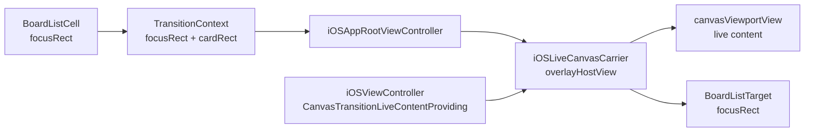

# 方案三分阶段计划

## 默认设计

- 默认只让 `canvasViewportView` 参与 live zoom；`chromeOverlayView`（返回按钮、toolbar、minimap）不作为放大主体，opening 在 handoff 后淡入，closing 在缩回前淡出。
- 转场几何统一成“`focusRect` 优先、`cardRect` 兜底”的语义；`focusRect` 代表缩略图区域或新建占位图标区域，opening 和 closing 都优先使用它。
- `snapshotShell` 保留为 fallback，不再作为长期主路径；live 路径不可用时必须显式记录 fallback 原因。

## 目标架构

## Phase 1：统一缩略图锚点几何

- 在 [MyCanvas_Ver_0/Platform/Shared/Transition/BoardListCanvasTransitionGeometry.swift](MyCanvas_Ver_0/Platform/Shared/Transition/BoardListCanvasTransitionGeometry.swift) 把当前“source 有 `previewRect`、target 只有 `cardRect`”升级为对称语义，推荐统一成 `focusRect` + `cardRect`。
- 在 [MyCanvas_Ver_0/Platform/iOS/BoardList/iOSBoardCollectionViewCell.swift](MyCanvas_Ver_0/Platform/iOS/BoardList/iOSBoardCollectionViewCell.swift) 保留现有 `transitionGeometry(in:)` 对缩略图区域的采集，但把它从“顺手带一个 `previewRect`”升级为正式的转场锚点。
- 在 [MyCanvas_Ver_0/Platform/iOS/BoardList/iOSBoardListViewController.swift](MyCanvas_Ver_0/Platform/iOS/BoardList/iOSBoardListViewController.swift) 的 target-ready 链里，为 closing 目标补出缩略图区域或新建占位图标区域，不能再只返回整卡 `cardRect`。
- 现有必须改造的锚点消费点是 [MyCanvas_Ver_0/Platform/iOS/AppRoot/iOSBoardListCanvasTransitionCarrier.swift](MyCanvas_Ver_0/Platform/iOS/AppRoot/iOSBoardListCanvasTransitionCarrier.swift) 里的 `prepareOpeningShell(using:)` 和 `resolvedClosingTargetFrame(in:)`；当前它们都只消费 `cardRect`。
- 本阶段先不切换到 live carrier，但要保证 source/target 两端都能稳定解出缩略图锚点，这样后续 live 路径和 snapshot fallback 才能共享同一套几何契约。
- 验收：existing board、新建占位、grid/list 两种布局都能拿到合法 `focusRect`；没有 `focusRect` 时仍能回退到 `cardRect`。

## Phase 2：建立 live canvas 内容提供者边界

- 在 [MyCanvas_Ver_0/Platform/iOS/iOSViewController.swift](MyCanvas_Ver_0/Platform/iOS/iOSViewController.swift) 增加一个窄接口协议，例如 `CanvasTransitionLiveContentProviding`，由 `iOSViewController` 暴露 live 转场真正需要的内容：`canvasViewportView`、所属容器 `canvasHostView`、以及转场期间 chrome 可见性控制。
- 这一步的核心依据是当前 `iOSViewController` 已通过 `installCanvasContentView(_:)` 把 `canvasViewportView` 安装到 `canvasHostView`；真实画布内容和 overlay chrome 已经天然分层。
- 在 [MyCanvas_Ver_0/Platform/iOS/AppRoot/iOSBoardListCanvasTransitionCarrier.swift](MyCanvas_Ver_0/Platform/iOS/AppRoot/iOSBoardListCanvasTransitionCarrier.swift) 落实现有但未接线的 `iOSLiveCanvasCarrierRequirements`，让工厂不再把 `.liveCanvas` 硬编码回 `iOSSnapshotShellCarrier()`。
- 在 [MyCanvas_Ver_0/Platform/iOS/AppRoot/iOSAppRootViewController.swift](MyCanvas_Ver_0/Platform/iOS/AppRoot/iOSAppRootViewController.swift) 的 opening/closing 入口，把 source/destination controller 中的 live provider 解析出来并传给 carrier factory。
- 默认设计：live 路径只动画 `canvasViewportView`，不直接挪 `chromeOverlayView`，这样更符合“缩略图内容放大”的目标，也避免把 toolbar/minimap 一起当成缩略图的一部分。
- 验收：AppRoot 能在 opening/closing 两端拿到 live content provider；`.liveCanvas` 终于有独立 carrier 实例；provider 缺失时会明确 fallback。

## Phase 3：落地 opening live carrier

- 在 [MyCanvas_Ver_0/Platform/iOS/AppRoot/iOSBoardListCanvasTransitionCarrier.swift](MyCanvas_Ver_0/Platform/iOS/AppRoot/iOSBoardListCanvasTransitionCarrier.swift) 新增 `iOSLiveCanvasCarrier`，不要把 live 逻辑继续塞进 `iOSSnapshotShellCarrier`。
- opening 主流程仍保留 [MyCanvas_Ver_0/Platform/iOS/AppRoot/iOSAppRootViewController.swift](MyCanvas_Ver_0/Platform/iOS/AppRoot/iOSAppRootViewController.swift) 现有编排：destination canvas 先 `mountViewController(..., hidden: true)`，再 layout，再交给 carrier；但 carrier 不再抓整卡 snapshot，而是把 destination 的 `canvasViewportView` 放进 overlay 中的 live 容器，从 source `focusRect` 放大到全屏。
- handoff 方案要固定：动画结束后把 `canvasViewportView` 还回 destination 的 `canvasHostView`，然后再显示 destination chrome，避免 live view 一直悬在 overlay 上。
- opening fallback 规则要明确：provider 不存在、`focusRect` 不合法、destination 尚未完成 layout、或 live view 无法安全 reparent 时，回退到 snapshot shell，并输出 fallback reason。
- 这一阶段不要求 closing 也 live；目标是先把“从缩略图内容放大到真实画布”的 opening 主路径单独跑通。
- 验收：opening 视觉主体变成缩略图内容而不是整卡；existing board 与新建占位都能进入 live opening；fallback 有可读日志。

## Phase 4：落地 closing live carrier

- 复用 [MyCanvas_Ver_0/Platform/iOS/AppRoot/iOSAppRootViewController.swift](MyCanvas_Ver_0/Platform/iOS/AppRoot/iOSAppRootViewController.swift) 当前 closing 编排与 target-ready 链，不推翻现有 `prepareTransitionTargetGeometry(for:completion:)`、`handleResolvedClosingTargetGeometry(...)`、closing trace 体系。
- closing 关键改造点是：当 BoardList target-ready 返回 `focusRect` 后，live carrier 不再缩整页 snapshot，而是直接缩当前 canvas 的 live 内容到目标缩略图区域。
- 在 [MyCanvas_Ver_0/Platform/iOS/BoardList/iOSBoardListViewController.swift](MyCanvas_Ver_0/Platform/iOS/BoardList/iOSBoardListViewController.swift) 中，把 closing 的 target geometry 结果扩展为“整卡 rect + 缩略图 rect + fallback 标记”；这样 closing 收口时能判断自己是否真的对齐了缩略图。
- closing handoff 要求对称：destination BoardList 先显示在底层，live canvas 在 overlay 缩回 `focusRect`，结束后移除 live 容器并把真实 canvas 交还/卸载，而不是把整页 canvas snapshot 淡出。
- closing fallback 与 opening 一致：缺失 target `focusRect`、board 已被删除、BoardList target-ready 失败或 live view 不可用时，退回 snapshot shell。
- 验收：从 canvas 返回时，缩回目标是缩略图区域，不是整卡；现有 closing trace 中 `requestTargetGeometry -> targetGeometryResolved` 与 target-ready 护栏不回退。

## Phase 5：补齐特殊场景与视觉对称性

- 新建板占位不是普通 preview，需要在 [MyCanvas_Ver_0/Platform/iOS/BoardList/iOSBoardCollectionViewCell.swift](MyCanvas_Ver_0/Platform/iOS/BoardList/iOSBoardCollectionViewCell.swift) 里给 placeholder icon 或 placeholder 区块定义正式 `focusRect`，不能继续把 `previewView.isHidden == true` 视为“没有缩略图就没有锚点”。
- list/grid 两种布局都要复核，尤其是 list 模式下 preview 是左侧小方块，title 在右侧；必须保证 opening/closing 都对齐 preview 而不是整行 cell。
- rename/editing、空 preview、geometry fallback、thumbnail fallback 这些路径都要统一语义：只要有合法 `focusRect`，live carrier 就应该从该区域起跳；没有时才退到 `cardRect`。
- boardlist preview 与 minimap 的共享几何层不要重做；继续复用 [MyCanvas_Ver_0/Platform/Shared/BoardList/BoardGeometryPreviewBuilder.swift](MyCanvas_Ver_0/Platform/Shared/BoardList/BoardGeometryPreviewBuilder.swift)、[MyCanvas_Ver_0/Platform/Shared/BoardList/BoardPreviewRenderer.swift](MyCanvas_Ver_0/Platform/Shared/BoardList/BoardPreviewRenderer.swift) 与 [MyCanvas_Ver_0/Canvas/Core/CanvasMiniMapViewGeometry.swift](MyCanvas_Ver_0/Canvas/Core/CanvasMiniMapViewGeometry.swift)，但 live carrier 不应耦合到 `BoardPreviewProvider` 的缓存逻辑。
- 验收：existing board、新建占位、grid/list、thumbnail/geometry fallback 这四类组合都能保持“缩略图放大/缩回”的一致语义。

## Phase 6：接入回归护栏、默认切换与灰度

- 复用 [MyCanvas_Ver_0/Platform/Shared/Transition/BoardListCanvasTransitionDebugTrace.swift](MyCanvas_Ver_0/Platform/Shared/Transition/BoardListCanvasTransitionDebugTrace.swift)、[MyCanvas_Ver_0/Platform/iOS/AppRoot/iOSAppRootViewController.swift](MyCanvas_Ver_0/Platform/iOS/AppRoot/iOSAppRootViewController.swift) 和 [MyCanvas_Ver_0/Platform/iOS/BoardList/iOSBoardListViewController.swift](MyCanvas_Ver_0/Platform/iOS/BoardList/iOSBoardListViewController.swift) 现有 trace/guardrail 体系，为 live 路径新增：carrier 选择结果、fallback reason、reparent 时长、handoff 时长、restore 成功与否。
- 保留 `snapshotShell` 作为灰度 fallback，先只在 request 构造处按开关/白名单把 `preferredCarrierKind` 切到 `.liveCanvas`；稳定后再把 [MyCanvas_Ver_0/Platform/Shared/Transition/BoardListCanvasTransitionState.swift](MyCanvas_Ver_0/Platform/Shared/Transition/BoardListCanvasTransitionState.swift) 中 `BoardListCanvasOpenRequest` / `BoardListCanvasReturnRequest` 的默认值切到 `.liveCanvas`。
- 取消/中断路径必须和完成路径一样强制 restore：无论 `completeTransition()` 还是 `cancelTransition()`，都要把 live view 还回 `canvasHostView`，避免留下空宿主或悬挂视图。
- 最终回归基线要同时看视觉与性能：opening/closing 是否真从缩略图区域起跳，target-ready 护栏是否仍健康，是否没有重新引入整页 reload 或双 refresh。
- 验收：日志中 warm opening/closing 默认走 live 路径，fallback 率可见；取消/异常路径不会把 canvas 留在 overlay；closing 性能基线不劣化。

## 关键文件

- [MyCanvas_Ver_0/Platform/iOS/AppRoot/iOSAppRootViewController.swift](MyCanvas_Ver_0/Platform/iOS/AppRoot/iOSAppRootViewController.swift)
- [MyCanvas_Ver_0/Platform/iOS/AppRoot/iOSBoardListCanvasTransitionCarrier.swift](MyCanvas_Ver_0/Platform/iOS/AppRoot/iOSBoardListCanvasTransitionCarrier.swift)
- [MyCanvas_Ver_0/Platform/iOS/AppRoot/iOSBoardListCanvasTransitionCoordinator.swift](MyCanvas_Ver_0/Platform/iOS/AppRoot/iOSBoardListCanvasTransitionCoordinator.swift)
- [MyCanvas_Ver_0/Platform/Shared/Transition/BoardListCanvasTransitionState.swift](MyCanvas_Ver_0/Platform/Shared/Transition/BoardListCanvasTransitionState.swift)
- [MyCanvas_Ver_0/Platform/Shared/Transition/BoardListCanvasTransitionGeometry.swift](MyCanvas_Ver_0/Platform/Shared/Transition/BoardListCanvasTransitionGeometry.swift)
- [MyCanvas_Ver_0/Platform/iOS/BoardList/iOSBoardCollectionViewCell.swift](MyCanvas_Ver_0/Platform/iOS/BoardList/iOSBoardCollectionViewCell.swift)
- [MyCanvas_Ver_0/Platform/iOS/BoardList/iOSBoardListViewController.swift](MyCanvas_Ver_0/Platform/iOS/BoardList/iOSBoardListViewController.swift)
- [MyCanvas_Ver_0/Platform/iOS/iOSViewController.swift](MyCanvas_Ver_0/Platform/iOS/iOSViewController.swift)
- [MyCanvas_Ver_0/Platform/iOS/Canvas/iOSCanvasViewportView.swift](MyCanvas_Ver_0/Platform/iOS/Canvas/iOSCanvasViewportView.swift)
- [MyCanvas_Ver_0/Platform/Shared/BoardList/BoardGeometryPreviewBuilder.swift](MyCanvas_Ver_0/Platform/Shared/BoardList/BoardGeometryPreviewBuilder.swift)
- [MyCanvas_Ver_0/Platform/Shared/BoardList/BoardPreviewRenderer.swift](MyCanvas_Ver_0/Platform/Shared/BoardList/BoardPreviewRenderer.swift)
- [MyCanvas_Ver_0/Canvas/Core/CanvasMiniMapViewGeometry.swift](MyCanvas_Ver_0/Canvas/Core/CanvasMiniMapViewGeometry.swift)

## 风险与控制点

- `canvasViewportView` 是高复杂度 live view，reparent 设计必须把“安装、动画、归位、取消恢复”封装进 carrier 内，不要散落在 AppRoot 与 controller 多处。
- `chromeOverlayView` 与 `canvasHostView` 是兄弟层级，默认不跟随 zoom；否则视觉会重新变成“整页界面放大”，偏离缩略图内容放大的目标。
- `focusRect` 一旦没有打通到 target 端，closing 就会退回整卡缩放；因此 `focusRect` 对称化必须先于 live carrier 的 closing 实现。
- live carrier 计划不要求一开始覆盖 macOS；当前建议 iOS 先落地，macOS 保持 snapshot，避免双端同时放大复杂度。