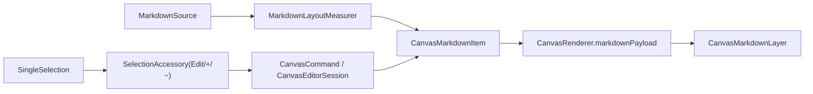

# Markdown Block 分阶段计划

## 默认前提

- `Markdown block` 作为新的 item 类型实现，不复用现有 `CanvasTextItem` 语义。
- v1 的 markdown 源文本直接 inline 存在 `board.json`，不引入 bundle / sidecar 资产。
- 初始尺寸规则：创建或首次提交内容时，按固定最大宽度排版，再计算高度。
- resize 规则：改的是 block 容器尺寸；宽度变化触发重排，高度只是可视窗口变化，不改内容字号。
- `+/-` 规则：只改 markdown 内容字号（或基础内容尺度），不直接改 block frame。
- 编辑器入口默认采用“选中后块旁 Edit 按钮 + iOS 最简独立编辑器”；共享模型/渲染从第一阶段即覆盖 iOS 与 macOS，macOS 编辑器 parity 放后续阶段。
- 默认超出 block 高度的内容先裁切显示，不在 v1 引入 block 内滚动。

## 架构主线

## 阶段 1：模型、命令骨架与持久化 schema

目标：先把 `markdown` 变成一等 item 类型，打通 Scene / BoardDocument / 命令系统的最小闭环，不改现有 text / handDrawing 语义。

- 在 [CanvasBoardItem.swift](MyCanvas_Ver_0/Canvas/Core/CanvasBoardItem.swift) 新增：
  - `CanvasBoardItemKind.markdown`
  - `CanvasMarkdownItem`
  - `CanvasBoardItem.markdown(...)`
  - `markdownItem` 访问器、几何桥接分支
- 在 [CanvasScene.swift](MyCanvas_Ver_0/Canvas/Core/CanvasScene.swift) 新增 markdown 的 `append/upsert/item/update` 分支，确保复制、删除、查找、zIndex 与选择链路都认识新类型。
- 在 [BoardDocument.swift](MyCanvas_Ver_0/Canvas/Storage/BoardDocument.swift) 新增：
  - `BoardMarkdownItemRecord`
  - `BoardItemRecord.markdown`
  - `BoardDocument.currentFormatVersion` 递增（建议 `8 -> 9`）
- 在 [BoardDocumentMapper.swift](MyCanvas_Ver_0/Canvas/Storage/BoardDocumentMapper.swift) 新增 runtime/document 双向映射，注意加载时要**保留持久化的容器 size**，不要像现有 text 那样无脑重算覆盖。
- 在 [CanvasCommand.swift](MyCanvas_Ver_0/Canvas/Editing/CanvasCommand.swift)、[CanvasCommandExecutor.swift](MyCanvas_Ver_0/Canvas/Editing/CanvasCommandExecutor.swift)、[CanvasCommandCatalog.swift](MyCanvas_Ver_0/Canvas/Editing/CanvasCommandCatalog.swift) 增加命令骨架：
  - `addMarkdownItem`
  - `beginMarkdownEdit`
  - `commitMarkdownEdit`
  - `increaseMarkdownContentSize`
  - `decreaseMarkdownContentSize`
  - 可选 `presentMarkdownEditor(itemID:)` follow-up
- 在 [CanvasEditorSession.swift](MyCanvas_Ver_0/Canvas/Editing/CanvasEditorSession.swift) 新增最小能力：
  - `canAddMarkdownItem`
  - `canBeginMarkdownEdit(withID:)`
  - `selectedMarkdownItem`
  - 新建 markdown item 的默认内容、默认字号、默认最大创建宽度常量

## 阶段 2：Markdown 测量与主画布渲染

目标：让 markdown block 在双端画布里真正渲染出来，并建立“固定宽度排版 -> 计算高度”的测量契约。

- 新建共享测量器 [CanvasMarkdownLayoutMeasurer.swift](MyCanvas_Ver_0/Platform/Shared/Rendering/CanvasMarkdownLayoutMeasurer.swift)：
  - 输入：markdown 源文本、基础字号、最大排版宽度
  - 输出：渲染用 attributed 内容 / layout 结果、测量出的内容高度
  - 仅支持基础子集：标题、段落、粗体、斜体、列表、引用、行内代码、代码块
- 在 [CanvasRenderSnapshot.swift](MyCanvas_Ver_0/Canvas/Core/CanvasRenderSnapshot.swift) 新增：
  - `CanvasMarkdownRenderPayload`
  - `CanvasRenderPayload.markdown`
- 在 [CanvasRenderer.swift](MyCanvas_Ver_0/Canvas/Core/CanvasRenderer.swift) 新增 `makeMarkdownRenderItem(...)`：
  - `screenBoundsSize = item.size * camera.zoomScale`
  - payload 中带 `markdownSource`、markdown style、`zoomScale`
  - 单选 overlay 不走 text 的“无 handles”特例
- 新建共享渲染层 [CanvasMarkdownLayer.swift](MyCanvas_Ver_0/Platform/Shared/Rendering/CanvasMarkdownLayer.swift)，并接入：
  - [iOSCanvasViewportView.swift](MyCanvas_Ver_0/Platform/iOS/Canvas/iOSCanvasViewportView.swift)
  - [macOSCanvasViewportView.swift](MyCanvas_Ver_0/Platform/macOS/Canvas/macOSCanvasViewportView.swift)
- 渲染层语义：
  - block 的 `bounds` 来自容器尺寸
  - 字号来自 `contentBaseFontSize * camera.zoomScale`
  - 容器宽度改变时重新排版
  - 高度不足时裁切内容

## 阶段 3：Resize 语义与选中态悬浮条

目标：把 markdown block 的交互语义从普通 text 分叉出来，保证“resize 改容器、+/- 改内容字号”。

- 在 [CanvasSelectionTransformState.swift](MyCanvas_Ver_0/Canvas/Editing/CanvasSelectionTransformState.swift) 新增 markdown 分支：
  - 禁止复用 `resizedTextItem(...)` 的“缩放=改字号”逻辑
  - 单选 / 组选 resize 都只提交新的几何（center/size/rotation）
- 在 [CanvasRenderer.swift](MyCanvas_Ver_0/Canvas/Core/CanvasRenderer.swift) 的 selection overlay 逻辑里，确保 markdown 单选像 image/handDrawing 一样显示 resize handles，而不是套用 text 的 `selectionHandles = []`。
- 新建共享块旁浮层基础设施（建议目录）：
  - [SelectionAccessoryHostView.swift](MyCanvas_Ver_0/Platform/Shared/SelectionAccessory/SelectionAccessoryHostView.swift)
  - [SelectionAccessoryState.swift](MyCanvas_Ver_0/Platform/Shared/SelectionAccessory/SelectionAccessoryState.swift)
  - [SelectionAccessoryLayoutSolver.swift](MyCanvas_Ver_0/Platform/Shared/SelectionAccessory/SelectionAccessoryLayoutSolver.swift)
- 参考并复用现有：
  - [CanvasContextMenuHostView.swift](MyCanvas_Ver_0/Platform/Shared/ContextMenu/CanvasContextMenuHostView.swift)
  - [CanvasChromeLayoutContext.swift](MyCanvas_Ver_0/Platform/Shared/CanvasChromeLayoutContext.swift)
- 悬浮条仅在“单选 markdown block”时出现，默认承载：
  - `Edit`
  - `-`
  - `+`
- 锚点来源建议优先用 `renderSnapshot.editOverlay.activeScreenQuad.boundingRect`，这样能与现有选区框保持一致。

## 阶段 4：iOS 最简编辑器入口

目标：先把 iOS 上的“选中 -> Edit -> 修改 markdown 源文本 -> 回写并重排”跑通。

- 在 [CanvasEditorSession.swift](MyCanvas_Ver_0/Canvas/Editing/CanvasEditorSession.swift) 增加：
  - `addMarkdownItem(...)`
  - `updateMarkdownItemContent(withID:source:style:)`
  - `increase/decreaseMarkdownContentSize`
  - 基于当前容器宽度的重新测量逻辑
- 在 [CanvasCommandExecutor.swift](MyCanvas_Ver_0/Canvas/Editing/CanvasCommandExecutor.swift) 与 [CanvasCommand.swift](MyCanvas_Ver_0/Canvas/Editing/CanvasCommand.swift) 把 `Edit` 路径接成 follow-up，默认新增 `presentMarkdownEditor(itemID:)`。
- 在 [iOSViewController.swift](MyCanvas_Ver_0/Platform/iOS/iOSViewController.swift) 接入：
  - 单选 markdown 时显示块旁 accessory
  - accessory 的 `Edit / +/-` 按钮 dispatch 到命令系统
  - 处理 `presentMarkdownEditor(itemID:)`
- 新建 iOS 最简编辑器（建议）：
  - [iOSCanvasMarkdownEditorViewController.swift](MyCanvas_Ver_0/Platform/iOS/Markdown/iOSCanvasMarkdownEditorViewController.swift)
- 第一版编辑器只做：
  - 原始 markdown 文本输入
  - Done / Cancel
  - Done 后回写 source，并按“保留当前 block 宽度、重算高度”的规则更新 item

## 阶段 5：双端预览面与 macOS 编辑 parity

目标：补齐 markdown block 在 board list / minimap / macOS 端的可见性与最小可用编辑入口。

- 在 [BoardThumbnailRenderer.swift](MyCanvas_Ver_0/Platform/Shared/BoardList/BoardThumbnailRenderer.swift) 新增 `drawMarkdownItem(...)`，确保 board 列表缩略图能画出 markdown block，而不是只显示空白占位。
- 在 [CanvasMiniMapNodeProvider.swift](MyCanvas_Ver_0/Canvas/Core/CanvasMiniMapNodeProvider.swift) / [CanvasMiniMapRenderer.swift](MyCanvas_Ver_0/Canvas/Core/CanvasMiniMapRenderer.swift) 为 markdown block 注册节点提供器，至少保证 minimap 上有正确的占位矩形。
- 在 [macOSViewController.swift](MyCanvas_Ver_0/Platform/macOS/macOSViewController.swift) 接入与 iOS 对齐的：
  - 单选 markdown accessory
  - `Edit / +/-` 命令分发
- macOS 编辑器 parity 可按最简形态补：
  - 新建 [macOSCanvasMarkdownEditorViewController.swift](MyCanvas_Ver_0/Platform/macOS/Markdown/macOSCanvasMarkdownEditorViewController.swift)
  - 若想继续压缩范围，也可以先做最简单 sheet，而不是复杂 inline editor

## 阶段 6：回归测试与兼容性收口

目标：确保新增类型不会破坏现有 text / handDrawing / board 持久化与选择变换语义。

- 数据/存储测试：
  - `BoardDocument` encode/decode 新增 `markdown` case
  - `BoardDocumentMapper` runtime/document round-trip
  - 旧 board（无 markdown）继续可读
- 渲染/测量测试：
  - 固定最大宽度下的 markdown 高度测量
  - resize 改宽时重排、改高时不改字号
  - `+/-` 只改内容字号，不直接改 frame
- 交互测试：
  - 单选 markdown 显示 handles
  - 单选 markdown 显示 accessory，text/handDrawing 不误显示 markdown accessory
- 预览测试：
  - board thumbnail
  - minimap
- 明确记录兼容风险：`BoardDocument.currentFormatVersion` 提升后，旧版本客户端对 `type: markdown` 无法前向兼容读取。

## 关键落点文件

- 模型与几何：[CanvasBoardItem.swift](MyCanvas_Ver_0/Canvas/Core/CanvasBoardItem.swift), [CanvasScene.swift](MyCanvas_Ver_0/Canvas/Core/CanvasScene.swift), [CanvasSelectionTransformState.swift](MyCanvas_Ver_0/Canvas/Editing/CanvasSelectionTransformState.swift)
- 渲染链：[CanvasRenderSnapshot.swift](MyCanvas_Ver_0/Canvas/Core/CanvasRenderSnapshot.swift), [CanvasRenderer.swift](MyCanvas_Ver_0/Canvas/Core/CanvasRenderer.swift), [iOSCanvasViewportView.swift](MyCanvas_Ver_0/Platform/iOS/Canvas/iOSCanvasViewportView.swift), [macOSCanvasViewportView.swift](MyCanvas_Ver_0/Platform/macOS/Canvas/macOSCanvasViewportView.swift)
- 测量与层：[CanvasTextLayoutMeasurer.swift](MyCanvas_Ver_0/Platform/Shared/Rendering/CanvasTextLayoutMeasurer.swift), `CanvasMarkdownLayoutMeasurer.swift`, `CanvasMarkdownLayer.swift`
- 命令与 Session：[CanvasCommand.swift](MyCanvas_Ver_0/Canvas/Editing/CanvasCommand.swift), [CanvasCommandExecutor.swift](MyCanvas_Ver_0/Canvas/Editing/CanvasCommandExecutor.swift), [CanvasCommandCatalog.swift](MyCanvas_Ver_0/Canvas/Editing/CanvasCommandCatalog.swift), [CanvasEditorSession.swift](MyCanvas_Ver_0/Canvas/Editing/CanvasEditorSession.swift)
- 持久化：[BoardDocument.swift](MyCanvas_Ver_0/Canvas/Storage/BoardDocument.swift), [BoardDocumentMapper.swift](MyCanvas_Ver_0/Canvas/Storage/BoardDocumentMapper.swift)
- 平台 UI：[iOSViewController.swift](MyCanvas_Ver_0/Platform/iOS/iOSViewController.swift), [macOSViewController.swift](MyCanvas_Ver_0/Platform/macOS/macOSViewController.swift), [CanvasContextMenuHostView.swift](MyCanvas_Ver_0/Platform/Shared/ContextMenu/CanvasContextMenuHostView.swift), [CanvasChromeLayoutContext.swift](MyCanvas_Ver_0/Platform/Shared/CanvasChromeLayoutContext.swift), [iOSCanvasTextEditorOverlayView.swift](MyCanvas_Ver_0/Platform/iOS/Canvas/iOSCanvasTextEditorOverlayView.swift)

