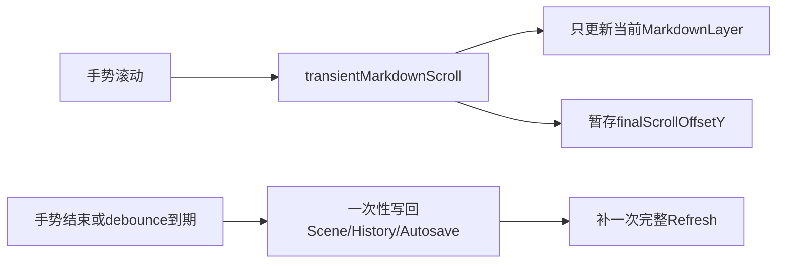

# Markdown 滚动优化方案

## 目标

将长 markdown block 的内部滚动从“每次手势增量都触发整画布刷新”改成“滚动期间只更新当前 markdown layer 的可视偏移与滚动条，手势结束后再一次性提交文档态 `scrollOffsetY`”，优先解决卡顿根因，而不是只做表层节流。

## 现状判断

- 当前滚动热路径在 [MyCanvas_Ver_0/Platform/iOS/iOSViewController.swift](MyCanvas_Ver_0/Platform/iOS/iOSViewController.swift) 的 `consumeMarkdownScrollIfNeeded(...)` 中，每次有效增量都会调用 `requestCanvasRefresh("scroll markdown item")`，而后续 `performCanvasRefresh(...)` 会重建 `makeCanvasSnapshot()`、`canvasViewportView.apply(...)`、`refreshMiniMap()` 与 accessory 刷新。
- 当前 `scrollOffsetY` 更新在 [MyCanvas_Ver_0/Canvas/Editing/CanvasEditorSession.swift](MyCanvas_Ver_0/Canvas/Editing/CanvasEditorSession.swift) 的 `updateMarkdownItemScrollOffset(...) -> normalizedMarkdownItem(...)` 中会再次执行 `measuredMarkdownContentHeight(...)`；而滚动前的命中消费链也会再测一次，长 markdown 会放大这一成本。
- markdown 渲染层本身在 [MyCanvas_Ver_0/Platform/Shared/Rendering/CanvasMarkdownContentLayer.swift](MyCanvas_Ver_0/Platform/Shared/Rendering/CanvasMarkdownContentLayer.swift) 已经具备轻量位移能力：同一份 `markdownSource/style/width` 下，`scrollOffsetY` 主要只改 `applyScrollOffset(...)`，并不会天然要求重做整个位图渲染。
- 当前 markdown 相关 trace 在 [MyCanvas_Ver_0/Canvas/Core/CanvasRenderer.swift](MyCanvas_Ver_0/Canvas/Core/CanvasRenderer.swift)、[MyCanvas_Ver_0/Platform/Shared/Rendering/CanvasMarkdownLayoutMeasurer.swift](MyCanvas_Ver_0/Platform/Shared/Rendering/CanvasMarkdownLayoutMeasurer.swift)、[MyCanvas_Ver_0/Platform/Shared/Rendering/CanvasMarkdownContentLayer.swift](MyCanvas_Ver_0/Platform/Shared/Rendering/CanvasMarkdownContentLayer.swift)、[MyCanvas_Ver_0/Platform/Shared/Rendering/CanvasMarkdownBitmapRenderer.swift](MyCanvas_Ver_0/Platform/Shared/Rendering/CanvasMarkdownBitmapRenderer.swift) 仍处于开启状态，高频滚动时会放大主线程与控制台 IO 成本。
- 当前滚动事务在 debounce 后会走 history commit，并通过 [MyCanvas_Ver_0/Canvas/Storage/BoardSaveCoordinator.swift](MyCanvas_Ver_0/Canvas/Storage/BoardSaveCoordinator.swift) / [MyCanvas_Ver_0/Canvas/Storage/BoardStore.swift](MyCanvas_Ver_0/Canvas/Storage/BoardStore.swift) 进入 autosave；若最终被视为 content 变更，还会触发 persisted thumbnail 重建。这不是滚动时卡顿的第一主因，但应一起收敛。

## 目标结构

## 实施方案

### 1. 在 iOS controller 引入 markdown scroll 的 transient fast path

- 入口文件：[MyCanvas_Ver_0/Platform/iOS/iOSViewController.swift](MyCanvas_Ver_0/Platform/iOS/iOSViewController.swift)
- 目标：在 `.scrollingMarkdownItem` 生命周期内，不再对每个 scroll delta 调 `requestCanvasRefresh(...)`。
- 做法：
  - 扩展 `PointerMarkdownScrollState`，持有滚动开始时需要复用的只读信息，例如 `initialScrollOffsetY`、`contentHeight`、`maxScrollOffsetY`、以及 transient 当前值。
  - 将 `scrollMarkdownItem(...)` / `consumeMarkdownScrollIfNeeded(...)` 拆成两层：
    - 滚动中：只计算新的 transient offset，并走 viewport fast path；不做 `makeCanvasSnapshot()`。
    - 手势结束/取消/延迟提交时：再把最终 offset 一次性写回 `editorSession.updateMarkdownItemScrollOffset(...)`，并触发一次完整 refresh。
  - 保留现有 history transaction 边界，但把 document/model 写回从“每帧发生”改成“滚动结束发生”。

### 2. 在 viewport/layer 侧提供“只更新当前 markdown layer”的轻量接口

- 入口文件：
  - [MyCanvas_Ver_0/Platform/iOS/Canvas/iOSCanvasViewportView.swift](MyCanvas_Ver_0/Platform/iOS/Canvas/iOSCanvasViewportView.swift)
  - [MyCanvas_Ver_0/Platform/Shared/Rendering/CanvasMarkdownItemLayer.swift](MyCanvas_Ver_0/Platform/Shared/Rendering/CanvasMarkdownContentLayer.swift)
- 目标：让 controller 能直接把 transient scroll offset 推给当前 markdown layer，而不重建整张 snapshot。
- 做法：
  - 在 viewport 层增加按 `itemID` 更新 markdown scroll 的轻量 API，例如只命中既有 `CanvasMarkdownItemLayer`。
  - 在 `CanvasMarkdownItemLayer` / `CanvasMarkdownContentLayer` 暴露一个仅用于 transient scroll 的 update path，只更新：
    - `contentLayer.position.y`
    - scrollbar thumb / track 的几何
  - 不触碰 world geometry、selection overlay、其他 item layer，也不重新 raster bitmap。
- 注意：transient layer 更新完成后，仍要保证完整 refresh 后的状态与 transient 状态一致，避免跳变。

### 3. 去掉滚动热路径里的重复全文测量

- 入口文件：[MyCanvas_Ver_0/Canvas/Editing/CanvasEditorSession.swift](MyCanvas_Ver_0/Canvas/Editing/CanvasEditorSession.swift)
- 目标：同一次滚动过程中，不再反复执行 `CanvasMarkdownLayoutMeasurer.measuredContentHeight(...)`。
- 做法：
  - 把 `contentHeight` / `maxScrollOffsetY` 预先算好，塞进 `PointerMarkdownScrollState`，滚动期间复用。
  - 让 `updateMarkdownItemScrollOffset(...)` 在最终 commit 时支持使用外部已知的 `contentHeight` 做 clamp，避免再次走 `normalizedMarkdownItem(...)` 的全文测量。
  - 若需要在 session 层通用化，可新增基于 `markdownSource + style + width` 的轻量 height cache；但这一步优先服务 scroll fast path，不先做泛化重构。

### 4. 降低滚动阶段的无关刷新与日志噪音

- 入口文件：
  - [MyCanvas_Ver_0/Platform/iOS/iOSViewController.swift](MyCanvas_Ver_0/Platform/iOS/iOSViewController.swift)
  - [MyCanvas_Ver_0/Canvas/Core/CanvasRenderer.swift](MyCanvas_Ver_0/Canvas/Core/CanvasRenderer.swift)
  - [MyCanvas_Ver_0/Platform/Shared/Rendering/CanvasMarkdownLayoutMeasurer.swift](MyCanvas_Ver_0/Platform/Shared/Rendering/CanvasMarkdownLayoutMeasurer.swift)
  - [MyCanvas_Ver_0/Platform/Shared/Rendering/CanvasMarkdownContentLayer.swift](MyCanvas_Ver_0/Platform/Shared/Rendering/CanvasMarkdownContentLayer.swift)
  - [MyCanvas_Ver_0/Platform/Shared/Rendering/CanvasMarkdownBitmapRenderer.swift](MyCanvas_Ver_0/Platform/Shared/Rendering/CanvasMarkdownBitmapRenderer.swift)
- 目标：先把最明显的热路径噪音拿掉，避免干扰 fast path 的真实收益。
- 做法：
  - markdown trace 默认关闭，或至少收敛到 `#if DEBUG` / 集中诊断开关。
  - 在 transient scroll 期间跳过 `refreshMiniMap()` 与 accessory 刷新；完整 refresh 时再统一补齐。
  - 保留必要的异常诊断，但避免每个增量都 `print` payload / measure / draw trace。

### 5. 收敛滚动结束后的持久化链路

- 入口文件：
  - [MyCanvas_Ver_0/Platform/iOS/iOSViewController.swift](MyCanvas_Ver_0/Platform/iOS/iOSViewController.swift)
  - [MyCanvas_Ver_0/Canvas/Editing/CanvasEditorSession.swift](MyCanvas_Ver_0/Canvas/Editing/CanvasEditorSession.swift)
  - [MyCanvas_Ver_0/Canvas/Storage/BoardSaveCoordinator.swift](MyCanvas_Ver_0/Canvas/Storage/BoardStore.swift)
- 目标：保留你已经要求的 `scrollOffsetY` 持久化、undo/redo、duplicate 语义，但避免高频滚动把保存链拖得过重。
- 做法：
  - 滚动过程中不触发文档级 autosave；只在 scroll transaction commit 时提交一次。
  - 先保持现有持久化合同不变，确保功能正确；如果后续 profile 显示 thumbnail 仍是瓶颈，再考虑把 scroll 相关保存从 content 更新中拆分出去，作为第二阶段优化，而不是这次首改就动文档语义。

## 验证计划

- 针对 [MyCanvas_Ver_0Tests/CanvasMarkdownLayerTests.swift](MyCanvas_Ver_0Tests/CanvasMarkdownLayerTests.swift) 增加/调整测试，覆盖：
  - transient scroll 不触发 layout width/bitmap 失效
  - 最终 commit 后 `scrollOffsetY` 仍能正确恢复当前视觉位置
  - scrollbar 在 transient scroll 与 commit 后的位置一致
- 针对 [MyCanvas_Ver_0Tests/CanvasMarkdownContractTests.swift](MyCanvas_Ver_0Tests/CanvasMarkdownContractTests.swift) 保留并补充合同：
  - `scrollOffsetY` 持久化
  - undo/redo 后滚动位置正确
  - duplicate 后滚动位置正确
- 运行 iOS 定向验证，重点比较：
  - 长 markdown 滚动时的主线程手感
  - minimap / selection accessory 是否在 scroll 结束后恢复正确
  - 快速连续滚动后保存与恢复是否正确

## 风险与约束

- transient path 会让滚动中的视觉状态先于 `lastRenderSnapshot`，因此命中测试、selection accessory 锚点、以及 minimap 必须允许在滚动进行时短暂滞后，并在 commit 后补齐。
- 若滚动过程中插入缩放/切换 selection/切换 workspace mode，需要明确定义优先级，避免 transient scroll 状态泄漏。
- 这次优先聚焦 iOS 的 scroll 热路径和 shared markdown pipeline；如果结果成立，再按同一模式对 [MyCanvas_Ver_0/Platform/macOS/macOSViewController.swift](MyCanvas_Ver_0/Platform/macOS/macOSViewController.swift) 做对称治理。

