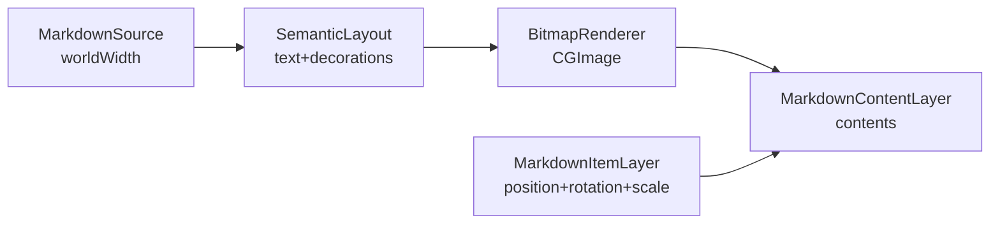

# Markdown 方案2 分阶段计划

## 目标

同时解决两类问题：

- canvas 缩放时 markdown 内容跳动
- markdown 中 code block 的灰色背景 panel 与文字语义不一致，缩小时显得过大

最终目标架构：

- markdown 布局稳定在世界空间，不再把相机 zoom 直接喂给文本重排
- code block 背景不再依赖 `NSAttributedString.backgroundColor`，而是独立 decoration
- 主画布显示对象从 `CATextLayer` 改为位图内容层，zoom 期间大多数帧只改几何，不改布局
- 通过分桶重栅格保证高倍缩放下的清晰度

## 现有约束

- 模型层里 markdown 的容器尺寸语义不能变：[CanvasBoardItem.swift](/Users/shaun/cloudDev/MyCanvas_Ver_0/MyCanvas_Ver_0/Canvas/Core/CanvasBoardItem.swift)
  - `CanvasMarkdownItem.size` 仍然代表画布上的显式容器尺寸，而不是仅内容尺寸。
- 编辑提交链必须保持：[CanvasEditorSession.swift](/Users/shaun/cloudDev/MyCanvas_Ver_0/MyCanvas_Ver_0/Canvas/Editing/CanvasEditorSession.swift)
  - `addMarkdownItem(...)` 仍按默认宽度先测高。
  - `commitMarkdownEdit(...)` / `updateMarkdownItemContent(...)` 仍按当前 `item.size.width` 重算高度并写回。
- 选区、旋转、accessory、overlay 依赖当前 renderer 的屏幕几何，不能破坏：[CanvasRenderer.swift](/Users/shaun/cloudDev/MyCanvas_Ver_0/MyCanvas_Ver_0/Canvas/Core/CanvasRenderer.swift)
  - `screenQuad`、`screenFrame`、`screenCenter`、`screenBoundsSize` 仍要继续产出并维持语义。
- minimap / preview seed 目前只依赖 world quad 与持久化几何，可先保持不动：[CanvasMiniMapNodeProvider.swift](/Users/shaun/cloudDev/MyCanvas_Ver_0/MyCanvas_Ver_0/Canvas/Core/CanvasMiniMapNodeProvider.swift)、[BoardGeometryPreviewBuilder.swift](/Users/shaun/cloudDev/MyCanvas_Ver_0/MyCanvas_Ver_0/Platform/Shared/BoardList/BoardGeometryPreviewBuilder.swift)

## 阶段 0：冻结契约与迁移边界

目标：先把不能破坏的契约写清楚，避免后面改渲染时把已有行为打散。

涉及文件：

- [CanvasBoardItem.swift](/Users/shaun/cloudDev/MyCanvas_Ver_0/MyCanvas_Ver_0/Canvas/Core/CanvasBoardItem.swift)
- [CanvasRenderer.swift](/Users/shaun/cloudDev/MyCanvas_Ver_0/MyCanvas_Ver_0/Canvas/Core/CanvasRenderer.swift)
- [CanvasRenderSnapshot.swift](/Users/shaun/cloudDev/MyCanvas_Ver_0/MyCanvas_Ver_0/Canvas/Core/CanvasRenderSnapshot.swift)
- [CanvasEditorSession.swift](/Users/shaun/cloudDev/MyCanvas_Ver_0/MyCanvas_Ver_0/Canvas/Editing/CanvasEditorSession.swift)

要冻结的规则：

- `CanvasMarkdownItem.size.width` 是唯一的布局宽度来源。
- `CanvasMarkdownItem.size.height` 仍然是容器高度/裁剪高度，不自动等同于内容 intrinsic height。
- `CanvasRenderItem.screenQuad/screenFrame/screenCenter` 继续由 world 几何映射得到，用于选区、旋转、命中与 accessory anchor。
- markdown 的内容布局缓存不能反向污染模型层；模型层只保留源码、style、size、center、rotation。

验收：

- 写清主画布与编辑链的契约说明后，再进入代码迁移；后续阶段都以这些契约为回归基线。

## 阶段 1：升级为语义布局器

目标：把 `CanvasMarkdownLayoutMeasurer` 从“只产出 attributed string”的工具，升级成“产出文本布局 + decorations”的语义布局器。

核心文件：

- [CanvasMarkdownLayoutMeasurer.swift](/Users/shaun/cloudDev/MyCanvas_Ver_0/MyCanvas_Ver_0/Platform/Shared/Rendering/CanvasMarkdownLayoutMeasurer.swift)
- 新增 [CanvasMarkdownLayoutModel.swift](/Users/shaun/cloudDev/MyCanvas_Ver_0/MyCanvas_Ver_0/Platform/Shared/Rendering/CanvasMarkdownLayoutModel.swift)
- 测试：[CanvasMarkdownLayoutMeasurerTests.swift](/Users/shaun/cloudDev/MyCanvas_Ver_0/MyCanvas_Ver_0Tests/CanvasMarkdownLayoutMeasurerTests.swift)

实施点：

- 新增布局结果模型，例如：
  - `CanvasMarkdownLayoutResult`
  - `CanvasMarkdownDecoration`
  - `CanvasMarkdownDecorationKind`
- 第一版只先把 fenced code block 背景 panel 抽成独立 decoration。
- 去掉 code block 对 `.backgroundColor` 的主依赖，让 panel rect 来自块级布局，而不是 typographic background box。
- 保留 `attributedText`，这样后续 bitmap renderer 与过渡期 thumbnail 都能复用现有文本绘制能力。

为什么先做这一步：

- 这一步不改主画布显示对象，风险最低。
- 它先把“灰底过大”的根因从文本属性里拿出来，后面自绘/位图化才有明确输入。

验收：

- 新布局结果能产出 code block decoration rect。
- 小字号下 decoration padding 有上下限，不再无限偏大。
- `measuredContentHeight(...)` 的现有语义不被破坏。

## 阶段 2：新增共享 bitmap renderer，并先接 thumbnail

目标：先把“语义布局结果 -> 自定义绘制 -> CGImage”跑通，但暂时不切主画布。

核心文件：

- 新增 [CanvasMarkdownBitmapRenderer.swift](/Users/shaun/cloudDev/MyCanvas_Ver_0/MyCanvas_Ver_0/Platform/Shared/Rendering/CanvasMarkdownBitmapRenderer.swift)
- 接入 [BoardThumbnailRenderer.swift](/Users/shaun/cloudDev/MyCanvas_Ver_0/MyCanvas_Ver_0/Platform/Shared/BoardList/BoardThumbnailRenderer.swift)

实施点：

- `CanvasMarkdownBitmapRenderer` 输入：
  - `CanvasMarkdownLayoutResult`
  - `rasterScale`
- 绘制顺序固定：
  1. 先画 decorations
  2. 再画 attributed text
  3. 输出 `CGImage`
- `BoardThumbnailRenderer.drawMarkdownItem(...)` 先切到共享 bitmap renderer，作为语义和绘制顺序的验证场。

为什么先接 thumbnail：

- thumbnail 没有 pinch 交互，能隔离变量。
- 可以先证明 code block panel 的视觉语义稳定，再进入主画布改造。

验收：

- board thumbnail 里的 code block panel 在小尺寸下不再夸张偏大。
- decorations 与文字对齐稳定。
- thumbnail 行为不影响主画布现状。

## 阶段 3：主画布切换为 ItemLayer + ContentLayer

目标：真正切断“camera zoom 参与 markdown 重排”的链路，从根上解决跳动。

核心文件：

- [CanvasRenderSnapshot.swift](/Users/shaun/cloudDev/MyCanvas_Ver_0/MyCanvas_Ver_0/Canvas/Core/CanvasRenderSnapshot.swift)
- [CanvasRenderer.swift](/Users/shaun/cloudDev/MyCanvas_Ver_0/MyCanvas_Ver_0/Canvas/Core/CanvasRenderer.swift)
- 将 [CanvasMarkdownLayer.swift](/Users/shaun/cloudDev/MyCanvas_Ver_0/MyCanvas_Ver_0/Platform/Shared/Rendering/CanvasMarkdownLayer.swift) 拆为：
  - [CanvasMarkdownItemLayer.swift](/Users/shaun/cloudDev/MyCanvas_Ver_0/MyCanvas_Ver_0/Platform/Shared/Rendering/CanvasMarkdownItemLayer.swift)
  - [CanvasMarkdownContentLayer.swift](/Users/shaun/cloudDev/MyCanvas_Ver_0/MyCanvas_Ver_0/Platform/Shared/Rendering/CanvasMarkdownContentLayer.swift)
- 接入：
  - [iOSCanvasViewportView.swift](/Users/shaun/cloudDev/MyCanvas_Ver_0/MyCanvas_Ver_0/Platform/iOS/Canvas/iOSCanvasViewportView.swift)
  - [macOSCanvasViewportView.swift](/Users/shaun/cloudDev/MyCanvas_Ver_0/MyCanvas_Ver_0/Platform/macOS/Canvas/macOSCanvasViewportView.swift)

实施点：

- `CanvasMarkdownRenderPayload` 改语义，不再表达“按当前屏幕宽度排版”。
- payload 至少携带：
  - `markdownSource`
  - `style`
  - `logicalSize` 或 `logicalWidth`
  - `cameraZoomScale`
- `CanvasMarkdownItemLayer`：
  - 负责 `position`、`rotation`、`zIndex`、裁剪、外层 scale
  - `bounds` 使用 markdown 容器的逻辑尺寸
- `CanvasMarkdownContentLayer`：
  - 负责显示 bitmap `contents`
  - 不参与 camera zoom 布局
- `CanvasRenderer.makeMarkdownRenderItem(...)`：
  - 保持 `screenQuad/screenFrame/screenCenter` 的现有几何契约
  - markdown 内容布局宽度改为 `CanvasMarkdownItem.size.width`

为什么这一步能解决跳动：

- zoom 时主画布大多数帧只改外层几何，不再每帧重新 parse + reflow + 重新生成富文本内容。
- code block panel 与文字来自同一张位图，缩放时会一起稳定变化。

验收：

- 快速 pinch 时，markdown 内容结构不再跳动。
- 选区 outline、handles、rotation preview、selection accessory 锚点保持正确，因为 renderer 的屏幕几何契约没变。
- markdown block 的内容大小不会像之前错误方案那样失真。

## 阶段 4：加入分桶重栅格与缓存

目标：在不重排的前提下，解决高倍 zoom 下位图模糊的问题。

核心文件：

- [CanvasMarkdownContentLayer.swift](/Users/shaun/cloudDev/MyCanvas_Ver_0/MyCanvas_Ver_0/Platform/Shared/Rendering/CanvasMarkdownContentLayer.swift)
- [CanvasMarkdownBitmapRenderer.swift](/Users/shaun/cloudDev/MyCanvas_Ver_0/MyCanvas_Ver_0/Platform/Shared/Rendering/CanvasMarkdownBitmapRenderer.swift)
- 测试：[CanvasMarkdownLayerTests.swift](/Users/shaun/cloudDev/MyCanvas_Ver_0/MyCanvas_Ver_0Tests/CanvasMarkdownLayerTests.swift)

实施点：

- 缓存分成两层：
  - `layout cache key = markdownSource + style + logicalWidth`
  - `bitmap cache key = layout key + rasterScaleBucket`
- zoom 时：
  - 同 bucket 内只改 outer transform
  - 跨 bucket 时只重栅格，不重布局
- bucket 可以先做离散倍率桶，保持实现简单可预测。

为什么这一步不能前置：

- 只有在第 3 步把布局改到世界空间之后，bucket 才真正只影响清晰度，而不再影响换行/字号语义。

验收：

- 同一 bucket 内连续 pinch 不重 layout。
- 跨 bucket 时只重 bitmap，不重语义布局。
- 高倍 zoom 清晰度明显改善，不出现长期模糊。

## 阶段 5：统一 resize 提交语义与 parity 收口

目标：收尾所有依赖 markdown 容器宽度变化的路径，并让 thumbnail/preview/minimap 行为保持一致。

核心文件：

- [CanvasEditorSession.swift](/Users/shaun/cloudDev/MyCanvas_Ver_0/MyCanvas_Ver_0/Canvas/Editing/CanvasEditorSession.swift)
- [CanvasSelectionTransformState.swift](/Users/shaun/cloudDev/MyCanvas_Ver_0/MyCanvas_Ver_0/Canvas/Editing/CanvasSelectionTransformState.swift)
- [iOSViewController.swift](/Users/shaun/cloudDev/MyCanvas_Ver_0/MyCanvas_Ver_0/Platform/iOS/iOSViewController.swift)
- [macOSViewController.swift](/Users/shaun/cloudDev/MyCanvas_Ver_0/MyCanvas_Ver_0/Platform/macOS/macOSViewController.swift)
- [BoardThumbnailRenderer.swift](/Users/shaun/cloudDev/MyCanvas_Ver_0/MyCanvas_Ver_0/Platform/Shared/BoardList/BoardThumbnailRenderer.swift)
- [MarkdownPreviewParityTests.swift](/Users/shaun/cloudDev/MyCanvas_Ver_0/MyCanvas_Ver_0Tests/MarkdownPreviewParityTests.swift)

实施点：

- 统一 markdown resize 宽度变化后的提交语义：
  - 只要 markdown 容器宽度变化，提交时就按新宽度重算内容高度并写回 `item.size.height`。
- 保证 markdown editor 提交链继续复用 `updateMarkdownItemContent(...)` 的语义。
- thumbnail 路径改成和主画布共用同一套 semantic layout + bitmap renderer。
- minimap / preview seed 继续只依赖 world 几何，不需要引入正文绘制复杂度。

为什么这一步放最后：

- 主画布稳定后，再统一 parity，能避免把交互重构和展示收口混在一起。

验收：

- resize 后 markdown 容器宽度变化会稳定触发 reflow，高度正确回写。
- 编辑器提交、主画布、thumbnail 在 code block panel 语义上保持一致。
- minimap / selection / accessory 行为不回退。

## 风险与对应策略

- `CATextLayer` 切换到 bitmap layer 后，测试基线会变化：
  - 先保留 `CanvasMarkdownLayoutMeasurer` 的 `attributedText` 输出，降低第一波改造风险。
- world-space 布局与现有 resize 语义可能冲突：
  - 将“宽度变化触发重算高度”作为单独收口阶段，不和 layer 架构改造耦合在一起。
- thumbnail 与主画布可能短时间内出现风格差异：
  - 通过第 2 步先共享 renderer，第 5 步再完成 parity 收口。

## 推荐执行顺序

- 先做阶段 1 和阶段 2，把 code block panel 语义与自绘链打通。
- 然后直接做阶段 3，把主问题“缩放跳动”从根上切断。
- 阶段 4 只负责清晰度与性能，不再改 markdown 布局语义。
- 阶段 5 最后收口交互与 preview parity。

