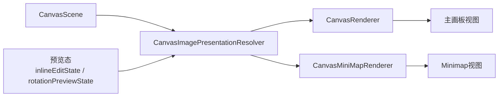

# Minimap 分阶段计划

## 目标

- 为当前画板新增 `minimap`，支持：整块画板缩略范围、灰色占位矩形显示图片位置、裁切后可见区域与旋转角度同步、当前视口框、点击/拖动快速定位主画板。
- `minimap` 的位置与大小先做成代码层可配置，不进入文档持久化；同时保证不与现有按钮重合。
- 当前版本仍以图片元素为主，但数据结构与渲染接口要为未来的文字/贴纸/形状留好扩展点。

## 现状与约束

- 主画板不是 `UIScrollView`，而是 `UIView/NSView` 外壳 + `CALayer` 树。关键参考文件：`[MyCanvas_Ver_0/Platform/iOS/Canvas/iOSCanvasViewportView.swift](MyCanvas_Ver_0/Platform/iOS/Canvas/iOSCanvasViewportView.swift)`、`[MyCanvas_Ver_0/Platform/macOS/Canvas/macOSCanvasViewportView.swift](MyCanvas_Ver_0/Platform/macOS/Canvas/macOSCanvasViewportView.swift)`、`[MyCanvas_Ver_0/Platform/Shared/Rendering/CanvasImageLayer.swift](MyCanvas_Ver_0/Platform/Shared/Rendering/CanvasImageLayer.swift)`。
- 相机与视口范围由 `[MyCanvas_Ver_0/Canvas/Core/CanvasCamera.swift](MyCanvas_Ver_0/Canvas/Core/CanvasCamera.swift)` 管理，`visibleWorldRect` 可直接作为 minimap 视口框来源。
- 当前运行时元素本质上只有图片链路：`[MyCanvas_Ver_0/Canvas/Core/CanvasImageItem.swift](MyCanvas_Ver_0/Canvas/Core/CanvasImageItem.swift)` + `[MyCanvas_Ver_0/Canvas/Core/CanvasScene.swift](MyCanvas_Ver_0/Canvas/Core/CanvasScene.swift)`。
- 主渲染器 `[MyCanvas_Ver_0/Canvas/Core/CanvasRenderer.swift](MyCanvas_Ver_0/Canvas/Core/CanvasRenderer.swift)` 会按当前视口裁剪 `visibleItems`，不能直接复用来做“整板内容分布”的 minimap。
- 裁切与旋转存在独立预览态：`[MyCanvas_Ver_0/Canvas/Core/CanvasInlineEditState.swift](MyCanvas_Ver_0/Canvas/Core/CanvasInlineEditState.swift)` 以及 controller 内的 `rotationPreviewState`。如果 minimap 只读正式 `scene`，在 crop/rotate 拖拽过程中会和主画板短时间不一致。
- iOS 与 macOS 的按钮都直接压在 controller 根视图右下侧，且按钮宽度会随标题变化，因此 minimap 不能用写死 inset 的方式避让。关键参考文件：`[MyCanvas_Ver_0/Platform/iOS/iOSViewController.swift](MyCanvas_Ver_0/Platform/iOS/iOSViewController.swift)`、`[MyCanvas_Ver_0/Platform/macOS/macOSViewController.swift](MyCanvas_Ver_0/Platform/macOS/macOSViewController.swift)`。

## 目标架构

## 范围界定

- 本期不改 `[MyCanvas_Ver_0/Canvas/Storage/BoardDocument.swift](MyCanvas_Ver_0/Canvas/Storage/BoardDocument.swift)` 与 `[MyCanvas_Ver_0/Canvas/Storage/BoardDocumentMapper.swift](MyCanvas_Ver_0/Canvas/Storage/BoardDocumentMapper.swift)`，即不把 minimap 位置/大小写入存储。
- 本期不引入文字/贴纸/形状的完整 runtime model，但 minimap 的数据结构不能绑死在 image-only 的渲染语义上。
- 本期优先完成 iOS/macOS 两端一致的基础体验；视觉精修、动画、样式微调放在功能闭环之后。

## Phase 1：抽取共享几何解析层

- 新增 `[MyCanvas_Ver_0/Canvas/Core/CanvasImagePresentation.swift](MyCanvas_Ver_0/Canvas/Core/CanvasImagePresentation.swift)` 与 `[MyCanvas_Ver_0/Canvas/Core/CanvasImagePresentationResolver.swift](MyCanvas_Ver_0/Canvas/Core/CanvasImagePresentationResolver.swift)`。
- 目标是把 `CanvasImageItem`、`CanvasInlineEditState`、`CanvasRotationPreviewState` 统一解释成“当前应显示的几何结果”，而不是让 `CanvasRenderer` 与 minimap renderer 各自重复理解预览态。
- 这层至少要产出：`visibleWorldQuad`、`fullImageWorldQuad`、`visibleCenter`、`visibleSize`、`effectiveRotationRadians`、`effectiveCropRectNormalized`、`zIndex`。
- 关键原则：
  - minimap 永远使用 `visibleWorldQuad`，即当前用户真正看到的裁切后区域。
  - 主画板在 crop 编辑模式下仍保留“完整图片 + crop overlay”的现有语义，因此后续主 renderer 与 minimap renderer 会共用 resolver，但不会共用最终渲染策略。
- 完成后，先把 `[MyCanvas_Ver_0/Canvas/Core/CanvasRenderer.swift](MyCanvas_Ver_0/Canvas/Core/CanvasRenderer.swift)` 内部对 preview item 的零散逻辑迁移到 resolver，避免两套几何语义并存。

## Phase 2：新增 minimap 专用 snapshot 与 renderer

- 新增 `[MyCanvas_Ver_0/Canvas/Core/CanvasMiniMapSnapshot.swift](MyCanvas_Ver_0/Canvas/Core/CanvasMiniMapSnapshot.swift)` 与 `[MyCanvas_Ver_0/Canvas/Core/CanvasMiniMapRenderer.swift](MyCanvas_Ver_0/Canvas/Core/CanvasMiniMapRenderer.swift)`。
- `CanvasMiniMapSnapshot` 至少包含：
  - `boardWorldRect`
  - `displayWorldRect`
  - `visibleWorldRect`
  - `nodes`
  - `configuration` 所需的布局输入
- `nodes` 第一版只填图片，但字段设计成通用节点：`id`、`kind`、`worldQuad`、`zIndex`。这样后续文字/贴纸/形状接入时，不需要重写 minimap view 与布局逻辑。
- `CanvasMiniMapRenderer` 不复用 `[MyCanvas_Ver_0/Canvas/Core/CanvasRenderSnapshot.swift](MyCanvas_Ver_0/Canvas/Core/CanvasRenderSnapshot.swift)`，因为主 snapshot 已经混入主画板专属语义（可见裁剪、edit overlay、crop 模式下完整图显示）。
- `displayWorldRect` 默认取 `boardState.worldRect`；若当前 crop/rotate preview 的 `visibleWorldQuad.boundingRect` 超出 board，则临时做 `union`，避免预览时灰块被 minimap 边界截断，但不污染正式 `boardState`。

## Phase 3：建立 minimap 可避让的 overlay/chrome 布局层

- 在 `[MyCanvas_Ver_0/Platform/iOS/iOSViewController.swift](MyCanvas_Ver_0/Platform/iOS/iOSViewController.swift)` 与 `[MyCanvas_Ver_0/Platform/macOS/macOSViewController.swift](MyCanvas_Ver_0/Platform/macOS/macOSViewController.swift)` 内重构当前散落的按钮布局。
- 目标层级调整为：
  - `canvasHostView`：主画板内容
  - `chromeOverlayView`：专门承载浮层 chrome
  - `controlsStackView`：现有按钮的统一容器
  - `miniMapView`：minimap 本体
- 新增 `[MyCanvas_Ver_0/Canvas/Core/CanvasMiniMapLayout.swift](MyCanvas_Ver_0/Canvas/Core/CanvasMiniMapLayout.swift)`，定义：
  - `CanvasMiniMapAnchor`
  - `CanvasMiniMapConfiguration`
  - `CanvasOverlayLayoutSolver`
- `CanvasMiniMapConfiguration` 先支持代码层参数：`preferredAnchor`、`preferredSize`、`edgeInset`、`chromeClearance`、`minimumAllowedSize`。
- 默认锚点建议设为 `bottomLeading`，因为当前两个平台的 `bottomTrailing` 都天然被按钮栈占用。
- 避障策略不能写死，而应基于按钮真实 frame 的联合包围盒：
  - 先尝试首选角
  - 若与控件区域相交，优先沿同侧平移腾挪
  - 仍冲突时在允许范围内收缩 minimap 尺寸
  - 仍不满足时 fallback 到其他角
- `chromeOverlayView` 需要做透明区域事件透传，避免 minimap 之外的空白 overlay 抢走主画板手势。

## Phase 4：实现平台 minimap 视图

- 新增 `[MyCanvas_Ver_0/Platform/iOS/Canvas/iOSCanvasMiniMapView.swift](MyCanvas_Ver_0/Platform/iOS/Canvas/iOSCanvasMiniMapView.swift)` 与 `[MyCanvas_Ver_0/Platform/macOS/Canvas/macOSCanvasMiniMapView.swift](MyCanvas_Ver_0/Platform/macOS/Canvas/macOSCanvasMiniMapView.swift)`。
- 实现形式继续沿用现有主画板的风格：`UIView/NSView` 外壳，内部使用 `CALayer/CAShapeLayer`，不引入大量子 `UIView`。
- 最少图层建议：
  - `backgroundLayer`
  - `boardLayer`
  - `occupancyLayer`
  - `viewportLayer`
- 第一版 `occupancyLayer` 用聚合 path 批量绘制所有灰色四边形，不为每个元素单独建 view；这样与“只画几何占位块”的需求更匹配，也更利于后续扩展到更多元素类型。
- minimap 内部必须先算 `contentRect = aspectFit(displayWorldRect, in: bounds.inset(...))`，再做世界坐标到 minimap 坐标换算，不能直接把外框 `bounds` 当成内容坐标系。
- 图片灰块绘制规则：
  - 颜色统一灰色填充，可视情况加细描边
  - 直接使用 resolver 产出的 `visibleWorldQuad`
  - 不使用 `worldBounds`，否则旋转角会丢失，只剩包围盒
- 视口框直接使用 `[MyCanvas_Ver_0/Canvas/Core/CanvasCamera.swift](MyCanvas_Ver_0/Canvas/Core/CanvasCamera.swift)` 的 `visibleWorldRect` 投影到 minimap。

## Phase 5：接入 controller 刷新链路与 minimap 交互

- iOS 接线点在 `[MyCanvas_Ver_0/Platform/iOS/iOSViewController.swift](MyCanvas_Ver_0/Platform/iOS/iOSViewController.swift)`，macOS 接线点在 `[MyCanvas_Ver_0/Platform/macOS/macOSViewController.swift](MyCanvas_Ver_0/Platform/macOS/macOSViewController.swift)`。
- 统一在主画板刷新之后生成 minimap snapshot：
  - iOS：接在 `requestCanvasRefresh/performCanvasRefresh` 这一组刷新入口之后
  - macOS：接在 `refreshCanvas` 这一组刷新入口之后
- 点击 minimap：
  - minimap 点位先映射回 `displayWorldRect`
  - 再把该世界坐标写入 `camera.center`
  - 最后刷新主画板与 minimap
- 拖动 minimap：
  - 以拖动点或视口框中心对应的世界坐标持续更新 `camera.center`
  - 保证 minimap 与主画板始终共用同一份 `CanvasCamera`，不要出现两套视口状态
- 任何会触发主画板刷新或几何变化的动作，都要同步带动 minimap：导入、移动、缩放、crop draft、crop commit、rotate draft、rotate commit、board expand、viewport size change。

## Phase 6：回归验证与质量收尾

- 重点验证以下场景：
  - 新导入图片时灰块比例正确，位置与主画板一致
  - crop 拖拽过程中灰块实时变化，松手后不跳变
  - rotate 拖拽过程中灰块实时旋转，角度与主画板一致
  - move/resize 过程中 minimap 与主画板同步
  - board 扩张后 minimap 的整体边界同步扩大
  - `bottomTrailing` 配置下 minimap 会自动避让按钮，不发生遮挡
  - iOS safe area、macOS 窗口缩放/尺寸变化下布局稳定
  - minimap 未命中的透明区域不会吞掉主画板手势
- 完成代码后，使用 `ReadLints` 检查新增/改动文件，优先清理新增诊断。
- 若主 renderer 在抽 resolver 后出现行为差异，优先修正 shared geometry 解释层，而不是在两个 renderer 内各自打补丁。

## Phase 7：为未来多元素 minimap 预留扩展点

- 本期不实现文字/贴纸/形状的完整运行时链路，但要确保 minimap 架构不会再次绑死到图片专属类型。
- 具体要求：
  - `CanvasMiniMapSnapshot.Node` 带 `kind`
  - minimap view 只依赖通用几何节点，不依赖 `CanvasImageLayer`
  - 后续新增元素类型时，只需要补对应的 presentation/provider，而不需要推翻 minimap layout、交互、平台视图结构
- 这样当前工作既能快速落地图片 minimap，又不会把未来通用 element 系统的升级路径堵死。

## 交付顺序建议

- 先完成 Phase 1 到 Phase 3，建立几何与布局基础。
- 再完成 Phase 4 到 Phase 5，拿到两端可交互 minimap。
- 最后做 Phase 6 回归与 Phase 7 的接口收口，避免先做视觉细节后返工核心结构。

