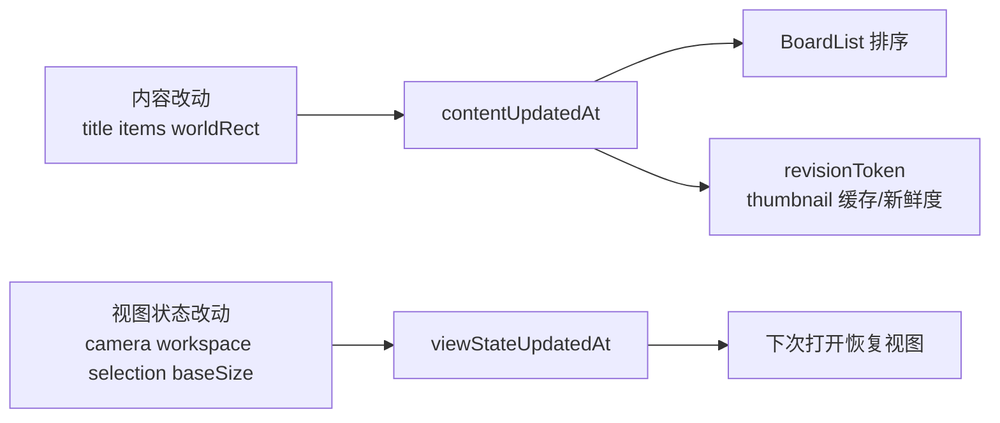

# 拆分更新时间语义

## 目标

- 把单一 `updatedAt` 拆成两条时间线：`contentUpdatedAt` 与 `viewStateUpdatedAt`。
- 保留视图状态持久化，但 `boardlist` 排序、`revisionToken`、缩略图新鲜度只看 `contentUpdatedAt`。
- 修复“打开 existing board 后返回，卡片因为视图状态保存而被移动到第一行”的根因。

## 当前根因

- [MyCanvas_Ver_0/Canvas/Editing/CanvasEditorSession.swift](MyCanvas_Ver_0/Canvas/Editing/CanvasEditorSession.swift) 的 `currentBoardRuntimeState(...)` 每次构造快照都会写 `updatedAt: Date()`。
- [MyCanvas_Ver_0/Canvas/Storage/BoardStore.swift](MyCanvas_Ver_0/Canvas/Storage/BoardStore.swift) 的 `saveBoard(...)` 又统一执行 `persistedState.updatedAt = Date()`，把所有保存都压成一种“最近更新”。
- [MyCanvas_Ver_0/Platform/iOS/BoardList/iOSBoardListViewController.swift](MyCanvas_Ver_0/Platform/iOS/BoardList/iOSBoardListViewController.swift) 里的 `boardCatalogItemSortsBefore(...)` 按 `updatedAt` 倒序排序。
- [MyCanvas_Ver_0/Platform/Shared/BoardList/BoardCatalogItem.swift](MyCanvas_Ver_0/Platform/Shared/BoardList/BoardCatalogItem.swift) 的 `revisionToken` 也直接绑定 `updatedAt`，导致 view-only 保存会同时触发列表重排、preview 版本变化和 cell reload 语义。

## 关键语义

- `contentUpdatedAt`：影响文档内容或缩略图语义的改动。
  - 默认包括：`title`、`items`、影响内容边界的 `boardState.worldRect`。
- `viewStateUpdatedAt`：仅影响下次打开时视图恢复的改动。
  - 默认包括：`cameraCenter`、`cameraZoomScale`、`selectedItemID`、`workspaceMode`，以及当前由 viewport 初始化出来的 `boardState.baseSize`。
- 默认假设：`boardlist` 的“最近更新”语义切换为“最近内容更新”，不再因为 pan/zoom/open/return 上浮。

## 实施计划

### 1. 拆模型与兼容层

- 修改 [MyCanvas_Ver_0/Canvas/Storage/BoardDocument.swift](MyCanvas_Ver_0/Canvas/Storage/BoardDocument.swift)
  - 给 `BoardDocument`、`BoardRuntimeState`、`BoardSummary` 增加 `contentUpdatedAt` 与 `viewStateUpdatedAt`。
  - 移除“业务语义上的单一 `updatedAt`”，但可以保留一个短期只读兼容访问器，先减少编译面震荡。
- 修改 [MyCanvas_Ver_0/Canvas/Storage/BoardDocumentMapper.swift](MyCanvas_Ver_0/Canvas/Storage/BoardDocumentMapper.swift)
  - `makeDocument(from:)` / `makeRuntimeState(from:)` 双向映射新字段。
- 给 `BoardDocument` 增加自定义 `Codable`
  - 读取旧文档时：若只有旧 `updatedAt`，则回填 `contentUpdatedAt = viewStateUpdatedAt = updatedAt`。
  - 编码时建议保留一版 legacy `updatedAt` 字段，值取 `contentUpdatedAt`，降低跨版本风险。

### 2. 引入显式保存分类，替换统一更新时间刷新

- 在保存链路引入类型化语义，例如 `BoardPersistenceUpdateKind`：`.contentOnly`、`.viewStateOnly`、`.contentAndViewState`。
- 贯穿这些入口：
  - [MyCanvas_Ver_0/Canvas/Editing/CanvasEditorSession.swift](MyCanvas_Ver_0/Canvas/Editing/CanvasEditorSession.swift)
  - [MyCanvas_Ver_0/Canvas/Storage/BoardSaveCoordinator.swift](MyCanvas_Ver_0/Canvas/Storage/BoardSaveCoordinator.swift)
  - [MyCanvas_Ver_0/Canvas/Storage/BoardStore.swift](MyCanvas_Ver_0/Canvas/Storage/BoardStore.swift)
- 具体替换点：
  - 不再在 `currentBoardRuntimeState(...)` 里直接写死 `Date()`。
  - 不再在 `BoardStore.saveBoard(...)` 里统一 `persistedState.updatedAt = Date()`。
  - 改成根据 `updateKind` 只 bump 对应时间字段。
- 关键调用分类：
  - `pan/zoom/minimap/workspaceMode`：`viewStateOnly`
  - item 编辑、撤销/重做、删除、裁剪、旋转、重命名：`contentOnly` 或 `contentAndViewState`
  - `configureBoardStateIfNeeded(for:)`：单独拆开处理，不要再把 viewport 初始化直接算成内容更新时间

### 3. 处理 `boardState` 的边界归属

- [MyCanvas_Ver_0/Canvas/Core/CanvasBoardState.swift](MyCanvas_Ver_0/Canvas/Core/CanvasBoardState.swift) 当前同时承载：
  - `baseSize`：明显带 viewport 初始化痕迹
  - `worldRect`：决定画板内容边界
- 推荐拆语义而不是继续整体绑定一个更新时间：
  - `worldRect` 继续归内容域，影响 `contentUpdatedAt`
  - `baseSize` 迁到视图状态域，影响 `viewStateUpdatedAt`
- 对应修改 [MyCanvas_Ver_0/Canvas/Editing/BoardHistorySnapshot.swift](MyCanvas_Ver_0/Canvas/Editing/BoardHistorySnapshot.swift)
  - `replacingDocumentState(with:updatedAt:)` 改成显式传入内容时间，避免历史恢复时误伤 view 时间

### 4. 迁移 boardlist / preview / revision 的消费点

- 修改 [MyCanvas_Ver_0/Platform/Shared/BoardList/BoardCatalogItem.swift](MyCanvas_Ver_0/Platform/Shared/BoardList/BoardCatalogItem.swift)
  - `revisionToken` 改为只绑定 `contentUpdatedAt`，不要再跟 view-only 保存联动。
- 修改 [MyCanvas_Ver_0/Platform/iOS/BoardList/iOSBoardListViewController.swift](MyCanvas_Ver_0/Platform/iOS/BoardList/iOSBoardListViewController.swift)
  - `boardCatalogItemSortsBefore(...)`、`insertionIndexForBoardCatalogItem(...)`、`upsertBoardCatalogItem(...)` 切换到内容时间/内容 revision。
  - 目标行为：view-only 保存不再触发 `.moved`，content 改动仍会按预期上浮。
- 修改缩略图链路：
  - [MyCanvas_Ver_0/Platform/Shared/BoardList/BoardPreviewProvider.swift](MyCanvas_Ver_0/Platform/Shared/BoardList/BoardPreviewProvider.swift)
  - [MyCanvas_Ver_0/Platform/Shared/BoardList/BoardThumbnailCache.swift](MyCanvas_Ver_0/Platform/Shared/BoardList/BoardThumbnailCache.swift)
  - [MyCanvas_Ver_0/Canvas/Storage/BoardPersistedThumbnailStore.swift](MyCanvas_Ver_0/Canvas/Storage/BoardPersistedThumbnailStore.swift)
- 目标行为：缩略图缓存键和 freshness 只看内容时间；纯 camera/workspace 变更不触发 preview 版本抖动。
- 同步检查 cell 防串逻辑：
  - [MyCanvas_Ver_0/Platform/iOS/BoardList/iOSBoardCollectionViewCell.swift](MyCanvas_Ver_0/Platform/iOS/BoardList/iOSBoardCollectionViewCell.swift)
  - `representedRevisionToken` 应改为 content revision。

### 5. 验证与回归护栏

- 复用现有 `Phase 6` trace，不新增一套日志体系；重点验证这些场景：
  - existing board 打开后直接返回：位置不变
  - pan / zoom / minimap / workspace 切换后返回：位置不变
  - 真正编辑内容后返回：卡片按 `contentUpdatedAt` 上浮
  - rename 后返回：按设计决定是否上浮，并与 `contentUpdatedAt` 语义保持一致
- 手动回归重点文件：
  - [MyCanvas_Ver_0/Platform/iOS/BoardList/iOSBoardListViewController.swift](MyCanvas_Ver_0/Platform/iOS/BoardList/iOSBoardListViewController.swift)
  - [MyCanvas_Ver_0/Platform/iOS/iOSViewController.swift](MyCanvas_Ver_0/Platform/iOS/iOSViewController.swift)
  - [MyCanvas_Ver_0/Platform/iOS/AppRoot/iOSAppRootViewController.swift](MyCanvas_Ver_0/Platform/iOS/AppRoot/iOSAppRootViewController.swift)
- 编译与一致性检查：
  - iOS `xcodebuild`
  - 检查旧文档加载是否成功
  - 检查 `boardlist` 排序、closing target-ready、thumbnail freshness 是否仍健康

## 关键风险

- `boardState` 需要拆语义，否则只换时间字段名称，仍会把 viewport 初始化误计入“内容更新”。
- `revisionToken`、thumbnail freshness、列表排序必须同批迁移；只改一部分会出现“列表不动了，但缩略图每次都刷新”之类的半残状态。
- 旧 `board.json` 兼容是必须项；否则历史数据会直接解码失败或顺序异常。

