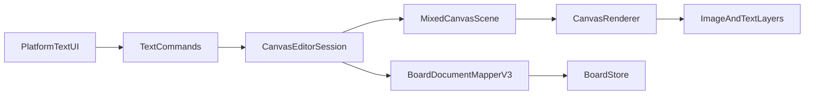

# Canvas Text Support Plan

## 定位

这是一条独立的“文本支持”路线，不再沿用 `D-2` 命名。

首版范围固定为“最小可用纯文本框”:

- 单一字体、字号、颜色
- 支持创建、编辑内容、移动、缩放、旋转、复制、删除、层级调整、保存/加载
- `crop` 继续保持 image-only
- 不做富文本，不做复杂 inline rich editor

## 目标架构

## T-1：共享 mixed-item 运行时模型

- 在 [MyCanvas_Ver_0/Canvas/Core/](MyCanvas_Ver_0/Canvas/Core/) 新增 `CanvasTextItem`、`CanvasTextStyle`，并引入统一的 `CanvasItemID` / `CanvasBoardItem`。
- 改造 [MyCanvas_Ver_0/Canvas/Core/CanvasScene.swift](MyCanvas_Ver_0/Canvas/Core/CanvasScene.swift)，让场景、命中测试、zIndex 顺序支持 image + text 混排。
- 改造 [MyCanvas_Ver_0/Canvas/Storage/BoardDocument.swift](MyCanvas_Ver_0/Canvas/Storage/BoardDocument.swift) 的 `BoardRuntimeState.items`，以及 [MyCanvas_Ver_0/Canvas/Editing/BoardHistorySnapshot.swift](MyCanvas_Ver_0/Canvas/Editing/BoardHistorySnapshot.swift) 的快照载荷，使历史系统能承载混合 item。
- 保留图片路径兼容层，避免先期把所有图片逻辑打散。
- 完成标志：image-only 画板在 mixed runtime 下仍能正常加载、选择、移动、撤销。

## T-2：文档格式与存储升级到文本可持久化

- 将 [MyCanvas_Ver_0/Canvas/Storage/BoardDocument.swift](MyCanvas_Ver_0/Canvas/Storage/BoardDocument.swift) 从 `BoardImageItemRecord` 扩展为带类型标签的 `BoardItemRecord`，并把 `formatVersion` 升到 `3`。
- 更新 [MyCanvas_Ver_0/Canvas/Storage/BoardDocumentMapper.swift](MyCanvas_Ver_0/Canvas/Storage/BoardDocumentMapper.swift) 做双向映射：image 继续走 PNG asset，text 只写 JSON。
- 更新 [MyCanvas_Ver_0/Canvas/Storage/BoardStore.swift](MyCanvas_Ver_0/Canvas/Storage/BoardStore.swift)，让 `saveBoard` / `loadBoard` / orphan asset cleanup 只对 image asset 生效。
- 保证旧 `v2` 图片文档仍可读；首次以新格式保存时才写出 mixed schema。
- 完成标志：`v2` 图片文档兼容读取，`v3` 混合文档能稳定 round-trip。

## T-3：渲染、命中测试与 viewport layer 支持文本

- 改造 [MyCanvas_Ver_0/Canvas/Core/CanvasRenderSnapshot.swift](MyCanvas_Ver_0/Canvas/Core/CanvasRenderSnapshot.swift) 与 [MyCanvas_Ver_0/Canvas/Core/CanvasRenderer.swift](MyCanvas_Ver_0/Canvas/Core/CanvasRenderer.swift)，让 render item 能表达 image payload 和 text payload。
- 更新 [MyCanvas_Ver_0/Canvas/Core/CanvasContextResolver.swift](MyCanvas_Ver_0/Canvas/Core/CanvasContextResolver.swift)，保证文本项的 body hit-test、selection handles、resize/rotate 与图片共用统一几何流程。
- 在 [MyCanvas_Ver_0/Platform/Shared/Rendering/](MyCanvas_Ver_0/Platform/Shared/Rendering/) 增加文本 layer，并更新 `iOS` / `macOS` viewport view 的 layer reconciliation。
- `crop` overlay 继续只对图片生成，文本只进入 selection/resize/rotate overlay。
- 完成标志：text-only / mixed board 都能正确渲染、选中、拖动、缩放、旋转。

## T-4：文本编辑命令与平台 UI 入口

- 在 [MyCanvas_Ver_0/Canvas/Core/CanvasInlineEditState.swift](MyCanvas_Ver_0/Canvas/Core/CanvasInlineEditState.swift) 增加 `.text` 编辑态，和现有 `.crop` 并存。
- 在 [MyCanvas_Ver_0/Canvas/Editing/CanvasCommand.swift](MyCanvas_Ver_0/Canvas/Editing/CanvasCommand.swift) 与 [MyCanvas_Ver_0/Canvas/Editing/CanvasCommandExecutor.swift](MyCanvas_Ver_0/Canvas/Editing/CanvasCommandExecutor.swift) 增加最小文本命令：例如 `addTextItem`、`beginTextEdit`、`commitTextEdit`。
- 在 [MyCanvas_Ver_0/Canvas/Editing/CanvasCommandCatalog.swift](MyCanvas_Ver_0/Canvas/Editing/CanvasCommandCatalog.swift)、[MyCanvas_Ver_0/Platform/Shared/ContextMenu/CanvasContextMenuCommandResolver.swift](MyCanvas_Ver_0/Platform/Shared/ContextMenu/CanvasContextMenuCommandResolver.swift)、[MyCanvas_Ver_0/Platform/Shared/Toolbar/CanvasToolbarStateBuilder.swift](MyCanvas_Ver_0/Platform/Shared/Toolbar/CanvasToolbarStateBuilder.swift) 做类型感知：文本项不显示/不启用 `crop`，图片项保持现状。
- 在 [MyCanvas_Ver_0/Platform/iOS/iOSViewController.swift](MyCanvas_Ver_0/Platform/iOS/iOSViewController.swift) 和 [MyCanvas_Ver_0/Platform/macOS/macOSViewController.swift](MyCanvas_Ver_0/Platform/macOS/macOSViewController.swift) 新增 `Add Text` 入口和最小文本编辑 UI。
- 完成标志：用户可新增文本项、编辑内容，并通过共享命令完成历史记录、刷新和 autosave。

## T-5：minimap、board list 预览与回归补齐

- 更新 [MyCanvas_Ver_0/Canvas/Core/CanvasMiniMapNodeProvider.swift](MyCanvas_Ver_0/Canvas/Core/CanvasMiniMapNodeProvider.swift) 及相关 snapshot/provider，让 minimap 输出 `.text` 节点。
- 更新 [MyCanvas_Ver_0/Platform/Shared/BoardList/BoardGeometryPreviewBuilder.swift](MyCanvas_Ver_0/Platform/Shared/BoardList/BoardGeometryPreviewBuilder.swift) 和 [MyCanvas_Ver_0/Platform/Shared/BoardList/BoardThumbnailRenderer.swift](MyCanvas_Ver_0/Platform/Shared/BoardList/BoardThumbnailRenderer.swift)，支持 text-only / mixed board 的几何预览和缩略图。
- 做完整回归：image import、crop、undo/redo、mixed save/load、text-only save/load、catalog 预览。
- 完成标志：文本项不只是主画布可见，也能在 minimap、列表预览、缩略图里闭环显示。

## 验收守则

- 图片行为零回归：已有 image board、crop、import、undo/redo 必须保持稳定。
- 文本初版只做纯文本，不在本路线里扩成富文本。
- 文档升级必须向后兼容 `v2` image-only board。
- 每个阶段结束至少验证：image-only、text-only、mixed 三种板子的打开、编辑、保存路径。

