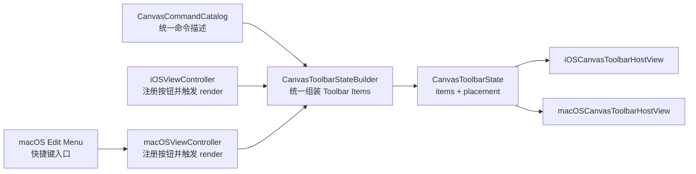

# iOS/macOS Toolbar History 收敛计划

## 目标

- 把 `undo/redo` 从“命令层已支持、UI 层分叉”收敛为“共享 toolbar items 的正式组成部分”。
- 收掉 iOS 私有 `historyButtonsStackView`，避免继续维护两套 history UI 与两条布局链路。
- 补齐 macOS 工具条按钮注册，使 `undo/redo` 与 `crop/save/text/import` 一样走共享状态构建与宿主渲染。

## 当前架构判断

- 共享契约已经预留了 `undo/redo`：`[CanvasToolbarState.swift](/Users/shaun/Library/Mobile Documents/com~apple~CloudDocs/Develop/MyCanvas_Ver_0/MyCanvas_Ver_0/Platform/Shared/Toolbar/CanvasToolbarState.swift)` 中 `CanvasToolbarItemID` 已包含 `.undo`、`.redo`。
- 命令描述已经就绪：`[CanvasCommandCatalog.swift](/Users/shaun/Library/Mobile Documents/com~apple~CloudDocs/Develop/MyCanvas_Ver_0/MyCanvas_Ver_0/Canvas/Editing/CanvasCommandCatalog.swift)` 已为 `.undo/.redo` 提供标题、图标和 `isEnabled`。
- 真正的断点在共享 builder：`[CanvasToolbarStateBuilder.swift](/Users/shaun/Library/Mobile Documents/com~apple~CloudDocs/Develop/MyCanvas_Ver_0/MyCanvas_Ver_0/Platform/Shared/Toolbar/CanvasToolbarStateBuilder.swift)` 的 `mainToolbarState(...)` 目前只组装 `crop/save/text/import`。
- iOS 目前维持一条私有 history UI 链：`[iOSViewController.swift](/Users/shaun/Library/Mobile Documents/com~apple~CloudDocs/Develop/MyCanvas_Ver_0/MyCanvas_Ver_0/Platform/iOS/iOSViewController.swift)` 中存在 `historyButtonsStackView`、`installHistoryButtons()`、`updateHistoryButtonsAppearance()`，并通过 `baseChromeBlockersForToolbarLayout()` 注入 `.historyButtons` blocker。
- macOS 目前只差工具条注册：`[macOSViewController.swift](/Users/shaun/Library/Mobile Documents/com~apple~CloudDocs/Develop/MyCanvas_Ver_0/MyCanvas_Ver_0/Platform/macOS/macOSViewController.swift)` 已能执行 `.undo/.redo`，`[macOSAppDelegate.swift](/Users/shaun/Library/Mobile Documents/com~apple~CloudDocs/Develop/MyCanvas_Ver_0/MyCanvas_Ver_0/Platform/macOS/macOSAppDelegate.swift)` 也已接好菜单与快捷键，但 toolbar 还没注册这两个按钮。

## 目标态

## 分阶段计划

### 阶段 1：收口共享 Toolbar 组合层

- 在 `[CanvasToolbarStateBuilder.swift](/Users/shaun/Library/Mobile Documents/com~apple~CloudDocs/Develop/MyCanvas_Ver_0/MyCanvas_Ver_0/Platform/Shared/Toolbar/CanvasToolbarStateBuilder.swift)` 中把 `undo/redo` 正式纳入 `mainToolbarState(...)` 的 `items` 组装结果，而不是继续让平台各自补洞。
- 新增 `undoItemState` / `redoItemState` 这一类共享构建入口，直接复用 `[CanvasCommandCatalog.swift](/Users/shaun/Library/Mobile Documents/com~apple~CloudDocs/Develop/MyCanvas_Ver_0/MyCanvas_Ver_0/Canvas/Editing/CanvasCommandCatalog.swift)` 的 descriptor，避免平台私有启用态判断。
- 固定共享工具条的线性顺序，并在这一步一次性定稿。建议把 `undo/redo` 作为起始分组放入，以避免后续平台顺序漂移。
- 保持现有 reading mode 语义不变：builder 在阅读模式继续返回空 `items`，这样 iOS/macOS 都会自然隐藏 `undo/redo`，不再需要各平台单独判空或单独隐藏 history 区。

### 阶段 2：补齐两端按钮注册，避免 shared state 与宿主渲染脱节

- 在 `[iOSViewController.swift](/Users/shaun/Library/Mobile Documents/com~apple~CloudDocs/Develop/MyCanvas_Ver_0/MyCanvas_Ver_0/Platform/iOS/iOSViewController.swift)` 与 `[macOSViewController.swift](/Users/shaun/Library/Mobile Documents/com~apple~CloudDocs/Develop/MyCanvas_Ver_0/MyCanvas_Ver_0/Platform/macOS/macOSViewController.swift)` 中都新增 `undoButton`、`redoButton`，并把它们纳入 `toolbarButtonsByID`。
- 两端都继续沿用现有命令入口：按钮点击只负责调用 `performCommand(.undo)` / `performCommand(.redo)` 或等价 `performCommand(withID:)`，不新增第二套命令执行通道。
- 把这一步与阶段 1 放在同一个实现批次落地，不能先只改 builder 再晚些补注册。原因是 `ToolbarHostView.syncButtons(...)` 对未注册 ID 会静默丢项，容易留下“状态有、UI 没有、但不报错”的隐性 bug。

### 阶段 3：迁移 iOS 到统一 Toolbar 渲染链，拆除私有 history 区

- 从 `[iOSViewController.swift](/Users/shaun/Library/Mobile Documents/com~apple~CloudDocs/Develop/MyCanvas_Ver_0/MyCanvas_Ver_0/Platform/iOS/iOSViewController.swift)` 中移除 `historyButtonsStackView`、`historyButtons`、`installHistoryButtons()`、相关约束与独立显隐逻辑。
- 收掉 `updateHistoryButtonsAppearance()` 这条私有刷新路径，把 `undo/redo` 的启用态更新并回 `renderToolbar()` / `updatePreparedToolbarPlacement()` 这条共享工具条刷新链。
- 从 `baseChromeBlockersForToolbarLayout()` 中移除 `.historyButtons` 注入，让 iOS 的布局避让只依赖“单一 toolbar rect”，不再同时维护“toolbar rect + history rect”两套占位体。
- 同步检查 workspace mode 切换和 toolbar transition 相关流程，确保原本靠 `updateHistoryButtonsAppearance()` 做的阅读模式隐藏，在统一后完全由 builder 产出的 `items` 驱动。

### 阶段 4：补齐 macOS 的工具条接入，但保留菜单/快捷键作为并行入口

- 在 `[macOSViewController.swift](/Users/shaun/Library/Mobile Documents/com~apple~CloudDocs/Develop/MyCanvas_Ver_0/MyCanvas_Ver_0/Platform/macOS/macOSViewController.swift)` 中新增 `setupUndoButton()` / `setupRedoButton()` 之类的接线点，并在 `viewDidLoad()` 初始化阶段与现有 toolbar 按钮一并注册。
- 保持 `[macOSAppDelegate.swift](/Users/shaun/Library/Mobile Documents/com~apple~CloudDocs/Develop/MyCanvas_Ver_0/MyCanvas_Ver_0/Platform/macOS/macOSAppDelegate.swift)` 的 Edit 菜单、`Cmd+Z`、`Shift+Cmd+Z` 不变，让菜单与 toolbar 共享同一组 `canPerformCommand(.undo/.redo)` 判定结果。
- 重点验证 macOS 上按钮新增后对 `CanvasToolbarMeasurement`、`CanvasToolbarPlacementPass`、toolbar transition 的尺寸与动画影响，确认只是“同一条浮动工具条变宽/变高”，而不是新引入额外 chrome 体。

### 阶段 5：清理共享 Chrome Blocker 模型中的历史遗留

- 检查 `[CanvasChromeLayoutContext.swift](/Users/shaun/Library/Mobile Documents/com~apple~CloudDocs/Develop/MyCanvas_Ver_0/MyCanvas_Ver_0/Platform/Shared/CanvasChromeLayoutContext.swift)` 及相关 shared layout 代码里 `CanvasChromeBlockerKind.historyButtons` 的剩余用途。
- 如果 `.historyButtons` 在 iOS history stack 移除后已无消费者，就把这个 blocker kind 以及关联分支一起删除，避免共享布局模型继续背负已消失的平台私有概念。
- 同步检查 `[iOSCanvasToolbarHostView.swift](/Users/shaun/Library/Mobile Documents/com~apple~CloudDocs/Develop/MyCanvas_Ver_0/MyCanvas_Ver_0/Platform/iOS/Canvas/iOSCanvasToolbarHostView.swift)` 中任何只为历史按钮预留但已无必要的局部逻辑，确认保留还是清理。

### 阶段 6：以“布局收敛”而不只是“按钮出现”为标准做验证

- iOS 编辑模式：`undo/redo` 在共享 toolbar 内可见，启用态严格跟随 `historyController.canUndo/canRedo`，且页面上不再有重复 history 按钮。
- iOS 阅读模式：toolbar 为空时不再残留 history blocker，mini map、context menu、其他 overlay 的摆位不受幽灵占位影响。
- iOS 工具条转场与重排：由于 item 数量从 4 变 6，需要重点看 solver 结果、safe area 边缘避让、工具条收缩/展开动画是否抖动。
- macOS：toolbar、菜单、快捷键三条入口在启用态与执行结果上完全一致，不能出现菜单可点但 toolbar 灰掉，或反过来的分叉。
- 跨平台：`crop/save/text/import` 的既有行为不能被 `undo/redo` 并入 shared builder 后带偏，尤其是 `saveButtonState`、inline edit、crop mode 的按钮状态切换。

## 实施批次建议

- 实施批次 A：完成共享 builder 收口 + iOS/macOS 的 `undo/redo` 按钮注册。这一批的目标是让两端都能通过同一份 `CanvasToolbarState.items` 正常显示 `undo/redo`。
- 实施批次 B：删除 iOS 私有 history stack、约束、刷新逻辑和 `.historyButtons` blocker，彻底消灭双轨 UI。
- 实施批次 C：清理共享 blocker 枚举与 dead code，并做一轮针对转场、布局和命令入口一致性的回归验证。

## 风险控制点

- iOS 从胶囊 history 按钮切到 icon-only 方形按钮是本次架构收敛的既定取舍；如果后续验证发现可发现性不足，也应在共享 toolbar 模型上扩展能力，而不是恢复平台私有 `historyButtonsStackView`。
- 由于 `ToolbarHostView` 会根据 `items` 数量重新测量尺寸，任何“只增按钮、不看布局”的实现都会把风险留到转场和 minimap 避让阶段；因此验证必须覆盖小屏、边缘 dock、reading/editing 切换。
- 阶段 1 与阶段 2 不能拆开做，否则最容易出现 shared state 已产出 `undo/redo`，但宿主没注册按钮导致 UI 静默缺失的半成品状态。

