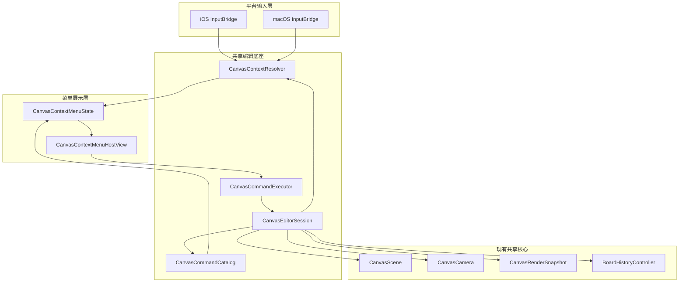

# 上下文菜单 C+D 分阶段计划

## 目标

在保留现有画布交互能力的前提下，为 `macOS` 右键和 `iOS` 长按增加“基于唤起位置动态生成菜单内容”的能力，并避免把新逻辑继续堆回两个平台 `ViewController`。最终收敛为：

- 共享编辑底座：`CanvasEditorSession`
- 共享语义解析：`CanvasContextResolver`
- 共享命令能力：`CanvasCommandCatalog` / `CanvasCommandExecutor`
- 平台菜单展示：`CanvasContextMenuState` + `CanvasContextMenuHostView`
- 薄平台输入桥接：`macOS` secondary click / `iOS` long press

## 当前落点

- 现有编辑运行时主要堆在 [MyCanvas_Ver_0/Platform/iOS/iOSViewController.swift](MyCanvas_Ver_0/Platform/iOS/iOSViewController.swift) 和 [MyCanvas_Ver_0/Platform/macOS/macOSViewController.swift](MyCanvas_Ver_0/Platform/macOS/macOSViewController.swift)。
- 现有命中测试与位置语义主要在两个 `ViewController` 的 `hitTestItemID()`、`hitTestEditHandle()`、`hitTestCropOutline()`、`pointerPressTarget(at:)`。
- 现有渲染几何和交互 overlay 已由 [MyCanvas_Ver_0/Canvas/Core/CanvasRenderer.swift](MyCanvas_Ver_0/Canvas/Core/CanvasRenderer.swift) 与 [MyCanvas_Ver_0/Canvas/Core/CanvasRenderSnapshot.swift](MyCanvas_Ver_0/Canvas/Core/CanvasRenderSnapshot.swift) 产出，足够支撑 `ContextResolver`。
- 现有历史边界已由 [MyCanvas_Ver_0/Canvas/Editing/BoardHistoryController.swift](MyCanvas_Ver_0/Canvas/Editing/BoardHistoryController.swift) 和 [MyCanvas_Ver_0/Canvas/Editing/BoardHistorySnapshot.swift](MyCanvas_Ver_0/Canvas/Editing/BoardHistorySnapshot.swift) 定义清楚：`camera` 不进入 history，`interactionState.selectedItemID` 进入 history。

## 关键边界

- `camera` 进入 `CanvasEditorSession` 和持久化，但继续留在 history 之外。
- `inlineEditState`、`rotationPreviewState`、`rotationInteractionState` 属于共享编辑瞬时态，进入 `CanvasEditorSession`，但不进入 `BoardRuntimeState` 持久化。
- `pointerDragState`、平台 view 树、按钮外观、菜单展示态继续留在平台层。
- `CanvasContextMenuState` 属于 UI 展示态，不并入 `CanvasEditorSession`。
- 菜单唤起的“上下文目标”和“当前选中项”要明确分离，避免仅因弹菜单就污染 selection history。

## 架构关系

## 分阶段实施

### 阶段 1：抽出共享编辑底座 `CanvasEditorSession`

目标：先把“编辑器脑”从两个平台 `ViewController` 中抽出来，但暂时不改菜单 UI。

范围：

- 新增共享会话层，例如 [MyCanvas_Ver_0/Canvas/Editing/CanvasEditorSession.swift](MyCanvas_Ver_0/Canvas/Editing/CanvasEditorSession.swift)。
- 把以下共享状态与服务迁入 session：
  - `scene`、`camera`、`boardState`
  - `interactionState`、`inlineEditState`、`rotationPreviewState`、`rotationInteractionState`
  - `renderer`、`miniMapRenderer`、`lastRenderSnapshot`
  - `historyController`、`saveCoordinator`
  - `activeBoardID`、`activeBoardTitle`、`activeBoardCreatedAt`
- 两个平台 `ViewController` 改成：
  - 持有 session
  - 透传 viewport size / 原生输入
  - 消费 session 输出的 canvas snapshot / minimap snapshot / command state

主要修改文件：

- [MyCanvas_Ver_0/Platform/iOS/iOSViewController.swift](MyCanvas_Ver_0/Platform/iOS/iOSViewController.swift)
- [MyCanvas_Ver_0/Platform/macOS/macOSViewController.swift](MyCanvas_Ver_0/Platform/macOS/macOSViewController.swift)
- [MyCanvas_Ver_0/Canvas/Editing/BoardHistoryController.swift](MyCanvas_Ver_0/Canvas/Editing/BoardHistoryController.swift)
- [MyCanvas_Ver_0/Canvas/Editing/BoardHistorySnapshot.swift](MyCanvas_Ver_0/Canvas/Editing/BoardHistorySnapshot.swift)
- [MyCanvas_Ver_0/Canvas/Storage/BoardDocument.swift](MyCanvas_Ver_0/Canvas/Storage/BoardDocument.swift)
- [MyCanvas_Ver_0/Canvas/Storage/BoardDocumentMapper.swift](MyCanvas_Ver_0/Canvas/Storage/BoardDocumentMapper.swift)

验收标准：

- iOS/macOS 在不引入菜单前，现有导入、保存、选择、拖拽、缩放、crop、rotate、undo、redo 行为保持不变。
- history 边界不变：selection 仍可撤销，camera 仍不可撤销。

### 阶段 2：收敛共享命令层 `CanvasCommandCatalog + CanvasCommandExecutor`

目标：把现有分散在两个 `ViewController` 的“能否执行”和“如何执行”收口到统一命令层。

范围：

- 新增命令模型，例如：
  - [MyCanvas_Ver_0/Canvas/Editing/CanvasCommand.swift](MyCanvas_Ver_0/Canvas/Editing/CanvasCommand.swift)
  - [MyCanvas_Ver_0/Canvas/Editing/CanvasCommandCatalog.swift](MyCanvas_Ver_0/Canvas/Editing/CanvasCommandCatalog.swift)
  - [MyCanvas_Ver_0/Canvas/Editing/CanvasCommandExecutor.swift](MyCanvas_Ver_0/Canvas/Editing/CanvasCommandExecutor.swift)
- 先收敛现成命令：
  - `select item`
  - `clear selection`
  - `begin crop`
  - `finish/exit crop`
  - `undo`
  - `redo`
- 后续预留菜单常见命令位：
  - `delete`
  - `duplicate`
  - `bring forward` / `send backward` / `bring to front` / `send to back`
- 统一命令副作用：history、autosave、canvas refresh、minimap refresh。
- 让 iOS 按钮与 macOS 菜单/快捷键改为消费命令状态，而不是直接调平台私有方法。

主要修改文件：

- [MyCanvas_Ver_0/Platform/iOS/iOSViewController.swift](MyCanvas_Ver_0/Platform/iOS/iOSViewController.swift)
- [MyCanvas_Ver_0/Platform/macOS/macOSViewController.swift](MyCanvas_Ver_0/Platform/macOS/macOSViewController.swift)
- [MyCanvas_Ver_0/Platform/macOS/macOSAppDelegate.swift](MyCanvas_Ver_0/Platform/macOS/macOSAppDelegate.swift)
- [MyCanvas_Ver_0/Canvas/Core/CanvasScene.swift](MyCanvas_Ver_0/Canvas/Core/CanvasScene.swift)

验收标准：

- 按钮、菜单栏、未来上下文菜单都能走同一命令执行链。
- 所有命令执行后的 history/autosave/refresh 语义一致。

### 阶段 3：抽出 `CanvasContextResolver`

目标：把“位置 -> 语义目标”的共享解析逻辑从两个平台 `ViewController` 中拿出来，作为菜单和现有点击/拖拽的统一判断源。

范围：

- 新增上下文模型与解析器，例如：
  - [MyCanvas_Ver_0/Canvas/Core/CanvasContextMenuContext.swift](MyCanvas_Ver_0/Canvas/Core/CanvasContextMenuContext.swift)
  - [MyCanvas_Ver_0/Canvas/Core/CanvasContextResolver.swift](MyCanvas_Ver_0/Canvas/Core/CanvasContextResolver.swift)
- 收敛现有逻辑：
  - `hitTestItemID()`
  - `hitTestEditHandle()`
  - `hitTestCropOutline()`
  - `pointerPressTarget(at:)`
- 明确上下文目标优先级：
  - `edit handle`
  - `crop outline`
  - `selected item body`
  - `unselected item body`
  - `blank`
- 引入平台差异参数注入，例如 `interactionMetrics`：
  - `selectionHandleHitTargetSize`
  - `cropHandleHitTargetSize`
  - `cropOutlineHitTargetWidth`
  - `rotateHandleHitTargetSize`
- 上下文模型至少应包含：
  - `invocationViewportPoint`
  - `invocationWorldPoint`
  - `targetKind`
  - `targetItemID`
  - `anchorRect` 或 `anchorPoint`
  - `selectedItemID`
  - `isInlineCropModeActive`

主要修改文件：

- [MyCanvas_Ver_0/Platform/iOS/iOSViewController.swift](MyCanvas_Ver_0/Platform/iOS/iOSViewController.swift)
- [MyCanvas_Ver_0/Platform/macOS/macOSViewController.swift](MyCanvas_Ver_0/Platform/macOS/macOSViewController.swift)
- [MyCanvas_Ver_0/Canvas/Core/CanvasRenderer.swift](MyCanvas_Ver_0/Canvas/Core/CanvasRenderer.swift)
- [MyCanvas_Ver_0/Canvas/Core/CanvasRenderSnapshot.swift](MyCanvas_Ver_0/Canvas/Core/CanvasRenderSnapshot.swift)
- [MyCanvas_Ver_0/Canvas/Core/CanvasCamera.swift](MyCanvas_Ver_0/Canvas/Core/CanvasCamera.swift)
- [MyCanvas_Ver_0/Canvas/Core/CanvasScene.swift](MyCanvas_Ver_0/Canvas/Core/CanvasScene.swift)

验收标准：

- iOS/macOS 对同一位置与同一编辑态，解析出一致的语义目标。
- 现有点击/拖拽命中优先级不回退。

### 阶段 4：引入 `CanvasContextMenuState + CanvasContextMenuHostView`

目标：补齐菜单展示态和菜单宿主，不把菜单 UI 状态塞进 session。

范围：

- 新增菜单展示态，例如：
  - [MyCanvas_Ver_0/Platform/Shared/ContextMenu/CanvasContextMenuState.swift](MyCanvas_Ver_0/Platform/Shared/ContextMenu/CanvasContextMenuState.swift)
- 新增菜单宿主，例如：
  - [MyCanvas_Ver_0/Platform/Shared/ContextMenu/CanvasContextMenuHostView.swift](MyCanvas_Ver_0/Platform/Shared/ContextMenu/CanvasContextMenuHostView.swift)
- 负责：
  - 菜单 anchor 定位
  - safe area / controls / minimap 避让
  - outside tap / click dismiss
  - hitTest 与 overlay 层级
- 不负责：
  - 命令可用性判断
  - 文档状态修改
  - history/autosave
- 菜单 state 冻结展示时刻的 `resolvedContext + command descriptors`，避免展示期再次命中导致漂移。

主要修改文件：

- [MyCanvas_Ver_0/Platform/iOS/Canvas/iOSCanvasChromeOverlayView.swift](MyCanvas_Ver_0/Platform/iOS/Canvas/iOSCanvasChromeOverlayView.swift)
- [MyCanvas_Ver_0/Platform/macOS/Canvas/macOSCanvasChromeOverlayView.swift](MyCanvas_Ver_0/Platform/macOS/Canvas/macOSCanvasChromeOverlayView.swift)
- [MyCanvas_Ver_0/Platform/iOS/iOSViewController.swift](MyCanvas_Ver_0/Platform/iOS/iOSViewController.swift)
- [MyCanvas_Ver_0/Platform/macOS/macOSViewController.swift](MyCanvas_Ver_0/Platform/macOS/macOSViewController.swift)

验收标准：

- 菜单可稳定挂载在平台 overlay/host 上。
- 菜单打开、关闭、点击外部消失、重复打开都不会污染编辑状态。

### 阶段 5：先接 `macOS` 右键菜单

目标：优先打通桥接最薄的一端，验证 `ContextResolver + CommandCatalog + MenuHost` 主链路。

范围：

- 在 [MyCanvas_Ver_0/Platform/macOS/Canvas/macOSCanvasViewportView.swift](MyCanvas_Ver_0/Platform/macOS/Canvas/macOSCanvasViewportView.swift) 增加 secondary click 入口。
- 平台输入桥仅负责把 viewport point 送给 resolver。
- 第一批菜单先支持：
  - blank context
  - selected item body
  - unselected item body
- 第二批再接：
  - selection handle
  - rotate handle
  - crop outline / crop handle
- 明确并落定关键交互策略：
  - 右键命中未选中 item 时，是否先改选中再展示菜单
  - 菜单显示期间，是否允许继续鼠标拖拽/滚轮/缩放
  - secondary click 是否中断当前 pointer interaction

主要修改文件：

- [MyCanvas_Ver_0/Platform/macOS/Canvas/macOSCanvasViewportView.swift](MyCanvas_Ver_0/Platform/macOS/Canvas/macOSCanvasViewportView.swift)
- [MyCanvas_Ver_0/Platform/macOS/macOSViewController.swift](MyCanvas_Ver_0/Platform/macOS/macOSViewController.swift)
- [MyCanvas_Ver_0/Platform/macOS/macOSAppDelegate.swift](MyCanvas_Ver_0/Platform/macOS/macOSAppDelegate.swift)

验收标准：

- macOS 右键菜单可以根据位置动态变更内容。
- 右键路径不破坏现有鼠标拖拽、滚轮平移、magnify 缩放。

### 阶段 6：接入 `iOS` 长按菜单

目标：在较复杂的多触点状态机上接入长按菜单，并避免污染现有 pointer/pinch 流程。

范围：

- 在 [MyCanvas_Ver_0/Platform/iOS/Canvas/iOSCanvasViewportView.swift](MyCanvas_Ver_0/Platform/iOS/Canvas/iOSCanvasViewportView.swift) 增加长按桥接入口，建议先用只上报位置的 `UILongPressGestureRecognizer`。
- 明确长按与现有状态机的协作：
  - 长按识别开始前，是否允许 primary pointer 先进入 `pressed`
  - 菜单弹出时，是否 cancel 当前 pointer interaction
  - 菜单期间是否屏蔽 pinch 和拖拽
- 与 iOS 现有 `TouchInteractionState` 对齐，避免菜单和 pinch/drag 互相打断。

主要修改文件：

- [MyCanvas_Ver_0/Platform/iOS/Canvas/iOSCanvasViewportView.swift](MyCanvas_Ver_0/Platform/iOS/Canvas/iOSCanvasViewportView.swift)
- [MyCanvas_Ver_0/Platform/iOS/iOSViewController.swift](MyCanvas_Ver_0/Platform/iOS/iOSViewController.swift)

验收标准：

- 长按打开菜单不误触拖拽。
- pinch 缩放、单指拖拽、长按菜单三者的状态切换清晰且可预测。

### 阶段 7：补齐命令面与回归验证

目标：把上下文菜单真正接成平台统一入口，并补齐高风险回归验证。

范围：

- 扩展菜单命令集：
  - `delete`
  - `duplicate`
  - `z-order` 系列
  - 针对 crop / rotate / selected / blank 的分组差异
- 补齐回归验证矩阵：
  - 空白区域 / 已选中 item / 未选中 item / handle / crop outline
  - iOS 长按与 macOS 右键
  - undo/redo 后菜单上下文是否仍正确
  - autosave 后重新载入是否保持期望状态
- 清理两端 `ViewController` 中残留的重复命中测试与命令逻辑。

主要修改文件：

- [MyCanvas_Ver_0/Platform/iOS/iOSViewController.swift](MyCanvas_Ver_0/Platform/iOS/iOSViewController.swift)
- [MyCanvas_Ver_0/Platform/macOS/macOSViewController.swift](MyCanvas_Ver_0/Platform/macOS/macOSViewController.swift)
- [MyCanvas_Ver_0/Canvas/Core/CanvasScene.swift](MyCanvas_Ver_0/Canvas/Core/CanvasImageItem.swift)

验收标准：

- 菜单命令不再直接调用平台私有编辑方法。
- 两端平台保留薄 UI 装配层，核心编辑与菜单语义逻辑已共享。

## 风险与决策点

- 关键决策 1：菜单唤起是否自动改选中。建议默认分离 `invocation target` 与 `selection`，只在命令真正需要时显式改选中。
- 关键决策 2：平台 hit target 尺寸差异。建议通过 `interactionMetrics` 注入，而不是硬编码进共享 resolver。
- 关键决策 3：菜单展示冻结策略。建议展示时冻结 `context + command list`，避免因画布继续变化导致菜单内容漂移。
- 关键决策 4：iOS 长按与 pinch/drag 的优先级。建议先保证“不误触拖拽”，再追求更激进的连续交互。

## 交付顺序建议

- 先做阶段 1 到阶段 3，完成共享底座、命令层、上下文解析。
- 再做阶段 4 和阶段 5，先让 `macOS` 右键跑通。
- 最后做阶段 6 和阶段 7，完成 `iOS` 长按和命令面扩展。

这样可以先把“架构债”清掉，再把菜单 UI 接进来，避免后续为了迁移 `ViewController` 重写一次菜单。