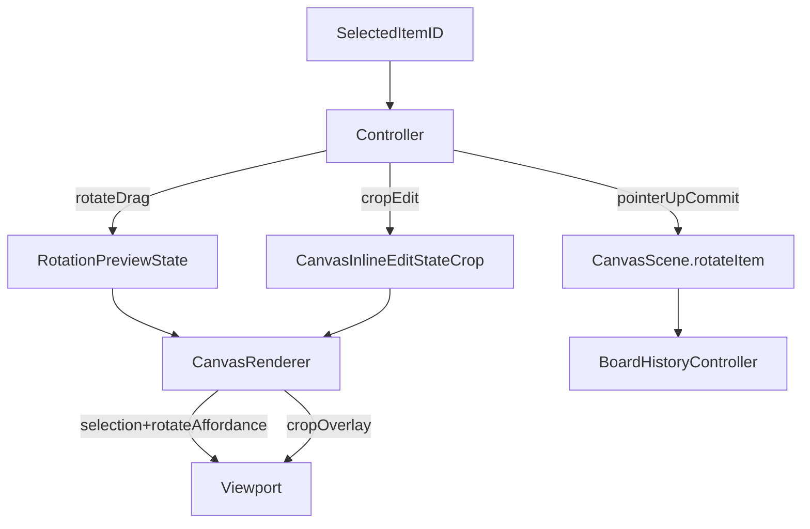

# 删除独立 Rotate 模式计划

## 目标

- 最终交互：选中图片后，直接显示蓝色高亮框、蓝色旋转引导线和旋转 handle；不再存在显式 `rotate mode`。
- `crop` 仍然是唯一的 inline edit mode，继续独占橙色 overlay、8 个 crop handles 和 crop-outline dragging。
- 默认假设：本轮移除 `Rotate` 按钮的“进入/退出模式”语义；如果以后要把按钮改成 `90°` 快捷动作，作为后续独立需求处理。

## 关键现状

- 旋转预览当前仍然绑在 `[MyCanvas_Ver_0/Canvas/Core/CanvasInlineEditState.swift](MyCanvas_Ver_0/Canvas/Core/CanvasInlineEditState.swift)` 的 `.rotate` session 上；这就是为什么方案 3 不能直接先删 mode。

```swift
private func previewedItem(
    for item: CanvasImageItem,
    inlineEditState: CanvasInlineEditState?
) -> CanvasImageItem {
    guard
        let inlineEditState,
        inlineEditState.itemID == item.id
    else {
        return item
    }

    var previewItem = item
    switch inlineEditState.session {
    case .crop:
        return previewItem
    case let .rotate(rotateSession):
        previewItem.rotationRadians = rotateSession.draftRotationRadians
        return previewItem
    }
}
```

- overlay 当前仍然是 `crop > rotate > selection` 的三态结构，定义在 `[MyCanvas_Ver_0/Canvas/Core/CanvasRenderSnapshot.swift](MyCanvas_Ver_0/Canvas/Core/CanvasRenderSnapshot.swift)` 与 `[MyCanvas_Ver_0/Canvas/Core/CanvasRenderer.swift](MyCanvas_Ver_0/Canvas/Core/CanvasRenderer.swift)`。
- 双平台 viewport 当前是“蓝色 selection chrome + 紫色 rotate chrome + 橙色 crop chrome”的分层绘制，见 `[MyCanvas_Ver_0/Platform/iOS/Canvas/iOSCanvasViewportView.swift](MyCanvas_Ver_0/Platform/iOS/Canvas/iOSCanvasViewportView.swift)` 与 `[MyCanvas_Ver_0/Platform/macOS/Canvas/macOSCanvasViewportView.swift](MyCanvas_Ver_0/Platform/macOS/Canvas/macOSCanvasViewportView.swift)`。
- 双平台 controller 当前把旋转当成完整 mode：按钮 toggle、`hitTestEditHandle(at:)`、`makePointerRotateState(...)`、`updateRotationDraft(...)`、`commitRotationDraftIfNeeded()` 都依赖 `[MyCanvas_Ver_0/Platform/iOS/iOSViewController.swift](MyCanvas_Ver_0/Platform/iOS/iOSViewController.swift)` / `[MyCanvas_Ver_0/Platform/macOS/macOSViewController.swift](MyCanvas_Ver_0/Platform/macOS/macOSViewController.swift)` 中的 `inlineEditState.mode == .rotate`。

## 目标数据流




## 阶段一：引入独立的 transient rotation preview

- 目标：先把旋转预览从 `CanvasInlineEditState.rotate` 上拆下来，但暂时不删旧 overlay 和旧按钮语义，降低首轮改动面。
- 重点文件：
  - `[MyCanvas_Ver_0/Canvas/Core/CanvasRenderer.swift](MyCanvas_Ver_0/Canvas/Core/CanvasRenderer.swift)`
  - `[MyCanvas_Ver_0/Platform/iOS/iOSViewController.swift](MyCanvas_Ver_0/Platform/iOS/iOSViewController.swift)`
  - `[MyCanvas_Ver_0/Platform/macOS/macOSViewController.swift](MyCanvas_Ver_0/Platform/macOS/macOSViewController.swift)`
- 具体动作：
  - 新增 controller-local 的 `rotationPreviewState`，只保存 `itemID + draftRotationRadians`。
  - 给 `CanvasRenderer.makeSnapshot(...)` 增加 preview 参数，让 `makeRenderItem(...)` / `previewedItem(...)` 优先从 preview state 读取旋转草稿。
  - 保留现有 `PointerRotateState`、角度计算和 `CanvasScene.rotateItem(withID:to:)` 提交逻辑不动。
- 完成标志：图片本体的旋转预览不再依赖 `CanvasInlineEditState.mode == .rotate`。

## 阶段二：把 inline edit 语义收缩为 crop-only

- 目标：先把“inline edit == crop-only”这个语义收紧，避免后面删除 rotate mode 时误伤 undo/redo、body hit 和 selection 同步。
- 重点文件：
  - `[MyCanvas_Ver_0/Canvas/Core/CanvasInlineEditState.swift](MyCanvas_Ver_0/Canvas/Core/CanvasInlineEditState.swift)`
  - `[MyCanvas_Ver_0/Platform/iOS/iOSViewController.swift](MyCanvas_Ver_0/Platform/iOS/iOSViewController.swift)`
  - `[MyCanvas_Ver_0/Platform/macOS/macOSViewController.swift](MyCanvas_Ver_0/Platform/macOS/macOSViewController.swift)`
- 具体动作：
  - 把 `isInlineEditModeActive` 的调用语义逐步收缩到 crop 专属分支，尤其是 `pointerPressTarget(at:)`、selection/body hit 的阻断条件。
  - 把 `canUndoCommand` / `canRedoCommand` 从“任何 inlineEditState 都禁用”改成“只有 crop 编辑时禁用”。
  - 在 `applyBoardRuntimeState(...)`、undo/redo 恢复、selection change、enter crop 等路径上统一清理 `rotationPreviewState`。
- 完成标志：即使临时还保留旧 rotate mode 代码，普通 selection 流程也已经不再被“rotate draft state”误判为 inline edit。

## 阶段三：重构 shared overlay contract

- 目标：把 rotate affordance 从独立 `.rotate` overlay 合并到 `.selection` payload 中，shared 层最终只剩 `selection | crop` 两类 overlay。
- 重点文件：
  - `[MyCanvas_Ver_0/Canvas/Core/CanvasRenderSnapshot.swift](MyCanvas_Ver_0/Canvas/Core/CanvasRenderSnapshot.swift)`
  - `[MyCanvas_Ver_0/Canvas/Core/CanvasRenderer.swift](MyCanvas_Ver_0/Canvas/Core/CanvasRenderer.swift)`
- 具体动作：
  - 新增 `CanvasEditSelectionOverlayPayload`，内部承载 `CanvasEditRotateOverlayPayload` 或等价字段。
  - 将 `CanvasEditRenderOverlayPayload.selection` 从空 payload 改成带旋转 affordance 的 payload。
  - 把 `makeRotateEditOverlay(...)` 中的 `guideScreenStart / guideScreenEnd / handle` 计算迁入 `makeSelectionEditOverlay(...)`。
  - 将 overlay 优先级从 `crop > rotate > selection` 改为 `crop > selection(with rotate affordance)`。
- 完成标志：renderer 不再产出独立的 `.rotate` overlay；选中态天然包含旋转引导线几何信息。

## 阶段四：迁移 viewport 到蓝色 selection-owned rotate chrome

- 目标：让旋转引导线/手柄成为蓝色选中框的一部分，同时删除紫色旋转样式和无效 layer。
- 重点文件：
  - `[MyCanvas_Ver_0/Platform/iOS/Canvas/iOSCanvasViewportView.swift](MyCanvas_Ver_0/Platform/iOS/Canvas/iOSCanvasViewportView.swift)`
  - `[MyCanvas_Ver_0/Platform/macOS/Canvas/macOSCanvasViewportView.swift](MyCanvas_Ver_0/Platform/macOS/Canvas/macOSCanvasViewportView.swift)`
- 具体动作：
  - 让 `refreshSelectionChrome(from:)` 同时绘制 selection outline、corner handles、rotate guide 和 rotate handle。
  - `rotateGuideLayer` / `rotateHandleLayer` 可以暂时保留为单独 `CAShapeLayer`，但改由 selection 生命周期控制，并统一改用 `selectionStrokeColor`。
  - 删除 `rotateOutlineLayer`、`rotateOutlineStrokeColor` 等已无实际用途的紫色残留。
  - 保持 `crop` 分支继续隐藏 selection/rotate chrome，只保留橙色 crop overlay。
- 完成标志：非 crop 选中态只出现蓝色 chrome；crop 仍然只出现橙色 chrome。

## 阶段五：重接 controller 的 rotate 命中与拖拽链路

- 目标：让旋转 handle 从 selection payload 命中并触发旋转，不再依赖显式 rotate mode。
- 重点文件：
  - `[MyCanvas_Ver_0/Platform/iOS/iOSViewController.swift](MyCanvas_Ver_0/Platform/iOS/iOSViewController.swift)`
  - `[MyCanvas_Ver_0/Platform/macOS/macOSViewController.swift](MyCanvas_Ver_0/Platform/macOS/macOSViewController.swift)`
- 具体动作：
  - 调整 `hitTestEditHandle(at:)`，从 selection payload 中读取 rotate affordance；继续保持 `crop` 分支独占优先级。
  - 将 `makePointerRotateState(...)`、`updateRotationDraft(...)`、`commitRotationDraftIfNeeded()` 改为依赖 `rotationPreviewState`。
  - 保留 `PointerRotateState`、`beginPointerHistoryTransactionIfNeeded(.rotateHandle)`、`CanvasScene.rotateItem(withID:to:)` 和现有 `

