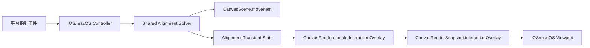

# 图片拖动对齐辅助线分阶段计划

## 目标

在不破坏现有 `scene -> renderer -> snapshot -> viewport` 架构的前提下，为图片拖动引入类似 PPT 的对齐辅助线与吸附能力，并保证：

- 共享几何求解逻辑只有一份。
- `iOS` / `macOS` 行为一致。
- 对齐线与吸附状态是 transient，不进入持久化和历史快照。
- 第一版聚焦轴对齐 `left/center/right/top/middle/bottom`，不做旋转后精确边对齐。

## 架构落点

关键复用路径：

- 拖拽移动入口在 [iOSViewController.swift](/Users/shaun/Library/Mobile Documents/com~~apple~~CloudDocs/Develop/MyCanvas_Ver_0/MyCanvas_Ver_0/Platform/iOS/iOSViewController.swift) 与 [macOSViewController.swift](/Users/shaun/Library/Mobile Documents/com~~apple~~CloudDocs/Develop/MyCanvas_Ver_0/MyCanvas_Ver_0/Platform/macOS/macOSViewController.swift) 的 `moveSelectedItem(withID:from:to:)`。
- transient overlay 通道已经存在于 [CanvasRenderSnapshot.swift](/Users/shaun/Library/Mobile Documents/com~~apple~~CloudDocs/Develop/MyCanvas_Ver_0/MyCanvas_Ver_0/Canvas/Core/CanvasRenderSnapshot.swift) 的 `interactionOverlay`，旋转环是现成参考实现。
- 几何搜索与屏幕/世界坐标换算可复用 [CanvasScene.swift](/Users/shaun/Library/Mobile Documents/com~~apple~~CloudDocs/Develop/MyCanvas_Ver_0/MyCanvas_Ver_0/Canvas/Core/CanvasScene.swift)、[CanvasCamera.swift](/Users/shaun/Library/Mobile Documents/com~~apple~~CloudDocs/Develop/MyCanvas_Ver_0/MyCanvas_Ver_0/Canvas/Core/CanvasCamera.swift)、[CanvasGeometry.swift](/Users/shaun/Library/Mobile Documents/com~~apple~~CloudDocs/Develop/MyCanvas_Ver_0/MyCanvas_Ver_0/Canvas/Core/CanvasGeometry.swift)。

## Phase 0: 契约与边界先收口

目标：先把第一版能力边界写死，避免后续在 `worldFrame` / `worldBounds` / 旋转语义上反复返工。

改动重点：

- 在共享核心层定义对齐语义：
  - 候选锚点只包含 `left/center/right/top/middle/bottom`。
  - 拖拽项和参考项都基于 `worldFrame + center` 计算，不基于旋转后的 `worldQuad` 斜边。
  - 搜索范围使用 `visibleWorldRect` 扩张后的世界坐标矩形，再调用 `visibleBoardItems(in:)` 做候选裁剪。
  - 吸附阈值采用“屏幕像素阈值 -> world 距离”的换算，避免缩放级别变化时手感漂移。
- 设计新的 transient 数据契约：
  - `CanvasAlignmentInteractionState`：拖拽期的求解结果缓存或最小描述。
  - `CanvasAlignmentInteractionOverlayPayload`：供 viewport 绘制的屏幕线段与命中信息。
  - 保持其与 `rotationInteractionState` 一样，不进入 `BoardRuntimeState` / `BoardHistorySnapshot`。

建议文件：

- [CanvasRenderSnapshot.swift](/Users/shaun/Library/Mobile Documents/com~~apple~~CloudDocs/Develop/MyCanvas_Ver_0/MyCanvas_Ver_0/Canvas/Core/CanvasRenderSnapshot.swift)
- [CanvasInlineEditState.swift](/Users/shaun/Library/Mobile Documents/com~~apple~~CloudDocs/Develop/MyCanvas_Ver_0/MyCanvas_Ver_0/Canvas/Core/CanvasInlineEditState.swift)
- 新增共享核心文件，例如 [CanvasAlignmentGuideSolver.swift](/Users/shaun/Library/Mobile Documents/com~~apple~~CloudDocs/Develop/MyCanvas_Ver_0/MyCanvas_Ver_0/Canvas/Core/CanvasAlignmentGuideSolver.swift)

## Phase 1: 共享求解器落地

目标：先把最关键的“根因”抽出来，消除双平台各算一套拖拽几何的问题。

实现内容：

- 新建共享 solver，输入建议为：
  - `movingItemID`
  - `proposedCenter` 或 `rawDeltaInWorld`
  - `scene`
  - `camera`
  - `boardState`
- 输出建议为：
  - `resolvedCenter` 或 `resolvedDeltaInWorld`
  - 命中的 `horizontalGuide` / `verticalGuide`
  - 是否发生吸附、吸附到哪个锚点
- 求解流程建议：
  1. 取当前拖拽项的 `worldFrame` 与 `center`。
  2. 基于原始拖拽结果得到 `proposedFrame`。
  3. 在扩张后的 `visibleWorldRect` 中收集参考项，排除自身。
  4. 生成参考线集合：每个对象输出 `minX/midX/maxX/minY/midY/maxY`。
  5. 分别寻找横向/纵向最优候选，优先最近距离，距离相同再用更近屏幕位置或更小偏移做 tie-break。
  6. 若落在阈值内，修正 `resolvedCenter`，并输出 guide 线段世界坐标。
  7. 若无命中，返回原始拖拽结果与空 overlay。
- 第一版建议只支持“单对象对齐线 + 单轴或双轴同时吸附”，不做多对象等间距。

测试建议：

- 新增 solver 单测，覆盖：
  - 左/中/右 与 上/中/下吸附。
  - 缩放变化下阈值稳定。
  - 候选冲突时只命中最优参考线。
  - 无候选时不吸附。
  - 旋转对象仍按 `worldFrame` 语义吸附。

建议文件：

- 新增 [CanvasAlignmentGuideSolver.swift](/Users/shaun/Library/Mobile Documents/com~~apple~~CloudDocs/Develop/MyCanvas_Ver_0/MyCanvas_Ver_0/Canvas/Core/CanvasAlignmentGuideSolver.swift)
- 新增测试文件，例如 [CanvasAlignmentGuideSolverTests.swift](/Users/shaun/Library/Mobile Documents/com~~apple~~CloudDocs/Develop/MyCanvas_Ver_0/MyCanvas_Ver_0Tests/CanvasAlignmentGuideSolverTests.swift)
- 复用 [CanvasScene.swift](/Users/shaun/Library/Mobile Documents/com~~apple~~CloudDocs/Develop/MyCanvas_Ver_0/MyCanvas_Ver_0/Canvas/Core/CanvasScene.swift)、[CanvasCamera.swift](/Users/shaun/Library/Mobile Documents/com~~apple~~CloudDocs/Develop/MyCanvas_Ver_0/MyCanvas_Ver_0/Canvas/Core/CanvasCamera.swift)、[CanvasImageItem.swift](/Users/shaun/Library/Mobile Documents/com~~apple~~CloudDocs/Develop/MyCanvas_Ver_0/MyCanvas_Ver_0/Canvas/Core/CanvasImageItem.swift)

## Phase 2: Session 与 Renderer 接线

目标：把 solver 结果纳入现有 transient 渲染通道，而不是在平台视图里直接画。

实现内容：

- 在 [CanvasEditorSession.swift](/Users/shaun/Library/Mobile Documents/com~~apple~~CloudDocs/Develop/MyCanvas_Ver_0/MyCanvas_Ver_0/Canvas/Editing/CanvasEditorSession.swift) 新增：
  - `alignmentInteractionState`。
  - `presentationAlignmentInteractionState`，与 `presentationRotationInteractionState` 保持一致，阅读模式下自动屏蔽。
- 在 [CanvasRenderSnapshot.swift](/Users/shaun/Library/Mobile Documents/com~~apple~~CloudDocs/Develop/MyCanvas_Ver_0/MyCanvas_Ver_0/Canvas/Core/CanvasRenderSnapshot.swift) 扩展：
  - `CanvasInteractionOverlayKind.alignment`
  - `CanvasInteractionRenderOverlayPayload.alignment(...)`
  - `CanvasAlignmentInteractionOverlayPayload`
- 在 [CanvasRenderer.swift](/Users/shaun/Library/Mobile Documents/com~~apple~~CloudDocs/Develop/MyCanvas_Ver_0/MyCanvas_Ver_0/Canvas/Core/CanvasRenderer.swift)：
  - `makeSnapshot(...)` 增加 alignment state 参数。
  - `makeInteractionOverlay(...)` 里增加 alignment 分支。
  - 新增 `makeAlignmentInteractionOverlay(...)`，只负责把 solver 或 state 中的世界坐标 guide 映射为屏幕线段。
- 优先级约束：
  - 拖拽移动时显示 alignment overlay。
  - 旋转时继续显示 rotation overlay。
  - 两者不叠加在同一帧，继续沿用当前单一 `interactionOverlay` 槽位。

关键参考实现：

- [CanvasRenderer.swift](/Users/shaun/Library/Mobile Documents/com~~apple~~CloudDocs/Develop/MyCanvas_Ver_0/MyCanvas_Ver_0/Canvas/Core/CanvasRenderer.swift) 中现有 `makeRotationInteractionOverlay(...)`

## Phase 3: iOS 控制器切换到共享 solver

目标：先在一个平台打通完整交互闭环，再复制到另一端，降低联调复杂度。

实现内容：

- 改造 [iOSViewController.swift](/Users/shaun/Library/Mobile Documents/com~~apple~~CloudDocs/Develop/MyCanvas_Ver_0/MyCanvas_Ver_0/Platform/iOS/iOSViewController.swift) 的 `moveSelectedItem(withID:from:to:)`：
  - 保留 `viewportToWorld` 转换。
  - 不再直接把原始 `deltaInWorld` 传给 `scene.moveItem(...)`。
  - 先调用共享 solver，得到 `resolvedDeltaInWorld` / `resolvedCenter` 与 alignment state。
  - 更新 `scene` 后再 `expandBoardIfNeeded(toInclude:)`。
  - 写入 `editorSession.alignmentInteractionState`，随后 `requestCanvasRefresh(...)`。
- 在拖拽生命周期清理状态：
  - `handlePrimaryPointerUp` 的 `.draggingSelectedItem` 分支在提交事务后清空 alignment state。
  - `handlePrimaryPointerCancel` 的 `.draggingSelectedItem` 分支也清空 alignment state。
  - 非移动场景进入 `.pressed` 点击收尾时也要兜底清空，避免残留辅助线。
- 保持历史事务边界不变：
  - `beginPointerHistoryTransactionIfNeeded(...)` 继续在 pointer down 建事务。
  - `commitPendingPointerHistoryTransaction(...)` 继续在 up/cancel 统一提交。
  - 对齐线与吸附不单独记 history。

## Phase 4: macOS 控制器对齐 iOS 行为

目标：避免两个平台在 solver 输入、清理时机、刷新语义上出现漂移。

实现内容：

- 对称改造 [macOSViewController.swift](/Users/shaun/Library/Mobile Documents/com~~apple~~CloudDocs/Develop/MyCanvas_Ver_0/MyCanvas_Ver_0/Platform/macOS/macOSViewController.swift) 的 `moveSelectedItem(withID:from:to:)`。
- 与 iOS 保持一致：
  - solver 输入结构一致。
  - `alignmentInteractionState` 的写入/清理时机一致。
  - 拖拽结束后的 `refreshCanvas(reason:)` 调用点一致。
- 注意 macOS 当前 `moveSelectedItem(...)` 直接 `refreshCanvas()`，这里建议与 iOS 一样补充清晰的 `reason`，便于后续诊断对齐行为。

## Phase 5: 双端 viewport 渲染 alignment overlay

目标：把 transient 数据真正可视化，仍然保持平台视图只负责画，不负责算。

实现内容：

- 在 [iOSCanvasViewportView.swift](/Users/shaun/Library/Mobile Documents/com~~apple~~CloudDocs/Develop/MyCanvas_Ver_0/MyCanvas_Ver_0/Platform/iOS/Canvas/iOSCanvasViewportView.swift) 与 [macOSCanvasViewportView.swift](/Users/shaun/Library/Mobile Documents/com~~apple~~CloudDocs/Develop/MyCanvas_Ver_0/MyCanvas_Ver_0/Platform/macOS/Canvas/macOSCanvasViewportView.swift)：
  - 在现有 `interactionOverlayLayer` 下新增 alignment 专用 `CAShapeLayer`。
  - 扩展 `refreshInteractionOverlay()` 的 `switch`，新增 `.alignment` 分支。
  - 新增 `refreshAlignmentInteractionOverlay(...)` 与对应 `hide` 逻辑。
- 视觉建议：
  - 先使用与选中框同色系蓝线，后续再考虑主题区分。
  - guide 线贯穿“被拖拽对象与参考对象之间的可见范围”，而不是只画短线段，提高可读性。
  - 第一版不显示文字标签，只显示横/纵线与吸附效果。
- 注意与现有 rotation overlay 共存方式：
  - 因为 `interactionOverlay` 仍是单值，viewport 只需要扩一层 `switch`，不需要引入 overlay 数组。

## Phase 6: 验证与回归控制

目标：验证体验和架构都达标，而不是只看到线条。

验证清单：

- 交互验证
  - 拖动图片接近周边图片左/中/右、上/中/下时出现辅助线。
  - 松手后辅助线立即消失。
  - 吸附在不同 zoom 下手感稳定，不会突然过度跳跃。
  - 视口边缘、超大板面、自动扩板场景下辅助线仍正确。
- 架构验证
  - `BoardHistorySnapshot` 不包含 alignment transient state。
  - 存盘/重开后不残留辅助线状态。
  - 阅读模式下不显示 alignment overlay。
- 回归验证
  - 现有旋转 HUD 不受影响。
  - 裁剪模式与文本编辑模式不显示 alignment overlay。
  - iOS/macOS 命中、提交 history、取消拖拽语义一致。
- 自动化建议
  - 至少补 solver 单测。
  - 若现有测试模式允许，再补一个 renderer/snapshot 级测试，验证命中时会生成 `.alignment` payload，未命中时为空。

## 实施顺序建议

1. 先完成 Phase 0 和 Phase 1，把共享 solver 契约与单测打稳。
2. 再做 Phase 2，把 transient state 和 snapshot/renderer 通道接通。
3. 先接 iOS，再平移到 macOS，避免双平台同时调试。
4. 最后做 viewport 绘制和统一验证。

## 关键风险与控制点

- 风险：`worldFrame` / `worldBounds` 混用导致旋转对象看起来“线对了但视觉没对齐”。
  - 控制：第一版统一用 `worldFrame + center` 作为 snap 语义，并在 solver 注释里写死。
- 风险：吸附阈值若用 world 单位，缩放后手感会漂。
  - 控制：统一使用屏幕像素阈值，经 `camera.zoomScale` 换算。
- 风险：对齐线状态散落在平台层，后续维护成本高。
  - 控制：平台层只负责 pointer 输入和 refresh，求解与 overlay 数据均放共享层。
- 风险：拖拽结束后残留 overlay。
  - 控制：在 `pointer up`、`pointer cancel`、点击未进入拖拽的收尾路径统一清理 transient state。

