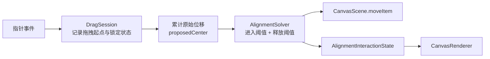

# 对齐吸附拖离修复计划

## 根因

- [MyCanvas_Ver_0/Platform/iOS/iOSViewController.swift](MyCanvas_Ver_0/Platform/iOS/iOSViewController.swift) 与 [MyCanvas_Ver_0/Platform/macOS/macOSViewController.swift](MyCanvas_Ver_0/Platform/macOS/macOSViewController.swift) 的 `moveSelectedItem(withID:from:to:)` 当前都按 `proposedCenter = movingItem.center + rawDeltaInWorld` 求解。`movingItem.center` 一旦在上一帧被吸附修正，下一帧就不再代表“拖拽起点的原始位置”，会持续把小位移喂回已吸附位置。
- [MyCanvas_Ver_0/Canvas/Core/CanvasAlignmentGuideSolver.swift](MyCanvas_Ver_0/Canvas/Core/CanvasAlignmentGuideSolver.swift) 目前只有单一 `snapThresholdInViewport: 8`，没有 release threshold、hysteresis 或锁定状态。只要本帧偏移仍在阈值内，solver 就会再次把对象拉回参考线。
- [MyCanvas_Ver_0/Canvas/Core/CanvasInlineEditState.swift](MyCanvas_Ver_0/Canvas/Core/CanvasInlineEditState.swift) 里的 `CanvasAlignmentInteractionState` 目前是渲染输出，不适合承载跨帧的“已锁定 / 已释放”求解状态；根因修复应新增独立的拖拽会话状态，而不是把求解状态塞进 overlay payload。

## 目标方案

- 保持现有 `scene -> renderer -> snapshot -> viewport` 渲染链不变；`alignmentInteractionState` 继续只承担展示职责。
- 新增一个共享的 selected-item drag session value type，建议放在 `Canvas/Editing` 共享层（例如新增 [MyCanvas_Ver_0/Canvas/Editing/CanvasSelectedItemDragState.swift](MyCanvas_Ver_0/Canvas/Editing/CanvasSelectedItemDragState.swift)），至少记录：
  - `itemID`
  - `dragStartWorldPoint`
  - `dragStartCenter`
  - 上一帧锁定轴 / 命中的参考线信息
- 扩展 solver 请求与配置，采用“双阈值”语义：
  - `snapEnterThresholdInViewport`
  - `snapReleaseThresholdInViewport`（大于 enter）
- controller 不再按“上一帧吸附后 center + 帧间增量”构造 `proposedCenter`，而是按“拖拽起点 center + 从拖拽起点到当前指针的累计世界位移”构造 `proposedCenter`。

## 实施步骤

### 1. 共享拖拽会话状态

- 在共享层新增 `CanvasSelectedItemDragState`（命名可微调），把当前 `PointerDragState.draggingSelectedItem(itemID: CanvasItemID)` 升级为携带完整拖拽基线的状态。
- 进入拖拽时机仍保持在 controller 的 `.pressed -> .draggingSelectedItem` 切换点，但两端都使用同一套共享字段，避免 iOS/macOS 再次分叉。
- 不把这类状态塞进 `CanvasEditorSession`，避免将 pointer 生命周期与 session 的渲染/历史职责耦合。

### 2. Alignment solver 增加释放语义

- 在 [MyCanvas_Ver_0/Canvas/Core/CanvasAlignmentGuideSolver.swift](MyCanvas_Ver_0/Canvas/Core/CanvasAlignmentGuideSolver.swift) 中把当前单一阈值配置升级为 enter/release 双阈值。
- 在 `CanvasAlignmentSolveRequest` 中增加上一帧锁定信息（例如 `previousLock` / `previousMatch`）。
- `solve(_:)` 调整为两阶段：
  1. 若当前仍处于锁定状态，先判断是否超过 release threshold 决定是否释放。
  2. 若未锁定或已释放，再走现有 candidate 搜索与 entering snap 判定。
- 保留现有 `CanvasAlignmentInteractionState` / `CanvasAlignmentGuide` / `CanvasAlignmentMatch` 输出结构，避免渲染链大改。

### 3. 双端 controller 改造为“累计原始位移”

- 在 [MyCanvas_Ver_0/Platform/iOS/iOSViewController.swift](MyCanvas_Ver_0/Platform/iOS/iOSViewController.swift) 与 [MyCanvas_Ver_0/Platform/macOS/macOSViewController.swift](MyCanvas_Ver_0/Platform/macOS/macOSViewController.swift)：
  - 从 `.pressed` 切入拖拽时记录 `dragStartWorldPoint` 与 `dragStartCenter`。
  - `moveSelectedItem(...)` 改为基于 drag session 与当前 pointer 位置计算累计世界位移，再生成 `proposedCenter`。
  - 继续把 solver 的结果写回 `alignmentInteractionState`，并保持现有 history begin/commit 边界与 cleanup 行为不变。
- 不建议只调小或调大当前 `snapThresholdInViewport`；那只能改变“吸附难易”，不能从根因上解决“阈值带内持续回吸”。

### 4. 测试与验证

- 扩展 [MyCanvas_Ver_0Tests/CanvasAlignmentGuideSolverTests.swift](MyCanvas_Ver_0Tests/CanvasAlignmentGuideSolverTests.swift)，新增多步场景：
  - 首帧进入吸附
  - 小位移仍在 release threshold 内时维持锁定
  - 超过 release threshold 后正确释放
  - 双轴吸附后仅单轴释放 / 双轴同时释放
  - 不同 zoom 下 enter/release 手感一致
- 若有必要，提取一个 controller-neutral 的纯函数（例如解析 drag session 到 `proposedCenter` 的 helper）以便直接测试累计位移逻辑，而不是强行给 `UIViewController` / `NSViewController` 做手势测试。
- 保持 [MyCanvas_Ver_0Tests/CanvasEditorSessionAlignmentOverlayTests.swift](MyCanvas_Ver_0Tests/CanvasEditorSessionAlignmentOverlayTests.swift) 继续覆盖展示层回归，不让它承担拖拽几何逻辑的主测试职责。

### 5. 验证清单与日志收口

- 自动化：
  - 共享 alignment 测试
  - macOS build
  - iOS simulator build
- 手验：
  - 吸附到顶部/底部/左/中/右后，沿法向继续拖动可以稳定脱离
  - 双轴同时吸附时不会被“钉死”
  - 不同 zoom 下脱离门槛一致
  - 视口边缘与自动扩板场景没有异常抖动
- 当前新增的 `[Canvas Alignment][Solver]` 日志只用于定位根因；修复确认后应并入现有诊断开关或默认关闭，避免常驻噪音。

## 风险控制

- 不要把锁定/释放语义塞进 `CanvasAlignmentInteractionState`；它应该继续是 renderer 的瞬时输入，而不是 solver 的跨帧状态容器。
- 释放阈值若仍用 world 单位，缩放后手感会再次漂移；enter 与 release 都必须继续走 viewport -> world 的换算。
- iOS/macOS 必须共用同一套 drag session 与 solver 请求语义，否则这次修完后两端仍可能出现不同的“粘滞感”。