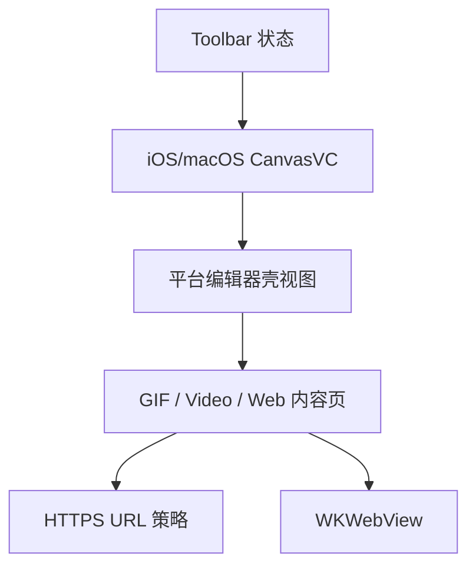

# 工具栏网页弹层分阶段计划

## 约束定稿

- 保持 [MyCanvas_Ver_0/Platform/Shared/Toolbar/CanvasToolbarStateBuilder.swift](MyCanvas_Ver_0/Platform/Shared/Toolbar/CanvasToolbarStateBuilder.swift) 的现有逻辑不变：`reading mode` 继续返回空 `items`，因此浏览器按钮不会在该模式下出现。
- “打开网页”继续留在 [MyCanvas_Ver_0/Platform/iOS/iOSViewController.swift](MyCanvas_Ver_0/Platform/iOS/iOSViewController.swift) 和 [MyCanvas_Ver_0/Platform/macOS/macOSViewController.swift](MyCanvas_Ver_0/Platform/macOS/macOSViewController.swift) 的 controller 层；不新增 `CanvasCommand`，也不修改 [MyCanvas_Ver_0/Canvas/Editing/CanvasCommand.swift](MyCanvas_Ver_0/Canvas/Editing/CanvasCommand.swift) 的语义边界。
- 只支持 `https`；当前工程由 [MyCanvas_Ver_0.xcodeproj/project.pbxproj](MyCanvas_Ver_0.xcodeproj/project.pbxproj) 生成 Info，不存在 ATS 放宽配置，因此本次不新增 `http` 例外配置。
- 工具栏顺序把浏览器按钮放在现有 `import` 按钮旁边，保持“外部输入入口”相邻，避免打散 `crop/save/text` 这组编辑按钮。

## 目标结构

## Phase 1：共享边界与 URL 策略先落稳

- 目标：先把双平台必须一致的非 UI 逻辑收束起来，避免 iOS/macOS 各写一套 URL 处理规则。
- 具体动作：新增一个纯 Swift 的 `https` URL 规范化/校验类型，建议新建 `MyCanvas_Ver_0/Platform/Shared/CanvasHTTPSURLPolicy.swift`，负责 `trim`、空串拦截、缺失 scheme 自动补 `https://`、拒绝 `http`、拒绝非 `https`、拒绝缺失 host 的地址。
- 具体动作：明确壳层抽象做成“平台复用视图”，而不是新的跨页面基类 controller。这样可以复用标题栏、关闭按钮、可选主按钮、内容容器和顶部安全区布局，又不会把 GIF / Video 的生命周期硬塞进继承链。
- 影响文件：现有入口仍以 [MyCanvas_Ver_0/Platform/iOS/iOSViewController.swift](MyCanvas_Ver_0/Platform/iOS/iOSViewController.swift)、[MyCanvas_Ver_0/Platform/macOS/macOSViewController.swift](MyCanvas_Ver_0/Platform/macOS/macOSViewController.swift) 为准；Phase 1 只新增共享纯逻辑，不碰现有弹层行为。
- 验收标准：URL 规范化规则可以被单独测试，且此阶段不引入任何 toolbar 或弹层行为变化。

## Phase 2：先在 iOS 抽出编辑器壳层并迁移现有页面

- 目标：把 iOS 端 `GIF` 与 `Video` 页面里重复的 header / safe area / 内容容器结构收成一个复用壳层，先解决重复布局这个根因。
- 具体动作：从 [MyCanvas_Ver_0/Platform/iOS/iOSGIFFrameImportViewController.swift](MyCanvas_Ver_0/Platform/iOS/iOSGIFFrameImportViewController.swift) 和 [MyCanvas_Ver_0/Platform/iOS/iOSVideoDisplayFrameEditorViewController.swift](MyCanvas_Ver_0/Platform/iOS/iOSVideoDisplayFrameEditorViewController.swift) 抽取共用 chrome，建议新建 `MyCanvas_Ver_0/Platform/iOS/iOSCanvasEditorShellView.swift`。
- 具体动作：壳层只负责标题、左侧关闭按钮、右侧可选主按钮、顶部布局和内容承载；GIF 选帧网格、视频播放与时间线仍各自留在原 controller 内。
- 具体动作：保留现有 iOS 呈现方式，不改变 [MyCanvas_Ver_0/Platform/iOS/iOSViewController.swift](MyCanvas_Ver_0/Platform/iOS/iOSViewController.swift) 里 `present(...)`、`modalPresentationStyle = .fullScreen`、`modalTransitionStyle = .coverVertical` 这条路径。
- 迁移顺序：先迁移 GIF 页面，再迁移 Video 页面。这样能先用结构更简单的页面验证壳层抽象，再覆盖更复杂的时间线页面。
- 验收标准：iOS 端现有 `Import GIF Frames` 与 `Set Display Frame` 的弹出方式、关闭方式、主按钮行为和错误提示都保持不变，只是 header / 容器实现改为复用壳层。

## Phase 3：在 macOS 复用同样思路抽壳并迁移现有页面

- 目标：把 macOS 端重复的 sheet 页面 chrome 同样收束，避免新网页页再复制第三套 AppKit 布局。
- 具体动作：从 [MyCanvas_Ver_0/Platform/macOS/macOSGIFFrameImportViewController.swift](MyCanvas_Ver_0/Platform/macOS/macOSGIFFrameImportViewController.swift) 和 [MyCanvas_Ver_0/Platform/macOS/macOSVideoDisplayFrameEditorViewController.swift](MyCanvas_Ver_0/Platform/macOS/macOSVideoDisplayFrameEditorViewController.swift) 抽取共用 chrome，建议新建 `MyCanvas_Ver_0/Platform/macOS/macOSCanvasEditorShellView.swift`。
- 具体动作：壳层继续承载标题、取消按钮、可选主按钮、内容容器和统一的 `preferredContentSize`；GIF 网格与视频播放/时间线仍保留在各自 controller。
- 具体动作：保留 [MyCanvas_Ver_0/Platform/macOS/macOSViewController.swift](MyCanvas_Ver_0/Platform/macOS/macOSViewController.swift) 里的 `presentAsSheet(...)` 入口，不改 sheet 呈现语义。
- 迁移顺序：同样先 GIF，后 Video；让 iOS/macOS 两边的迁移节奏和风险控制一致。
- 验收标准：macOS 端两个现有页面的视觉尺寸、快捷键、取消/确认行为与错误提示不变，只把公共壳层提取出来。

## Phase 4：基于新壳层实现网页编辑页

- 目标：不复制第三套完整弹层布局，直接在新壳层内承载浏览器内容区。
- 具体动作：新增 `MyCanvas_Ver_0/Platform/iOS/iOSWebPageEditorViewController.swift` 和 `MyCanvas_Ver_0/Platform/macOS/macOSWebPageEditorViewController.swift`，都只关注网页页自己的内容区和状态。
- 具体动作：内容区包括一个 URL 输入框和一个 `WKWebView`。用户按回车时，先走 `CanvasHTTPSURLPolicy` 解析，成功后调用 `WKWebView.load(URLRequest)`，失败则复用各平台现有 alert / sheet error 模式提示。
- 具体动作：网页页不需要 GIF / Video 那种 header 主按钮，因此壳层要支持“右侧主按钮可选”。这一步能反向验证壳层抽象确实覆盖了三类页面，而不是只适配原有两类页面。
- 具体动作：进入页面后默认聚焦 URL 输入框；再次输入新地址并回车时在当前页内重载，不跳系统浏览器。
- 具体动作：本阶段在 iOS/macOS 控制器里引入 `WebKit`，但不动 [MyCanvas_Ver_0/Canvas/Editing/CanvasEditorSession.swift](MyCanvas_Ver_0/Canvas/Editing/CanvasEditorSession.swift)、[MyCanvas_Ver_0/Canvas/GIF/CanvasGIFFrameService.swift](MyCanvas_Ver_0/Canvas/GIF/CanvasGIFFrameService.swift)、[MyCanvas_Ver_0/Canvas/Video/CanvasVideoFrameService.swift](MyCanvas_Ver_0/Canvas/Video/CanvasVideoFrameService.swift) 这些现有领域逻辑。
- 验收标准：手工调用网页页时，裸域名会自动补 `https://`，合法 `https` 地址可加载，`http` 与非法地址会被拦截并给出错误提示。

## Phase 5：把浏览器能力接入现有 toolbar 状态链路

- 目标：在不改变 toolbar 总体策略的前提下，把新页面挂进现有 `toolbar state -> host view -> platform VC` 这条链路。
- 具体动作：在 [MyCanvas_Ver_0/Platform/Shared/Toolbar/CanvasToolbarState.swift](MyCanvas_Ver_0/Platform/Shared/Toolbar/CanvasToolbarState.swift) 新增浏览器按钮 ID，在 [MyCanvas_Ver_0/Platform/Shared/Toolbar/CanvasToolbarStateBuilder.swift](MyCanvas_Ver_0/Platform/Shared/Toolbar/CanvasToolbarStateBuilder.swift) 新增对应 item state，图标使用 `safari` SF Symbol。
- 具体动作：在 [MyCanvas_Ver_0/Platform/iOS/iOSViewController.swift](MyCanvas_Ver_0/Platform/iOS/iOSViewController.swift) 与 [MyCanvas_Ver_0/Platform/macOS/macOSViewController.swift](MyCanvas_Ver_0/Platform/macOS/macOSViewController.swift) 新增 `browserButton`、更新 `toolbarButtonsByID`、新增 `setupBrowserButton()`、新增 `handleBrowserButtonTap/Click()`，并沿用现有 `presentedViewController` / `presentedViewControllers` 的互斥判断。
- 具体动作：iOS 侧同步更新 [MyCanvas_Ver_0/Platform/iOS/Canvas/iOSCanvasToolbarHostView.swift](MyCanvas_Ver_0/Platform/iOS/Canvas/iOSCanvasToolbarHostView.swift) 的 `symbolConfiguration(for:)` 分支，保证新按钮有合适的图标尺寸；macOS 侧主要做视觉验证，因为现有 host 不按 item ID 分 symbol config。
- 具体动作：在两个平台的 `viewDidLoad` setup 顺序里把 `setupBrowserButton()` 接在现有 `setupImportButton()` 附近，确保初始化、注册和渲染路径与现有按钮一致。
- 具体验收：非 `reading mode` 下 toolbar 出现 Safari 风格按钮，点击后打开网页页；`reading mode` 下 toolbar 仍按现有策略整体隐藏，不为浏览器按钮单独开口子。

## Phase 6：有针对性的测试与回归验证

- 目标：只补高价值测试，避免为 UI 重构堆低价值样板测试。
- 具体动作：新增 `MyCanvas_Ver_0Tests/CanvasHTTPSURLPolicyTests.swift`，覆盖裸域名补 `https`、显式 `https` 通过、`http` 拒绝、空串拒绝、无 host 拒绝等规则。
- 具体动作：补一个轻量的 toolbar 状态测试文件，建议命名为 `MyCanvas_Ver_0Tests/CanvasToolbarStateBuilderTests.swift`，验证浏览器按钮只出现在非 `reading mode` 主 toolbar 中，并且仍与 `import` 相邻。
- 具体动作：更新 [MyCanvas_Ver_0Tests/CanvasToolbarPlacementPassTests.swift](MyCanvas_Ver_0Tests/CanvasToolbarPlacementPassTests.swift) 里依赖主 toolbar 按钮数量的基线；如果浏览器按钮是常驻项，测试里的 `buttonCount: 6` 需要同步到新的真实数量。
- 具体动作：双平台手工回归四条链路：现有 GIF 页面、现有 Video 页面、新网页页、toolbar 动画/布局；重点看弹出方式是否仍与当前产品一致。
- 验收标准：旧功能无视觉或交互回退，新网页页满足“SF Symbol 按钮入口 + 从下往上弹出 + 输入 URL 回车加载 + 只支持 https”这组约束。

