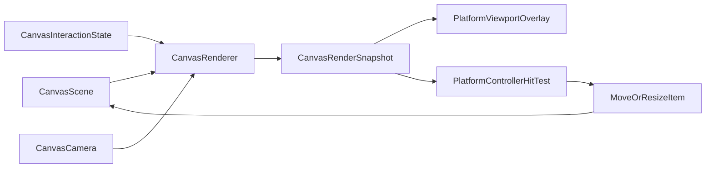

# 干净的方案C分阶段计划

## 目标与边界

- 第一版目标：为已选中图片增加四角 handle，拖拽时始终等比缩放；由 renderer 成为 selection geometry 的唯一来源。
- 共享层只输出“语义几何”，不输出平台视觉或交互策略。也就是说，core 只负责 `选中了谁`、`选中框在哪里`、`四个角锚点在哪里`；iOS/macOS 继续各自决定 `handle 画多大`、`hit slop 多大`、`hover/cursor`、`contentsScale`。
- 持久化层不改 schema。图片尺寸已经由 [BoardDocument.swift](MyCanvas_Ver_0/Canvas/Storage/BoardDocument.swift) 和 [BoardDocumentMapper.swift](MyCanvas_Ver_0/Canvas/Storage/BoardDocumentMapper.swift) 持久化，resize 只会复用现有 `size` / `center` 保存链路。




## 阶段一：收敛 core 渲染模型，让 snapshot 承载 selection 语义几何

- 修改 [CanvasRenderSnapshot.swift](MyCanvas_Ver_0/Canvas/Core/CanvasRenderSnapshot.swift)，新增 `CanvasSelectionHandleRole`、`CanvasSelectionHandleGeometry`、`CanvasSelectionRenderOverlay`，并给 `CanvasRenderSnapshot` 增加 `selectionOverlay: CanvasSelectionRenderOverlay?`。
- `CanvasSelectionRenderOverlay` 只包含中性几何数据，建议最小字段是：`itemID`、`worldFrame`、`screenFrame`、`handles`。其中 `handles` 只保存四角锚点中心和语义角色，不保存视觉尺寸或命中矩形。
- 修改 [CanvasRenderer.swift](MyCanvas_Ver_0/Canvas/Core/CanvasRenderer.swift)，用 `interactionState.selectedItemID` + `scene.item(withID:)` 直接生成 `selectionOverlay`，不要从 `visibleItems` 或 `CanvasRenderItem` 反推，以免 selection 语义和裁剪结果耦合。
- 同步精简 `CanvasRenderItem`：删除 `isSelected`，让 item 回到“图片内容 + 屏幕几何 + 层级”的纯渲染职责。

```swift
struct CanvasSelectionRenderOverlay {
    let itemID: CanvasImageItemID
    let worldFrame: CGRect
    let screenFrame: CGRect
    let handles: [CanvasSelectionHandleGeometry]
}
```

## 阶段二：把选中框和四角 handle 迁移到 viewport 的 overlayLayer

- 修改 [CanvasImageLayer.swift](MyCanvas_Ver_0/Platform/Shared/Rendering/CanvasImageLayer.swift)，移除当前依赖 `item.isSelected` 的蓝色边框绘制，让图片层只负责图片内容与 z-order。
- 修改 [iOSCanvasViewportView.swift](MyCanvas_Ver_0/Platform/iOS/Canvas/iOSCanvasViewportView.swift) 与 [macOSCanvasViewportView.swift](MyCanvas_Ver_0/Platform/macOS/Canvas/macOSCanvasViewportView.swift)，在现有 `overlayLayer` 中新增 `selectionOutlineLayer` 与四个 handle layers，刷新时机与现有 board overlay 一致，都放在 `apply(snapshot)` 内统一更新。
- selection overlay 的层级要固定在 `boardHighlightLayer` 之上，确保不受 item z-order 影响，始终浮在最上层。
- 平台差异继续留在 viewport：iOS/macOS 可分别定义 `handleVisualSize`、`outlineLineWidth`、`contentsScale`、`path/frame` 摆放方式，但都消费同一份 `snapshot.selectionOverlay`。

## 阶段三：扩展 controller 输入状态机，让 handle 命中与等比缩放成为一等路径

- 修改 [iOSViewController.swift](MyCanvas_Ver_0/Platform/iOS/iOSViewController.swift) 与 [macOSViewController.swift](MyCanvas_Ver_0/Platform/macOS/macOSViewController.swift)，把当前的 `pressed -> draggingSelectedItem / draggingCanvas` 扩成带 `pressTarget` 的状态机。
- 推荐新增 `PointerPressTarget`：`.handle(role:itemID)`、`.selectedBody(itemID)`、`.unselectedItem(itemID)`、`.blank`。`pointerDown` 的命中顺序改为 `handle > item body > blank`。
- 保留当前 `4pt` 拖动激活阈值。超过阈值后：`handle` 进入 `resizingSelectedItem`，`selectedBody` 进入 `draggingSelectedItem`，`unselectedItem` 与 `blank` 继续沿用现有 `draggingCanvas` 语义，避免一次性改动过多已有交互。
- `resizingSelectedItem` 需要记录 `itemID`、`handle role`、`initialWorldFrame`、`fixedOppositeWorldCorner`。移动时用当前 pointer 的 world 坐标与固定对角点重算 frame，再按初始宽高比回推新的 `center + size`，避免逐帧累积误差。
- `pointerUp` 若仍停在 `pressed`，继续保留现有 click 语义与日志位置：图片 click 选中、空白 click 取消选中；`pressed(handle)` 且未过阈值时可视为 no-op。

## 阶段四：补齐 scene 的 resize 变更入口，并串回现有刷新/扩板/保存链路

- 修改 [CanvasScene.swift](MyCanvas_Ver_0/Canvas/Core/CanvasScene.swift)，新增面向几何的 resize 入口，例如 `updateItemFrame(withID:)` 或 `resizeItem(withID:toWorldFrame:)`，避免 controller 直接拼接 items 数组。
- controller 在 resize 过程中继续复用现有链路：变更 scene 后调用 `expandBoardIfNeeded(toInclude:)`、`refreshCanvas()` / `requestCanvasRefresh(reason:)`、`scheduleAutosave(reason: "resize item")`。
- 由于 [CanvasImageItem.swift](MyCanvas_Ver_0/Canvas/Core/CanvasImageItem.swift) 已经以 `center + size` 表达图元，第一版不引入 rotation，也不修改持久化模型；`BoardDocument` / `BoardDocumentMapper` 只需保持兼容验证，不应新增 selection overlay 的保存字段。

## 阶段五：验证回归并为后续扩展留接口

- 手工验证 iOS/macOS 两端：图片选中、空白取消选中、拖动已选中图片、四角 handle 等比缩放、画布 pan/zoom、点击日志仍稳定输出、保存后重开尺寸正确恢复。
- 重点回归当前已修过的问题：轻微抖动下 click 不应丢日志；resize 不应触发错误的 `draggingCanvas`；iOS 的 pinch takeover 不应卡住单指 resize 状态。
- 为后续功能预留但不在第一版实现：边中点 handle、旋转 handle、hover/cursor、按住修饰键切换缩放模式。若后面 overlay 元素继续增长，再把 selection geometry 计算从 [CanvasRenderer.swift](MyCanvas_Ver_0/Canvas/Core/CanvasRenderer.swift) 内部抽到独立 builder，而不是提前把平台样式带进 core。

