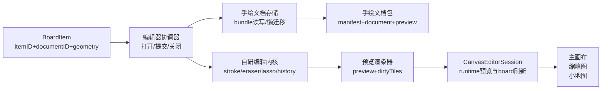

# 手绘内核替换分阶段计划

## 目标与前提

- 目标：把当前 `Hand drawing` 页面从 `PencilKit` 托管页，替换为“自研绘图内核 + 完整基础编辑器”，并为高级编辑器继续扩展预留结构。
- 已确认范围：
  - 只支持 `iPad`
  - 直接替换旧编辑器，不对用户保留旧入口
  - 使用自有文档格式；旧 `.pkdrawing` 走懒迁移
  - 橡皮是像素式局部擦除，并支持 pressure 改变半径
  - 套索选择要做；V1 先支持“选整笔 -> 移动 -> 取消选择”
  - 颜色选择、粗细选择都要做
- 本计划默认采用以下架构前提：
  - board 只保存 hand drawing 的引用与展示元数据，手绘内容本体进入独立文档包
  - 自研内核采用“`stroke` 对象模型 + 每笔局部擦除遮罩 + tile 栅格化合成”的 hybrid 路线
  - 主画布、缩略图、小地图继续消费 handDrawing 的 preview 位图与几何，不直接读取手绘源文档

## 现状约束

- [CanvasHandDrawingItem.swift](/Users/shaun/cloudDev/MyCanvas_Ver_0/MyCanvas_Ver_0/Canvas/Core/CanvasHandDrawingItem.swift) 当前通过 `defaultPreviewImageFilename(for:)` / `defaultSourceDrawingFilename(for:)` 直接把源稿身份绑定到 `itemID`，且源扩展名固定为 `.pkdrawing`。
- [BoardStore.swift](/Users/shaun/cloudDev/MyCanvas_Ver_0/MyCanvas_Ver_0/Canvas/Storage/BoardStore.swift) 里的 `persistHandDrawingAssetsIfNeeded(...)`、`loadHandDrawingSourceData(...)`、orphan cleanup 都假设 handDrawing 只有两份扁平文件：`assets/{itemID}.png` 与 `assets/{itemID}.pkdrawing`。
- [BoardDocument.swift](/Users/shaun/cloudDev/MyCanvas_Ver_0/MyCanvas_Ver_0/Canvas/Storage/BoardDocument.swift) / [BoardDocumentMapper.swift](/Users/shaun/cloudDev/MyCanvas_Ver_0/MyCanvas_Ver_0/Canvas/Storage/BoardDocumentMapper.swift) 当前没有 `documentID` 或 bundle 级存储语义。
- [iOSHandDrawingEditorViewController.swift](/Users/shaun/cloudDev/MyCanvas_Ver_0/MyCanvas_Ver_0/Platform/iOS/HandDrawing/iOSHandDrawingEditorViewController.swift) 目前同时承担 `PKCanvasView`、`PKToolPicker`、缩放/平移、dirty 判定、preview 导出、提交回调等职责；它还是一个 PencilKit 托管页，不是独立编辑器模块。
- [CanvasEditorSession.swift](/Users/shaun/cloudDev/MyCanvas_Ver_0/MyCanvas_Ver_0/Canvas/Editing/CanvasEditorSession.swift) 已经是 handDrawing 的共享业务边界，但 `handDrawingEditorContext(...)` / `commitHandDrawingEdit(...)` 目前仍然默认 `drawingData` 是 PencilKit bytes。

## 目标架构

## 阶段 1：数据边界与 schema 升级

- 目标：把 handDrawing 的“画板元素身份”和“手绘文档身份”拆开，给后续独立文档包铺路。
- 主要改动文件：
  - [CanvasHandDrawingItem.swift](/Users/shaun/cloudDev/MyCanvas_Ver_0/MyCanvas_Ver_0/Canvas/Core/CanvasHandDrawingItem.swift)
  - [BoardDocument.swift](/Users/shaun/cloudDev/MyCanvas_Ver_0/MyCanvas_Ver_0/Canvas/Storage/BoardDocument.swift)
  - [BoardDocumentMapper.swift](/Users/shaun/cloudDev/MyCanvas_Ver_0/MyCanvas_Ver_0/Canvas/Storage/BoardDocumentMapper.swift)
  - [BoardHistorySnapshot.swift](/Users/shaun/cloudDev/MyCanvas_Ver_0/MyCanvas_Ver_0/Canvas/Editing/BoardHistorySnapshot.swift)（若 item equality 需要跟进）
- 实施要点：
  - 为 `CanvasHandDrawingItem` 新增 `documentID`，把 `itemID` 与 source/preview 文件身份解耦。
  - 为 `BoardHandDrawingItemRecord` 增加文档身份与存储形态字段（例如 bundle 模式 / legacy 模式）。
  - 明确保留哪些展示元数据继续留在 board 记录里：`paper`、几何、`contentRevision`、`isEmpty`。
  - 保持旧 handDrawing 记录仍能被解码，为后续懒迁移留入口。
- 完成标志：board document/runtime round-trip 能带上 `documentID` 且不破坏现有 handDrawing 渲染、选择、保存主链。

## 阶段 2：独立 handDrawing 文档包与持久化层

- 目标：把手绘内容从 board 的扁平 asset 文件升级为独立文档包。
- 新增目录建议：
  - [Canvas/HandDrawing/Persistence](/Users/shaun/cloudDev/MyCanvas_Ver_0/MyCanvas_Ver_0/Canvas/HandDrawing/Persistence)
- 主要文件：
  - 新增 `HandDrawingDocumentStore`、`HandDrawingDocumentCodec`、`HandDrawingBundleLocator`、`HandDrawingManifest`
  - 改造 [BoardStore.swift](/Users/shaun/cloudDev/MyCanvas_Ver_0/MyCanvas_Ver_0/Canvas/Storage/BoardStore.swift)
  - 改造 [BoardHandDrawingAssetLocator.swift](/Users/shaun/cloudDev/MyCanvas_Ver_0/MyCanvas_Ver_0/Canvas/Storage/BoardHandDrawingAssetLocator.swift) 或以 bundle locator 取代
- 实施要点：
  - 文档包布局默认落在 `boards/<boardID>/handdrawings/<documentID>.handdraw/`。
  - `manifest.json` 保存版本、paper、`contentRevision`、`isEmpty`、迁移来源等元数据。
  - `document.hdraw` 保存自有文档格式；`preview.png` 只作展示缓存。
  - `BoardStore` 的 `validateHandDrawingSourceAssetExists`、`persistHandDrawingAssetsIfNeeded`、orphan cleanup 需要从“扁平双文件”改为“bundle 级保留/校验”。
  - `CanvasEditorSession` 后续读取源稿不能再直接假设 `itemID -> .pkdrawing`。
- 完成标志：新的 handDrawing bundle 可以独立 save/load round-trip，board 保存链只保存引用与展示元数据。

## 阶段 3：旧 `.pkdrawing` 懒迁移

- 目标：不做全量批迁，在首次打开旧 handDrawing 时平滑迁到新格式。
- 主要文件：
  - 新增 `HandDrawingMigrationService`
  - 改造 [CanvasEditorSession.swift](/Users/shaun/cloudDev/MyCanvas_Ver_0/MyCanvas_Ver_0/Canvas/Editing/CanvasEditorSession.swift)
  - 改造 [CanvasHandDrawingEditing.swift](/Users/shaun/cloudDev/MyCanvas_Ver_0/MyCanvas_Ver_0/Canvas/Editing/CanvasHandDrawingEditing.swift)
  - 视需要调整 [BoardStore.swift](/Users/shaun/cloudDev/MyCanvas_Ver_0/MyCanvas_Ver_0/Canvas/Storage/BoardStore.swift)
- 实施要点：
  - 当记录仍是 legacy flat `.pkdrawing` 时，在首次编辑入口触发迁移。
  - 用 `PKDrawing` 只做一次性解码，把最终可见内容转换成新文档模型；不保留旧引擎内部历史。
  - 迁移成功后写入新 bundle，并保留 `legacy_backup.pkdrawing` 作为短期兜底。
  - 迁移失败时，不覆盖旧文件、不污染 board 记录。
- 完成标志：旧 handDrawing 可以首次打开即迁移成功，并在新编辑器里继续编辑；迁移过程具备原子性与回滚保证。

## 阶段 4：自研文档模型与编辑内核骨架

- 目标：先把“无 UI 的可测试内核”立起来，再接入 iPad 页面。
- 新增目录建议：
  - [Canvas/HandDrawing/Core](/Users/shaun/cloudDev/MyCanvas_Ver_0/MyCanvas_Ver_0/Canvas/HandDrawing/Core)
  - [Canvas/HandDrawing/Editing](/Users/shaun/cloudDev/MyCanvas_Ver_0/MyCanvas_Ver_0/Canvas/HandDrawing/Editing)
  - [Canvas/HandDrawing/Rendering](/Users/shaun/cloudDev/MyCanvas_Ver_0/MyCanvas_Ver_0/Canvas/HandDrawing/Rendering)
- 核心类型建议：
  - `HandDrawingDocument`、`HandDrawingStroke`、`HandDrawingSamplePoint`、`HandDrawingBrushStyle`
  - `HandDrawingEditorEngine`、`HandDrawingEditorState`、`HandDrawingHistoryController`
  - `HandDrawingPreviewRenderer`、`HandDrawingDirtyRegionTracker`
- 实施要点：
  - 文档模型以 `stroke` 为一等对象，每笔包含颜色、基准粗细、opacity、point 列表、transform。
  - 为每笔引入局部擦除遮罩 `eraseMask`，而不是对整张纸做全局 erase replay。
  - 统一输入抽象：Pencil 输入事件、手指 viewport 手势、编辑命令（undo/redo/deselect）。
  - 先保证内核能 headless 地加载文档、追加笔迹、导出 preview、记录 undo/redo。
- 完成标志：不依赖 UIKit 的 engine 能完成 document load/save、绘制、历史栈、preview 导出。

## 阶段 5：iPad 编辑器壳与基础绘制工具

- 目标：用自研 surface 和 palette 替换当前 `PKCanvasView` 页面，先打通可用基础编辑器。
- 新增目录建议：
  - [Platform/iOS/HandDrawing/UI](/Users/shaun/cloudDev/MyCanvas_Ver_0/MyCanvas_Ver_0/Platform/iOS/HandDrawing/UI)
  - [Platform/iOS/HandDrawing/Presentation](/Users/shaun/cloudDev/MyCanvas_Ver_0/MyCanvas_Ver_0/Platform/iOS/HandDrawing/Presentation)
- 主要文件：
  - 重写/替换 [iOSHandDrawingEditorViewController.swift](/Users/shaun/cloudDev/MyCanvas_Ver_0/MyCanvas_Ver_0/Platform/iOS/HandDrawing/iOSHandDrawingEditorViewController.swift)
  - 新增 `HandDrawingEditorCoordinator`、`HandDrawingCanvasSurfaceView`、`HandDrawingToolPaletteView`
  - 缩减 [iOSViewController.swift](/Users/shaun/cloudDev/MyCanvas_Ver_0/MyCanvas_Ver_0/Platform/iOS/iOSViewController.swift) 的 handDrawing 页面编排职责
- 实施要点：
  - VC 只做编辑器壳：顶部栏、完成/关闭、撤销/重做、挂载 surface/palette。
  - Pencil 事件进 engine；手指只做 pan/zoom。
  - V1 工具栏包含：画笔、像素橡皮、套索、颜色色板、粗细档位、撤销/重做。
  - 默认做预设色板与预设粗细档位，不在 V1 引入自由取色器与连续滑杆。
- 完成标志：新编辑器可在 iPad 上打开、绘制彩色笔迹、切换粗细、完成提交并替换旧 `PKCanvasView` 页面。

## 阶段 6：像素橡皮内核

- 目标：实现 pressure 驱动的像素式局部擦除，同时保持对象级 stroke 语义。
- 主要文件：
  - `HandDrawingPixelEraserToolController`
  - `HandDrawingCanvasRenderer` / `HandDrawingPreviewRenderer`
  - 相关 dirty tile / mask 数据结构
- 实施要点：
  - 橡皮先采用硬边圆形半径模型。
  - `pressure` 用于在基准橡皮尺寸上放大/缩小半径。
  - 擦除写入每笔的 `eraseMask`，使“被擦掉的局部效果”跟着该笔迹移动。
  - 确保编辑器内看到的擦除结果与 `preview.png`、主画布 preview 一致。
- 完成标志：局部擦除在编辑器、主画布、thumbnail 中表现一致，且性能不依赖整纸全量重绘。

## 阶段 7：套索选择与移动

- 目标：完成 V1 的对象级编辑起点。
- 主要文件：
  - `HandDrawingLassoToolController`
  - `HandDrawingMoveSelectionController`
  - 选区 overlay 相关 UI
- 实施要点：
  - V1 套索只选“整笔/整 stroke”，不选被擦碎片。
  - 选中后先只支持移动，不做缩放/旋转/复制。
  - 支持显式取消选择。
  - 选区状态要进入 engine state，并与 undo/redo 一起工作。
- 完成标志：能套索选整笔、移动、取消选择，且操作可撤销重做。

## 阶段 8：宿主替换与共享链兼容

- 目标：让新内核编辑器无缝接回现有主画布/缩略图/小地图链路。
- 主要文件：
  - [CanvasHandDrawingEditing.swift](/Users/shaun/cloudDev/MyCanvas_Ver_0/MyCanvas_Ver_0/Canvas/Editing/CanvasHandDrawingEditing.swift)
  - [CanvasEditorSession.swift](/Users/shaun/cloudDev/MyCanvas_Ver_0/MyCanvas_Ver_0/Canvas/Editing/CanvasEditorSession.swift)
  - [CanvasCommand.swift](/Users/shaun/cloudDev/MyCanvas_Ver_0/MyCanvas_Ver_0/Canvas/Editing/CanvasCommand.swift)
  - [CanvasCommandExecutor.swift](/Users/shaun/cloudDev/MyCanvas_Ver_0/MyCanvas_Ver_0/Canvas/Editing/CanvasCommandExecutor.swift)
  - [CanvasToolbarStateBuilder.swift](/Users/shaun/cloudDev/MyCanvas_Ver_0/MyCanvas_Ver_0/Platform/Shared/Toolbar/CanvasToolbarStateBuilder.swift)
  - [CanvasContextMenuCommandResolver.swift](/Users/shaun/cloudDev/MyCanvas_Ver_0/MyCanvas_Ver_0/Platform/Shared/ContextMenu/CanvasContextMenuCommandResolver.swift)
- 实施要点：
  - `CanvasHandDrawingEditSubmission` 改成 engine-agnostic 的 commit bridge，不再隐含“PencilKit bytes”。
  - `CanvasEditorSession.commitHandDrawingEdit(...)` 只负责 board runtime 更新、history、autosave 与 preview 刷新；文档包写入交给持久化层/coordinator。
  - 保持 [CanvasRenderer.swift](/Users/shaun/cloudDev/MyCanvas_Ver_0/MyCanvas_Ver_0/Canvas/Core/CanvasRenderer.swift)、[iOSCanvasViewportView.swift](/Users/shaun/cloudDev/MyCanvas_Ver_0/MyCanvas_Ver_0/Platform/iOS/Canvas/iOSCanvasViewportView.swift)、[BoardThumbnailRenderer.swift](/Users/shaun/cloudDev/MyCanvas_Ver_0/MyCanvas_Ver_0/Platform/Shared/BoardList/BoardThumbnailRenderer.swift)、[CanvasMiniMapNodeProvider.swift](/Users/shaun/cloudDev/MyCanvas_Ver_0/MyCanvas_Ver_0/Canvas/Core/CanvasMiniMapNodeProvider.swift) 的上层消费契约尽量不变。
  - macOS 保持“只渲染、不编辑”的平台能力判断不变。
- 完成标志：用户侧只看到新编辑器；主画布、缩略图、小地图与保存链继续正常工作。

## 阶段 9：测试、性能与回归收口

- 目标：补齐自研内核替换后最关键的正确性与稳定性护栏。
- 新增/扩展测试重点：
  - `HandDrawingDocumentCodecTests`
  - `HandDrawingDocumentStoreTests`
  - `HandDrawingMigrationServiceTests`
  - `HandDrawingPreviewRendererTests`
  - `HandDrawingPixelEraserTests`
  - `HandDrawingLassoSelectionTests`
  - `HandDrawingMoveSelectionTests`
  - 扩展 [CanvasHandDrawingEditingSessionTests.swift](/Users/shaun/cloudDev/MyCanvas_Ver_0/MyCanvas_Ver_0Tests/CanvasHandDrawingEditingSessionTests.swift)
  - 扩展 [BoardHandDrawingStorageTests.swift](/Users/shaun/cloudDev/MyCanvas_Ver_0/MyCanvas_Ver_0Tests/BoardHandDrawingStorageTests.swift)
  - 复用 [HandDrawingPreviewPipelineTests.swift](/Users/shaun/cloudDev/MyCanvas_Ver_0/MyCanvas_Ver_0Tests/HandDrawingPreviewPipelineTests.swift)
- 手工验收清单：
  - 新建 -> 立即打开 -> 画几笔 -> 返回 -> 再次编辑 -> 重启项目
  - 颜色与粗细切换后 preview 正确
  - 像素橡皮局部擦除后主画布/thumbnail 一致
  - 套索移动后 undo/redo 正确
  - 旧 `.pkdrawing` 首次打开时懒迁移成功
- 性能门槛：
  - iPad 主目标 `60fps`，极端情况下不低于 `30fps`
  - preview 导出不出现明显卡死

## 风险与应对

- 最大风险是“数据边界没拆干净就开始做自研引擎”，会导致后续 bundle、迁移、preview 契约反复返工；因此必须先做阶段 1-3。
- 第二风险是“像素橡皮先做成整纸 raster 擦除”，会直接把后续套索移动与高级编辑堵死；因此阶段 4 就要把每笔局部 mask 设计定下来。
- 第三风险是“preview renderer 和编辑器内显示逻辑不一致”，会造成主画布/thumbnail 与编辑器视觉不一致；因此阶段 6 起就要把 preview 当共享渲染契约而不是页面内部函数。

