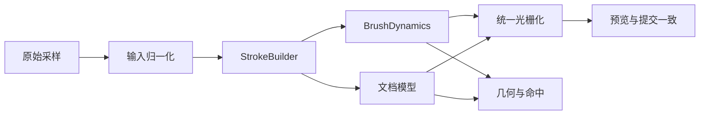

# 手绘 Pressure/Tilt Brush Engine 方案一详细分阶段计划

## 目标

- 在不推翻现有自研文档模型的前提下，把当前“`force -> 线宽`”升级成可扩展的 `pressure / tilt brush dynamics`。
- 保持以下合同不被破坏：
  - 编辑器里的 `draftStroke`、`committedImage`、提交时的 `previewCGImage`、主画布上的 hand drawing preview 语义一致。
  - `lasso`、`move selection`、`pixel eraser`、`undo/redo` 继续围绕同一套 stroke 几何工作。
  - 旧 `document.hdraw`、PK 迁移结果、当前 board 存储格式尽量不破坏兼容。

## 当前架构锚点

- 输入采样：`[MyCanvas_Ver_0/Platform/iOS/HandDrawing/UI/HandDrawingCanvasSurfaceView.swift](MyCanvas_Ver_0/Platform/iOS/HandDrawing/UI/HandDrawingCanvasSurfaceView.swift)`
- 会话协调：`[MyCanvas_Ver_0/Platform/iOS/HandDrawing/Presentation/HandDrawingEditorCoordinator.swift](MyCanvas_Ver_0/Platform/iOS/HandDrawing/Presentation/HandDrawingEditorCoordinator.swift)`
- 文档与 stroke 模型：`[MyCanvas_Ver_0/Canvas/HandDrawing/Core/HandDrawingDocument.swift](MyCanvas_Ver_0/Canvas/HandDrawing/Core/HandDrawingDocument.swift)`
- 编辑引擎：`[MyCanvas_Ver_0/Canvas/HandDrawing/Editing/HandDrawingEditorEngine.swift](MyCanvas_Ver_0/Canvas/HandDrawing/Editing/HandDrawingEditorEngine.swift)`
- 统一光栅化：`[MyCanvas_Ver_0/Canvas/HandDrawing/Rendering/HandDrawingStrokeRasterizer.swift](MyCanvas_Ver_0/Canvas/HandDrawing/Rendering/HandDrawingStrokeRasterizer.swift)`
- 画布 committed 渲染：`[MyCanvas_Ver_0/Canvas/HandDrawing/Rendering/HandDrawingCanvasRenderer.swift](MyCanvas_Ver_0/Canvas/HandDrawing/Rendering/HandDrawingCanvasRenderer.swift)`
- 提交/预览渲染：`[MyCanvas_Ver_0/Canvas/HandDrawing/Rendering/HandDrawingPreviewRenderer.swift](MyCanvas_Ver_0/Canvas/HandDrawing/Rendering/HandDrawingPreviewRenderer.swift)`
- 几何与命中：`[MyCanvas_Ver_0/Canvas/HandDrawing/Editing/HandDrawingStrokeGeometry.swift](MyCanvas_Ver_0/Canvas/HandDrawing/Editing/HandDrawingStrokeGeometry.swift)`

当前唯一真正消费 pressure 的核心钩子是：

```swift
// 文件路径: MyCanvas_Ver_0/Canvas/HandDrawing/Core/HandDrawingDocument.swift
func radiusForSample(at index: Int) -> CGFloat {
    guard samplePoints.indices.contains(index) else {
        return CGFloat(brush.baseSize) / 2
    }
    return CGFloat(brush.baseSize) * samplePoints[index].resolvedForce / 2
}
```

这意味着：

- `force` 已经贯通输入、文档、渲染。
- `azimuthRadians` / `altitudeRadians` 已采样和持久化，但仍未进入渲染/命中。
- 方案一最该做的不是换内核，而是补齐一个统一的 `BrushDynamics` 层，并让渲染与几何都只依赖它。

## 目标架构




## 核心原则

- 单一真相源：任何 pressure/tilt 相关公式都不能散落在 `coordinator`、`rasterizer`、`geometry` 多处；必须收敛到统一的 brush dynamics 求解层。
- 默认兼容：旧文档在未显式启用新动力学参数时，视觉效果必须尽量等价于当前实现。
- 先共享语义，再升级视觉：先让 `draft / committed / preview / hit test` 共享同一套 brush 语义，再做 tilt 椭圆、更多 preset。
- 延后高风险项：`predictedTouches`、GPU renderer、复杂纹理笔刷放到后面，不塞进首轮方案一。

## Phase 0：建立基线与兼容护栏

### 目标

- 在改动力学前，先把“当前行为是什么”固定成测试基线，避免后面演进时把渲染、几何、持久化一起改散。

### 主要动作

- 盘点并补充现有测试空缺，重点围绕：
  - `force` 对半径的当前线性映射。
  - `preview renderer` 与 `canvas renderer` 的一致性。
  - `lasso` / `pixel eraser` / `move selection` 对当前 stroke 几何的假设。
- 明确兼容策略：
  - 首轮优先使用“新增可选字段 + 默认值回退当前行为”，避免立即提升 `document formatVersion`。
  - 若后续发现 brush 语义无法在默认值下兼容旧稿，再单独设计 `v3`。

### 关键文件

- `[MyCanvas_Ver_0Tests/HandDrawingPreviewRendererTests.swift](MyCanvas_Ver_0Tests/HandDrawingPreviewRendererTests.swift)`
- `[MyCanvas_Ver_0Tests/HandDrawingCanvasRendererTests.swift](MyCanvas_Ver_0Tests/HandDrawingCanvasRendererTests.swift)`
- `[MyCanvas_Ver_0Tests/HandDrawingEditorEngineTests.swift](MyCanvas_Ver_0Tests/HandDrawingEditorEngineTests.swift)`
- `[MyCanvas_Ver_0Tests/HandDrawingPixelEraserToolControllerTests.swift](MyCanvas_Ver_0Tests/HandDrawingPixelEraserToolControllerTests.swift)`
- `[MyCanvas_Ver_0Tests/HandDrawingLassoSelectionTests.swift](MyCanvas_Ver_0Tests/HandDrawingLassoSelectionTests.swift)`

### 验收

- 有一组明确的测试能证明：在不启用新 dynamics 时，当前 pressure-only 行为是可回归的。

## Phase 1：抽出统一的 Brush Dynamics 内核

### 目标

- 把当前散落在 `radiusForSample` 的笔刷动力学抽成单一真相源，为后续 tilt 和 preset 打基础。

### 主要动作

- 新增共享求解层，例如：
  - `HandDrawingBrushDynamics`
  - `HandDrawingResolvedBrushSample` 或 `HandDrawingResolvedStamp`
- 扩展 `[MyCanvas_Ver_0/Canvas/HandDrawing/Core/HandDrawingDocument.swift](MyCanvas_Ver_0/Canvas/HandDrawing/Core/HandDrawingDocument.swift)` 中的 `HandDrawingBrushStyle`，以可选字段表达后续动力学参数，默认值保持当前行为。
- 让 `HandDrawingStroke.radiusForSample(at:)` 不再自己算，而是委托给新的 dynamics 求解器。
- 同步更新 `bounds` 的求法，让失效框与新的半径公式一致。

### 建议新增/重构点

- 新文件：`[MyCanvas_Ver_0/Canvas/HandDrawing/Editing/HandDrawingBrushDynamics.swift](MyCanvas_Ver_0/Canvas/HandDrawing/Editing/HandDrawingBrushDynamics.swift)`
- 主要改动文件：
  - `[MyCanvas_Ver_0/Canvas/HandDrawing/Core/HandDrawingDocument.swift](MyCanvas_Ver_0/Canvas/HandDrawing/Core/HandDrawingDocument.swift)`
  - `[MyCanvas_Ver_0/Canvas/HandDrawing/Editing/HandDrawingStrokeGeometry.swift](MyCanvas_Ver_0/Canvas/HandDrawing/Editing/HandDrawingStrokeGeometry.swift)`

### 第一阶段推荐支持的参数

- `pressureCurveExponent`
- `minSizeRatio`
- `maxSizeRatio`
- `tiltSizeInfluence`（先只算出，不一定马上用于光栅）
- `tiltOpacityInfluence`（可先保留默认 0）

### 验收

- 默认配置下渲染与当前视觉一致。
- 不同 `force` 序列会稳定影响半径，且 `bounds` 与半径变化同步。

## Phase 2：抽出 Input Normalizer 与 StrokeBuilder，统一草稿与提交链路

### 目标

- 消除 `coordinator.draftStroke` 和 `engine.appendStroke` 双份样本映射，避免“预览一套、提交一套”。

### 主要动作

- 新建 `HandDrawingInputNormalizer`：
  - 负责平台原始样本到编辑器共享样本的归一化。
  - 处理最小间距过滤、重复点抑制、时间戳单调性。
  - 这一步先不引入 `predictedTouches`。
- 新建 `HandDrawingStrokeBuilder`：
  - 统一 `HandDrawingInputSample -> HandDrawingSamplePoint / HandDrawingStroke` 的构造逻辑。
  - `draftStroke` 和 `appendStroke(brush:samples:)` 都依赖同一 builder。
- 收缩平台层职责：
  - `[MyCanvas_Ver_0/Platform/iOS/HandDrawing/UI/HandDrawingCanvasSurfaceView.swift](MyCanvas_Ver_0/Platform/iOS/HandDrawing/UI/HandDrawingCanvasSurfaceView.swift)` 只负责 `UITouch -> 原始样本`。
  - 归一化和 builder 全部进入共享层。

### 关键文件

- `[MyCanvas_Ver_0/Platform/iOS/HandDrawing/UI/HandDrawingCanvasSurfaceView.swift](MyCanvas_Ver_0/Platform/iOS/HandDrawing/UI/HandDrawingCanvasSurfaceView.swift)`
- `[MyCanvas_Ver_0/Platform/iOS/HandDrawing/Presentation/HandDrawingEditorCoordinator.swift](MyCanvas_Ver_0/Platform/iOS/HandDrawing/Presentation/HandDrawingEditorCoordinator.swift)`
- `[MyCanvas_Ver_0/Canvas/HandDrawing/Editing/HandDrawingEditorEngine.swift](MyCanvas_Ver_0/Canvas/HandDrawing/Editing/HandDrawingEditorEngine.swift)`
- 新文件：
  - `[MyCanvas_Ver_0/Canvas/HandDrawing/Editing/HandDrawingInputNormalizer.swift](MyCanvas_Ver_0/Canvas/HandDrawing/Editing/HandDrawingInputNormalizer.swift)`
  - `[MyCanvas_Ver_0/Canvas/HandDrawing/Editing/HandDrawingStrokeBuilder.swift](MyCanvas_Ver_0/Canvas/HandDrawing/Editing/HandDrawingStrokeBuilder.swift)`

### 验收

- 同一串输入样本，`draftStroke` 与抬笔提交后的 `stroke` 在 sample 级别保持一致。
- 采样去重与间距过滤不会破坏当前压力曲线表现。

## Phase 3：升级统一光栅化为 tilt-aware stamp 渲染

### 目标

- 在保持单一 rasterizer 的前提下，让 tilt 真正进入可见笔迹。

### 主要动作

- 将 `[MyCanvas_Ver_0/Canvas/HandDrawing/Rendering/HandDrawingStrokeRasterizer.swift](MyCanvas_Ver_0/Canvas/HandDrawing/Rendering/HandDrawingStrokeRasterizer.swift)` 从“圆盘 + 线段连接”升级到“可解析 resolved stamp”的实现。
- 第一版 tilt 建议采用：
  - `azimuthRadians` 作为 stamp 朝向
  - `altitudeRadians` 作为长短轴比的控制
  - 先做椭圆 footprint，不上纹理
- 同步更新 `[MyCanvas_Ver_0/Canvas/HandDrawing/Editing/HandDrawingStrokeGeometry.swift](MyCanvas_Ver_0/Canvas/HandDrawing/Editing/HandDrawingStrokeGeometry.swift)`，让命中、套索、擦除相交判断与新的椭圆 footprint 对齐。
- 重新校准 `stroke.bounds` 与 `dirtyRegion`，避免 committed 层局部刷新时留下残影。

### 关键文件

- `[MyCanvas_Ver_0/Canvas/HandDrawing/Rendering/HandDrawingStrokeRasterizer.swift](MyCanvas_Ver_0/Canvas/HandDrawing/Rendering/HandDrawingStrokeRasterizer.swift)`
- `[MyCanvas_Ver_0/Canvas/HandDrawing/Core/HandDrawingDocument.swift](MyCanvas_Ver_0/Canvas/HandDrawing/Core/HandDrawingDocument.swift)`
- `[MyCanvas_Ver_0/Canvas/HandDrawing/Editing/HandDrawingStrokeGeometry.swift](MyCanvas_Ver_0/Canvas/HandDrawing/Editing/HandDrawingStrokeGeometry.swift)`
- `[MyCanvas_Ver_0/Canvas/HandDrawing/Rendering/HandDrawingCanvasRenderer.swift](MyCanvas_Ver_0/Canvas/HandDrawing/Rendering/HandDrawingCanvasRenderer.swift)`
- `[MyCanvas_Ver_0/Canvas/HandDrawing/Rendering/HandDrawingPreviewRenderer.swift](MyCanvas_Ver_0/Canvas/HandDrawing/Rendering/HandDrawingPreviewRenderer.swift)`

### 风险

- 如果 `rasterizer` 与 `geometry` 分叉，`lasso` / `pixel eraser` 会马上不准。
- 如果 `bounds` 低估，dirty 局部刷新会出现边缘残留。

### 验收

- tilt 样本进入后，`draft`、`committed`、`preview` 视觉一致。
- `HandDrawingCanvasRendererTests` 与 `HandDrawingPreviewRendererTests` 更新后仍能稳定通过。

## Phase 4：把 Brush Preset 与编辑器 UI 接到完整 BrushStyle

### 目标

- 让当前 UI 上的颜色/粗细选择，从“会话态参数”升级为“完整 brush preset / brush style 构造器”。

### 主要动作

- 扩展 `[MyCanvas_Ver_0/Platform/iOS/HandDrawing/Presentation/HandDrawingEditorCoordinator.swift](MyCanvas_Ver_0/Platform/iOS/HandDrawing/Presentation/HandDrawingEditorCoordinator.swift)` 中的 `currentBrushStyle`，由完整的 preset + dynamics 参数生成笔刷样式。
- 保留现有 `defaultLineWidths` 作为第一版 preset 入口，不强行一次性改 UI 结构。
- 若需要，后续扩展：
  - `pen`
  - `marker`
  - `pencil`
  - `brush`
  但方案一首轮不要求把所有 preset 一次做完。
- 保证提交时写入的 `stroke.brush` 已经包含完整 dynamics 信息，而不是只存 `baseSize + opacity`。

### 关键文件

- `[MyCanvas_Ver_0/Platform/iOS/HandDrawing/Presentation/HandDrawingEditorCoordinator.swift](MyCanvas_Ver_0/Platform/iOS/HandDrawing/Presentation/HandDrawingEditorCoordinator.swift)`
- `[MyCanvas_Ver_0/Platform/iOS/HandDrawing/UI/HandDrawingToolPaletteView.swift](MyCanvas_Ver_0/Platform/iOS/HandDrawing/UI/HandDrawingToolPaletteView.swift)`
- `[MyCanvas_Ver_0/Platform/iOS/HandDrawing/iOSHandDrawingEditorViewController.swift](MyCanvas_Ver_0/Platform/iOS/HandDrawing/iOSHandDrawingEditorViewController.swift)`

### 验收

- UI 选中的笔刷配置能够稳定落入 `stroke.brush`。
- 重新打开文档后，同一笔迹能按同一 dynamics 公式回放。

## Phase 5：持久化、迁移与兼容收口

### 目标

- 让新增 brush/dynamics 参数在存储、迁移、旧稿打开时都安全可回放。

### 主要动作

- 评估是否保持 `document formatVersion` 不变：
  - 若只是新增 `Codable` 可选字段，优先不升版本。
  - 若旧稿无法在默认值语义下安全解释，再引入 `v3`。
- 更新 codec / loader / migration 测试，重点覆盖：
  - 旧文档无新增字段时能正常 decode。
  - PK 迁移结果里的 `force / azimuth / altitude` 不丢。
  - 迁移后生成的 `preview` 与新 rasterizer 兼容。
- 明确 `preview.png` 作为 board 侧展示契约不变。

### 关键文件

- `[MyCanvas_Ver_0/Canvas/HandDrawing/Persistence/HandDrawingDocumentCodec.swift](MyCanvas_Ver_0/Canvas/HandDrawing/Persistence/HandDrawingDocumentCodec.swift)`
- `[MyCanvas_Ver_0/Canvas/HandDrawing/Editing/HandDrawingDocumentLoader.swift](MyCanvas_Ver_0/Canvas/HandDrawing/Editing/HandDrawingDocumentLoader.swift)`
- `[MyCanvas_Ver_0/Canvas/HandDrawing/Persistence/HandDrawingMigrationService.swift](MyCanvas_Ver_0/Canvas/HandDrawing/Persistence/HandDrawingMigrationService.swift)`
- `[MyCanvas_Ver_0Tests/HandDrawingDocumentCodecTests.swift](MyCanvas_Ver_0Tests/HandDrawingDocumentCodecTests.swift)`
- `[MyCanvas_Ver_0Tests/HandDrawingDocumentLoaderTests.swift](MyCanvas_Ver_0Tests/HandDrawingDocumentLoaderTests.swift)`
- `[MyCanvas_Ver_0Tests/HandDrawingMigrationServiceTests.swift](MyCanvas_Ver_0Tests/HandDrawingMigrationServiceTests.swift)`

### 验收

- 旧 bundle 可打开。
- 迁移得到的手绘文档在新 dynamics 下仍可正常编辑、提交、预览。

## Phase 6：性能与延后项收口

### 目标

- 在不切 GPU 的前提下，把方案一的 CPU 路径打磨到可长期维护的状态，并为后续 Hybrid 路线留口。

### 主要动作

- 评估并补充：
  - 样本重采样或 spacing 控制
  - dirty region 膨胀策略
  - 长笔画和大画布下的 CPU 开销
  - 是否需要把 `predictedTouches` 放到实验开关后
- 为未来 Hybrid 路线预留接口：
  - `BrushDynamics` 与 `StrokeBuilder` 必须独立于 rasterizer，避免将来切 GPU 时再拆一次。

### 暂不纳入方案一首轮

- `Metal` / GPU 实时渲染器
- 完整纹理笔刷
- macOS 本地手绘编辑器接入

### 验收

- 长笔画和多层场景下，编辑器交互延迟可接受。
- `BrushDynamics` 可被未来实时 renderer 直接复用。

## 里程碑建议

- M1：Phase 0-1 完成，建立统一 dynamics 真相源，默认行为兼容当前实现。
- M2：Phase 2 完成，输入归一化与 stroke 构造统一，消除 draft/commit 语义分叉。
- M3：Phase 3 完成，tilt 真正进入可见笔迹，几何与渲染重新对齐。
- M4：Phase 4-5 完成，UI preset、持久化、迁移与回归测试收口。
- M5：Phase 6 完成，确认 CPU 路径可持续，并为后续 Hybrid 方案留接口。

## 最关键的实施顺序约束

- 一定先做 `BrushDynamics`，再做 tilt 可视化；不要先在 `rasterizer` 里硬塞椭圆公式。
- 一定先统一 `draftStroke` 与提交的 `StrokeBuilder`，再做更复杂的采样/平滑；否则很容易“所见非所得”。
- 一定让 `geometry` 和 `rasterizer` 共用同一套 resolved stamp 语义；否则 `lasso`、`eraser`、dirty region 会同时失准。
- 一定把旧稿兼容测试提到前面；brush 语义升级很容易在视觉上破坏旧手绘资产。

