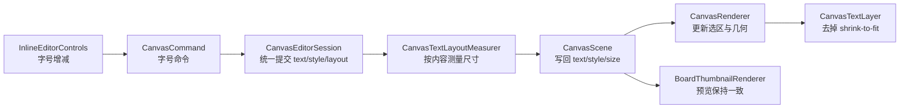

# 文字内容驱动尺寸计划

## 目标与已确认决策

- 目标：把文字项从“固定框 + shrink-to-fit”改成“内容决定尺寸 + `fontSize` 是权威字号”。
- 已确认决策：
  - 去掉主画布与缩略图里的按框缩字逻辑。
  - 单个文字项不再支持按框 resize。
  - 若组选里包含文字，组选缩放时按比例更新文字 `fontSize`，再按内容重算文字尺寸。
  - 旧文档在打开时立即按 `text + style` 归一到新语义。
  - 字号入口放在内联编辑浮层附近，而不是 toolbar / context menu。
- 非目标：
  - 不引入“固定文本框模式”。
  - 不保留旧的“拖文字角点就是缩放框”的单对象语义。

## 当前根因

```swift
// MyCanvas_Ver_0/Canvas/Core/CanvasScene.swift
// 当前提交文字时只改 text，不改 size；因此内容变化不会驱动几何变化。
func updateTextItem(
    withID id: CanvasItemID,
    text: String
) -> CanvasTextItem? {
    updateBoardItem(withID: id) { item in
        guard case var .text(textItem) = item else {
            return nil
        }

        textItem.text = text
        item = .text(textItem)
        return textItem
    } ?? nil
}
```

```swift
// MyCanvas_Ver_0/Platform/Shared/Rendering/CanvasTextLayer.swift
// 当前渲染不是让框跟内容走，而是让文字按 availableSize 再缩一次字号。
let scale = min(
    availableSize.width / intrinsicSize.width,
    availableSize.height / intrinsicSize.height
)
```

## 目标链路




## Phase 1：建立“内容驱动尺寸”的共享契约

- 在 [MyCanvas_Ver_0/Canvas/Core/CanvasBoardItem.swift](MyCanvas_Ver_0/Canvas/Core/CanvasBoardItem.swift) 明确 `CanvasTextItem.size` 的新语义：它表示当前 `text + style` 的内容包围尺寸，而不是用户手动框尺寸。
- 新增一个共享文字测量 helper，建议放在 [MyCanvas_Ver_0/Platform/Shared/Rendering/](MyCanvas_Ver_0/Platform/Shared/Rendering/) 下，负责：
  - 按 `text + CanvasTextStyle` 计算 intrinsic size
  - 返回稳定的最小宽高/边距规则
  - 给主画布与缩略图共用，避免两套测量口径分叉
- 先不改 UI，只把“字号权威、内容驱动尺寸、单文字不再手动 resize”的语义在共享层定清楚。

关键文件：

- [MyCanvas_Ver_0/Canvas/Core/CanvasBoardItem.swift](MyCanvas_Ver_0/Canvas/Core/CanvasBoardItem.swift)
- [MyCanvas_Ver_0/Platform/Shared/Rendering/CanvasTextLayer.swift](MyCanvas_Ver_0/Platform/Shared/Rendering/CanvasTextLayer.swift)
- [MyCanvas_Ver_0/Platform/Shared/BoardList/BoardThumbnailRenderer.swift](MyCanvas_Ver_0/Platform/Shared/BoardList/BoardThumbnailRenderer.swift)
- 新增 shared text layout helper

## Phase 2：把 text/style/size 的提交收口到 Session / Scene

- 扩展 [MyCanvas_Ver_0/Canvas/Core/CanvasScene.swift](MyCanvas_Ver_0/Canvas/Core/CanvasScene.swift)，把当前只改 `text` 的 `updateTextItem(...)` 升级为可原子更新 `text + style + size` 的共享写入口。
- 在 [MyCanvas_Ver_0/Canvas/Editing/CanvasEditorSession.swift](MyCanvas_Ver_0/Canvas/Editing/CanvasEditorSession.swift) 改造：
  - `addTextItem(...)`：创建文字时按默认文案和默认 `fontSize` 先测尺寸，不再用 `defaultTextItemSize(...)` 直接写死框。
  - `commitTextEdit()`：提交 draft 时同步重算尺寸，并把几何变更纳入 history/autosave。
  - 预留“仅改字号”的会话入口，供后面的 inline controls 复用。
- 明确中心点策略：文本内容变化时默认保持 `center` 不变，只更新 `size`；如果后续有需要，再单独讨论对齐锚点。

关键文件：

- [MyCanvas_Ver_0/Canvas/Editing/CanvasEditorSession.swift](MyCanvas_Ver_0/Canvas/Editing/CanvasEditorSession.swift)
- [MyCanvas_Ver_0/Canvas/Core/CanvasScene.swift](MyCanvas_Ver_0/Canvas/Core/CanvasScene.swift)
- [MyCanvas_Ver_0/Canvas/Editing/CanvasCommandExecutor.swift](MyCanvas_Ver_0/Canvas/Editing/CanvasCommandExecutor.swift)

## Phase 3：移除 shrink-to-fit，并统一主画布/缩略图的文字排版

- 在 [MyCanvas_Ver_0/Platform/Shared/Rendering/CanvasTextLayer.swift](MyCanvas_Ver_0/Platform/Shared/Rendering/CanvasTextLayer.swift) 去掉 `fittedFont(...)` 的按框缩字逻辑。
- 渲染改为：直接以 `style.fontSize * zoomScale` 作为最终字号；显示尺寸来自内容测量后写回的 `item.size`。
- 同步改 [MyCanvas_Ver_0/Platform/Shared/BoardList/BoardThumbnailRenderer.swift](MyCanvas_Ver_0/Platform/Shared/BoardList/BoardThumbnailRenderer.swift)，保证 board list 预览与主画布一致，不再一边 intrinsic、一边 shrink-to-fit。
- 明确行断策略：在内容驱动尺寸下，文本默认不再依赖“强制塞进固定框”；必要时保留换行，但不能再靠缩小字号兜底。

关键文件：

- [MyCanvas_Ver_0/Platform/Shared/Rendering/CanvasTextLayer.swift](MyCanvas_Ver_0/Platform/Shared/Rendering/CanvasTextLayer.swift)
- [MyCanvas_Ver_0/Canvas/Core/CanvasRenderer.swift](MyCanvas_Ver_0/Canvas/Core/CanvasRenderer.swift)
- [MyCanvas_Ver_0/Platform/Shared/BoardList/BoardThumbnailRenderer.swift](MyCanvas_Ver_0/Platform/Shared/BoardList/BoardThumbnailRenderer.swift)

## Phase 4：调整单文字与含文字组选的交互语义

- 单个文字项：
  - 在 [MyCanvas_Ver_0/Canvas/Core/CanvasRenderer.swift](MyCanvas_Ver_0/Canvas/Core/CanvasRenderer.swift) 的 selection overlay 生成逻辑里，对单选 text item 不再产出 selection resize handles。
  - 保留 translation / rotation 语义，避免把“文字 intrinsic item”又做回文本框。
- 含文字组选：
  - 改造 [MyCanvas_Ver_0/Canvas/Editing/CanvasSelectionTransformState.swift](MyCanvas_Ver_0/Canvas/Editing/CanvasSelectionTransformState.swift) 或其下游应用路径，让组选缩放在文字成员上不再只改 `size`，而是：
    1. 计算组选缩放比例
    2. 把比例映射到文字 `fontSize`
    3. 重新测量该文字的新 intrinsic size
    4. 再更新它在组选中的 `center`
  - 图片成员继续走现有几何缩放路径。
- 控制器侧只负责分发，不在 [MyCanvas_Ver_0/Platform/iOS/iOSViewController.swift](MyCanvas_Ver_0/Platform/iOS/iOSViewController.swift) / [MyCanvas_Ver_0/Platform/macOS/macOSViewController.swift](MyCanvas_Ver_0/Platform/macOS/macOSViewController.swift) 打补丁式特判；核心语义收口在 shared transform / scene 层。

关键文件：

- [MyCanvas_Ver_0/Canvas/Core/CanvasRenderer.swift](MyCanvas_Ver_0/Canvas/Core/CanvasRenderer.swift)
- [MyCanvas_Ver_0/Canvas/Core/CanvasEditOverlayHitTester.swift](MyCanvas_Ver_0/Canvas/Core/CanvasEditOverlayHitTester.swift)
- [MyCanvas_Ver_0/Canvas/Editing/CanvasSelectionTransformState.swift](MyCanvas_Ver_0/Canvas/Editing/CanvasSelectionTransformState.swift)
- [MyCanvas_Ver_0/Canvas/Core/CanvasScene.swift](MyCanvas_Ver_0/Canvas/Core/CanvasScene.swift)
- [MyCanvas_Ver_0/Platform/iOS/iOSViewController.swift](MyCanvas_Ver_0/Platform/iOS/iOSViewController.swift)
- [MyCanvas_Ver_0/Platform/macOS/macOSViewController.swift](MyCanvas_Ver_0/Platform/macOS/macOSViewController.swift)

## Phase 5：旧文档加载时立即归一到新语义

- 由于旧文档里的 text item `size` 来自旧的固定框语义，若直接去掉 shrink-to-fit，旧内容会出现裁剪/观感突变。
- 在加载链路里做一次“打开即归一”：
  - 从磁盘读出 `text + style`
  - 立即按新测量规则重算 `size`
  - 运行时用新 `size` 参与渲染与交互
- 优先在 mapper / load 路径收口，不改存储 schema；`BoardTextStyleRecord.fontSize` 已存在，可继续复用。

关键文件：

- [MyCanvas_Ver_0/Canvas/Storage/BoardDocument.swift](MyCanvas_Ver_0/Canvas/Storage/BoardDocument.swift)
- [MyCanvas_Ver_0/Canvas/Storage/BoardDocumentMapper.swift](MyCanvas_Ver_0/Canvas/Storage/BoardDocumentMapper.swift)
- [MyCanvas_Ver_0/Canvas/Editing/CanvasEditorSession.swift](MyCanvas_Ver_0/Canvas/Editing/CanvasEditorSession.swift)

## Phase 6：把字号入口接到 inline text editor 附近

- 在 [MyCanvas_Ver_0/Platform/iOS/Canvas/iOSCanvasTextEditorOverlayView.swift](MyCanvas_Ver_0/Platform/iOS/Canvas/iOSCanvasTextEditorOverlayView.swift) 和 [MyCanvas_Ver_0/Platform/macOS/Canvas/macOSCanvasTextEditorOverlayView.swift](MyCanvas_Ver_0/Platform/macOS/Canvas/macOSCanvasTextEditorOverlayView.swift) 增加字号控件。
- 第一版建议做离散步进：`A-` / `A+`，避免一开始就引入 slider 的连续值同步复杂度。
- 控件回调不要直接改 view 层状态，而是走命令层：
  - 扩展 [MyCanvas_Ver_0/Canvas/Editing/CanvasCommand.swift](MyCanvas_Ver_0/Canvas/Editing/CanvasCommand.swift)
  - 扩展 [MyCanvas_Ver_0/Canvas/Editing/CanvasCommandCatalog.swift](MyCanvas_Ver_0/Canvas/Editing/CanvasCommandCatalog.swift)
  - 扩展 [MyCanvas_Ver_0/Canvas/Editing/CanvasCommandExecutor.swift](MyCanvas_Ver_0/Canvas/Editing/CanvasCommandExecutor.swift)
- 这样字号修改可以复用 history/autosave/read-mode gate，而不是长出 controller 私有写口。

关键文件：

- [MyCanvas_Ver_0/Platform/iOS/Canvas/iOSCanvasTextEditorOverlayView.swift](MyCanvas_Ver_0/Platform/iOS/Canvas/iOSCanvasTextEditorOverlayView.swift)
- [MyCanvas_Ver_0/Platform/macOS/Canvas/macOSCanvasTextEditorOverlayView.swift](MyCanvas_Ver_0/Platform/macOS/Canvas/macOSCanvasTextEditorOverlayView.swift)
- [MyCanvas_Ver_0/Platform/iOS/iOSViewController.swift](MyCanvas_Ver_0/Platform/iOS/iOSViewController.swift)
- [MyCanvas_Ver_0/Platform/macOS/macOSViewController.swift](MyCanvas_Ver_0/Platform/macOS/macOSViewController.swift)
- [MyCanvas_Ver_0/Canvas/Editing/CanvasCommand.swift](MyCanvas_Ver_0/Canvas/Editing/CanvasCommand.swift)
- [MyCanvas_Ver_0/Canvas/Editing/CanvasCommandCatalog.swift](MyCanvas_Ver_0/Canvas/Editing/CanvasCommandCatalog.swift)
- [MyCanvas_Ver_0/Canvas/Editing/CanvasCommandExecutor.swift](MyCanvas_Ver_0/Canvas/Editing/CanvasCommandExecutor.swift)

## Phase 7：测试与回归验证

- 新增/更新自动化测试，优先覆盖：
  - 新建文字时尺寸按内容测量
  - `commitTextEdit()` 同时更新 `text + size`
  - 去掉 shrink-to-fit 后，`CanvasTextLayer` 不再二次缩小 `fontSize`
  - 旧文档加载时文字尺寸会被归一
  - 单选 text 不再出现 resize handles
  - 含文字组选缩放时，文字 `fontSize` 按比例变化
  - inline editor 的字号增减命令能进入 history / undo / redo
- 手工验证清单重点：
  - 单选文字：移动、旋转、点正文编辑、字号增减
  - 纯文字多选：整体缩放后字号/位置是否一致
  - 图文混合多选：图片继续几何缩放、文字按字号比例变化
  - board list 缩略图与主画布文字观感一致
  - 阅读模式 / 多选 / context menu gating 不回归

关键测试文件候选：

- [MyCanvas_Ver_0Tests/CanvasEditorSessionAlignmentOverlayTests.swift](MyCanvas_Ver_0Tests/CanvasEditorSessionAlignmentOverlayTests.swift)
- [MyCanvas_Ver_0Tests/CanvasClickSelectionResolverTests.swift](MyCanvas_Ver_0Tests/CanvasClickSelectionResolverTests.swift)
- [MyCanvas_Ver_0Tests/CanvasContextMenuActionResolverTests.swift](MyCanvas_Ver_0Tests/CanvasContextMenuActionResolverTests.swift)
- 以及新增的 text layout / command / migration 专项测试

## 风险与控制点

- 最大风险是“去掉 shrink-to-fit”后，旧 `size` 与新语义不匹配导致文字溢出，所以旧文档加载归一必须靠前做。
- 第二风险是含文字组选缩放：如果只改几何不改 `fontSize`，语义会立刻撕裂；因此这一段必须作为明确 phase，而不是后补。
- 第三风险是主画布和缩略图各自测量，口径容易漂；必须共用一套 text measurement 规则。
- 第四风险是把字号入口直接塞进 controller 私有逻辑，绕开 command/history；这会让 undo/redo 和 read mode gate 重新分叉，必须避免。

