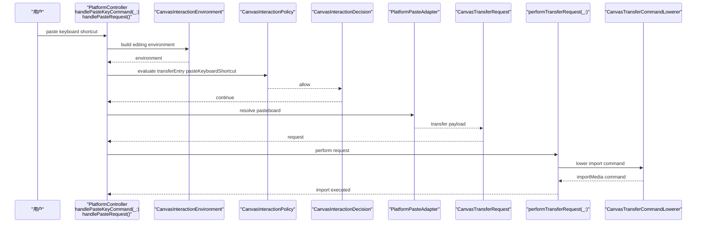
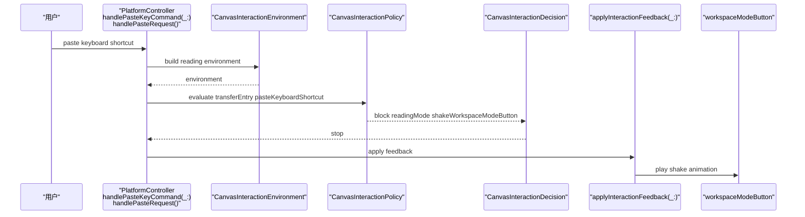
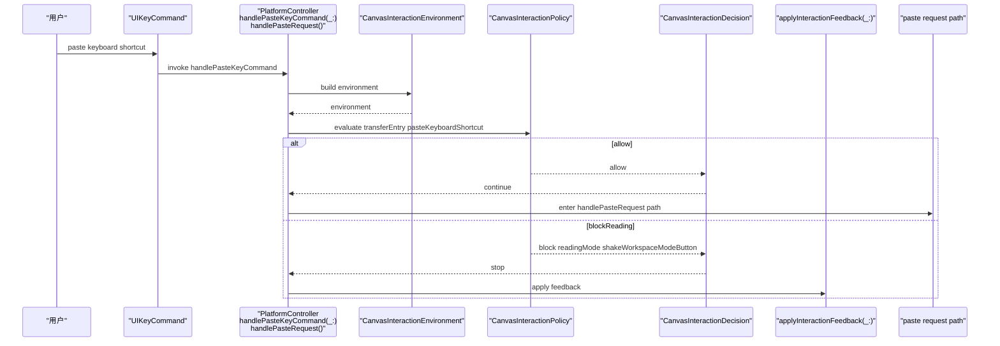
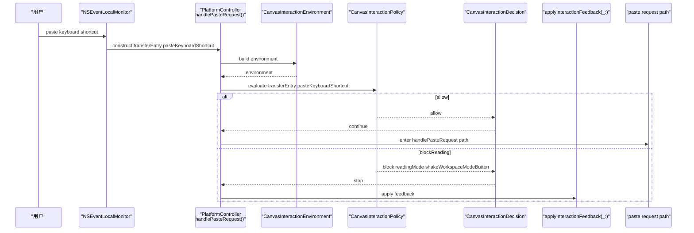
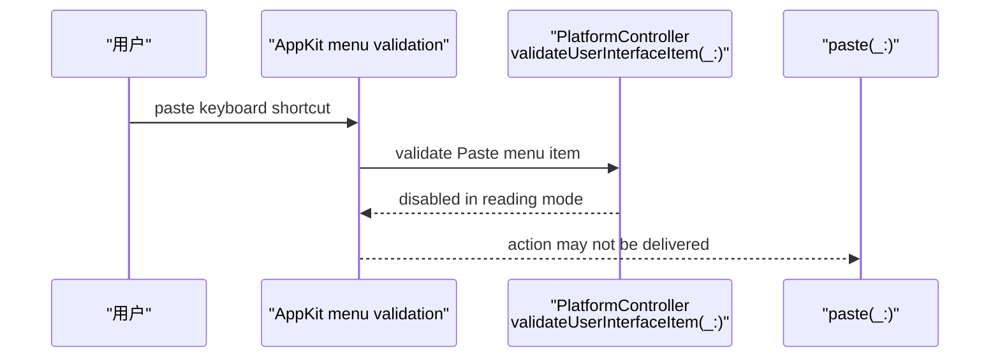
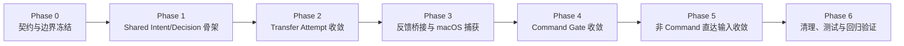

# 方案 4 分阶段计划

目标不是只把“阅读模式下 `Command + V` 摇头”做出来，而是把整条链路升级成：

`平台捕获输入尝试 -> shared 判定是否允许 -> 平台执行反馈或继续执行`

当前代码里，`[MyCanvas_Ver_0/Canvas/Transfer/CanvasTransferTypes.swift](MyCanvas_Ver_0/Canvas/Transfer/CanvasTransferTypes.swift)` 的 `CanvasTransferRequest` 还是“已解析完成、可导入的内容”，它出现得太晚，不适合承载“用户刚刚尝试了一次 paste”的语义。

## 关键设计原则

- `Intent` 必须放在 `CanvasTransferRequest` 之前，表示“用户发起了什么尝试”，而不是“已经拿到了什么 payload”。
- `Policy` 必须是 shared 纯判定层，但它接收的是一个显式 `Environment`，而不是把 `isTransitionInteractionFrozen` 这类平台临时状态塞进 `[MyCanvas_Ver_0/Canvas/Editing/CanvasEditorSession.swift](MyCanvas_Ver_0/Canvas/Editing/CanvasEditorSession.swift)`。
- `FeedbackHint` 可以是 shared 输出，但真正的按钮摇头动画依然留在平台层，不把 UI 动画状态写进 shared session。
- `[MyCanvas_Ver_0/Canvas/Editing/CanvasCommand.swift](MyCanvas_Ver_0/Canvas/Editing/CanvasCommand.swift)` 里的 `CanvasCommandID.isAllowedInReadingMode` 先保留，作为已有命令语义真源，后续让新 policy 复用它，而不是再造一套 allowlist。
- 第一版只统一“状态型阻断原因”，例如 `readingMode`、`transitionInteractionFrozen`；剪贴板为空、类型不支持这类 payload 失败，先继续留在 adapter / request 构建阶段，不强行塞进 policy。

## 建议新增契约

- 新增目录：`[MyCanvas_Ver_0/Canvas/Input/](MyCanvas_Ver_0/Canvas/Input/)`
- 建议首批类型：
  - `CanvasInteractionIntent`
  - `CanvasTransferEntryIntent`
  - `CanvasInteractionEnvironment`
  - `CanvasInteractionBlockReason`
  - `CanvasInteractionFeedbackHint`
  - `CanvasInteractionDecision`
  - `CanvasInteractionPolicy`
- `CanvasInteractionIntent` 首版覆盖：
  - `transferEntry(CanvasTransferEntryIntent)`
  - `command(CanvasCommandID)`
  - `contextMenuRequest`
  - `beginTextEdit(itemID: CanvasItemID)`
- `CanvasTransferEntryIntent` 首版覆盖：
  - `pasteKeyboardShortcut`
  - `pasteMenu`
  - `importButton`
  - `dragAndDrop`
- `CanvasInteractionEnvironment` 首版只包含：
  - `workspaceMode`
  - `isTransitionInteractionFrozen`
- `CanvasInteractionDecision` 首版只返回：
  - `allow`
  - `block(reason:feedback:)`
- `CanvasInteractionFeedbackHint` 首版只需要：
  - `shakeWorkspaceModeButton`

## 以粘贴为例的模式时序差异

- 统一抽象：
  - `iOS` 键盘入口保持从 `[MyCanvas_Ver_0/Platform/iOS/iOSViewController.swift](MyCanvas_Ver_0/Platform/iOS/iOSViewController.swift)` 的 `handlePasteKeyCommand(_:) -> handlePasteRequest()` 进入；迁移到 `方案 4` 后，这个入口先构造 `CanvasInteractionIntent.transferEntry(.pasteKeyboardShortcut)` 与 `CanvasInteractionEnvironment`。
  - `macOS` 键盘入口在 `Phase 3` 补上 scoped `NSEvent.addLocalMonitorForEvents(matching: [.keyDown])` 后，也先构造 `CanvasInteractionIntent.transferEntry(.pasteKeyboardShortcut)` 与 `CanvasInteractionEnvironment`；如果是菜单粘贴，则构造 `CanvasInteractionIntent.transferEntry(.pasteMenu)`。
  - 两端在进入 pasteboard adapter 之前，都统一先问 `CanvasInteractionPolicy`，由 `CanvasInteractionDecision` 决定是继续构建 `CanvasTransferRequest`，还是通过 `applyInteractionFeedback(_:)` 走阅读模式阻断反馈。

### 编辑模式下的粘贴时序

- 编辑模式下，分叉点发生在 `CanvasInteractionDecision.allow`。
- 一旦判定允许，后续仍然沿用现有 transfer pipeline：`pasteboard adapter -> CanvasTransferRequest -> performTransferRequest(_:) -> CanvasTransferCommandLowerer`。
- 这意味着 `方案 4` 不会替换 [`MyCanvas_Ver_0/Canvas/Transfer/CanvasTransferTypes.swift](MyCanvas_Ver_0/Canvas/Transfer/CanvasTransferTypes.swift) 里的` CanvasTransferRequest`，而是把它后移成“allowed 之后的后置结构”。

### 阅读模式下的粘贴时序

- 阅读模式下，分叉点发生在 `CanvasInteractionDecision.block(reason:.readingMode, feedback:.shakeWorkspaceModeButton)`。
- 被阻断后，不再进入 pasteboard 解析，也不会生成 `CanvasTransferRequest`，更不会继续走 `performTransferRequest(_:)` 与 `CanvasTransferCommandLowerer`。
- 这正是 `方案 4` 和当前实现的核心区别：当前实现是平台 controller 直接 `guard isReadingModeActive == false`；迁移后则是平台先提交 `Intent`，再由 shared policy 给出正式的 blocked decision。

### 双端键盘粘贴入口对照

- `iOS` 已经有现成的键盘入口：`[MyCanvas_Ver_0/Platform/iOS/iOSViewController.swift](MyCanvas_Ver_0/Platform/iOS/iOSViewController.swift)` 里的 `keyCommands` 会把键盘粘贴分发到 `handlePasteKeyCommand(_:)`，所以 `方案 4` 只需要把这个入口前移到 `Intent -> Policy -> Decision`。
- `macOS` 当前没有等价的稳定键盘入口，因为 `[MyCanvas_Ver_0/Platform/macOS/macOSViewController.swift](MyCanvas_Ver_0/Platform/macOS/macOSViewController.swift)` 的 `validateUserInterfaceItem(_:)` 可能先把 `Paste` 禁掉；因此 `方案 4` 在 `Phase 3` 才需要额外补 `NSEvent.addLocalMonitorForEvents(matching: [.keyDown])`，让键盘尝试本身先变成一个可观测的 `Intent`。

#### iOS 键盘粘贴入口时序

- `iOS` 的关键点不是新增捕获层，而是把现有 `handlePasteKeyCommand(_:) -> handlePasteRequest()` 这条链前移成“先判定，再进入 paste request path”。
- 这意味着蓝牙键盘、`iPhone Mirroring` 这类最终落入 `UIKeyCommand` 的硬件键盘场景，都自然复用同一套 shared policy。

#### macOS 键盘粘贴入口时序

- `macOS` 的关键点不是 `handlePasteRequest()` 本身，而是先让“键盘按下 `Command + V`”在 `Paste` 菜单被禁用前就能被 controller 看到。
- 也正因为如此，`Phase 3` 的 `macOS` 工作本质上是“补齐 keyboard intent capture”，不是单纯补一个动画。

#### macOS 当前状态与目标状态的差异

- 这也是为什么 `方案 4` 不能只说“把 `paste(_:)` 改成先问 policy”就结束了；如果不补 `NSEvent` 级别的键盘尝试捕获层，`macOS` 在阅读模式下可能根本拿不到这次 `Intent`。

## 阶段依赖

## Phase 0：契约与边界冻结

- 目标：先把 `方案 4` 的边界定死，避免后面一边迁移一边改定义。
- 范围：首版纳入 `transferEntry`、`command`、`contextMenuRequest`、`beginTextEdit`；不纳入 `pan/zoom/back` 这类导航输入。
- 规则：`CanvasTransferRequest` 保持现义，不改名、不扩展成“尝试”；新 intent 体系只放在它之前。
- 规则：`readingMode` 和 `transitionInteractionFrozen` 进入 `CanvasInteractionDecision`；`emptyPasteboard`、`unsupportedTransferContent` 暂不进入 shared policy。
- 涉及文件：规划层面先锁定未来新增目录 `[MyCanvas_Ver_0/Canvas/Input/](MyCanvas_Ver_0/Canvas/Input/)`。
- 完成标志：命名、边界、非目标项冻结；后续 phase 不再反复改模型。

## Phase 1：搭 shared Intent/Decision 骨架

- 目标：先把 shared 判定核心搭起来，但暂时不切任何运行时入口。
- 主要改动：新增 `CanvasInteractionIntent.swift`、`CanvasInteractionDecision.swift`、`CanvasInteractionPolicy.swift`。
- 主要改动：`CanvasInteractionPolicy` 先只做最小闭环判断：
  - `workspaceMode == .reading` 时阻断编辑型 intent。
  - `isTransitionInteractionFrozen == true` 时阻断编辑型 intent。
- 主要改动：新增 `CanvasInteractionEnvironment`，由平台 controller 在调用时构造；不要把 `transitionFrozen` 写进 `[MyCanvas_Ver_0/Canvas/Editing/CanvasEditorSession.swift](MyCanvas_Ver_0/Canvas/Editing/CanvasEditorSession.swift)`。
- 测试：新增 `[MyCanvas_Ver_0Tests/CanvasInteractionPolicyTests.swift](MyCanvas_Ver_0Tests/CanvasInteractionPolicyTests.swift)`，先覆盖 `reading/editing`、`frozen/unfrozen` 四象限。
- 完成标志：shared policy 已可纯函数化返回 `allow` / `block`，但产品行为暂时不变。

## Phase 2：先收敛 transfer attempt

- 目标：把 paste / import / drag-drop 这类导入入口，从“平台自己直接 `guard`”迁到“先构造 intent，再问 policy”。
- 主要改动：`[MyCanvas_Ver_0/Platform/iOS/iOSViewController.swift](MyCanvas_Ver_0/Platform/iOS/iOSViewController.swift)` 与 `[MyCanvas_Ver_0/Platform/macOS/macOSViewController.swift](MyCanvas_Ver_0/Platform/macOS/macOSViewController.swift)` 的这些入口统一先创建 `CanvasInteractionIntent.transferEntry(...)`：
  - `handlePasteRequest()`
  - `handleImportButtonTap()` / `handleImportButtonClick()`
  - drag/drop 入口
- 主要改动：`allow` 时继续走现有路径：
  - platform adapter 解析 pasteboard / picker / drop
  - 生成 `CanvasTransferRequest`
  - 进入 `[MyCanvas_Ver_0/Canvas/Transfer/CanvasTransferCommandLowerer.swift](MyCanvas_Ver_0/Canvas/Transfer/CanvasTransferCommandLowerer.swift)`
- 主要改动：`block` 时不再继续解析 payload，也不再静默 `return`，而是把 `decision` 往平台反馈桥接层返回。
- 保底策略：`performTransferRequest(_:)` 里的现有 guard 暂时保留，作为迁移期 safety net，不在这一阶段删。
- 完成标志：transfer 入口已经“先判定，后解析”，shared policy 首次成为真实运行时路径。

## Phase 3：接上反馈桥，并补齐 macOS 捕获层

- 目标：把 blocked decision 真正映射成右上角模式按钮摇头；这一阶段是第一个用户可见里程碑。
- 主要改动：双端 controller 新增统一反馈桥，比如 `applyInteractionFeedback(_:)`，只负责把 `.shakeWorkspaceModeButton` 映射到本地按钮动画。
- `iOS`：
  - `handlePasteKeyCommand(_:)` 走 `intent -> decision`。
  - 蓝牙键盘、`iPhone Mirroring` 等硬件键盘桥接路径都自然落到这里。
- `macOS`：
  - 不能只依赖 `paste(_:)`，因为 `validateUserInterfaceItem` 可能先把 `Paste` 禁掉。
  - 需要补一个 scoped 的 `NSEvent.addLocalMonitorForEvents(matching: [.keyDown])`。
  - 只在当前 canvas 活跃、窗口匹配、检测到 `Command + V` 时构造 `transferEntry(.pasteKeyboardShortcut)` intent。
- 关键避坑：
  - 要做去重，避免 `monitor` 和后续 responder/action 双触发两次动画。
  - 要决定是否吞掉被阻断的 `Command + V`，避免系统 beep 与摇头叠加。
- 测试：
  - manual：`iOS` 蓝牙键盘 / `iPhone Mirroring`
  - manual：`macOS` 键盘 `Command + V`
- 完成标志：目标功能在双端都可见，且 shared decision 已经是唯一阻断语义来源。

## Phase 4：把 command gate 收敛到同一 policy

- 目标：让命令执行、命令 descriptor、blocked reason 统一说同一种语言，避免 shared 命令层和 intent 层各判各的。
- 主要改动：引入 `CanvasInteractionIntent.command(CanvasCommandID)`。
- 主要改动：`[MyCanvas_Ver_0/Canvas/Editing/CanvasCommandExecutor.swift](MyCanvas_Ver_0/Canvas/Editing/CanvasCommandExecutor.swift)` 的 `canExecute(_:)` 改为先问 `CanvasInteractionPolicy`，不要再直接写 `session.isReadingModeActive == false`。
- 主要改动：`[MyCanvas_Ver_0/Canvas/Editing/CanvasCommandCatalog.swift](MyCanvas_Ver_0/Canvas/Editing/CanvasCommandCatalog.swift)` 的 `workspaceModeAdjustedDescriptor(...)` 改为复用同一 policy 结论，而不是自己再判断一遍阅读模式。
- 主要改动：`[MyCanvas_Ver_0/Canvas/Editing/CanvasCommand.swift](MyCanvas_Ver_0/Canvas/Editing/CanvasCommand.swift)` 里的 `CanvasCommandID.isAllowedInReadingMode` 暂不删，继续作为 command 元数据，被 policy 消费。
- 测试：新增 command policy parity 测试，保证 descriptor、executor、policy 三者一致。
- 完成标志：command descriptor、command execution、blocked reason 不再有两套阅读模式逻辑。

## Phase 5：把非 command 的直达编辑入口也收敛进来

- 目标：把目前散在 controller 里的“阅读模式早退”逐步迁成 intent-policy 驱动。
- 主要改动：为这些入口建 intent，并改成先判定再执行：
  - `[MyCanvas_Ver_0/Platform/iOS/iOSViewController.swift](MyCanvas_Ver_0/Platform/iOS/iOSViewController.swift)` 里的 `handleLongPress(at:)`、`beginTextEditIfPossible(for:)`
  - `[MyCanvas_Ver_0/Platform/macOS/macOSViewController.swift](MyCanvas_Ver_0/Platform/macOS/macOSViewController.swift)` 里的 `handleSecondaryClick(at:)`、`beginTextEditIfPossible(for:)`
  - context menu request
- 主要改动：`[MyCanvas_Ver_0/Platform/Shared/ContextMenu/CanvasContextMenuCommandResolver.swift](MyCanvas_Ver_0/Platform/Shared/ContextMenu/CanvasContextMenuCommandResolver.swift)` 里的 `if session.isReadingModeActive { return [] }` 从“手写特判”迁为消费统一 policy 结果。
- 主要改动：平台 controller 里大量 `guard isReadingModeActive == false else { return }` 的早退，开始有计划地下线。
- 测试：扩展 `[MyCanvas_Ver_0Tests/CanvasContextMenuActionResolverTests.swift](MyCanvas_Ver_0Tests/CanvasContextMenuActionResolverTests.swift)`，补阅读模式 blocked 场景。
- 完成标志：direct edit entry 不再各自维护一套 reading-mode 早退语义。

## Phase 6：清理、测试与回归验证

- 目标：把迁移期的重复 guard 清理掉，但保留真正必要的底线防护。
- 主要改动：审计 controller 中所有 `isReadingModeActive == false` / `isTransitionInteractionFrozen == false` 直写 guard。
- 主要改动：删除已经被 policy 覆盖的重复判断；保留 `[MyCanvas_Ver_0/Canvas/Editing/CanvasCommandExecutor.swift](MyCanvas_Ver_0/Canvas/Editing/CanvasCommandExecutor.swift)` 与 `performTransferRequest(_:)` 这种末端 safety net。
- 主要改动：统一 debug 日志格式，至少能看出：
  - intent 类型
  - decision
  - block reason
  - feedback hint
- 测试：
  - 新增 `[MyCanvas_Ver_0Tests/CanvasInteractionPolicyTests.swift](MyCanvas_Ver_0Tests/CanvasInteractionPolicyTests.swift)`
  - 扩展 `[MyCanvas_Ver_0Tests/CanvasContextMenuActionResolverTests.swift](MyCanvas_Ver_0Tests/CanvasContextMenuActionResolverTests.swift)`
  - 如有必要，补 command policy parity tests
- 手工回归矩阵：
  - `iOS` 编辑模式 / 阅读模式 + 蓝牙键盘 `Command + V`
  - `iOS` `iPhone Mirroring` 下 `Command + V`
  - `macOS` 菜单 `Paste`
  - `macOS` 键盘 `Command + V`
  - 阅读模式下 import button / drag-drop / context menu / beginTextEdit
  - 编辑模式下现有导入与命令行为不回归
- 完成标志：所有编辑型输入的“是否允许”都能追溯到 shared policy；平台只负责捕获事件和播放反馈。

## 关键取舍

- `Phase 2 + Phase 3` 是首个产品里程碑，能把“阅读模式下按 `Command + V` 时右上角按钮摇头”做出来。
- `Phase 4 + Phase 5` 才是真正把 `方案 4` 做完整，否则只是 transfer 入口收敛，不算 fully converged。
- 最容易失控的点不是动画，而是把 payload 失败和 state block 混成一层；这一步必须控制住，不然 policy 会迅速膨胀。
- `macOS` 仍然是实现难点，因为它需要“在 Paste 菜单已 disabled 的情况下仍然捕获 `Command + V` 尝试”。

