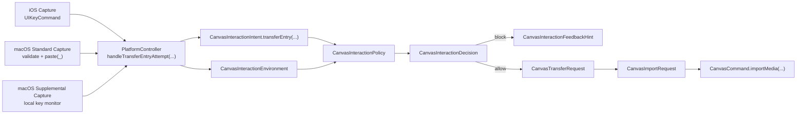
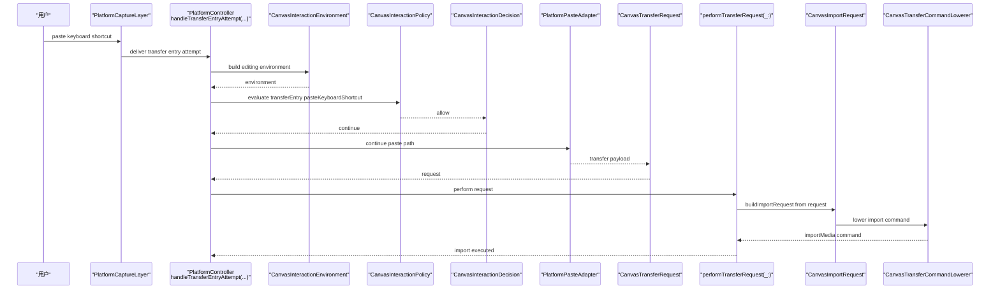
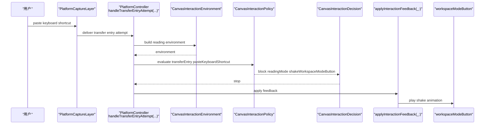
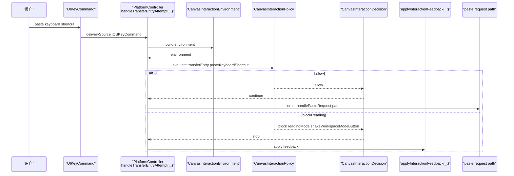
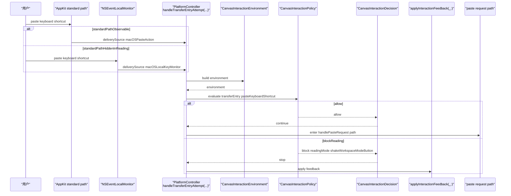
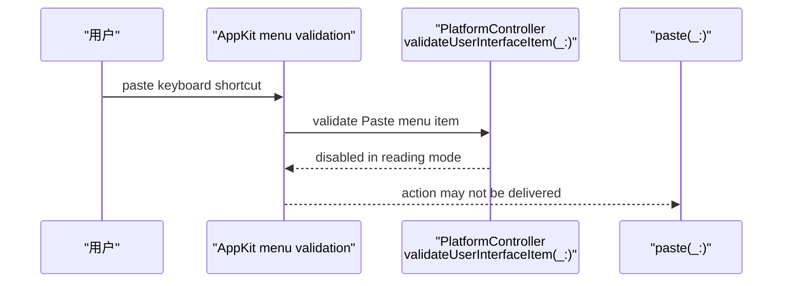
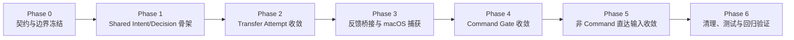

# 方案 4 分阶段计划

目标不是只把“阅读模式下 `Command + V` 摇头”做出来，而是把整条链路升级成：

`平台捕获输入尝试 -> shared 判定是否允许 -> 平台执行反馈或继续执行`

当前代码里，`[MyCanvas_Ver_0/Canvas/Transfer/CanvasTransferTypes.swift](MyCanvas_Ver_0/Canvas/Transfer/CanvasTransferTypes.swift)` 的 `CanvasTransferRequest` 还是“已解析完成、可导入的内容”，它出现得太晚，不适合承载“用户刚刚尝试了一次 paste”的语义。

## 关键设计原则

- `Intent` 必须放在 `CanvasTransferRequest` 之前，表示“用户发起了什么尝试”，而不是“已经拿到了什么 payload”。
- `Policy` 必须是 shared 纯判定层，但它接收的是一个显式 `Environment`，而不是把 `isTransitionInteractionFrozen` 这类平台临时状态塞进 `[MyCanvas_Ver_0/Canvas/Editing/CanvasEditorSession.swift](MyCanvas_Ver_0/Canvas/Editing/CanvasEditorSession.swift)`。
- `FeedbackHint` 可以是 shared 输出，但真正的按钮摇头动画依然留在平台层，不把 UI 动画状态写进 shared session。
- `[MyCanvas_Ver_0/Canvas/Editing/CanvasCommand.swift](MyCanvas_Ver_0/Canvas/Editing/CanvasCommand.swift)` 里的 `CanvasCommandID.isAllowedInReadingMode` 先保留，作为已有命令语义真源，后续让新 policy 复用它，而不是再造一套 allowlist。
- 第一版只统一“状态型阻断原因”，例如 `readingMode`、`transitionInteractionFrozen`；剪贴板为空、类型不支持这类 payload 失败，先继续留在 adapter / request 构建阶段，不强行塞进 policy。
- `Capture` 层只允许在平台侧分岔；统一点必须落在平台捕获之后的 controller 归一入口，而不是强行抹平 `UIKeyCommand` 与 `AppKit` responder/menu 的系统差异。
- `macOS` 优先保留标准 `validateUserInterfaceItem(_:) -> paste(_:)` 路径，只在阅读模式等标准路径无法稳定观测 keyboard attempt 的状态下补充 `NSEvent` monitor；不要把所有键盘粘贴都改成全量 monitor 化。

## 建议新增契约

- 新增目录：`[MyCanvas_Ver_0/Canvas/Input/](MyCanvas_Ver_0/Canvas/Input/)`
- 建议首批类型：
  - `CanvasInteractionIntent`
  - `CanvasTransferEntryIntent`
  - `CanvasInteractionEnvironment`
  - `CanvasInteractionBlockReason`
  - `CanvasInteractionFeedbackHint`
  - `CanvasInteractionDecision`
  - `CanvasInteractionPolicy`
- 继续复用的既有下游类型：
  - `CanvasTransferRequest`
  - `CanvasImportRequest`
  - `CanvasCommand.importMedia(CanvasImportRequest)`
- `CanvasInteractionIntent` 首版覆盖：
  - `transferEntry(CanvasTransferEntryIntent)`
  - `command(CanvasCommandID)`
  - `contextMenuRequest`
  - `beginTextEdit(itemID: CanvasItemID)`
- `CanvasTransferEntryIntent` 首版覆盖：
  - `pasteKeyboardShortcut`
  - `pasteMenu`
  - `importButton`
  - `dragAndDrop`
- `CanvasInteractionEnvironment` 首版只包含：
  - `workspaceMode`
  - `isTransitionInteractionFrozen`
- `CanvasInteractionDecision` 首版只返回：
  - `allow`
  - `block(reason:feedback:)`
- `CanvasInteractionFeedbackHint` 首版只需要：
  - `shakeWorkspaceModeButton`

## 关键数据结构与函数骨架

- 这一节作为整份计划的命名真源，后面的阶段拆分、时序图和验证项都以这里的类型与函数为准。
- 图中的 `PlatformPasteAdapter` 只是对现有 `[MyCanvas_Ver_0/Platform/iOS/iOSCanvasImportAdapter.swift](MyCanvas_Ver_0/Platform/iOS/iOSCanvasImportAdapter.swift)` / `[MyCanvas_Ver_0/Platform/macOS/macOSCanvasImportAdapter.swift](MyCanvas_Ver_0/Platform/macOS/macOSCanvasImportAdapter.swift)` 的统称，不新增一个新的 shared adapter 类型。
- 图中的 `PastePath` / `paste request path` 只是对现有 `handlePasteRequest() -> platform adapter -> CanvasTransferRequest -> performTransferRequest(_:) -> buildImportRequest(from:) -> CanvasImportRequest` 这条路径的抽象命名，不新增一个新的运行时对象。
- `CanvasInteractionDecision.block(reason:feedback:)` 里的 `feedback` 保持可选；像键盘 paste 在阅读模式下可以给 `.shakeWorkspaceModeButton`，而 `transitionInteractionFrozen` 这类状态阻断可以继续保持 `nil`。

```swift
// MyCanvas_Ver_0/Canvas/Input/CanvasInteractionIntent.swift
enum CanvasTransferEntryIntent {
    case pasteKeyboardShortcut
    case pasteMenu
    case importButton
    case dragAndDrop
}

enum CanvasInteractionIntent {
    case transferEntry(CanvasTransferEntryIntent)
    case command(CanvasCommandID)
    case contextMenuRequest
    case beginTextEdit(itemID: CanvasItemID)
}
```

```swift
// MyCanvas_Ver_0/Canvas/Input/CanvasInteractionDecision.swift
struct CanvasInteractionEnvironment {
    let workspaceMode: CanvasWorkspaceMode
    let isTransitionInteractionFrozen: Bool
}

enum CanvasInteractionBlockReason {
    case readingMode
    case transitionInteractionFrozen
}

enum CanvasInteractionFeedbackHint {
    case shakeWorkspaceModeButton
}

enum CanvasInteractionDecision {
    case allow
    case block(
        reason: CanvasInteractionBlockReason,
        feedback: CanvasInteractionFeedbackHint?
    )
}
```

```swift
// MyCanvas_Ver_0/Canvas/Input/CanvasInteractionPolicy.swift
struct CanvasInteractionPolicy {
    func decision(
        for intent: CanvasInteractionIntent,
        environment: CanvasInteractionEnvironment
    ) -> CanvasInteractionDecision
}
```

```swift
// Existing downstream bridge reused after transfer intent is allowed
// MyCanvas_Ver_0/Canvas/Transfer/CanvasTransferTypes.swift
struct CanvasTransferRequest

// MyCanvas_Ver_0/Canvas/Import/CanvasImportTypes.swift
struct CanvasImportRequest

// MyCanvas_Ver_0/Canvas/Editing/CanvasCommand.swift
case importMedia(CanvasImportRequest)
```

```swift
// MyCanvas_Ver_0/Platform/iOS/iOSViewController.swift
// MyCanvas_Ver_0/Platform/macOS/macOSViewController.swift
private enum TransferEntryDeliverySource {
    case iOSKeyCommand
    case macOSPasteAction
    case macOSLocalKeyMonitor
    case importButton
    case dragAndDrop
}

private func handleTransferEntryAttempt(
    _ entry: CanvasTransferEntryIntent,
    deliverySource: TransferEntryDeliverySource,
    continueIfAllowed: () -> Void
)

private func makeInteractionEnvironment() -> CanvasInteractionEnvironment
private func applyInteractionFeedback(_ hint: CanvasInteractionFeedbackHint)
private func shouldEnableSupplementalKeyboardCapture() -> Bool
```




## Capture 层软统一策略

- 这里追求的是“capture result 统一”，不是“系统 capture API 统一”。
- `iOS` 继续使用 `UIKeyCommand` 作为标准键盘入口，不额外发明一套低层键盘捕获。
- `macOS` 继续保留 `validateUserInterfaceItem(_:) -> paste(_:)` 的标准 responder/menu 路径；补充 `NSEvent` monitor 只用于“标准路径可能拿不到 keyboard attempt”的场景。
- `macOS` 的标准 `paste(_:)` 路径在来源可辨识时，应直接归一到对应的 transfer intent：
  - 菜单点击归一到 `.pasteMenu`
  - 可观测的键盘等效触发归一到 `.pasteKeyboardShortcut`
- 双端一旦捕获到 transfer 入口尝试，都应在平台 controller 内第一时间汇合到 `handleTransferEntryAttempt(_:deliverySource:continueIfAllowed:)`。
- `TransferEntryDeliverySource` 是平台本地去重与调度辅助信息，不进入 shared `CanvasInteractionIntent`，避免把 OS 事件分发细节污染到 shared domain。
- `continueIfAllowed` 闭包承载“当前入口的既有下游路径”：对 paste 来说是 `handlePasteRequest()` 的下游执行，对 import button / drag-and-drop 来说则是各自现有的 transfer continuation。
- `macOS` 的补充 monitor 默认不应该常驻全开；更合理的策略是由 `shouldEnableSupplementalKeyboardCapture()` 在阅读模式等必要状态下按条件启用。
- 去重优先走结构性策略：
  - 编辑模式优先走标准 `paste(_:)` 路径。
  - 阅读模式等标准路径可能观测不到 attempt 的状态，再启用补充 monitor。
- 只有在极端情况下，才需要在 controller 内再加一层很薄的时间窗去重，避免 `macOSPasteAction` 与 `macOSLocalKeyMonitor` 对同一次 `Command + V` 双重投递。

## 以粘贴为例的模式时序差异

- 统一抽象：
  - 前面两张“编辑模式 / 阅读模式”总图故意把 `iOS` 的 `UIKeyCommand`、`macOS` 的标准 `paste(_:)` 和补充 keyboard monitor 都折叠成 `PlatformCaptureLayer -> handleTransferEntryAttempt(...)`；具体平台分化放在后面的双端对照图里展开。
  - `iOS` 键盘入口保持从 `[MyCanvas_Ver_0/Platform/iOS/iOSViewController.swift](MyCanvas_Ver_0/Platform/iOS/iOSViewController.swift)` 的 `handlePasteKeyCommand(_:)` 进入，再尽快归一到 `handleTransferEntryAttempt(.pasteKeyboardShortcut, deliverySource: .iOSKeyCommand, ...)`。
  - `macOS` 键盘入口优先走标准 `validateUserInterfaceItem(_:) -> paste(_:)` 路径，再归一到 `handleTransferEntryAttempt(.pasteKeyboardShortcut, deliverySource: .macOSPasteAction, ...)`；阅读模式等标准路径可能观测不到 attempt 的状态，再由 `NSEvent.addLocalMonitorForEvents(matching: [.keyDown])` 补充归一到 `.macOSLocalKeyMonitor`。
  - 两端在进入 pasteboard adapter 之前，都统一先问 `CanvasInteractionPolicy`，由 `CanvasInteractionDecision` 决定是继续执行 `continueIfAllowed` 下游路径，还是读取其中的 `feedback` 并通过 `applyInteractionFeedback(_:)` 走阅读模式阻断反馈。
  - 一旦 transfer intent 被允许，后续沿用现有下游桥接：`CanvasTransferRequest -> buildImportRequest(from:) -> CanvasImportRequest -> CanvasTransferCommandLowerer.loweredCommand(for:) -> CanvasCommand.importMedia(...)`。

### 编辑模式下的粘贴时序




- 编辑模式下，分叉点发生在 `CanvasInteractionDecision.allow`。
- 一旦判定允许，后续仍然沿用现有 transfer pipeline：`pasteboard adapter -> CanvasTransferRequest -> performTransferRequest(_:) -> buildImportRequest(from:) -> CanvasImportRequest -> CanvasTransferCommandLowerer`。
- 这意味着 `方案 4` 不会替换 `[MyCanvas_Ver_0/Canvas/Transfer/CanvasTransferTypes.swift](MyCanvas_Ver_0/Canvas/Transfer/CanvasTransferTypes.swift) 里的` CanvasTransferRequest`，也不会替换 [`MyCanvas_Ver_0/Canvas/Import/CanvasImportTypes.swift](MyCanvas_Ver_0/Canvas/Import/CanvasImportTypes.swift) 里的 `CanvasImportRequest`，而是把它们整体后移成“allowed 之后的下游结构”。

### 阅读模式下的粘贴时序




- 阅读模式下，分叉点发生在 `CanvasInteractionDecision.block(reason:.readingMode, feedback:.shakeWorkspaceModeButton)`。
- 被阻断后，不再进入 pasteboard 解析，也不会生成 `CanvasTransferRequest`，更不会继续走 `performTransferRequest(_:)`、`buildImportRequest(from:)` 与 `CanvasTransferCommandLowerer`。
- 这正是 `方案 4` 和当前实现的核心区别：当前实现是平台 controller 直接 `guard isReadingModeActive == false`；迁移后则是平台先提交 `Intent`，再由 shared policy 给出正式的 blocked decision。

### 双端键盘粘贴入口对照

- `iOS` 已经有现成的键盘入口：`[MyCanvas_Ver_0/Platform/iOS/iOSViewController.swift](MyCanvas_Ver_0/Platform/iOS/iOSViewController.swift)` 里的 `keyCommands` 会把键盘粘贴分发到 `handlePasteKeyCommand(_:)`，所以 `方案 4` 只需要把这个入口尽快归一到 `handleTransferEntryAttempt(...)`。
- `macOS` 当前没有等价的稳定键盘入口，因为 `[MyCanvas_Ver_0/Platform/macOS/macOSViewController.swift](MyCanvas_Ver_0/Platform/macOS/macOSViewController.swift)` 的 `validateUserInterfaceItem(_:)` 可能先把 `Paste` 禁掉；因此 `方案 4` 在 `Phase 3` 才需要在标准 AppKit 路径之外，额外补 `NSEvent.addLocalMonitorForEvents(matching: [.keyDown])`，让键盘尝试本身先变成一个可观测并可归一的 transfer entry。

#### iOS 键盘粘贴入口时序




- `iOS` 的关键点不是新增捕获层，而是把现有 `handlePasteKeyCommand(_:) -> handlePasteRequest()` 这条链前移成“先归一到 `handleTransferEntryAttempt(...)`，再决定是否进入 paste request path”。
- 这意味着蓝牙键盘、`iPhone Mirroring` 这类最终落入 `UIKeyCommand` 的硬件键盘场景，都自然复用同一套 shared policy。

#### macOS 键盘粘贴入口时序




- `macOS` 的关键点不是 `handlePasteRequest()` 本身，而是先让“键盘按下 `Command + V`”在 `Paste` 菜单被禁用前就能被 controller 看到。
- 也正因为如此，`Phase 3` 的 `macOS` 工作本质上是“在标准 AppKit 路径之外补齐 keyboard intent capture，并尽快归一到 `handleTransferEntryAttempt(...)`”，不是单纯补一个动画。
- `macOS` 的推荐形态是“标准路径优先，补充 monitor 兜底”，而不是把所有键盘粘贴都强制改走 monitor。

#### macOS 当前状态与目标状态的差异




- 这也是为什么 `方案 4` 不能只说“把 `paste(_:)` 改成先问 policy”就结束了；如果不补 `NSEvent` 级别的键盘尝试捕获层，`macOS` 在阅读模式下可能根本拿不到这次 `Intent`。

### transferEntry 与 command 两条语义车道

- `pasteKeyboardShortcut` 与 `pasteMenu` 都属于 `CanvasTransferEntryIntent`，它们描述的是“用户从哪个 transfer 入口发起了一次尝试”，而不是“已经拿到了一个可执行 command”。
- `command(CanvasCommandID)` 描述的是已经进入 shared command 域的语义命令，例如 `addTextItem`、`crop`、`undo`，以及在 transfer lane 成功下沉后的 `.importMedia`。
- 这也是 `Phase 2` 和 `Phase 4` 的边界：
  - `Phase 2` 收敛的是 transfer entry lane。
  - `Phase 4` 收敛的是 command lane。
  - 两条车道通过 `CanvasTransferCommandLowerer.loweredCommand(for:)` 在 `.importMedia` 处汇合。

```mermaid
flowchart LR
    pasteKeyboard["pasteKeyboardShortcut"]
    pasteMenu["pasteMenu"]
    importButton["importButton"]
    dragDrop["dragAndDrop"]
    transferIntent["CanvasInteractionIntent.transferEntry(...)"]
    transferPolicy["CanvasInteractionPolicy.decision(for:environment:)"]
    transferRequest["CanvasTransferRequest"]
    importRequest["CanvasImportRequest"]
    lowerer["CanvasTransferCommandLowerer.loweredCommand(for:)"]
    importCommand["CanvasCommand.importMedia(...)"]
    commandIntent["CanvasInteractionIntent.command(CanvasCommandID)"]
    commandPolicy["CanvasInteractionPolicy.decision(for:environment:)"]
    commandDomain["CanvasCommandExecutor / CanvasCommandCatalog"]

    pasteKeyboard --> transferIntent
    pasteMenu --> transferIntent
    importButton --> transferIntent
    dragDrop --> transferIntent
    transferIntent --> transferPolicy
    transferPolicy -->|"allow"| transferRequest
    transferRequest -->|"buildImportRequest(from:)"| importRequest
    importRequest --> lowerer
    lowerer --> importCommand
    importCommand --> commandIntent
    commandIntent --> commandPolicy
    commandPolicy -->|"allow"| commandDomain
```




- 这张图也解释了为什么 `pasteMenu` 不能直接建模成 `command(.importMedia)`：
  - 在进入 platform adapter 解析之前，还没有 `CanvasTransferRequest`。
  - 在 `buildImportRequest(from:)` 之前，还没有 `CanvasImportRequest`。
  - 也就还没有 `CanvasCommand.importMedia(...)` 可以交给 command lane。

## 阶段依赖




## Phase 0：契约与边界冻结

- 目标：先把 `方案 4` 的边界定死，避免后面一边迁移一边改定义。
- 建议实施顺序（低风险 -> 高风险）：

1. 先冻结非目标范围，明确 `pan/zoom/back` 与 payload 失败类原因不进入首版 policy。
2. 再冻结 transfer lane / command lane 边界，确认 intent 体系位于 `CanvasTransferRequest` 与 `CanvasImportRequest` 之前。
3. 最后冻结命名、目录与保留类型语义，确认 `Canvas/Input/`、`CanvasTransferRequest`、`CanvasImportRequest`、`CanvasCommand.importMedia(...)` 的职责不再变动。

- 范围：首版纳入 `transferEntry`、`command`、`contextMenuRequest`、`beginTextEdit`；不纳入 `pan/zoom/back` 这类导航输入。
- 规则：`CanvasTransferRequest` 与 `CanvasImportRequest` 都保持现义，不改名、不扩展成“尝试”；新 intent 体系只放在它们之前。
- 规则：`readingMode` 和 `transitionInteractionFrozen` 进入 `CanvasInteractionDecision`；`emptyPasteboard`、`unsupportedTransferContent` 暂不进入 shared policy。
- 涉及文件：规划层面先锁定未来新增目录 `[MyCanvas_Ver_0/Canvas/Input/](MyCanvas_Ver_0/Canvas/Input/)`。
- 完成标志：命名、边界、非目标项冻结；后续 phase 不再反复改模型。

## Phase 1：搭 shared Intent/Decision 骨架

- 目标：先把 shared 判定核心搭起来，但暂时不切任何运行时入口。
- 建议实施顺序（低风险 -> 高风险）：

1. 先新增不依赖调用方的叶子值类型：`CanvasInteractionBlockReason`、`CanvasInteractionFeedbackHint`、`CanvasInteractionEnvironment`。
2. 再新增承上启下的意图/结果类型：`CanvasTransferEntryIntent`、`CanvasInteractionIntent`、`CanvasInteractionDecision`。
3. 然后补 `CanvasInteractionPolicy.decision(for:environment:)` 的统一入口签名与最小实现，只覆盖 `readingMode` / `transitionInteractionFrozen` 两类状态阻断。
4. 最后补 `CanvasInteractionPolicyTests`，锁定四象限行为，避免后续接入口时再反复改 policy 语义。

- 主要改动：新增 `CanvasInteractionIntent.swift`、`CanvasInteractionDecision.swift`、`CanvasInteractionPolicy.swift`，并冻结 `CanvasInteractionPolicy.decision(for:environment:)` 这一个统一入口签名。
- 主要改动：`CanvasInteractionPolicy` 先只做最小闭环判断：
  - `workspaceMode == .reading` 时阻断编辑型 intent。
  - `isTransitionInteractionFrozen == true` 时阻断编辑型 intent。
- 主要改动：新增 `CanvasInteractionEnvironment`，由平台 controller 的 `makeInteractionEnvironment()` 在调用时构造；不要把 `transitionFrozen` 写进 `[MyCanvas_Ver_0/Canvas/Editing/CanvasEditorSession.swift](MyCanvas_Ver_0/Canvas/Editing/CanvasEditorSession.swift)`。
- 测试：新增 `[MyCanvas_Ver_0Tests/CanvasInteractionPolicyTests.swift](MyCanvas_Ver_0Tests/CanvasInteractionPolicyTests.swift)`，先覆盖 `reading/editing`、`frozen/unfrozen` 四象限。
- 完成标志：shared policy 已可纯函数化返回 `allow` / `block`，但产品行为暂时不变。

## Phase 2：先收敛 transfer attempt

- 目标：把 paste / import / drag-drop 这类导入入口，从“平台自己直接 `guard`”迁到“先构造 intent，再问 policy”。
- 建议实施顺序（低风险 -> 高风险）：

1. 先引入统一归一入口 `handleTransferEntryAttempt(_:deliverySource:continueIfAllowed:)`，但先保持下游 continuation 原样不动。
2. 再迁移低风险、来源明确的入口：`handleImportButtonTap()` / `handleImportButtonClick()` 与 drag/drop。
3. 然后迁移 `iOS` 的 `handlePasteKeyCommand(_:)`，因为它已有稳定 `UIKeyCommand` capture。
4. 再迁移 `macOS` 的标准 `paste(_:)` 路径，先覆盖菜单 paste 与可观测 keyboard paste。
5. 最后统一把所有 allowed 分支回接到既有 continuation：`CanvasTransferRequest -> performTransferRequest(_:) -> CanvasImportRequest -> CanvasTransferCommandLowerer`，并保留末端 safety net。

- 主要改动：在 `[MyCanvas_Ver_0/Platform/iOS/iOSViewController.swift](MyCanvas_Ver_0/Platform/iOS/iOSViewController.swift)` 与 `[MyCanvas_Ver_0/Platform/macOS/macOSViewController.swift](MyCanvas_Ver_0/Platform/macOS/macOSViewController.swift)` 中新增统一归一入口 `handleTransferEntryAttempt(_:deliverySource:continueIfAllowed:)`。
- 主要改动：双端所有“标准可观测”的 transfer 入口先归一到这个入口：
  - `iOS` 的 `handlePasteKeyCommand(_:)`
  - `macOS` 的 `paste(_:)`（菜单 paste 与可观测 keyboard paste）
  - `handleImportButtonTap()` / `handleImportButtonClick()`
  - drag/drop 入口
- 主要改动：`handleTransferEntryAttempt(...)` 内统一构造 `CanvasInteractionIntent.transferEntry(...)`，调用 `makeInteractionEnvironment()`，再调用 `CanvasInteractionPolicy.decision(for:environment:)`。
- 主要改动：`allow` 时继续走现有路径：
  - `continueIfAllowed` 回到当前入口原有的 transfer continuation
  - platform adapter 解析 pasteboard / picker / drop
  - 生成 `CanvasTransferRequest`
  - 在 `performTransferRequest(_:)` 中继续下沉为 `CanvasImportRequest`
  - 进入 `[MyCanvas_Ver_0/Canvas/Transfer/CanvasTransferCommandLowerer.swift](MyCanvas_Ver_0/Canvas/Transfer/CanvasTransferCommandLowerer.swift)`
- 主要改动：`block` 时不再继续解析 payload，也不再静默 `return`，而是读取 `decision` 里的 `feedback` 并准备在 `Phase 3` 通过 `applyInteractionFeedback(_:)` 进入平台反馈桥接层。
- 边界说明：这一阶段先统一“标准可观测”的 transfer capture；`macOS` 阅读模式下标准路径可能观测不到 keyboard attempt 的缺口，明确留到 `Phase 3` 的补充 capture 处理。
- 保底策略：`performTransferRequest(_:)` 里的现有 guard 暂时保留，作为迁移期 safety net，不在这一阶段删。
- 完成标志：transfer 入口已经“先判定，后解析”，shared policy 首次成为真实运行时路径。

## Phase 3：接上反馈桥，并补齐 macOS 捕获层

- 目标：把 blocked decision 里的 `feedback` 真正映射成右上角模式按钮摇头；这一阶段是第一个用户可见里程碑。
- 建议实施顺序（低风险 -> 高风险）：

1. 先在双端实现 `applyInteractionFeedback(_:)`，只支持 `.shakeWorkspaceModeButton` 这一种反馈，不动 capture。
2. 再把 `iOS` 的 blocked feedback 接上，因为它已经有稳定的 `UIKeyCommand -> handleTransferEntryAttempt(...)` 路径。
3. 然后在 `macOS` 先补 `shouldEnableSupplementalKeyboardCapture()`，把补充 capture 的启停条件先固定下来。
4. 再引入 scoped `NSEvent.addLocalMonitorForEvents(matching: [.keyDown])`，并只在需要时把 attempt 归一到 `handleTransferEntryAttempt(...)`。
5. 接着先验证“标准路径优先、补充 capture 条件启用”的结构性去重是否已足够。
6. 只有结构性去重不够时，才补一层很薄的时间窗去重，合并 `macOSPasteAction` 与 `macOSLocalKeyMonitor`。
7. 最后才决定是否吞掉被阻断的 `Command + V`，因为这一步直接影响系统 beep 与最终 UX。

- 主要改动：双端 controller 新增统一反馈桥 `applyInteractionFeedback(_:)`，只负责把 `.shakeWorkspaceModeButton` 映射到本地按钮动画。
- `iOS`：
  - 继续沿用 `UIKeyCommand -> handleTransferEntryAttempt(...)` 这条标准 capture 路径。
  - 蓝牙键盘、`iPhone Mirroring` 等硬件键盘桥接路径都自然落到这里。
- `macOS`：
  - 继续保留标准 `validateUserInterfaceItem(_:) -> paste(_:)` 路径作为首选 capture。
  - 因为 `validateUserInterfaceItem(_:)` 可能先把 `Paste` 禁掉，所以需要补一个 scoped 的 `NSEvent.addLocalMonitorForEvents(matching: [.keyDown])`。
  - 补充 monitor 只在 `shouldEnableSupplementalKeyboardCapture()` 判定为需要时启用，而不是常驻全量开启。
  - 无论是标准 `paste(_:)` 还是补充 `NSEvent` monitor，都在平台侧尽快归一到 `handleTransferEntryAttempt(...)`。
- 关键避坑：
  - 要优先靠“标准路径优先、补充 capture 按条件启用”的结构性策略去重，避免 `monitor` 和后续 responder/action 双触发两次动画。
  - 必要时才在 controller 内补一层很薄的时间窗去重，用来合并 `macOSPasteAction` 与 `macOSLocalKeyMonitor`。
  - 要决定是否吞掉被阻断的 `Command + V`，避免系统 beep 与摇头叠加。
- 测试：
  - manual：`iOS` 蓝牙键盘 / `iPhone Mirroring`
  - manual：`macOS` 键盘 `Command + V`
  - manual：`macOS` 编辑模式确认仍以标准 `paste(_:)` 为主路径，不出现双触发
- 完成标志：目标功能在双端都可见，且 shared decision 已经是唯一阻断语义来源。

## Phase 4：把 command gate 收敛到同一 policy

- 目标：让命令执行、命令 descriptor、blocked reason 统一说同一种语言，避免 shared 命令层和 intent 层各判各的。
- 建议实施顺序（低风险 -> 高风险）：

1. 先引入 `CanvasInteractionIntent.command(CanvasCommandID)` 这一层映射，不立即改执行逻辑。
2. 再让 `CanvasCommandCatalog.workspaceModeAdjustedDescriptor(...)` 复用 policy，因为 descriptor 是展示语义，回归风险最低。
3. 然后让 `CanvasCommandExecutor.canExecute(_:)` 复用同一 policy，把真实执行路径收敛进来。
4. 再确认 transfer lane 下沉后的 `CanvasCommand.importMedia(CanvasImportRequest)` 与其他 command 共用同一套判定语义。
5. 最后补 command policy parity tests，锁定 descriptor、executor、policy 三者一致性。

- 主要改动：引入 `CanvasInteractionIntent.command(CanvasCommandID)`。
- 主要改动：把 transfer lane 成功下沉后的 `CanvasCommand.importMedia(CanvasImportRequest)` 也明确纳入 command lane，与其他 `CanvasCommandID` 共用同一套 policy 语义。
- 主要改动：`[MyCanvas_Ver_0/Canvas/Editing/CanvasCommandExecutor.swift](MyCanvas_Ver_0/Canvas/Editing/CanvasCommandExecutor.swift)` 的 `canExecute(_:)` 改为先问 `CanvasInteractionPolicy`，不要再直接写 `session.isReadingModeActive == false`。
- 主要改动：`[MyCanvas_Ver_0/Canvas/Editing/CanvasCommandCatalog.swift](MyCanvas_Ver_0/Canvas/Editing/CanvasCommandCatalog.swift)` 的 `workspaceModeAdjustedDescriptor(...)` 改为复用同一 policy 结论，而不是自己再判断一遍阅读模式。
- 主要改动：`[MyCanvas_Ver_0/Canvas/Editing/CanvasCommand.swift](MyCanvas_Ver_0/Canvas/Editing/CanvasCommand.swift)` 里的 `CanvasCommandID.isAllowedInReadingMode` 暂不删，继续作为 command 元数据，被 `CanvasInteractionPolicy.decision(for:environment:)` 消费。
- 测试：新增 command policy parity 测试，保证 descriptor、executor、policy 三者一致。
- 完成标志：command descriptor、command execution、blocked reason 不再有两套阅读模式逻辑。

## Phase 5：把非 command 的直达编辑入口也收敛进来

- 目标：把目前散在 controller 里的“阅读模式早退”逐步迁成 intent-policy 驱动。
- 建议实施顺序（低风险 -> 高风险）：

1. 先迁 `contextMenuRequest` 相关路径，因为它更偏展示/菜单暴露，状态破坏性最低。
2. 再迁 `handleLongPress(at:)` / `handleSecondaryClick(at:)` 这类直接触发 context menu 的手势入口。
3. 然后迁 `beginTextEditIfPossible(for:)`，因为它会真正改变编辑态，回归风险更高。
4. 最后再扫平台 controller 中剩余的阅读模式早退，把已被 intent-policy 覆盖的入口逐步下线。

- 主要改动：为这些入口建 intent，并改成先判定再执行：
  - `[MyCanvas_Ver_0/Platform/iOS/iOSViewController.swift](MyCanvas_Ver_0/Platform/iOS/iOSViewController.swift)` 里的 `handleLongPress(at:)`、`beginTextEditIfPossible(for:)`
  - `[MyCanvas_Ver_0/Platform/macOS/macOSViewController.swift](MyCanvas_Ver_0/Platform/macOS/macOSViewController.swift)` 里的 `handleSecondaryClick(at:)`、`beginTextEditIfPossible(for:)`
  - context menu request
- 主要改动：`[MyCanvas_Ver_0/Platform/Shared/ContextMenu/CanvasContextMenuCommandResolver.swift](MyCanvas_Ver_0/Platform/Shared/ContextMenu/CanvasContextMenuCommandResolver.swift)` 里的 `if session.isReadingModeActive { return [] }` 从“手写特判”迁为消费统一 policy 结果。
- 主要改动：平台 controller 里大量 `guard isReadingModeActive == false else { return }` 的早退，开始有计划地下线。
- 测试：扩展 `[MyCanvas_Ver_0Tests/CanvasContextMenuActionResolverTests.swift](MyCanvas_Ver_0Tests/CanvasContextMenuActionResolverTests.swift)`，补阅读模式 blocked 场景。
- 完成标志：direct edit entry 不再各自维护一套 reading-mode 早退语义。

## Phase 6：清理、测试与回归验证

- 目标：把迁移期的重复 guard 清理掉，但保留真正必要的底线防护。
- 建议实施顺序（低风险 -> 高风险）：

1. 先补齐日志与测试，再开始删 guard，避免清理过程失去观测性。
2. 再做重复 guard 审计，按“policy 已覆盖”与“必须保留的 safety net”两类标记。
3. 然后优先删除展示层/入口层的低风险重复判断。
4. `CanvasCommandExecutor` 与 `performTransferRequest(_:)` 这类末端 safety net 最后再决定是否继续保留，默认保留更稳。
5. 最后跑完整的手工回归矩阵，只在回归通过后再考虑进一步精简残余兜底。

- 主要改动：审计 controller 中所有 `isReadingModeActive == false` / `isTransitionInteractionFrozen == false` 直写 guard。
- 主要改动：删除已经被 policy 覆盖的重复判断；保留 `[MyCanvas_Ver_0/Canvas/Editing/CanvasCommandExecutor.swift](MyCanvas_Ver_0/Canvas/Editing/CanvasCommandExecutor.swift)` 与 `performTransferRequest(_:)` 这种末端 safety net。
- 主要改动：统一 debug 日志格式，至少能看出：
  - intent 类型
  - decision
  - block reason
  - feedback hint
- 测试：
  - 新增 `[MyCanvas_Ver_0Tests/CanvasInteractionPolicyTests.swift](MyCanvas_Ver_0Tests/CanvasInteractionPolicyTests.swift)`
  - 扩展 `[MyCanvas_Ver_0Tests/CanvasContextMenuActionResolverTests.swift](MyCanvas_Ver_0Tests/CanvasContextMenuActionResolverTests.swift)`
  - 如有必要，补 command policy parity tests
- 手工回归矩阵：
  - `iOS` 编辑模式 / 阅读模式 + 蓝牙键盘 `Command + V`
  - `iOS` `iPhone Mirroring` 下 `Command + V`
  - `macOS` 菜单 `Paste`
  - `macOS` 键盘 `Command + V`
  - 阅读模式下 import button / drag-drop / context menu / beginTextEdit
  - 编辑模式下现有导入与命令行为不回归
- 完成标志：所有编辑型输入的“是否允许”都能追溯到 shared policy；平台只负责捕获事件和播放反馈。

## 关键取舍

- 不追求 `iOS` / `macOS` 的系统 capture API 完全一致，只追求它们在 `handleTransferEntryAttempt(...)` 之后尽快归一。
- `Phase 2 + Phase 3` 是首个产品里程碑，能把“阅读模式下按 `Command + V` 时右上角按钮摇头”做出来。
- `Phase 4 + Phase 5` 才是真正把 `方案 4` 做完整，否则只是 transfer 入口收敛，不算 fully converged。
- 最容易失控的点不是动画，而是把 payload 失败和 state block 混成一层；这一步必须控制住，不然 policy 会迅速膨胀。
- `macOS` 仍然是实现难点，因为它需要“在 Paste 菜单已 disabled 的情况下仍然捕获 `Command + V` 尝试”。
- `macOS` 的补充 monitor 只应作为标准 `paste(_:)` 路径的兜底，不应取代 AppKit 的标准 responder/menu 语义。

