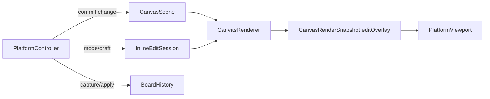

# 方案4统一EditOverlay分阶段计划

## 目标

- 把 [MyCanvas_Ver_0/Canvas/Core/CanvasRenderSnapshot.swift](MyCanvas_Ver_0/Canvas/Core/CanvasRenderSnapshot.swift) 中并行的 `selectionOverlay`、`rotateOverlay`、`cropOverlay` 收敛成单一 `editOverlay`，让高亮框、四角方块、旋转手柄共享同一套几何真源。
- 保持现有 clean C 边界：shared renderer 只输出中性几何，平台 viewport 决定视觉尺寸，controller 继续掌管状态机、history、autosave 与 hit slop。
- 最终效果包含两点：普通选中态下四角方块与高亮框同角度显示；进入 rotate mode 时仍然是“一个整体 overlay”，而不是 selection / rotate 两套互斥 chrome。

## 关键现状

- [MyCanvas_Ver_0/Canvas/Core/CanvasRenderSnapshot.swift](MyCanvas_Ver_0/Canvas/Core/CanvasRenderSnapshot.swift) 里的 `CanvasSelectionHandleGeometry` 当前只有 `role + screenCenter`，这是四角方块只能“跟着位置走”、不能“作为整体随框旋转”的直接原因。
- [MyCanvas_Ver_0/Canvas/Core/CanvasInlineEditState.swift](MyCanvas_Ver_0/Canvas/Core/CanvasInlineEditState.swift) 当前同时持有 `draftCropRectNormalized` 与 `draftRotationRadians`，不利于把 crop / rotate 收口成统一 overlay payload。
- [MyCanvas_Ver_0/Canvas/Core/CanvasRenderer.swift](MyCanvas_Ver_0/Canvas/Core/CanvasRenderer.swift) 现在对 `selectionOverlay`、`rotateOverlay`、`cropOverlay` 走三条互斥分支；[MyCanvas_Ver_0/Platform/iOS/Canvas/iOSCanvasViewportView.swift](MyCanvas_Ver_0/Platform/iOS/Canvas/iOSCanvasViewportView.swift) 和 [MyCanvas_Ver_0/Platform/macOS/Canvas/macOSCanvasViewportView.swift](MyCanvas_Ver_0/Platform/macOS/Canvas/macOSCanvasViewportView.swift) 也分别有三套 `refresh...Overlay()`。

## 目标数据流

## 分阶段任务

1. 阶段七：定义统一 `editOverlay` 骨架，并在 snapshot 中双写兼容。

文件落点：[MyCanvas_Ver_0/Canvas/Core/CanvasRenderSnapshot.swift](MyCanvas_Ver_0/Canvas/Core/CanvasRenderSnapshot.swift)。
本阶段新增 `CanvasEditOverlayKind`、`CanvasEditHandleRole`、`CanvasEditHandleGeometry`、`CanvasEditRenderOverlay` 与 `payload` 结构，公共几何至少统一为 `itemID`、`activeWorldQuad`、`activeScreenQuad`、`cornerHandles`。为满足“方块和高亮框是一个整体”，`cornerHandles` 不能再只带中心点，至少要带 `screenRotationRadians`；若后续想做严格旋转命中，再扩展为 `screenQuad`。本阶段先保留旧的 `selectionOverlay` / `rotateOverlay` / `cropOverlay`，新增 `editOverlay` 做双写，避免一次性切全链路。

1. 阶段八：让 shared renderer 统一产出 selection / rotate 的 `editOverlay`，并把角点旋转语义收口在 shared 层。

文件落点：[MyCanvas_Ver_0/Canvas/Core/CanvasRenderer.swift](MyCanvas_Ver_0/Canvas/Core/CanvasGeometry.swift)。
新增 `makeEditOverlay(...)`，收敛当前三套显示条件，优先级明确为 `crop > rotate > selection > nil`。先把 `selection + rotate` 合并成统一骨架：普通选中态输出带四角 handle 的 `editOverlay`；rotate mode 输出同一套 outline + corner handles，并在 payload 中附加 rotate guide 与 rotate handle。`previewedItem(...)` 继续复用，保证 draft rotation 时 outline、角点、旋转手柄同步更新。旧 `makeSelectionOverlay(...)` / `makeRotateOverlay(...)` 暂时保留，用于平台层迁移过渡。

1. 阶段九：迁移 iOS / macOS viewport 到统一 `refreshEditOverlay()`，让四角方块与高亮框真正作为一个整体显示。

文件落点：[MyCanvas_Ver_0/Platform/iOS/Canvas/iOSCanvasViewportView.swift](MyCanvas_Ver_0/Platform/iOS/Canvas/iOSCanvasViewportView.swift)、[MyCanvas_Ver_0/Platform/macOS/Canvas/macOSCanvasViewportView.swift](MyCanvas_Ver_0/Platform/macOS/Canvas/macOSCanvasViewportView.swift)。
先不推翻现有 layer 组织，而是把 `refreshSelectionOverlay()` 与 `refreshRotateOverlay()` 收敛成一个新的 `refreshEditOverlay()`，内部继续复用现有 `selectionOutlineLayer`、`selectionHandleLayers`、`rotateGuideLayer`、`rotateHandleLayer`。关键变化是 selection handles 的绘制不再固定为 `CGRect` 轴对齐方块，而是基于 `screenCenter + screenRotationRadians` 画出旋转后的 handle path 或给 layer 加 transform；这样高亮框和四角方块在视觉上同角度。平台常量如 handle size、line width 仍留在 viewport。

1. 阶段十：迁移 iOS / macOS controller 到统一 edit handle 命中与分发，避免 selection / rotate 各走一套入口。

文件落点：[MyCanvas_Ver_0/Platform/iOS/iOSViewController.swift](MyCanvas_Ver_0/Platform/iOS/iOSViewController.swift)、[MyCanvas_Ver_0/Platform/macOS/macOSViewController.swift](MyCanvas_Ver_0/Platform/macOS/macOSViewController.swift)。
把 `hitTestSelectionHandle(...)` 与 `hitTestRotateHandle(...)` 收敛成 `hitTestEditHandle(...)`，让 `pointerPressTarget` 优先从 `lastRenderSnapshot.editOverlay` 取几何真源。controller 仍保留 drag state、进入/退出 crop/rotate、history transaction 与 autosave；不要把交互求解迁回 renderer。第一版命中测试仍可保留当前平台各自的轴对齐 hit rect，以降低改动风险；视觉先整体旋转，命中继续维持宽松手感。

1. 阶段十一：把 crop overlay 与 inline edit state 收口到统一 payload / session，完成真正的“单一 edit overlay”。

文件落点：[MyCanvas_Ver_0/Canvas/Core/CanvasRenderSnapshot.swift](MyCanvas_Ver_0/Canvas/Core/CanvasRenderer.swift)、[MyCanvas_Ver_0/Canvas/Core/CanvasInlineEditState.swift](MyCanvas_Ver_0/Canvas/Core/CanvasInlineEditState.swift)、[MyCanvas_Ver_0/Platform/iOS/Canvas/iOSCanvasViewportView.swift](MyCanvas_Ver_0/Platform/iOS/Canvas/iOSCanvasViewportView.swift)、[MyCanvas_Ver_0/Platform/macOS/Canvas/macOSCanvasViewportView.swift](MyCanvas_Ver_0/Platform/macOS/Canvas/macOSCanvasViewportView.swift)。
把当前独立的 crop 语义迁进 `editOverlay.payload.crop`，其中保留 `fullImageWorldQuad`、`fullImageScreenQuad`、`cropWorldQuad`、`cropScreenQuad` 和 crop corner handles。与此同时，把 `CanvasInlineEditState` 从“一个 struct 同时持有两种 draft 字段”改成 typed session，例如 `itemID + session(.crop(draft) / .rotate(draft))`，让 shared 层的 overlay 只消费当前模式实际需要的数据。平台层随后把 `refreshCropOverlay()` 并入 `refreshEditOverlay()`。

1. 阶段十二：删除旧 overlay 字段与重复 helper，并完成回归验证。

文件落点：[MyCanvas_Ver_0/Canvas/Core/CanvasRenderSnapshot.swift](MyCanvas_Ver_0/Canvas/Core/CanvasRenderer.swift)、[MyCanvas_Ver_0/Platform/iOS/Canvas/iOSCanvasViewportView.swift](MyCanvas_Ver_0/Platform/iOS/Canvas/iOSCanvasViewportView.swift)、[MyCanvas_Ver_0/Platform/macOS/Canvas/macOSCanvasViewportView.swift](MyCanvas_Ver_0/Platform/macOS/Canvas/macOSCanvasViewportView.swift)、[MyCanvas_Ver_0/Platform/iOS/iOSViewController.swift](MyCanvas_Ver_0/Platform/iOS/iOSViewController.swift)、[MyCanvas_Ver_0/Platform/macOS/macOSViewController.swift](MyCanvas_Ver_0/Platform/macOS/macOSViewController.swift)。
删除旧的 `selectionOverlay` / `rotateOverlay` / `cropOverlay` 字段与对应 `refresh...Overlay()`、`hitTest...Handle()` 辅助，统一只保留 `editOverlay`。回归覆盖至少包含：普通选中、空白取消选中、旋转后 resize、rotate mode 拖拽中方块是否跟框同角度、crop on rotated item、undo/redo、autosave、手动保存、重开恢复，以及“单次手势只生成一条历史记录”。

## 重要实施约束

- body hit test 继续走 [MyCanvas_Ver_0/Canvas/Core/CanvasScene.swift](MyCanvas_Ver_0/Canvas/Core/CanvasScene.swift) / `CanvasImageItem.contains(worldPoint:)`；不要把 item body 命中改成依赖 overlay。
- `CanvasRenderItem` 与 crop 的预览逻辑先不重写；统一 overlay 不等于立刻重写 item preview。
- 迁移顺序必须坚持“shared 双写 -> viewport 消费 -> controller 命中 -> typed session -> 删除旧字段”，否则 diff 会过大且难以回归。
- 如无额外需求，第一轮不要把严格旋转-path 命中也一起做掉；先保证视觉整体一致，再决定是否需要把 hit test 从轴对齐热区升级到旋转 handle quad。

## 预期产出

- 一个单一的 `CanvasRenderSnapshot.editOverlay`，覆盖 selection / rotate / crop 三种编辑 chrome。
- 两个平台统一通过 `refreshEditOverlay()` 绘制编辑框，selection 方块与高亮框同角度显示。
- 两个平台 controller 统一通过 `hitTestEditHandle()` 分发角点 resize、crop corner、rotate handle，而 history / autosave / scene 写入路径保持现有 clean C 方向不变。

