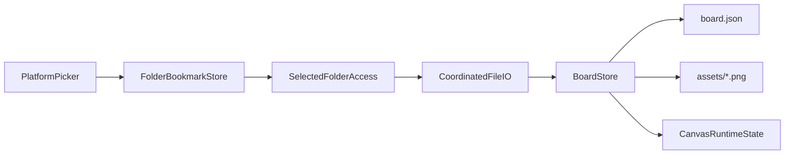

# 统一画板存储与目录访问

## 目标

- 平台层只保留目录选择和 bookmark 生成：`[MyCanvas_Ver_0/Platform/iOS/FolderPicker.swift](MyCanvas_Ver_0/Platform/iOS/FolderPicker.swift)`、`[MyCanvas_Ver_0/Platform/macOS/FilePickerManager.swift](MyCanvas_Ver_0/Platform/macOS/FilePickerManager.swift)`。
- 共享层统一处理 bookmark 解析、security-scoped access、`NSFileCoordinator`、`board.json + assets` 的读写。
- 默认范围：先打通共享存储基础层和最小调用点，不在本轮展开复杂 `BoardList` 导航、自动恢复最近画板、文件冲突合并。

## 当前依据

- `[MyCanvas_Ver_0/App/FolderBookmarkStore.swift](MyCanvas_Ver_0/App/FolderBookmarkStore.swift)` 已能存取 bookmark，并解析路径做状态展示，但还没有把“可访问工作目录”抽成共享能力。
- `[MyCanvas_Ver_0/Platform/iOS/iOSViewController.swift](MyCanvas_Ver_0/Platform/iOS/iOSViewController.swift)` 和 `[MyCanvas_Ver_0/Platform/macOS/macOSViewController.swift](MyCanvas_Ver_0/Platform/macOS/macOSViewController.swift)` 当前各自持有 `scene + boardState + camera + interactionState`，这四块就是画板的源状态。
- `[MyCanvas_Ver_0/Canvas/Core/CanvasRenderer.swift](MyCanvas_Ver_0/Canvas/Core/CanvasRenderer.swift)` 只生成渲染快照，不应作为持久化来源。
- `[MyCanvas_Ver_0/Canvas/Core/CanvasBoardState.swift](MyCanvas_Ver_0/Canvas/Core/CanvasBoardState.swift)` 现在只能从 `baseSize + center` 构造，恢复文档时需要补一个“从已存矩形恢复”的入口。

## 目标结构

## 实施步骤

1. 目录访问层

- 新增 `[MyCanvas_Ver_0/App/SelectedFolderAccess.swift](MyCanvas_Ver_0/App/SelectedFolderAccess.swift)`，从 `FolderBookmarkStore.storedBookmarkData()` 解析 URL，统一做 stale 检测、`startAccessingSecurityScopedResource()`、`stopAccessingSecurityScopedResource()`。
- 约定工作目录为 `<selected-folder>/MyCanvasData/boards/`，避免把业务文件直接散落在用户选中的根目录。

1. 共享文件 I/O

- 新增 `[MyCanvas_Ver_0/Canvas/Storage/CoordinatedFileIO.swift](MyCanvas_Ver_0/Canvas/Storage/CoordinatedFileIO.swift)`，统一 `mkdir/list/read/write/remove`，内部始终用 `NSFileCoordinator + FileManager`，iOS/macOS 共用同一实现。

1. 文档模型与映射

- 新增 `[MyCanvas_Ver_0/Canvas/Storage/BoardDocument.swift](MyCanvas_Ver_0/Canvas/Storage/BoardDocument.swift)`，定义 `BoardDocument`、`BoardItemRecord`、几何记录等 `Codable` 类型。
- 新增 `[MyCanvas_Ver_0/Canvas/Storage/BoardDocumentMapper.swift](MyCanvas_Ver_0/Canvas/Storage/BoardDocumentMapper.swift)`，负责 `CanvasScene` / `CanvasBoardState` / `CanvasCamera` / `CanvasInteractionState` 与 `BoardDocument` 的互转；图片资产文件名先直接复用 `item.id`。
- 更新 `[MyCanvas_Ver_0/Canvas/Core/CanvasBoardState.swift](MyCanvas_Ver_0/Canvas/Core/CanvasBoardState.swift)`，补一个能从持久化 `worldRect` 恢复的初始化方式，避免把设备 `viewportSize` 当作文档字段硬存。

1. Store API

- 新增 `[MyCanvas_Ver_0/Canvas/Storage/BoardStore.swift](MyCanvas_Ver_0/Canvas/Storage/BoardStore.swift)`，提供 `listBoards`、`loadBoard`、`saveBoard`、`deleteBoard`。
- `saveBoard` 写入 `boards/<boardID>/board.json` 和 `assets/<itemID>.png`；`loadBoard` 读 `PNG -> CGImage` 后重建运行时状态。

1. 最小接入

- 在 `[MyCanvas_Ver_0/Platform/iOS/BoardList/iOSBoardListViewController.swift](MyCanvas_Ver_0/Platform/iOS/BoardList/iOSBoardListViewController.swift)` 和 `[MyCanvas_Ver_0/Platform/macOS/BoardList/macOSBoardListViewController.swift](MyCanvas_Ver_0/Platform/macOS/BoardList/macOSBoardListViewController.swift)` 中，在 folder bookmark 成功后调用共享 `SelectedFolderAccess + BoardStore.listBoards` 验证目录可读写，并为后续真实列表留统一入口。
- 在 `[MyCanvas_Ver_0/Platform/iOS/iOSViewController.swift](MyCanvas_Ver_0/Platform/iOS/iOSViewController.swift)` 和 `[MyCanvas_Ver_0/Platform/macOS/macOSViewController.swift](MyCanvas_Ver_0/Platform/macOS/macOSViewController.swift)` 中提取最小的导入/导出辅助方法，让控制器只和 `BoardStore` 打交道，不直接操作文件系统。

## 验收标准

- iOS/macOS 选中同一个目录后，落盘目录结构一致。
- 两端保存出的 `board.json` 字段一致，图片资产命名一致。
- 重新加载后，图片位置、尺寸、层级、画板范围、相机中心/缩放、选中项保持一致。
- 任一端不再在控制器里直接写 `FileManager` 或 bookmark resolution 逻辑。

