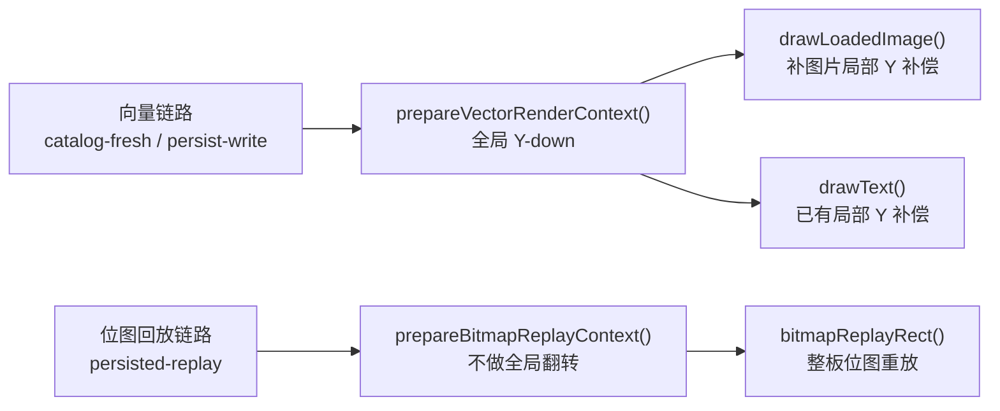

# 缩略图单图翻转根因修复计划

## 根因结论

- 向量渲染链路 `catalog-fresh` / `persist-write` 进入 `[BoardThumbnailRenderer.swift](/Users/shaun/Library/Mobile Documents/com~apple~CloudDocs/Develop/MyCanvas_Ver_0/MyCanvas_Ver_0/Platform/Shared/BoardList/BoardThumbnailRenderer.swift)` 的 `prepareVectorRenderContext()` 后，会先把整张缩略图上下文翻成 `Y-down`，所以 `mappedCenter`、`visibleRect`、`fullImageRect` 这套几何位置本身是正确的。
- 同文件里的 `drawText()` 已经在局部再次做了 Y 补偿，因此文本方向正常；但 `drawLoadedImage()` 直接把 `CGImage` 画进 `fullImageRect`，缺少等价的局部位图补偿，所以出现“图片之间位置对了，但每张图片自身上下颠倒”。
- `[BoardThumbnailRenderer.swift](/Users/shaun/Library/Mobile Documents/com~apple~CloudDocs/Develop/MyCanvas_Ver_0/MyCanvas_Ver_0/Platform/Shared/BoardList/BoardThumbnailRenderer.swift)` 的 `renderThumbnail(fromPersistedThumbnail:...)` 走的是 `prepareBitmapReplayContext()` + `bitmapReplayRect()`，不会调用 `drawLoadedImage()`；因此它与此前修过的 `persisted-replay` 整板上下关系问题是两个独立层面。

## 修改范围

- 仅修改 `[BoardThumbnailRenderer.swift](/Users/shaun/Library/Mobile Documents/com~apple~CloudDocs/Develop/MyCanvas_Ver_0/MyCanvas_Ver_0/Platform/Shared/BoardList/BoardThumbnailRenderer.swift)` 的 `drawLoadedImage()`，把“图片内容朝向补偿”封装到图片专用的局部绘制层里。
- 不改 `prepareVectorRenderContext()`、`prepareBitmapReplayContext()`、`bitmapReplayRect()`、`CanvasMiniMapViewGeometry.worldToMiniMap()`，避免再次触碰整板坐标语义。
- 不把方向修正前移到解码器、Provider 或持久化层，避免影响其他图片消费路径和已有缓存语义。

## 实施步骤

1. 在 `[BoardThumbnailRenderer.swift](/Users/shaun/Library/Mobile Documents/com~apple~CloudDocs/Develop/MyCanvas_Ver_0/MyCanvas_Ver_0/Platform/Shared/BoardList/BoardThumbnailRenderer.swift)` 的 `drawLoadedImage()` 中保留现有 `mappedCenter`、`rotationRadians`、`visibleRect`、`fullImageRect` 计算，继续把“位置、裁剪范围、旋转角度”视为正确输入。
2. 把当前的 `context.draw(image, in: fullImageRect)` 替换为“局部 Y 补偿后再 draw”的实现；补偿只包住图片绘制本身，不改外层向量上下文。这样修的是 `CGImage` 在已翻转 CTM 下的像素朝向，而不是几何布局。
3. 明确 `clip(to: visibleRect)` 与实际图片 draw 使用同一局部坐标系，避免修正朝向时把 `cropRect`、旋转后的裁剪边界一起带偏。
4. 保留现有日志链路，重点对比 `ImageDraw`、`ImageDrawResult`、`NodeRegion`、`PersistedReplayDraw`，确保“单图朝向修正”和“整板回放不回退”同时成立。
5. 先在问题图板验证，再补一个带 `cropRect` 的图板和一个带 `rotationRadians` 的图板做回归；确认稳定后，再决定是否收敛这轮定位日志。

## 验证重点

- `catalog-fresh` / `persist-write`：`ImageDrawResult.renderedRegionSignature` 的 top/bottom 行序要和源图签名一致，不再上下对调。
- `persisted-replay`：`persisted-replay-input` 与 `persisted-replay-output` 的 `NodeRegion` 区域签名继续保持一致，证明此前“图片之间上下关系”修复未被回退。
- `provider-cache-hit`：缓存命中后的整图/节点区域签名应与 fresh / persist-write 结果一致，避免只修首渲染不修缓存表现。

## 链路边界图

## 预期结果

- 缩略图内不同图片之间的上下关系继续保持正确。
- 每一张单独图片的内容方向恢复正常。
- 方案只收敛在图片位图绘制层，不扩散到解码、缓存和 persisted replay 架构。

