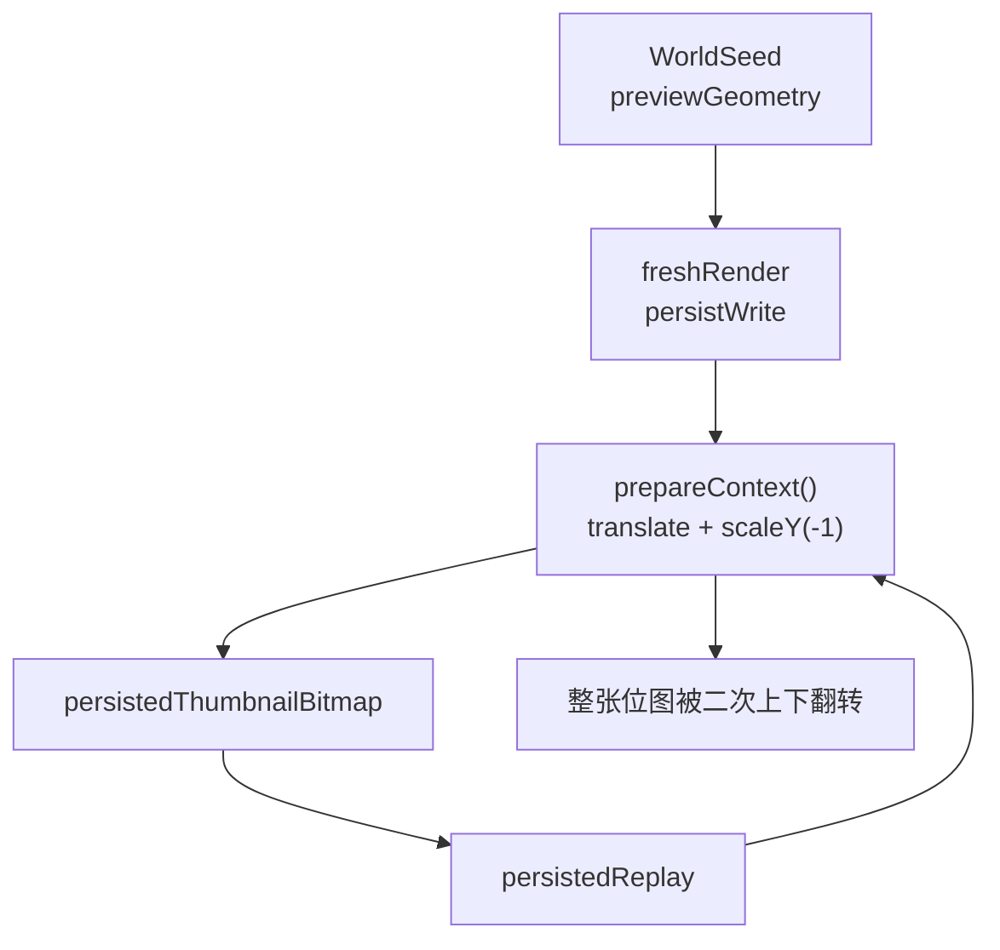

# 缩略图根因修复方案

## 根因定位

- `[MyCanvas_Ver_0/Platform/Shared/BoardList/BoardThumbnailRenderer.swift](MyCanvas_Ver_0/Platform/Shared/BoardList/BoardThumbnailRenderer.swift)` 里的 `prepareContext()` 当前无差别地执行 `translateBy(x: 0, y: pixelSize.height)` 和 `scaleBy(x: 1, y: -1)`，把所有绘制统一切到 preview-space 的左上原点坐标系。
- 这套 CTM 对 `fresh-render` / `persist-write` 是合理的，因为它们输入的是 world-space 几何与逐项绘制的 image/text 元素。
- 但 `renderThumbnail(fromPersistedThumbnail:...)` 的输入已经是“写盘后可直接展示的整张位图”。它再复用 `prepareContext()` 后执行 `context.draw(persistedThumbnail, in: geometry.contentRect)`，就把整张 persisted bitmap 又做了一次竖直镜像。
- `[MyCanvas_Ver_0/Canvas/Core/CanvasMiniMapViewGeometry.swift](MyCanvas_Ver_0/Canvas/Core/CanvasMiniMapViewGeometry.swift)` 只负责 `world -> minimap` 的线性映射，日志已经证明它保持了上下顺序，不应该改。
- `[MyCanvas_Ver_0/Platform/Shared/BoardList/BoardPreviewRenderer.swift](MyCanvas_Ver_0/Platform/Shared/BoardList/BoardPreviewRenderer.swift)` 和 `[MyCanvas_Ver_0/Platform/iOS/BoardList/iOSBoardPreviewView.swift](MyCanvas_Ver_0/Platform/iOS/BoardList/iOSBoardPreviewView.swift)` 只是把 `CGImage` 塞进 `imageLayer.contents`，没有二次翻转逻辑，也不应该改。

## 实施方案

- 在 `[MyCanvas_Ver_0/Platform/Shared/BoardList/BoardThumbnailRenderer.swift](MyCanvas_Ver_0/Platform/Shared/BoardList/BoardThumbnailRenderer.swift)` 里，把“上下文初始化”从单一 `prepareContext()` 拆成两种语义明确的路径：
- `vector-render` 路径：继续保留当前左上原点 CTM，供 `renderThumbnail(for:)` 和 `renderPersistedThumbnail(for:)` 使用。
- `bitmap-replay` 路径：给 `renderThumbnail(fromPersistedThumbnail:...)` 使用，不再对整张 persisted bitmap 施加全局 `scaleY(-1)`。
- replay 仍然沿用 `[MyCanvas_Ver_0/Canvas/Core/CanvasMiniMapViewGeometry.swift](MyCanvas_Ver_0/Canvas/Core/CanvasMiniMapViewGeometry.swift)` 计算 aspect-fit 后的 `contentRect`，但在真正调用 `CGContext.draw` 前，把这个 preview-space rect 转成 CGContext 原生坐标中的目标 rect。
- 目标 rect 采用“边界转换”而不是“反向修改 geometry”的方式，核心思路是把 `geometry.contentRect` 转成等价的 CG-space 区域：`x = contentRect.minX`，`y = pixelHeight - contentRect.maxY`，`width = contentRect.width`，`height = contentRect.height`。
- 这样可以把坐标系差异严格收口在 replay 边界，避免把已经验证正确的 `worldToMiniMap()`、`BoardGeometryPreviewLayout`、`BoardPreviewRenderer` 一起拖进改动面。
- `[MyCanvas_Ver_0/Canvas/Storage/BoardPersistedThumbnailStore.swift](MyCanvas_Ver_0/Canvas/Storage/BoardPersistedThumbnailStore.swift)` 和 `[MyCanvas_Ver_0/Platform/Shared/BoardList/BoardPreviewProvider.swift](MyCanvas_Ver_0/Platform/Shared/BoardList/BoardPreviewProvider.swift)` 只需要保持现有调用关系与 trace 透传，不作为首要修复点。

## 验证方案

- 用当前已经补好的 `ThumbnailTrace` 直接验证同一块 board：`persist-write` 的最终非透明采样不应再在 `persisted-replay` 中从 `bottom` 跑到 `top`。
- 验证 `[MyCanvas_Ver_0/Platform/Shared/BoardList/BoardThumbnailRenderer.swift](MyCanvas_Ver_0/Platform/Shared/BoardList/BoardThumbnailRenderer.swift)` 的 `catalog-fresh` 与 `persist-write` 两条链的 `contextCTM` 和 item-level `mappedCenterY` 逻辑保持不变，确保不引入新回归。
- 验证带文本的 board 仍然走 `geometry-fallback` 或 `fresh-render` 的既有分支，不受 replay 修复影响。
- 视觉上至少覆盖 3 类样本：有明确上下分层的纯图片 board、包含 text 的 board、命中 persisted thumbnail 的 board。
- 修复确认后，再决定是否收缩 `[MyCanvas_Ver_0/Platform/Shared/BoardList/BoardThumbnailRenderer.swift](MyCanvas_Ver_0/Platform/Shared/BoardList/BoardThumbnailRenderer.swift)`、`[MyCanvas_Ver_0/Canvas/Storage/BoardPersistedThumbnailStore.swift](MyCanvas_Ver_0/Canvas/Storage/BoardPersistedThumbnailStore.swift)`、`[MyCanvas_Ver_0/Platform/Shared/BoardList/BoardPreviewProvider.swift](MyCanvas_Ver_0/Platform/Shared/BoardList/BoardPreviewProvider.swift)`、`[MyCanvas_Ver_0/Platform/Shared/BoardList/BoardGeometryPreviewBuilder.swift](MyCanvas_Ver_0/Platform/Shared/BoardList/BoardGeometryPreviewBuilder.swift)` 里的 trace 日志。

## 约束与边界

- 不改 `[MyCanvas_Ver_0/Canvas/Core/CanvasMiniMapViewGeometry.swift](MyCanvas_Ver_0/Canvas/Core/CanvasMiniMapViewGeometry.swift)` 的 world 映射公式。
- 不改 `[MyCanvas_Ver_0/Platform/Shared/BoardList/BoardPreviewRenderer.swift](MyCanvas_Ver_0/Platform/Shared/BoardList/BoardPreviewRenderer.swift)` / `[MyCanvas_Ver_0/Platform/iOS/BoardList/iOSBoardPreviewView.swift](MyCanvas_Ver_0/Platform/iOS/BoardList/iOSBoardPreviewView.swift)` 的展示层行为。
- 不改 persisted thumbnail 的文件格式和 `BoardPersistedThumbnailStore` 的读写协议。
- 修复重点是“按输入类型区分坐标语义”，不是在现有 replay 路径上追加补偿式反转。

