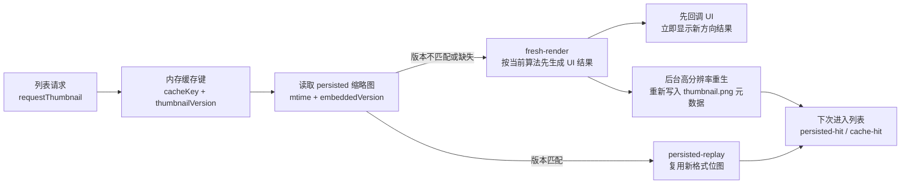

# 缩略图版本失效与回写分阶段计划

## 目标

- 让纯图片图板在渲染算法升级后，首次进入列表就自动淘汰旧 `thumbnail.png`，不再继续复用修复前的旧像素。
- 让新的缩略图结果能够沉淀回 persisted 层，避免本次会话修好了、下次启动又回到旧图。
- 保持当前已确认的坐标边界不变：`[BoardThumbnailRenderer.swift](/Users/shaun/Library/Mobile Documents/com~apple~CloudDocs/Develop/MyCanvas_Ver_0/MyCanvas_Ver_0/Platform/Shared/BoardList/BoardThumbnailRenderer.swift)` 里的 `drawLoadedImage()` 局部 Y 补偿继续负责“单图内容方向”，`[BoardPreviewProvider.swift](/Users/shaun/Library/Mobile Documents/com~apple~CloudDocs/Develop/MyCanvas_Ver_0/MyCanvas_Ver_0/Platform/Shared/BoardList/BoardPreviewProvider.swift)` / `[BoardPersistedThumbnailStore.swift](/Users/shaun/Library/Mobile Documents/com~apple~CloudDocs/Develop/MyCanvas_Ver_0/MyCanvas_Ver_0/Canvas/Storage/BoardPersistedThumbnailStore.swift)` 则负责“旧缩略图失效与重生”。

## 当前根因边界

- `[BoardThumbnailCache.swift](/Users/shaun/Library/Mobile Documents/com~apple~CloudDocs/Develop/MyCanvas_Ver_0/MyCanvas_Ver_0/Platform/Shared/BoardList/BoardThumbnailCache.swift)` 的 `BoardThumbnailCacheKey` 只包含 `boardID`、`revisionToken` 和像素尺寸，不包含渲染算法版本。
- `[BoardCatalogItem.swift](/Users/shaun/Library/Mobile Documents/com~apple~CloudDocs/Develop/MyCanvas_Ver_0/MyCanvas_Ver_0/Platform/Shared/BoardList/BoardCatalogItem.swift)` 的 `revisionToken` 只依赖 `updatedAt`，代码升级不会改变它。
- `[BoardPersistedThumbnailStore.swift](/Users/shaun/Library/Mobile Documents/com~apple~CloudDocs/Develop/MyCanvas_Ver_0/MyCanvas_Ver_0/Canvas/Storage/BoardPersistedThumbnailStore.swift)` 的 `loadThumbnailIfFresh()` 只按文件修改时间和 `updatedAt` 判断“新鲜”，不会识别“这是旧算法生成的 PNG”。
- `[BoardPreviewProvider.swift](/Users/shaun/Library/Mobile Documents/com~apple~CloudDocs/Develop/MyCanvas_Ver_0/MyCanvas_Ver_0/Platform/Shared/BoardList/BoardPreviewProvider.swift)` 的 `loadBestAvailableThumbnail()` fresh-render 后只回内存缓存，不会写回 persisted。
- `[BoardStore.swift](/Users/shaun/Library/Mobile Documents/com~apple~CloudDocs/Develop/MyCanvas_Ver_0/MyCanvas_Ver_0/Canvas/Storage/BoardStore.swift)` 目前仍是唯一会写 `thumbnail.png` 的地方，但它只在保存 board 时触发。

## 阶段 1：建立缩略图版本契约

- 增加一个单一事实来源的缩略图渲染版本常量，供内存缓存键、persisted PNG 元数据读写、日志原因字段共同使用。
- 这个版本应表达“缩略图像素语义版本”，而不是文档版本；文档内容变更继续由 `updatedAt` 管，渲染算法变更由版本常量管。
- 第一阶段只改契约和 key，不改图片绘制逻辑，避免把“方向修复”和“缓存失效”耦到同一层。
- 关键落点：`[BoardThumbnailCache.swift](/Users/shaun/Library/Mobile Documents/com~apple~CloudDocs/Develop/MyCanvas_Ver_0/MyCanvas_Ver_0/Platform/Shared/BoardList/BoardThumbnailCache.swift)`、`[BoardPersistedThumbnailStore.swift](/Users/shaun/Library/Mobile Documents/com~apple~CloudDocs/Develop/MyCanvas_Ver_0/MyCanvas_Ver_0/Canvas/Storage/BoardPersistedThumbnailStore.swift)`。

## 阶段 2：把版本写进 `thumbnail.png` 元数据，并在读取时校验

- 在 `[BoardPersistedThumbnailStore.swift](/Users/shaun/Library/Mobile Documents/com~apple~CloudDocs/Develop/MyCanvas_Ver_0/MyCanvas_Ver_0/Canvas/Storage/BoardPersistedThumbnailStore.swift)` 的 `writeThumbnail()` / `makePNGData(for:)` 中，改用 `CGImageDestinationAddImage(image, properties)` 把当前缩略图版本写进 PNG 元数据。
- 在 `loadThumbnailIfFresh()` 中，先从 `Data` 构建 `CGImageSource`，再用 `CGImageSourceCopyPropertiesAtIndex` 读取 PNG 元数据里的版本字段；缺失版本或版本不匹配时，直接按 `persisted-miss` 处理。
- 读取路径不应该重复做两次图片解析；可以复用 `[CanvasImagePosterFrameDecoder.swift](/Users/shaun/Library/Mobile Documents/com~apple~CloudDocs/Develop/MyCanvas_Ver_0/MyCanvas_Ver_0/Canvas/Core/CanvasImagePosterFrameDecoder.swift)` 现有的 `decodePosterFrame(from: imageSource, maxPixelSize:)` 重载，在同一个 `CGImageSource` 上完成“先看元数据，再解图”。
- 兼容策略要明确：历史上没有版本元数据的 `thumbnail.png` 全部视为旧格式，从而触发一次性重生。
- 日志侧新增稳定 reason，例如 `format-version-mismatch`，让后续验证不再依赖肉眼猜测是否走到了旧 persisted。

## 阶段 3：让内存缓存与 persisted 版本一起失效

- 在 `[BoardThumbnailCache.swift](/Users/shaun/Library/Mobile Documents/com~apple~CloudDocs/Develop/MyCanvas_Ver_0/MyCanvas_Ver_0/Platform/Shared/BoardList/BoardThumbnailCache.swift)` 的 `BoardThumbnailCacheKey.cacheKey` 中拼入缩略图版本常量，确保 app 新版本启动后不会继续命中旧的 NSCache 条目。
- 初始计划不强行改 `[BoardCatalogItem.swift](/Users/shaun/Library/Mobile Documents/com~apple~CloudDocs/Develop/MyCanvas_Ver_0/MyCanvas_Ver_0/Platform/Shared/BoardList/BoardCatalogItem.swift)` 的 `revisionToken`；先把“文档修订”和“渲染版本”保持为两个维度，避免把 UI 入口 token 语义扩得过大。
- 如果后面发现 iOS/macOS 列表 cell 的复用逻辑确实需要 token 感知渲染版本，再把 `revisionToken` 并入版本作为第二步，而不是一开始就把多层语义揉在一起。

## 阶段 4：补齐列表链路的高分辨率重生与回写

- `[BoardPreviewProvider.swift](/Users/shaun/Library/Mobile Documents/com~apple~CloudDocs/Develop/MyCanvas_Ver_0/MyCanvas_Ver_0/Platform/Shared/BoardList/BoardPreviewProvider.swift)` 的 `loadBestAvailableThumbnail()` 继续保持“优先返回 UI 需要的结果”，但在走到 `fresh-render` 且成功得到新图后，需要补一条 best-effort 的 persisted 重生链。
- 这里不能直接把列表 cell-size 的 fresh-render 图写回 `thumbnail.png`，因为当前列表尺寸可能只有 `492x360` / `744x360`，会把 persisted 缩略图降成低分辨率。
- 正确做法是新增一个面向 `BoardCatalogItem` 的 persisted 生成辅助入口，复用 `[BoardThumbnailRenderer.swift](/Users/shaun/Library/Mobile Documents/com~apple~CloudDocs/Develop/MyCanvas_Ver_0/MyCanvas_Ver_0/Platform/Shared/BoardList/BoardThumbnailRenderer.swift)` 现有的文档/资产渲染能力，按 `[BoardPersistedThumbnailStore.swift](/Users/shaun/Library/Mobile Documents/com~apple~CloudDocs/Develop/MyCanvas_Ver_0/MyCanvas_Ver_0/Canvas/Storage/BoardPersistedThumbnailStore.swift)` 的 `maximumLongestSide` 与 `pixelSize(forDisplayWorldRect:)` 重新生成高分辨率 persisted 图，再写盘。
- persisted 重生时要使用和 persisted 存储一致的预览模式与边距语义，而不是直接复用列表 cell 当前的 `targetPixelSize`。
- 只在当前已允许使用 persisted 的板子上做这件事；含 text 的 board 继续保留 `skip-persisted reason=contains-text-items`，避免把另一个未完成能力卷进来。
- 这条回写应保持 best-effort，不阻塞 UI 回调；写盘失败只打日志，不影响当前列表展示。

## 阶段 5：验证链路闭环，再收敛高噪声日志

- 先验证纯图片老图板的第一次加载：应出现 `persisted-miss reason=format-version-mismatch`，随后走 `fresh-render`，再触发一次新的 persisted 写入。
- 再验证同一图板的第二次加载或下一次进入列表：应回到 `persisted-hit` / `persisted-replay` / `cache-hit`，且显示的已经是修复后的方向。
- 验证含 text 图板：仍保持 `skip-persisted`，避免意外放开旧约束。
- 验证裁剪与旋转板：继续用现有 `ImageDraw` / `ImageDrawResult` / `NodeRegion` 对照，确认这次新增的失效与回写层没有把之前确认过的方向修复带偏。
- 验证完成后，再决定是否下掉高频的 `SeedNode`、`SourceImage`、`NodeRegion` 日志，只保留“Provider 决策 + 版本失配原因 + 持久化写入结果”这组低噪声信号。

## 推荐实施顺序

1. 先做版本常量与内存缓存键，让 app 内缓存先可控失效。
2. 再做 PNG 元数据写入/读取，让 persisted 层具备“识别旧算法结果”的能力。
3. 再补列表侧的高分辨率 persisted 重生入口，闭合“首次修复后如何沉淀”的链路。
4. 最后跑纯图片板、旋转板、裁剪板、含 text 板的回归，并收敛日志。

## 数据流图

## 预期结果

- 纯图片图板在算法升级后的第一次列表展示就能摆脱旧 `thumbnail.png`，不需要用户先手动改动或保存 board。
- 一旦第一次重生完成，后续 `persisted-replay` 与 `cache-hit` 将稳定复用新像素，不再反复回退到旧结果。
- 这次修改只动缓存/持久化版本治理与回写链路，不再回头改 `persisted-replay` 的位图坐标系，也不碰当前无关的 UIKit 约束告警。

