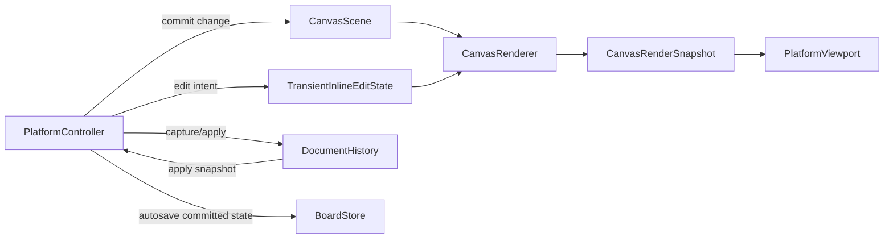

# B+裁切旋转撤销计划

## 已锁定边界

- 交互模式：保持在画布内直接编辑；选中图片后进入裁切/旋转子模式，不跳出当前画布。
- 撤销范围：覆盖文档内容变化和选中状态变化；不覆盖 `camera` 平移/缩放，也不覆盖临时 drag preview。
- 保持 B+：原始图片继续由 `[MyCanvas_Ver_0/Canvas/Core/CanvasImageItem.swift](MyCanvas_Ver_0/Canvas/Core/CanvasImageItem.swift)` 的 `cgImage` 与 `[MyCanvas_Ver_0/Canvas/Storage/BoardStore.swift](MyCanvas_Ver_0/Canvas/Storage/BoardStore.swift)` 写入的 PNG 表达；本轮不引入 asset 去重/共享层。

## 目标架构

## 阶段一：扩展图片实例与持久化元数据

- 在 `[MyCanvas_Ver_0/Canvas/Core/CanvasImageItem.swift](MyCanvas_Ver_0/Canvas/Core/CanvasImageItem.swift)` 为图片实例增加非破坏性编辑字段，至少包含 `cropRectNormalized` 与 `rotationRadians`；继续保留 `center` / `size` 作为“当前可见边界”。
- 在 `[MyCanvas_Ver_0/Canvas/Storage/BoardDocument.swift](MyCanvas_Ver_0/Canvas/Storage/BoardDocument.swift)` 与 `[MyCanvas_Ver_0/Canvas/Storage/BoardDocumentMapper.swift](MyCanvas_Ver_0/Canvas/Storage/BoardDocumentMapper.swift)` 为 `BoardImageItemRecord` 增加裁切/旋转字段，并为旧文档提供“完整裁切 + 零旋转”的兼容默认值。
- 新增一个非持久化的 shared 编辑态文件，建议为 `[MyCanvas_Ver_0/Canvas/Core/CanvasInlineEditState.swift](MyCanvas_Ver_0/Canvas/Core/CanvasInlineEditState.swift)`；不要把裁切/旋转子模式塞进 `[MyCanvas_Ver_0/Canvas/Core/CanvasInteractionState.swift](MyCanvas_Ver_0/Canvas/Core/CanvasInteractionState.swift)`，避免把临时编辑态写进 `board.json`。

## 阶段二：把场景/渲染升级为旋转感知

- 在 `[MyCanvas_Ver_0/Canvas/Core/CanvasScene.swift](MyCanvas_Ver_0/Canvas/Core/CanvasScene.swift)` 增加基于 item local space 的几何辅助与命中 API，替换当前对 `worldFrame.contains(...)` 和纯轴对齐矩形的依赖。
- 在 `[MyCanvas_Ver_0/Canvas/Core/CanvasRenderer.swift](MyCanvas_Ver_0/Canvas/Core/CanvasRenderer.swift)` 与 `[MyCanvas_Ver_0/Canvas/Core/CanvasRenderSnapshot.swift](MyCanvas_Ver_0/Canvas/Core/CanvasRenderSnapshot.swift)` 把 `CanvasRenderItem` / selection geometry 从“单个矩形 frame”升级为“旋转后的 quad + AABB + 图片采样区域”。
- 在 `[MyCanvas_Ver_0/Platform/Shared/Rendering/CanvasImageLayer.swift](MyCanvas_Ver_0/Platform/Shared/Rendering/CanvasImageLayer.swift)` 用 `contentsRect` 表达非破坏性裁切、用 layer transform 表达旋转；原始 `cgImage` 始终不改。
- 保持现有 `renderer -> snapshot -> viewport` 的 clean C 方向：共享层只输出语义几何和采样区域，平台层继续决定视觉尺寸、命中热区和手感。

## 阶段三：建立文档级历史与提交流程

- 新增一层共享历史控制器，建议新建 `[MyCanvas_Ver_0/Canvas/Editing/BoardHistoryController.swift](MyCanvas_Ver_0/Canvas/Editing/BoardHistoryController.swift)` 与配套 history entry/snapshot 文件，用于保存“可撤销的文档快照”。
- 历史快照应覆盖 `items + boardState + interactionState`，但显式排除 `camera`；挂点直接复用 `[MyCanvas_Ver_0/Platform/iOS/iOSViewController.swift](MyCanvas_Ver_0/Platform/iOS/iOSViewController.swift)` 和 `[MyCanvas_Ver_0/Platform/macOS/macOSViewController.swift](MyCanvas_Ver_0/Platform/macOS/macOSViewController.swift)` 里现成的 `currentBoardRuntimeState()` / `applyBoardRuntimeState(_:)`。
- 定义统一的提交规则：一次点击选中/取消选中记为一条历史；一次 move/resize/crop/rotate 拖拽在 `pointerDown` 记录起点、在 `pointerUp` 提交终点，中途实时刷新但不重复入栈。
- 让 `[MyCanvas_Ver_0/Canvas/Storage/BoardSaveCoordinator.swift](MyCanvas_Ver_0/Canvas/Storage/BoardSaveCoordinator.swift)` 只对“已提交变更”触发 autosave，避免拖拽过程把大量 preview 状态写盘。

## 阶段四：实现 inline crop 模式

- 在 `[MyCanvas_Ver_0/Canvas/Core/CanvasRenderSnapshot.swift](MyCanvas_Ver_0/Canvas/Core/CanvasRenderSnapshot.swift)` 与 `[MyCanvas_Ver_0/Canvas/Core/CanvasRenderer.swift](MyCanvas_Ver_0/Canvas/Core/CanvasRenderer.swift)` 新增 crop overlay 语义：遮罩、裁切框、裁切 handles、可选的 mode 标记。
- 在 `[MyCanvas_Ver_0/Platform/iOS/Canvas/iOSCanvasViewportView.swift](MyCanvas_Ver_0/Platform/iOS/Canvas/iOSCanvasViewportView.swift)` 和 `[MyCanvas_Ver_0/Platform/macOS/Canvas/macOSCanvasViewportView.swift](MyCanvas_Ver_0/Platform/macOS/Canvas/macOSCanvasViewportView.swift)` 画出 crop overlay；平台继续各自决定遮罩透明度、手柄尺寸和命中热区。
- 在两个平台控制器中扩展 press target / drag state：于 `[MyCanvas_Ver_0/Platform/iOS/iOSViewController.swift](MyCanvas_Ver_0/Platform/iOS/iOSViewController.swift)` 和 `[MyCanvas_Ver_0/Platform/macOS/macOSViewController.swift](MyCanvas_Ver_0/Platform/macOS/macOSViewController.swift)` 新增 crop 专用命中与拖拽状态。
- 在 `[MyCanvas_Ver_0/Canvas/Core/CanvasScene.swift](MyCanvas_Ver_0/Canvas/Core/CanvasScene.swift)` 增加 `cropItem(...)`，让裁切以 item local normalized rect 计算；提交时同时更新 `cropRectNormalized` 与 `center/size`，使“裁切后可见区域”成为新的世界边界，即使后续 item 已旋转也成立。

## 阶段五：实现 inline rotate 模式并修正现有 selection/resize

- 在共享渲染层为 rotate 增加专门的 overlay 语义与 handle 几何，落点仍是 `[MyCanvas_Ver_0/Canvas/Core/CanvasRenderSnapshot.swift](MyCanvas_Ver_0/Canvas/Core/CanvasRenderSnapshot.swift)` 与 `[MyCanvas_Ver_0/Canvas/Core/CanvasRenderer.swift](MyCanvas_Ver_0/Canvas/Core/CanvasRenderer.swift)`。
- 在 `[MyCanvas_Ver_0/Canvas/Core/CanvasScene.swift](MyCanvas_Ver_0/Canvas/Core/CanvasScene.swift)` 新增 `rotateItem(...)` 或统一的 presentation-state 更新入口，保证旋转写入不散落在平台控制器里。
- 在两个平台控制器中加入 rotate 命中与拖拽状态，继续复用现有的 `pointerPressTarget` / `pointerDragState` 框架，只把几何从屏幕轴对齐矩形切换到 item local axes。
- 同步修正当前 selection / resize 逻辑，使已旋转图片仍能被准确选中、显示正确的 selection overlay，并继续使用 resize；否则一旦 `rotationRadians` 落地，现有的 `screenFrame.contains(...)` 与四角 resize 会立即失真。

## 阶段六：平台命令接入与回归验证

- 在两个平台控制器里接入 undo/redo 命令入口；默认优先实现 macOS 快捷键/菜单路径，并为 iOS 增加显式按钮或命令入口，与现有保存入口放在同一层级。
- 通过 `[MyCanvas_Ver_0/Canvas/Storage/BoardStore.swift](MyCanvas_Ver_0/Canvas/Storage/BoardStore.swift)` 和 `[MyCanvas_Ver_0/Canvas/Storage/BoardDocumentMapper.swift](MyCanvas_Ver_0/Canvas/Storage/BoardDocumentMapper.swift)` 验证：保存后重开仍恢复原图、裁切、旋转和选中状态；旧文档缺少新字段时按默认值正常打开。
- 回归清单覆盖：导入、选中/取消选中、移动、缩放、裁切、旋转、撤销、重做、autosave、手动保存、重开恢复，以及“单次手势只生成一条历史记录”。

## 现有可直接复用的挂点

- `[MyCanvas_Ver_0/Canvas/Core/CanvasScene.swift](MyCanvas_Ver_0/Canvas/Core/CanvasScene.swift)` 已经有统一的 `resizeItem(withID:to:)`，说明“controller 编排，scene 写入”这条 clean C 路径已经成立。
- `[MyCanvas_Ver_0/Platform/iOS/iOSViewController.swift](MyCanvas_Ver_0/Platform/iOS/iOSViewController.swift)` 与 `[MyCanvas_Ver_0/Platform/macOS/macOSViewController.swift](MyCanvas_Ver_0/Platform/macOS/macOSViewController.swift)` 已经暴露 `currentBoardRuntimeState()` / `applyBoardRuntimeState(_:)`，它们就是文档级 undo/redo 最自然的 capture/apply 钩子。

