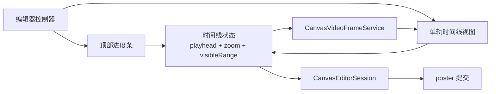

# 视频时间线轨道分阶段计划

## 已确认范围

- 保留顶部独立进度条，底部新增真正的单轨时间线，不做“把卡片间距调小”的伪轨道。
- 首版就支持时间线缩放：iOS 用 `UIPinchGestureRecognizer`，macOS 用触控板 magnify/滚轮缩放语义。
- 继续复用现有 poster 提交闭环，不改视频导入、board assets、`posterTimeSeconds` 持久化模型。
- 继续保持画板 `poster-only`，视频本体不在画板自动播放。

## 关键现状

- 当前 iOS 编辑页 [MyCanvas_Ver_0/Platform/iOS/iOSVideoDisplayFrameEditorViewController.swift](MyCanvas_Ver_0/Platform/iOS/iOSVideoDisplayFrameEditorViewController.swift) 与 macOS 编辑页 [MyCanvas_Ver_0/Platform/macOS/macOSVideoDisplayFrameEditorViewController.swift](MyCanvas_Ver_0/Platform/macOS/macOSVideoDisplayFrameEditorViewController.swift) 的底部区域，本质上都是 `CollectionView` 卡片列表。
- 当前共享取帧服务 [MyCanvas_Ver_0/Canvas/Video/CanvasVideoFrameService.swift](MyCanvas_Ver_0/Canvas/Video/CanvasVideoFrameService.swift) 只提供固定 `frameCount` 的均匀采样 `previewStrip(...)`。这适合“10 张缩略卡片”，不适合“随缩放变化密度的连续轨道”。
- 当前提交链路已经是正确的：编辑器 -> [MyCanvas_Ver_0/Canvas/Editing/CanvasEditorSession.swift](MyCanvas_Ver_0/Canvas/Editing/CanvasEditorSession.swift) `commitVideoPosterFrame(...)` -> `persistPosterAsset(...)` -> 画板刷新。这里不需要重做。

## 目标架构

## Phase 0: 锁定共享时间线契约

- 在 [MyCanvas_Ver_0/Canvas/Video/CanvasVideoFrameService.swift](MyCanvas_Ver_0/Canvas/Video/CanvasVideoFrameService.swift) 附近新增纯值类型，专门表达时间线的连续几何，而不是继续依赖 `previewFrames[index]`：
- 建议新增 `CanvasVideoTimelineScale`
- 建议新增 `CanvasVideoTimelineViewport`
- 建议新增 `CanvasVideoTimelineStripRequest`
- 建议新增 `CanvasVideoTimelineStripResult`
- 把当前控制器里的“当前时间”和“选中第几帧”语义拆开。新的主状态应该是：`playheadTimeSeconds`、`zoomScale`、`visibleTimeRange`、`contentWidth`。
- 把时间与几何映射抽成共享纯函数，至少包括：
- `time -> contentX`
- `contentOffset -> time`
- `visibleRect -> visibleTimeRange`
- `zoomScale -> secondsPerPoint`
- 这一步不改 poster 存储，也不改 `CanvasVideoEditorContext`；只解决当前架构里“预览条靠离散索引驱动”的根因。
- 完成标志：iOS/macOS 都能用同一套时间线数学驱动 UI，不再依赖 `nearestPreviewFrameIndex(for:)` 作为主选帧模型。

## Phase 1: 升级共享取帧服务为“缩放感知时间线”

- 在 [MyCanvas_Ver_0/Canvas/Video/CanvasVideoFrameService.swift](MyCanvas_Ver_0/Canvas/Video/CanvasVideoFrameService.swift) 保留现有 `frameImage(..., quality: .posterCommit)` 与 `persistPosterAsset(...)`，只扩展时间线缩略图接口。
- 建议把当前 `previewStrip(from:frameCount:maxPixelSize:)` 升级为按请求对象生成的 API，例如：
- 输入可见时间范围
- 输入当前缩放密度
- 输入目标缩略图宽度/高度
- 输入 overscan 预取范围
- 输出满足当前轨道宽度的连续缩略图段，而不是固定 10 张全局均匀采样图
- 首版就做会话级内存缓存，避免缩放和拖动时重复全量解码：
- key 建议包含 `sourceVideoURL`
- key 建议包含 `zoomBucket`
- key 建议包含 `timeRangeBucket`
- key 建议包含 `maxPixelSize`
- 编辑器侧为每次异步请求带 generation token，旧请求返回后直接丢弃，避免缩放/滚动时 UI 回跳。
- 这一层的目标不是先做“无限精细”，而是先建立“密度由 zoom 驱动”的正确机制。
- 完成标志：给定相同视频，改变时间线缩放后，服务层能输出不同密度的缩略图集合，并且不会破坏 poster 提交链路。

## Phase 2: iOS 单轨时间线视图

- 在 [MyCanvas_Ver_0/Platform/iOS/iOSVideoDisplayFrameEditorViewController.swift](MyCanvas_Ver_0/Platform/iOS/iOSVideoDisplayFrameEditorViewController.swift) 中，整块替换当前 `previewStripCollectionView` 和 `iOSVideoDisplayFramePreviewCell` 方案。
- 建议新增独立视图，如 [MyCanvas_Ver_0/Platform/iOS/iOSVideoTimelineView.swift](MyCanvas_Ver_0/Platform/iOS/iOSVideoTimelineView.swift)，用 `UIView + UIScrollView + CALayer` 实现，不再用 `UICollectionViewFlowLayout`。
- 结构建议：
- 外层 timeline host view
- 内层可横向滚动的 content view
- 用 `CALayer` 或一组平铺 thumbnail layers 绘制连续轨道
- 中央固定 playhead 线
- 上方或下方稀疏时间刻度，不再给每张缩略图单独放一个时间 label
- 交互建议：
- 左右拖动轨道改变当前时间
- 点击轨道某点立即 seek
- `UIPinchGestureRecognizer` 改变 `zoomScale`
- 缩放时以手势 anchor 位置为中心保持时间点稳定，避免画面跳动
- 顶部 `UISlider` 保留为辅助 scrub 控件，但它和时间线都只读写同一份时间状态，不允许双套状态机并存。
- 完成标志：iOS 上底部显示连续轨道，缩放和拖动都能稳定驱动当前预览时间，并保持和顶部 slider 同步。

## Phase 3: macOS 单轨时间线视图

- 在 [MyCanvas_Ver_0/Platform/macOS/macOSVideoDisplayFrameEditorViewController.swift](MyCanvas_Ver_0/Platform/macOS/macOSVideoDisplayFrameEditorViewController.swift) 中，整块替换 `previewStripScrollView`、`previewStripCollectionView`、`previewStripLayout`、`updatePreviewStripCollectionViewFrame()`、`macOSVideoDisplayFramePreviewItem`。
- 建议新增 [MyCanvas_Ver_0/Platform/macOS/macOSVideoTimelineView.swift](MyCanvas_Ver_0/Platform/macOS/macOSVideoTimelineView.swift)，使用 `NSView + NSScrollView + CALayer` 实现连续轨道。
- 交互建议：
- 水平滚动或拖动轨道进行 scrub
- 触控板 magnify 或 `magnify(with:)` 改变时间线缩放
- 点击轨道直接跳到对应时间
- 保持中央 playhead 视觉语义与 iOS 一致
- macOS 要额外处理输入优先级：避免 timeline 的滚动/缩放手势和现有 sheet 内其它控件抢焦点。
- 完成标志：macOS 轨道形态、交互语义和 iOS 保持一致，不再依赖 `NSCollectionView` 卡片式选帧。

## Phase 4: 重构编辑器状态同步

- 以 `currentPreviewTimeSeconds` 为核心，升级成“单一时间源 + 单一 viewport 源”，统一驱动：
- 顶部时间 label
- 顶部 slider
- AVPlayer 当前时间
- 底部时间线 playhead
- 当前 poster 预选状态
- iOS/macOS 两个控制器都要把以下旧逻辑降级或移除：
- `selectedPreviewFrameIndex`
- `nearestPreviewFrameIndex(for:)`
- 依赖 reload item 刷新的“蓝框选中卡片”模型
- 现有 `seekPreview(...)`、`pausePlayback()`、`handlePlayerTimeUpdate(...)`、`currentTimeSecondsDidChange(...)` 仍可保留，但职责要调整为：
- player 更新只负责写入时间状态
- timeline / slider 只负责发起时间变更意图
- UI 刷新统一从状态派生
- 要明确播放时行为：
- 默认播放时 playhead 前进
- 轨道可自动跟随当前时间滚动
- 用户主动拖动/缩放时，暂停自动跟随，交互结束后再恢复
- 完成标志：不管是拖 slider、拖时间线、点轨道、播放器时间回调，最终都不会出现回跳、抖动、循环触发或选中状态错乱。

## Phase 5: 性能与交互收口

- 针对首版就支持缩放，必须把性能收口纳入主路径，而不是作为后补优化：
- 对滚动/缩放触发的 strip 请求做 debounce
- 只为当前可见范围和少量 overscan 生成缩略图
- 对超长视频限制最大缩略图密度，避免一次性生成过多帧
- 优先复用同一会话内的 `AVAsset` / `AVAssetImageGenerator` 生命周期，避免缩放时重复创建重量对象
- timeline 视图要支持“加载中”和“无可用帧”的占位态，沿用当前 placeholder 语义，但宿主从 collection view 改为 timeline host。
- iOS 要验证 pinch 与内部滚动不会互相吞手势；macOS 要验证滚轮水平滚动、magnify 与 sheet 内默认行为不冲突。
- 完成标志：时间线在短视频和中长视频上都可用，缩放和滚动不会让 UI 明显卡顿或频繁闪烁。

## Phase 6: 验证与回归

- 自动化测试优先补共享纯逻辑，不补低价值 UI 快照：
- 时间与几何映射 round-trip
- `zoomScale` 与 `visibleTimeRange` 计算边界
- strip request bucketing / cache key 稳定性
- generation token 失效策略
- 保持现有视频 poster 存储与提交测试继续通过，避免这次轨道重构误伤 [MyCanvas_Ver_0Tests/BoardVideoStorageTests.swift](MyCanvas_Ver_0Tests/BoardVideoStorageTests.swift) 一类既有闭环。
- 手工验证矩阵至少覆盖：
- iOS / macOS 打开视频编辑页
- 拖动顶部 slider 与底部时间线互相同步
- 缩放时间线后继续选帧
- 播放中观察 playhead 与轨道跟随
- 设置展示画面后回到画板，poster 正确刷新
- 重开编辑页后，playhead 落在当前 `posterTimeSeconds`
- 长视频、短视频、接近 0 秒边界、结尾边界都不出错
- 完成标志：轨道式选帧在双平台可稳定工作，且没有破坏既有的导入、存储、封面回写和画板展示能力。

## 主要文件边界

- 共享层重点：
- [MyCanvas_Ver_0/Canvas/Video/CanvasVideoFrameService.swift](MyCanvas_Ver_0/Canvas/Video/CanvasVideoFrameService.swift)
- [MyCanvas_Ver_0/Canvas/Editing/CanvasEditorSession.swift](MyCanvas_Ver_0/Canvas/Editing/CanvasEditorSession.swift)
- iOS 重点：
- [MyCanvas_Ver_0/Platform/iOS/iOSVideoDisplayFrameEditorViewController.swift](MyCanvas_Ver_0/Platform/iOS/iOSVideoDisplayFrameEditorViewController.swift)
- 建议新增 [MyCanvas_Ver_0/Platform/iOS/iOSVideoTimelineView.swift](MyCanvas_Ver_0/Platform/iOS/iOSVideoTimelineView.swift)
- macOS 重点：
- [MyCanvas_Ver_0/Platform/macOS/macOSVideoDisplayFrameEditorViewController.swift](MyCanvas_Ver_0/Platform/macOS/macOSVideoDisplayFrameEditorViewController.swift)
- 建议新增 [MyCanvas_Ver_0/Platform/macOS/macOSVideoTimelineView.swift](MyCanvas_Ver_0/Platform/macOS/macOSVideoTimelineView.swift)

## 风险控制

- 不建议继续围绕 `CollectionView` 打补丁。那只能把视觉做得更像轨道，但根因上仍然是“离散卡片 + 固定 10 帧”，后面缩放、长视频、连续 scrub 都会继续受限。
- 不建议在首版把时间线状态分散到“slider 一套、timeline 一套、player 一套”。必须先统一成单一时间状态和单一 viewport 状态，否则交互会越来越脆。
- 不建议这次顺手改文档模型。当前 `posterTimeSeconds` 与 poster 持久化链路已经稳定，这一轮应该聚焦在编辑页时间线与共享取帧策略。