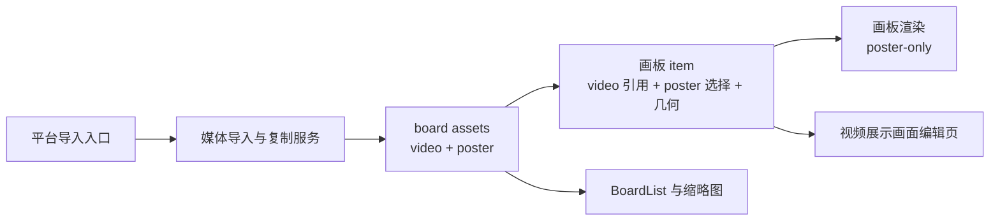

# 视频素材分阶段计划

目标是用“本地视频副本 + 本地封面缓存图”的双资产方案支持 iOS/macOS 视频导入与完整编辑，同时复用现有画板上的缩放、旋转、裁切能力，并保持画板始终 `poster-only`、不自动播放。

## 目标架构

- 运行时先保留现有 `CanvasImageItem` 几何链路，避免重新打开缩放/裁切/旋转的数学路径；根因修复集中在“媒体来源”和“展示封面”契约。
- 每个视频 item 持久化四类核心信息：`sourceVideoFilename`、`posterImageFilename`、`posterTimeSeconds`、现有几何字段（`center`、`size`、`cropRectNormalized`、`rotationRadians`、`zIndex`）。
- 视频导入走“立即复制到 board assets”：导入时确保 board 目录与 `assets` 目录存在，先复制原视频，再立即生成 poster PNG；item 从一开始就引用本地副本，而不是外部 URL。
- 复制后的多个视频 item 默认共享原视频本地副本，但 `posterTimeSeconds` 与 `posterImageFilename` 归 item 自身所有，后续可以独立修改。
- 若当前没有可写的 board 存储目录，视频导入直接复用现有“选择保存目录”错误流并中止；这与“导入时复制到 board assets”的需求保持一致。

## Phase 0: 契约与迁移骨架

- 在 [MyCanvas_Ver_0/Canvas/Core/CanvasImageAsset.swift](MyCanvas_Ver_0/Canvas/Core/CanvasImageAsset.swift) 附近引入新的媒体来源契约，彻底拆开“原始媒体来源”和“展示 poster”。不要把视频继续塞成另一种 image bytes。
- 在 [MyCanvas_Ver_0/Canvas/Storage/BoardDocument.swift](MyCanvas_Ver_0/Canvas/Storage/BoardDocument.swift) 把现有 `BoardImageItemRecord` 演进为媒体感知记录；推荐引入 `BoardMediaItemRecord` / `BoardItemRecord.media`，并保留对旧 `image` 记录的兼容解码路径。
- 在 [MyCanvas_Ver_0/Canvas/Transfer/CanvasTransferTypes.swift](MyCanvas_Ver_0/Canvas/Transfer/CanvasTransferTypes.swift)、[MyCanvas_Ver_0/Canvas/Import/CanvasImportTypes.swift](MyCanvas_Ver_0/Canvas/Import/CanvasImportTypes.swift)、[MyCanvas_Ver_0/Canvas/Editing/CanvasCommand.swift](MyCanvas_Ver_0/Canvas/Editing/CanvasCommand.swift)、[MyCanvas_Ver_0/Platform/Shared/Toolbar/CanvasToolbarState.swift](MyCanvas_Ver_0/Platform/Shared/Toolbar/CanvasToolbarState.swift)、[MyCanvas_Ver_0/Platform/Shared/Toolbar/CanvasToolbarStateBuilder.swift](MyCanvas_Ver_0/Platform/Shared/Toolbar/CanvasToolbarStateBuilder.swift) 将“image/importImages/importImage”术语统一为“media/importMedia/importMedia”。
- 等新记录形态稳定后，再同步提升 [MyCanvas_Ver_0/Canvas/Core/CanvasImageAssetContract.swift](MyCanvas_Ver_0/Canvas/Core/CanvasImageAssetContract.swift) 的文档格式版本，避免中途重复迁移。
- 阶段完成标志：不改 UI 时，文档层和运行时层已经能表达视频 item 的来源、poster 与几何信息。

## Phase 1: board assets 与持久化闭环

- 在 [MyCanvas_Ver_0/Canvas/Storage/BoardStore.swift](MyCanvas_Ver_0/Canvas/Storage/BoardStore.swift) 引入双资产保存规则：视频原文件写入 `assets`，poster 缓存图也写入 `assets`，并确保加载时分别恢复 source 与 poster。
- 优先做“导入即持久化引用”，尽量不要给视频再走 [MyCanvas_Ver_0/Canvas/Storage/BoardSaveCoordinator.swift](MyCanvas_Ver_0/Canvas/Storage/BoardSaveCoordinator.swift) 里的 transient payload 路线；只有某个平台导入路径做不到立即落盘时，才扩展 `BoardSaveSnapshot`。
- 更新 [MyCanvas_Ver_0/Canvas/Storage/BoardDocumentMapper.swift](MyCanvas_Ver_0/Canvas/Storage/BoardDocumentMapper.swift)，让 save/load/round-trip 都能正确携带 `sourceVideoFilename`、`posterImageFilename`、`posterTimeSeconds`。
- 改造 `removeOrphanedAssets`：旧逻辑只保留单个 `assetFilename`，这里必须按 item 收集“视频源 + poster 图”两个文件名，否则保存后会误删其中一个。
- 阶段完成标志：导入一个视频后，重启 App 仍能从本地 `assets` 恢复原视频引用和 poster 图；删除 item 并保存后，两个资产文件都会按引用关系清理。

## Phase 2: 跨平台导入链路

- iOS 侧更新 [MyCanvas_Ver_0/Platform/iOS/iOSViewController.swift](MyCanvas_Ver_0/Platform/iOS/iOSViewController.swift) 与 [MyCanvas_Ver_0/Platform/iOS/iOSCanvasImportAdapter.swift](MyCanvas_Ver_0/Platform/iOS/iOSCanvasImportAdapter.swift)：`PHPicker` 改为图片+视频，拖放/剪贴板增加 movie/video UTType，视频导入使用 file representation 交给统一复制服务。
- macOS 侧更新 [MyCanvas_Ver_0/Platform/macOS/macOSViewController.swift](MyCanvas_Ver_0/Platform/macOS/macOSViewController.swift) 与 [MyCanvas_Ver_0/Platform/macOS/macOSCanvasImportAdapter.swift](MyCanvas_Ver_0/Platform/macOS/macOSCanvasImportAdapter.swift)：`NSOpenPanel.allowedContentTypes` 扩为 `.image + .movie`，paste/drop 支持视频文件 URL。
- 为导入链引入统一媒体解析结构，替代当前只支持 `CanvasResolvedImportImage` 的设计；图片/GIF 仍可复用现有路径，视频则返回“本地源文件 + 首次 poster + 元信息”。
- 平台入口继续复用现有 `performTransferRequest` 主链，只把 request/command 改成 media-aware。
- 阶段完成标志：iOS/macOS 工具栏导入、拖放、粘贴这三条主入口均能导入视频，并在导入时完成 board assets 复制。

## Phase 3: 运行时 item 与画板展示

- 在 [MyCanvas_Ver_0/Canvas/Core/CanvasImageItem.swift](MyCanvas_Ver_0/Canvas/Core/CanvasImageItem.swift) 为 item 增加 poster 相关文档状态，并同步更新 `duplicated()` 与 `matchesDocumentState(_:)`；不要把 `posterTimeSeconds` 放在共享 source 引用上。
- 保持 [MyCanvas_Ver_0/Canvas/Core/CanvasScene.swift](MyCanvas_Ver_0/Canvas/Core/CanvasScene.swift) 的裁切/旋转/缩放数学不变，只调整 item 的素材来源与 poster 解析。
- 让 [MyCanvas_Ver_0/Canvas/Core/CanvasImagePresentationResolver.swift](MyCanvas_Ver_0/Canvas/Core/CanvasImagePresentationResolver.swift)、[MyCanvas_Ver_0/Canvas/Core/CanvasRenderer.swift](MyCanvas_Ver_0/Canvas/Core/CanvasRenderer.swift)、[MyCanvas_Ver_0/Platform/Shared/Rendering/CanvasImageLayer.swift](MyCanvas_Ver_0/Platform/Shared/Rendering/CanvasImageLayer.swift) 继续吃 `posterCGImage + contentsRect + rotation`，从而保证视频 item 在画板上的所有操作与图片对齐、且不自动播放。
- 在 [MyCanvas_Ver_0/Canvas/Editing/CanvasEditorSession.swift](MyCanvas_Ver_0/Canvas/Editing/CanvasEditorSession.swift) 增加“更新某个视频 item 的 poster”入口，统一触发 autosave、刷新与缩略图失效。
- 阶段完成标志：视频 item 在画板上拥有和图片相同的选中、缩放、旋转、裁切能力，并始终显示静态封面。

## Phase 4: BoardList、thumbnail 与 persisted thumbnail

- 目前 [MyCanvas_Ver_0/Platform/Shared/BoardList/BoardThumbnailRenderer.swift](MyCanvas_Ver_0/Platform/Shared/BoardList/BoardThumbnailRenderer.swift) 默认所有资产都能走 `CanvasImagePosterFrameDecoder`；这里要抽出“媒体封面解析器”，图片/GIF 继续走现有 ImageIO 路线，视频直接读本地 poster 图。
- [MyCanvas_Ver_0/Canvas/Storage/BoardPersistedThumbnailStore.swift](MyCanvas_Ver_0/Canvas/Storage/BoardPersistedThumbnailStore.swift) 的格式版本需要上调，确保历史缩略图不会继续命中旧像素。
- [MyCanvas_Ver_0/Platform/Shared/BoardList/BoardPreviewProvider.swift](MyCanvas_Ver_0/Platform/Shared/BoardList/BoardPreviewProvider.swift) 与缓存键继续复用 `updatedAt` / `revisionToken`，但要确认 poster 变化会刷新 board 文档更新时间。
- 保持 [MyCanvas_Ver_0/Platform/Shared/BoardList/BoardPreviewRenderer.swift](MyCanvas_Ver_0/Platform/Shared/BoardList/BoardPreviewRenderer.swift) 与 cell/view 侧逻辑不变，让它们继续只消费 `CGImage`。
- 阶段完成标志：BoardList、persisted thumbnail、列表首屏/异步 thumbnail 都显示“用户选中的视频展示画面”，而不是首帧或黑屏。

## Phase 5: 右键菜单与 UI Action 分层

- 当前 [MyCanvas_Ver_0/Platform/Shared/ContextMenu/CanvasContextMenuCommandResolver.swift](MyCanvas_Ver_0/Platform/Shared/ContextMenu/CanvasContextMenuCommandResolver.swift) 只产出 `CanvasCommandID`，而“设置展示画面”本质是打开编辑页的 UI action，不是立即改文档的 command。
- 这里建议把上下文菜单项抽象成“文档命令 + UI action”两类，并同步更新 [MyCanvas_Ver_0/Platform/Shared/ContextMenu/CanvasContextMenuHostView.swift](MyCanvas_Ver_0/Platform/Shared/ContextMenu/CanvasContextMenuHostView.swift)、[MyCanvas_Ver_0/Platform/iOS/iOSViewController.swift](MyCanvas_Ver_0/Platform/iOS/iOSViewController.swift)、[MyCanvas_Ver_0/Platform/macOS/macOSViewController.swift](MyCanvas_Ver_0/Platform/macOS/macOSViewController.swift)。
- 菜单解析规则保持现有图片/文本行为不变，仅当目标 item 为视频时增加 `设置展示画面`。
- 工具栏层把 `importImage` 改为 `importMedia`；是否增加“选中视频后显示编辑展示画面按钮”可以放到后续优化，不要阻塞右键菜单主路径。
- 阶段完成标志：长按/右键菜单能无副作用地打开视频展示画面编辑页，同时不污染 `CanvasCommandExecutor` 的职责。

## Phase 6: 共享视频帧服务

- 增加一套共享的 `AVFoundation` 服务，负责读取本地视频资产、按时间点生成 `CGImage`、生成底部帧预览条、以及把最终封面写回 board assets；服务层放在 shared/Canvas 侧，避免 iOS/macOS 各写一套逻辑。
- 该服务同时提供“高质量 commit 封面图”和“低成本帧条缩略图”两类接口，避免编辑页拖动过程中频繁写磁盘。
- 在写回 poster 时统一命名规则，确保旧 poster 文件在 item 改图后能够被替换/清理。
- 阶段完成标志：iOS/macOS 编辑页都能复用同一套视频帧提取与封面落盘规则。

## Phase 7: iOS 视频展示画面编辑页

- 新建 `UIKit` 控制器，建议命名为 `iOSVideoPosterEditorViewController`；通过 `present(..., animated: true)` 以 `fullScreen + coverVertical` 方式从底部进入，严格不用 SwiftUI。
- 页面结构按需求固定为：顶部预览区（`UIView` + `AVPlayerLayer`）、进度滑杆（`UISlider`）、帧预览条（`UICollectionView`）、提交按钮（`UIButton`）。
- 打开入口来自视频 item 的上下文菜单 UI action；提交时写入新的 `posterTimeSeconds` 与 `posterImageFilename`，刷新画板并触发 autosave。
- 画板页仍不自动播放；编辑页内默认也不自动播放，只在拖动/点击帧时刷新当前画面。
- 阶段完成标志：iOS 上能从画板长按视频打开全屏编辑页，选择一帧并回写为展示画面。

## Phase 8: macOS 视频展示画面编辑页

- 新建 `AppKit` 控制器，建议命名为 `macOSVideoPosterEditorViewController`；默认使用 window-modal sheet，交互风格对齐当前 `NSOpenPanel.beginSheetModal`。
- 页面结构与 iOS 对齐，但使用 `NSView`、`AVPlayerLayer`、`NSSlider`、`NSCollectionView`、`NSButton` 实现；同样不使用 SwiftUI。
- 入口来自右键菜单 UI action；提交路径与 iOS 共用同一套服务和 item 更新逻辑。
- macOS 端要特别验证鼠标拖动、键盘焦点和 ESC/取消路径，避免影响现有画板输入系统。
- 阶段完成标志：macOS 上完成与 iOS 等价的视频导入、打开编辑页、选择展示画面与回写流程。

## Phase 9: 验证与收口

- 有价值的自动化测试集中在存储与映射层：视频 item 的文档 round-trip、双资产 save/load、`removeOrphanedAssets` 清理、poster 变化后的缩略图更新。
- 手工验证矩阵覆盖 iOS/macOS 两端：导入图片/GIF/视频、复制视频 item 后单独改封面、裁切/旋转/缩放视频 item、undo/redo 展示画面修改、重启后恢复、删除后保存并检查双资产清理。
- 额外验证“无保存目录时视频导入失败”的交互是否清晰，确保这条限制不会以静默失败的形式出现。
- 收口标准：导入/存储/预览/右键菜单/编辑页链路中不再存在“视频被当成普通图片字节读取”的残留假设。

## 风险控制

- `posterTimeSeconds` 与 poster 文件必须归 item 所有，而不是归共享 source 所有；否则复制 item 后会相互覆盖展示画面。
- `removeOrphanedAssets` 的 keep 集必须覆盖视频源文件和 poster 文件两个维度；这是最容易在后期出隐性数据损坏的问题。
- `BoardList` 读取封面时必须优先使用本地 poster 图，不能继续把视频文件交给 `CanvasImagePosterFrameDecoder`，否则缩略图链路会在冷加载时失败。

